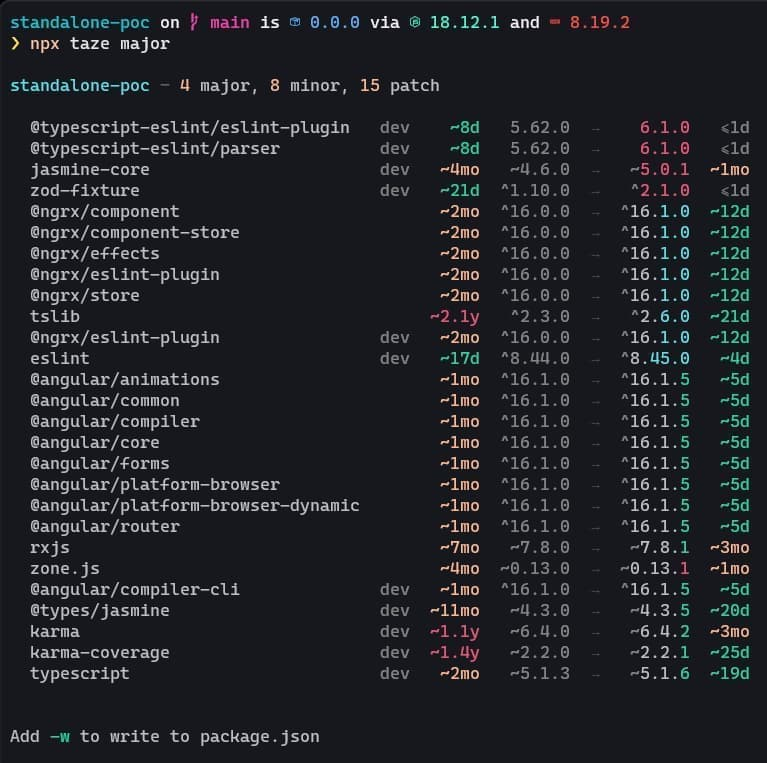
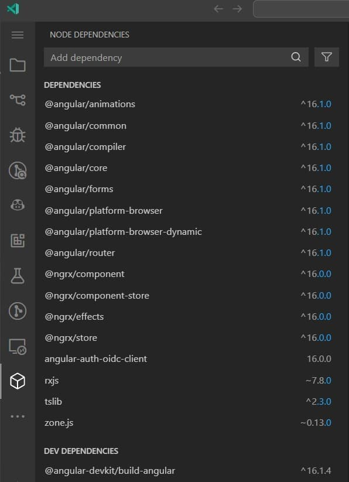

## Tools to keep your NPM dependencies up-to-date

You can use the default npm commands [npm outdated](https://docs.npmjs.com/cli/commands/npm-outdated) (check the registry to see if any packages are currently outdated) and [npm update](https://docs.npmjs.com/cli/commands/npm-update) (update all the packages listed to the latest version, respecting the semver constraints of both your package and its dependencies).

```bash
npm outdated # list packages to update
npm outdated --save # update package.json
npm update # update packages
```

But, to get a more detailed and prettier overview of the dependencies, you resort to the CLI
tool [🥦 taze](https://github.com/antfu/taze), which also works for monorepos.

```bash
npx taze
npx taze major
```



The Visual Studio Code users among us can install the [NPM](https://marketplace.visualstudio.com/items?itemName=idered.npm) extension to get a nice sidebar with the package information (and quick actions to update them). Just take a little glance at the sidebar to see if there are any updates available.


