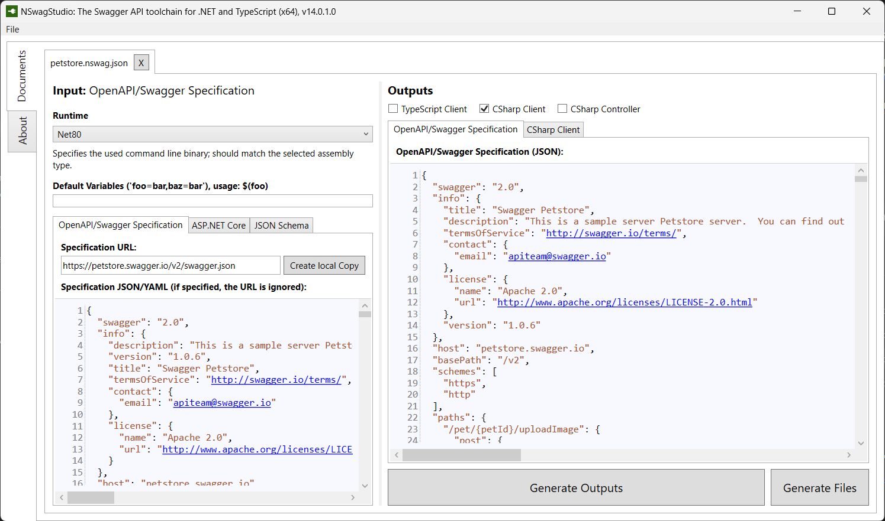
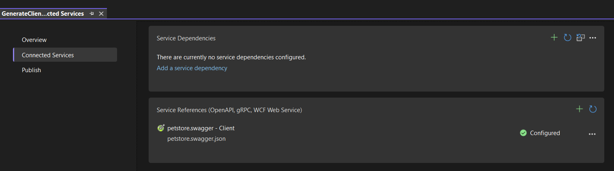

# Generate code with NSwag using OpenAPI

:::warning
It appears that the popular [Swashbuckle.AspNetCore](https://github.com/domaindrivendev/Swashbuckle.AspNetCore) project isn't being actively maintained anymore, and doesn't support .NET 8.
NSwag provides a good and battle-tested alternative, to get started see the [Microsoft Guide](https://learn.microsoft.com/en-us/aspnet/core/tutorials/getting-started-with-nswag).
:::

I was always skeptical about code generation tools using the OpenAPI specification.
But recently, I decided to give it another go, and surprisingly it was a positive experience!

My use case was an integration with a 3rd party, instead of writing all the DTO models and endpoints manually I resorted to NSwag to generate an [HTTP client](https://learn.microsoft.com/en-us/dotnet/fundamentals/networking/http/httpclient) (including all of its dependencies) for me. _You can also use this for code that you own._

[NSwag](https://github.com/RicoSuter/NSwag) provides different methods for generating code, ranging from a manual operation to an automated way.
Besides C# HTTP Clients, it also supports the generation of C# Models/Controllers, as well as TypeScript clients for most front-end technologies, e.g. Angular.

- [NSwagStudio](https://github.com/RicoSuter/NSwag/wiki/NSwagStudio): a Windows Desktop application to import an OpenAPI specification, and configure the parameters to generate the output file. Based on the configuration you can generate a client and/or save the configuration to an NSwag configuration document (`*.nswag.json`), which can be used later again with the intent to regenerate the client.



- A [CommandLine Tool](https://github.com/RicoSuter/NSwag/wiki/CommandLine) with commands to generate code based on an NSwag configuration document (which is created with NSwagStudio)

```bash
#          👇 created with NSwagStudio
nswag run ./petstore.nswag.json /runtime:Net70
# There's currently an issue with using Net80
```

- [NSwag.MSBuild](https://github.com/RicoSuter/NSwag/wiki/NSwag.MSBuild) to incorporate the generation process during a build (this also uses the NSwag config file)

```xml
<PropertyGroup>
  <RunPostBuildEvent>OnBuildSuccess</RunPostBuildEvent>
</PropertyGroup>

<Target Name="NSwag" AfterTargets="PostBuildEvent" Condition=" '$(Configuration)' == 'Debug' ">
  <Exec WorkingDirectory="$(ProjectDir)" EnvironmentVariables="ASPNETCORE_ENVIRONMENT=Development" Command="$(NSwagExe_Net70) run nswag.json /variables:Configuration=$(Configuration)" />
</Target>
```

- [NSwag.CodeGeneration.CSharp](https://www.nuget.org/packages/NSwag.CodeGeneration.CSharp/), a NuGet package to generate code using C#. There's also a TypeScript equivalent [NSwag.CodeGeneration.TypeScript](https://www.nuget.org/packages/NSwag.CodeGeneration.TypeScript/) to generate TypeScript code.

```cs
using NSwag;
using NSwag.CodeGeneration.CSharp;

await GenerateCSharpClient("https://petstore.swagger.io/v2/swagger.json", "PetStoreClient");

static async Task GenerateCSharpClient(string openApiLocation, string className)
{
    var document = await OpenApiDocument.FromUrlAsync(openApiLocation);
    var settings = new CSharpClientGeneratorSettings
    {
        UseBaseUrl = false,
        ClassName = className,
        GenerateClientInterfaces = true,
        CSharpGeneratorSettings =
        {
            Namespace = "HttpClients",
        },
    };

    var generator = new CSharpClientGenerator(document, settings);
    var generatedCode = generator.GenerateFile();

    var path = $"../../../{settings.CSharpGeneratorSettings.Namespace}/{settings.ClassName}";
    var file = new FileInfo(path);
    file.Directory.Create();
    await File.WriteAllTextAsync(file.FullName, generatedCode);
}
```

All of these gives you a working C# HTTP Client, including the needed models, interfaces, ... as output.

```cs Generated.cs
[System.CodeDom.Compiler.GeneratedCode("NSwag", "14.0.2.0 (NJsonSchema v11.0.0.0 (Newtonsoft.Json v13.0.0.0))")]
public partial interface IPetStoreClient
{
    /// <param name="cancellationToken">A cancellation token that can be used by other objects or threads to receive notice of cancellation.</param>
    /// <summary>
    /// Add a new pet to the store
    /// </summary>
    /// <param name="body">Pet object that needs to be added to the store</param>
    /// <exception cref="ApiException">A server side error occurred.</exception>
    System.Threading.Tasks.Task AddPetAsync(Pet body, System.Threading.CancellationToken cancellationToken);

    /// <param name="cancellationToken">A cancellation token that can be used by other objects or threads to receive notice of cancellation.</param>
    /// <summary>
    /// Find pet by ID
    /// </summary>
    /// <remarks>
    /// Returns a single pet
    /// </remarks>
    /// <param name="petId">ID of pet to return</param>
    /// <returns>successful operation</returns>
    /// <exception cref="ApiException">A server side error occurred.</exception>
    System.Threading.Tasks.Task<Pet> GetPetByIdAsync(long petId, System.Threading.CancellationToken cancellationToken);

    ...
}
```

:::tip
There's also the .NET Core Global Tool [Microsoft.dotnet-openapi](https://learn.microsoft.com/en-us/aspnet/core/web-api/microsoft.dotnet-openapi?view=aspnetcore-8.0) to generate HTTP clients using the OpenAPI specification.
Internally it uses NSwag for the generation.
From my limited experience with it, it isn't as versatile as the toolkit that NSwag provides, NSwag is also better documented.
But, `dotnet openapi` definitely something to keep an eye out for in the future.

```bash
dotnet openapi add url https://petstore.swagger.io/v2/swagger.json --code-generator NSwagCSharp --output-file petstore.swagger.json
dotnet openapi refresh --updateProject ./MyProject.csproj https://petstore.swagger.io/v2/swagger.json
```

The `add` will also create an `OpenApiReference` within the project, which is +/- the same as adding an OpenAPI specification via Visual Studio.
Because of this, it can also be interpreted by Visual Studio, and the generated client can be viewed and refreshed via the UI.


:::
