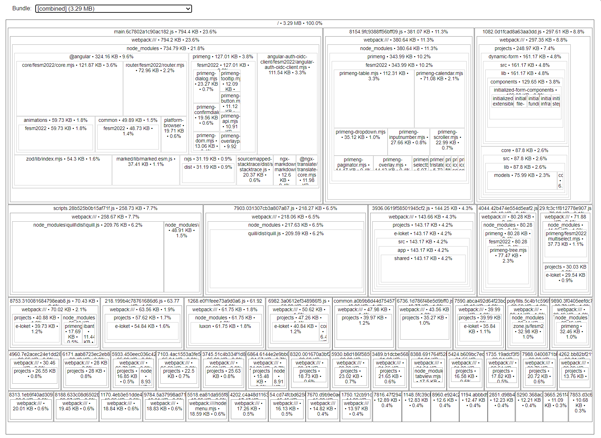

# Optimize your bundle size with source-map-explorer

Recently I was able to reduce the initial load of our Angular application from 2.8MB to 750kb (**a 75% reduction!**) in just a few minutes.

Using [source-map-explorer](https://github.com/danvk/source-map-explorer#readme) I was able to detect eagerly loaded modules that should've been lazy loaded, and dependencies that could be moved or removed.

If you want to optimize your bundle size, run the following command (replace PROJECT-NAME) and analyze the `main.js` file to start your investigation.

```bash
npx source-map-explorer ./dist/PROJECT-NAME/*.js
```

This command should open a new browser window with the output details in which you can see all the included dependencies (from your own or 3rd parties).



Make sure that you've built your project with source-maps enabled.
If that's not the case, either update your [source map configation](https://angular.dev/reference/configs/workspace-config#source-map-configuration), or pass the `--source-map` option flag to the Angular build command.

For the next step, explore the remaining files and be attentive to what can be trimmed down.
