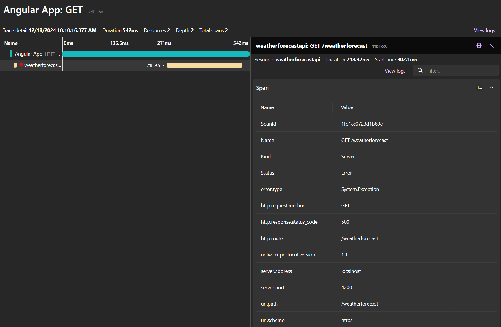

This post is the glue between the previous post on [OpenTelemetry in Angular](../adding-opentelemetry-to-an-angular-application/index.md) and [How to include an Angular project within .NET Aspire](../how-to-include-an-angular-project-within-net-aspire/).

In the latter, I mentioned that this wasn't supported yet, but as of .NET 9 the .NET Aspire Dashboard has been enhanced to [support OpenTelemetry data from the browser](https://learn.microsoft.com/en-us/dotnet/aspire/fundamentals/dashboard/enable-browser-telemetry).

:::info
Read more about [What's new in .NET Aspire 9.0](https://learn.microsoft.com/en-us/dotnet/aspire/whats-new/dotnet-aspire-9).
:::

The OpenTelemetry JavaScript SDK has also gone through some changes _- keep in mind that this feature is still experimental -_, so an update is long overdue.

## OpenTelemetry

OpenTelemetry is an open-source observability framework for cloud-native software, designed to capture and export telemetry data such as traces, metrics, and logs. It provides a set of APIs, libraries, agents, and instrumentation to help developers monitor and troubleshoot their applications. By using OpenTelemetry, you can gain insights into the performance and behavior of your application, identify bottlenecks, and improve overall reliability. This is particularly useful in production environments, but it can also be helpful during development phase to better understand and debug your code.

For more information see [What is OpenTelemetry?](https://opentelemetry.io/docs/what-is-opentelemetry/).

After this blog post, you will be able to follow the traces within the .NET Aspire Dashboard, starting from the Angular application to the .NET backend API (and external services if you have them, such as SQL server or other services).




## Configuring Aspire

### Add an Angular Application to the AppHost

Nothing much has changed to include a frontend project in Aspire compared to my previous post, [How to include an Angular project within .NET Aspire](../how-to-include-an-angular-project-within-net-aspire/)
To add an Angular application to the Aspire setup, you can use the `AddNpmApp` method. This method accepts the project name and the path to the project folder.

Because the application uses a backend API, we add a reference to the API project using the `WithReference` method. The `WaitFor` method ensures that the API project is started before the Angular application.

:::code-group

```cs{6-10}:AppHost/Program.cs [title=Program.cs]
var builder = DistributedApplication.CreateBuilder(args);

var weatherforecastApi = builder
 .AddProject<Projects.AngularAspire_WeatherForecastAPI>("weatherforecastapi");

builder.AddNpmApp("AngularFrontEnd", "../AngularAspire.AngularFrontEnd")
 .WithHttpEndpoint(env: "PORT", port: 4200)
 .WithReference(weatherforecastApi)
 .WaitFor(weatherforecastApi)
 .WithExternalHttpEndpoints(); // allow the application to be externally accessed when deployed

builder.Build().Run();
```

```diff [title=Difference]
var builder = DistributedApplication.CreateBuilder(args);

var weatherforecastApi = builder
 .AddProject<Projects.AngularAspire_WeatherForecastAPI>("weatherforecastapi");

builder
 .AddNpmApp("AngularFrontEnd", "../AngularAspire.AngularFrontEnd")
 .WithReference(weatherforecastApi)
+.WaitFor(weatherforecastApi)
 .WithServiceBinding(hostPort: 4200, scheme: "http", env: "PORT")
+.WithExternalHttpEndpoints();

builder.Build().Run();
```

:::

### Enable Browser OpenTelemetry

To send data from an Angular application to the Aspire Dashboard, the data needs to be send via the browser over HTTP requests. Compared to backend services, this is less secure. In previous versions of Aspire, this resulted in [CORS issues](https://github.com/dotnet/aspire/issues/857), which meant that the Aspire Dashboard didn't support traces from the browser.

This problem has been solved in .NET 9.0.

To enable the Aspire Dashboard to receive traces from the browser, set the [`DOTNET_DASHBOARD_OTLP_HTTP_ENDPOINT_URL` environment variable](https://learn.microsoft.com/en-us/dotnet/aspire/fundamentals/dashboard/configuration?tabs=bash#common-configuration). This changes how the telemetry data is received by the Aspire Dashboard, instead of using gRPC it now uses Protobuf over HTTP.

This action also configures the CORS settings for the Aspire Dashboard. By default, it adds all registered origins to the CORS settings. In this case, the Angular Application (`http://localhost:4200`) and the .NET WeatherForecast API 9 (`https://localhost:7234,http://localhost:5187`) are registered as allowed origins.

:::code-group

```json{12}:AppHost/Properties/launchSettings.json [title=launchSettings.json]
{
	"$schema": "https://json.schemastore.org/launchsettings.json",
	"profiles": {
		"https": {
			"commandName": "Project",
			"dotnetRunMessages": true,
			"launchBrowser": true,
			"applicationUrl": "https://localhost:17133;http://localhost:15113",
			"environmentVariables": {
				"ASPNETCORE_ENVIRONMENT": "Development",
				"DOTNET_ENVIRONMENT": "Development",
				"DOTNET_DASHBOARD_OTLP_HTTP_ENDPOINT_URL": "https://localhost:16175",
				"DOTNET_RESOURCE_SERVICE_ENDPOINT_URL": "https://localhost:22001",
				"DOTNET_ASPIRE_SHOW_DASHBOARD_RESOURCES": "true"
				// Does not seem to be setting the CORS origins?
				// "DOTNET_DASHBOARD_CORS_ALLOWED_ORIGINS": "*"
			}
		}
	}
}
```

```diff [title=Difference]
{
	"$schema": "https://json.schemastore.org/launchsettings.json",
	"profiles": {
		"https": {
			"commandName": "Project",
			"dotnetRunMessages": true,
			"launchBrowser": true,
			"applicationUrl": "https://localhost:17133;http://localhost:15113",
			"environmentVariables": {
				"ASPNETCORE_ENVIRONMENT": "Development",
				"DOTNET_ENVIRONMENT": "Development",
-				"DOTNET_DASHBOARD_OTLP_ENDPOINT_URL": "http://localhost:16162"
+				"DOTNET_DASHBOARD_OTLP_HTTP_ENDPOINT_URL": "https://localhost:16175",
+				"DOTNET_RESOURCE_SERVICE_ENDPOINT_URL": "https://localhost:22001",
+				"DOTNET_ASPIRE_SHOW_DASHBOARD_RESOURCES": "true",
			}
		}
	}
}
```

:::

## Add OpenTelemetry instrumentation to Angular

### Install the required packages

To record and send telemetry data from the Angular application to the Aspire Dashboard, you need to install the following packages.

```bash
npm install @opentelemetry/sdk-trace-base @opentelemetry/sdk-trace-web @opentelemetry/context-zone @opentelemetry/instrumentation @opentelemetry/exporter-trace-otlp-proto @opentelemetry/resources @opentelemetry/semantic-conventions @opentelemetry/auto-instrumentations-web
```

### Automatically register and and traces

Below is a revised version of the Angular instrumentation code from the previous post, [OpenTelemetry in Angular](../adding-opentelemetry-to-an-angular-application/index.md). I encourage you to read that post for more details on what each part does.
The main change is that this uses the trace exporter from `@opentelemetry/exporter-trace-otlp-proto` instead of `@opentelemetry/exporter-trace-otlp-http`. This change is required to send the traces in the Protobuf format.

```ts:otel-instrumentation.ts
import { EnvironmentProviders, provideAppInitializer } from '@angular/core';
import {
	BatchSpanProcessor,
	ConsoleSpanExporter,
	SimpleSpanProcessor,
} from '@opentelemetry/sdk-trace-base';
import { WebTracerProvider } from '@opentelemetry/sdk-trace-web';
import { ZoneContextManager } from '@opentelemetry/context-zone';
import { registerInstrumentations } from '@opentelemetry/instrumentation';
import { OTLPTraceExporter } from '@opentelemetry/exporter-trace-otlp-proto';
import { Resource } from '@opentelemetry/resources';
import { ATTR_SERVICE_NAME, ATTR_SERVICE_VERSION } from '@opentelemetry/semantic-conventions';
import { getWebAutoInstrumentations } from '@opentelemetry/auto-instrumentations-web';

export function provideInstrumentation(): EnvironmentProviders {
	return provideAppInitializer(() => {
		// Configure our resource
		const resource = Resource.default().merge(
			new Resource({
				[ATTR_SERVICE_NAME]: 'Angular App',
				[ATTR_SERVICE_VERSION]: '1.0.0',
			}),
		);

		const provider = new WebTracerProvider({ resource }); // For demo purposes only, immediately log traces to the console

		provider.addSpanProcessor(new SimpleSpanProcessor(new ConsoleSpanExporter())); // Batch traces before sending them to Collector

		provider.addSpanProcessor(
			new BatchSpanProcessor(
				new OTLPTraceExporter({
					url: `${window.origin}/v1/traces`,
				}),
			),
		); // Supports correlating asynchronous operations

		provider.register({
			contextManager: new ZoneContextManager(),
		}); // Register instrumentations to automatically capture traces from

		registerInstrumentations({
			instrumentations: [
				getWebAutoInstrumentations({
					'@opentelemetry/instrumentation-document-load': {},
					'@opentelemetry/instrumentation-user-interaction': {},
					'@opentelemetry/instrumentation-fetch': {},
					'@opentelemetry/instrumentation-xml-http-request': {},
				}),
			],
		});
	});
}
```

To register the instrumentation, include it within the application configuration.

```ts{10}:app.config.ts
import { ApplicationConfig } from '@angular/core';
import { provideRouter } from '@angular/router';

import { routes } from './app.routes';
import { provideHttpClient } from '@angular/common/http';
import { provideInstrumentation } from './otel-instrumentation';

export const appConfig: ApplicationConfig = {
	providers: [
		provideInstrumentation(),
		provideRouter(routes),
		provideHttpClient()
	],
};
```

### Update the Angular proxy server

Lastly, update the Angular proxy server.
In the `proxy.conf.js` file, add a new entry for the `/v1/traces` endpoint.
This entry should point to the configured URL in the Aspire Dashboard, which is the previously set `DOTNET_DASHBOARD_OTLP_HTTP_ENDPOINT_URL` environment variable. You can hardcode the URL, but it's better to use an environment variable, this makes it less brittle and easier to change.

You can also see that headers are added to the request. This is required to authenticate the request to the Aspire Dashboard. The headers are set by the dashboard in the `OTEL_EXPORTER_OTLP_HEADERS` environment variable, which is a comma-separated list of key-value pairs.
To view the settings, open the Aspire Dashboard and open in the `Details` slide-in, which gives the following value for the environment variable `x-otlp-api-key=6b8a4ea8c5480f4959846230024508b8`. The key is randomly generated each time the Aspire Dashboard is started.

This key protects the OLTP HTTP endpoint from unauthorized access. It's also possible to disable this security layer (or make the key a static value), but this is less secure and therefore not recommended.

:::code-group

```js{9-13}:proxy.conf.js [title=proxy.conf.js]
module.exports = {
	'/api': {
		target: process.env['services__weatherforecastapi__https__0'],
		secure: process.env['NODE_ENV'] !== 'development',
		pathRewrite: {
			'^/api': '',
		},
	},
	'/v1/traces': {
		target: process.env['OTEL_EXPORTER_OTLP_ENDPOINT'],
		secure: process.env['NODE_ENV'] !== 'development',
		headers: parseHeaders(process.env['OTEL_EXPORTER_OTLP_HEADERS']),
	},
};

function parseHeaders(s) {
	const headers = s.split(','); // Split by comma
	const result = {};

	headers.forEach((header) => {
		const [key, value] = header.split('='); // Split by equal sign
		result[key.trim()] = value.trim(); // Add to the object, trimming spaces
	});

	return result;
}
```

```diff [title=Difference]
module.exports = {
	'/api': {
-	target: process.env['services__weatherforecastapi__1'],
+	target: process.env['services__weatherforecastapi__https__0'],
+	secure: process.env['NODE_ENV'] !== 'development',
		pathRewrite: {
			'^/api': '',
		},
	},
+	'/v1/traces': {
+		target: process.env['OTEL_EXPORTER_OTLP_ENDPOINT'],
+		secure: process.env['NODE_ENV'] !== 'development',
+		headers: parseHeaders(process.env['OTEL_EXPORTER_OTLP_HEADERS']),
+	},
};

+function parseHeaders(s) {
+	const headers = s.split(','); // Split by comma
+	const result = {};
+	headers.forEach((header) => {
+		const [key, value] = header.split('='); // Split by equal sign
+		result[key.trim()] = value.trim(); // Add to the object, trimming spaces
+	});
+	return result;
+}
```

:::

## Conclusion

The .NET 9 release has brought a lot of new features and improvements to .NET Aspire.
One of the features I was waiting for, was the support for OpenTelemetry for frontend (Angular) applications, and .NET 9 delivered.

In this post, I've shown you that it's built-in to send browser tracer data to the Aspire Dashboard.
By changing the OpenTelemetry service to use the HTTP endpoint, you can now view traces from the browser in the Aspire Dashboard.
This makes the overall develoepr experience better, as you can now see the full picture of your application, from the frontend to the backend.

### Demo application

You can find the example application on my [GitHub](https://github.com/timdeschryver/AspireWithAngular).
