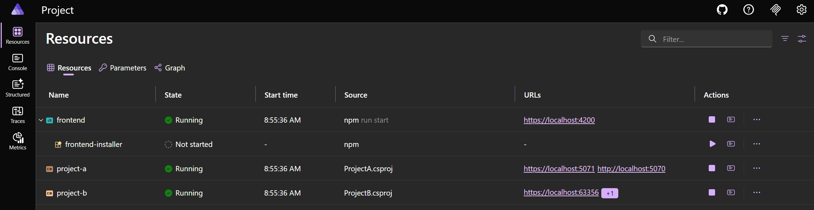

We adopted Aspire in our (.NET 8) codebase without touching our existing architecture, and it worked.

[Aspire](https://aspire.dev) isn't just for new projects. Existing projects can also benefit from Aspire's features. If you have an existing project and want to integrate Aspire, you don't have to go all-in from the start. In this post, we'll take a look at a minimal integration approach that lets you gradually adopt Aspire without having a big impact on the rest of your existing codebase.

Aspire has many great features, but you don't have to use all of them at once. Recently, our team started integrating Aspire into our existing project (on .NET 8) by only creating an Aspire `AppHost` project to run all of our projects with a single command. Doing this also allowed us to migrate from [Project Tye](https://github.com/dotnet/tye) without making significant changes to our codebase and build processes right away. This gave us a chance to understand how Aspire works and how it can improve our development process.

## What "minimal" means in this post

This post focuses on the smallest useful integration:

- Add an Aspire `AppHost` project.
- Register existing .NET and Angular projects in the `AppHost`.
- Run everything from one place.

It does **not** yet cover service defaults, containers, secrets migration, or deployment.

## Creating the AppHost project

To get started with the bare minimum, add a new project using the `Aspire AppHost` template to your solution.

You can do this in your IDE by right-clicking on your solution, selecting "Add" > "New Project", and then searching for "Aspire AppHost". Follow the prompts to create the project. The project will be created with an empty `AppHost` file that serves as the entry point for your application.

```cs [file=AppHost.cs]
var builder = DistributedApplication.CreateBuilder(args);

builder.Build().Run();
```

Alternatively, you can use the [Aspire CLI](https://aspire.dev/get-started/install-cli/) to create the project with the following command. The command runs a wizard that guides you through creating a new Aspire AppHost project and asks which projects you want to include.

Sadly, the command didn't work for our project at the time of writing (I suspect this is due to our current SDK/tooling combination on .NET 8), but it's still worth trying in your environment.

```bash
aspire init
```

## Adding .NET projects to the AppHost

Our project has multiple ASP.NET projects, and we wanted to run all of them with a single command. To do this, we started registering them in the `AppHost` file using the `builder.AddProject<T>()` method (you also need to add references to these projects in the `AppHost` project file).

```cs [file=AppHost.cs] [highlight=3-4]
var builder = DistributedApplication.CreateBuilder(args);

var projectA = builder.AddProject<Projects.ProjectA>("project-a");
var projectB = builder.AddProject<Projects.ProjectB>("project-b");

builder.Build().Run();
```

:::tip
If you have a lot of projects, adding all projects manually can be boring.
In our experience, we found that Copilot is perfectly fine to wire up the AppHost file for us.
:::

## Adding Angular projects to the AppHost

Besides our ASP.NET projects, we also have Angular projects in our solution. We wanted to run those from the same place, so we added them to the AppHost too.
Before adding an Angular project to the AppHost, add the `Aspire.Hosting.JavaScript` package to the AppHost project.

```bash
dotnet add package Aspire.Hosting.JavaScript
```

The next step is to register the Angular project(s) in the `AppHost` file using the `builder.AddJavaScriptApp()` method.

```cs [file=AppHost.cs] [highlight=6-8]
var builder = DistributedApplication.CreateBuilder(args);

var projectA = builder.AddProject<Projects.ProjectA>("project-a");
var projectB = builder.AddProject<Projects.ProjectB>("project-b");

var frontend = builder.AddJavaScriptApp("frontend", "../AngularProject")
    .WithNpm(installCommand: "ci")
    .WithUrl("https://localhost:4200");

builder.Build().Run();
```

## Running the AppHost

Now that we have our projects registered in the AppHost, we can run the AppHost - just as any other project - to see the results. When you run the AppHost, it will start all of the registered projects and provide you with a dashboard.



Here, we can also see that JavaScript projects include an installer resource that installs npm dependencies for those projects, so you don't have to worry about that anymore. You can opt out of this behavior by setting the `install` property to `false` in the `WithNpm()` method, for example: `WithNpm(installCommand: "ci", install: false)`.

Within the dashboard, the only working feature for us right now is the application logs.

## Next steps

This is just the beginning of what you can do with Aspire.
With this minimal integration in place, you can start exploring more Aspire features as you become more comfortable with it, such as:

- Enabling **Aspire's distributed tracing**: With Aspire's distributed tracing, you can get insights into how your different projects are interacting with each other, and identify any performance bottlenecks or issues in your application. This can be done using a `ServiceDefaults` project and by configuring existing projects to use `ServiceDefaults`.
- Integrating **Docker containers**: To create an isolated environment for your application, it's possible to integrate Docker containers into your AppHost. This allows you to run your application in a consistent environment across different machines and platforms. For example, you can add a SQL or Redis container to your AppHost.
- Migrating to **Aspire's secrets management**: With Aspire's secrets management, you can securely store and manage sensitive information such as database connection strings, API keys, and other secrets. This migration will move existing secrets and appsettings to the AppHost.
- Thinking about **Release management**: It's also possible to use Aspire to generate artifacts to host your application. For example, you can generate a docker compose file containing the entire project (with dependencies), or you can also set up an entire environment within Azure with all the necessary resources to host your application.

## Conclusion

Aspire is a great tool to orchestrate and manage your applications.
In this post, we've seen that you don't have to go all-in with Aspire from the start and that you can gradually introduce it into your existing project.

My team started with a simple Aspire integration that focuses on one practical outcome: running all projects with a single command from the AppHost. For us, this was a quick and easy way to introduce Aspire.

Through the Aspire dashboard we can already access logs from all our projects in one place. There's also a [MCP Server](https://aspire.dev/get-started/configure-mcp/), which will become smarter and better over time, when we enable more features.

From here, we can explore additional Aspire features as we get more comfortable with it and unlock more value without refactoring our existing codebase right away.
