It's been a while since I've measured the code coverage in a .NET project, but recently I was interested in the current state of coverage for a project I'm working on.
While Visual Studio and Rider have built-in tools for measuring code coverage, I wanted to configure it within our Azure pipeline.
Because this took me several tries to set up correctly, I'm writing this post as a future reference and maybe it can be of help to you as well.
I was also positively surprised that Azure DevOps also improved its experience since the last, and I think this is a feature most developers don't know exists.

- [Creating a pipeline](#creating-a-pipeline)
  - [Run the pipeline when a pull request is created](#run-the-pipeline-when-a-pull-request-is-created)
- [Adding code coverage](#adding-code-coverage)
  - [XPlat Code Coverage](#xplat-code-coverage)
  - [Format](#format)
- [Pull request comments](#pull-request-comments)
- [Enforcing a minimum code coverage](#enforcing-a-minimum-code-coverage)
- [Conclusion](#conclusion)

## Creating a pipeline

:::note
If you're already familiar with Azure DevOps and pipelines, you can skip this section and move to [Adding code coverage](#adding-code-coverage).
:::

To create an [Azure Pipeline](https://learn.microsoft.com/en-us/azure/devops/pipelines/get-started/what-is-azure-pipelines?view=azure-devops) go to the pipelines tab in your Azure DevOps project and click on the "New pipeline" button. This should bring you to the page https://dev.azure.com/ORGANIZATION/PROJECT/_apps/hub/ms.vss-build-web.ci-designer-hub.
On this page follow the steps to create a new pipeline or import an existing one from a repository.

The first step is to select the source of the code, which can be a repository in Azure Repos, GitHub, Bitbucket, or other Git repositories.
Because our code is hosted in Azure Repos, we select this option.

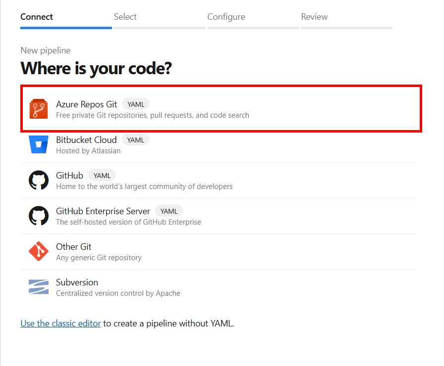

The next step is to select the repository.

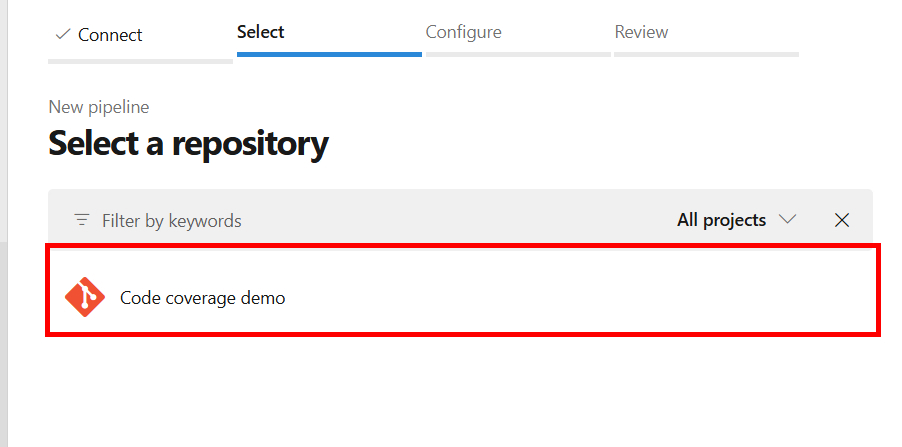

Lastly, either create a new pipeline or select an existing one in the repository.
In this case, we'll create a new pipeline.

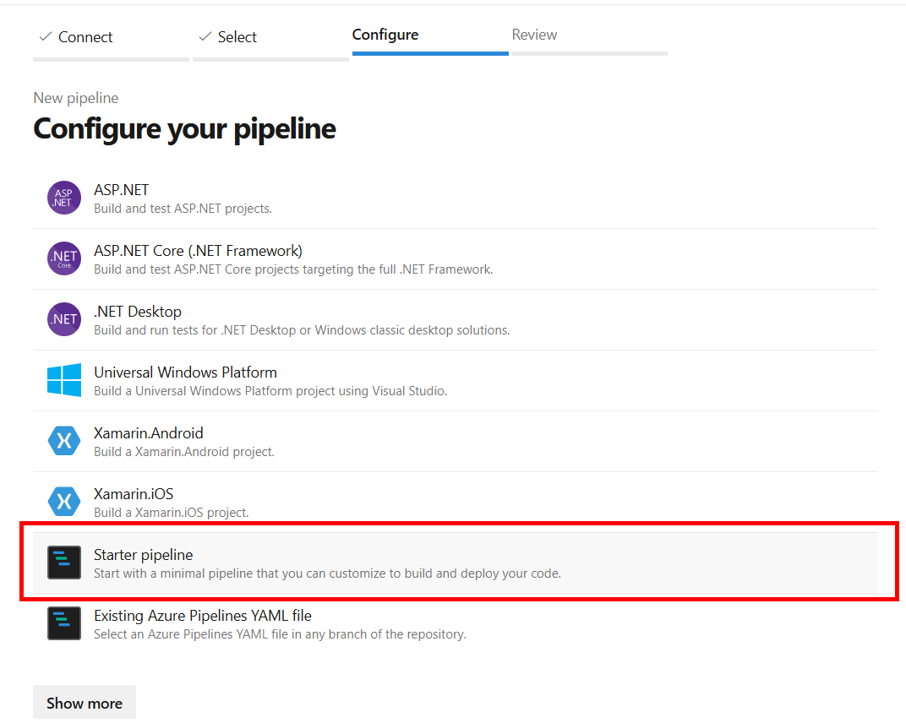

After this step, you will see a pipeline editor to configure the pipeline.
If you choose to import an existing pipeline, select the pipeline that you want to use.

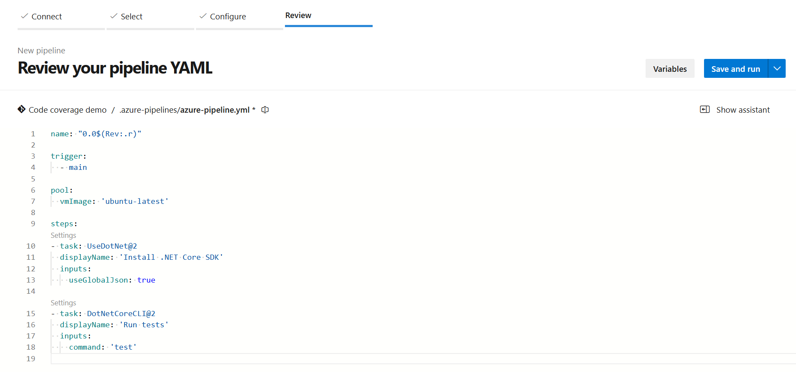

You can copy-paste the example below to configure a simple pipeline that runs the tests for your project.
The pipeline is triggered when a change is pushed to the `main` branch and uses the [`UseDotNet` task](https://learn.microsoft.com/en-us/azure/devops/pipelines/tasks/reference/use-dotnet-v2?view=azure-pipelines) to install the .NET Core SDK and the [`DotNetCoreCLI` task](https://learn.microsoft.com/en-us/azure/devops/pipelines/tasks/reference/dotnet-core-cli-v2?view=azure-pipelines) to run the tests.

```yml:.azure-pipelines/code-coverage.pipeline.yml
name: "0.0$(Rev:.r)"

trigger:
  - main

pool:
  vmImage: 'ubuntu-latest'

steps:
- task: UseDotNet@2
  displayName: 'Install .NET Core SDK'
  inputs:
      # I like to use the global.json file to specify the version of the SDK
    # For more info see https://learn.microsoft.com/en-us/dotnet/core/tools/global-json
    useGlobalJson: true
    # But, you can also specify the version here
    # version: 8.x

- task: DotNetCoreCLI@2
  displayName: 'Run tests'
  inputs:
    command: 'test'
```

When you're done, click on the "Save and run" button to save the pipeline and run it.
After pushing this change to the `main` branch, the pipeline should trigger and execute the steps.

When you open the details you should see the pipeline running, and the tests being executed.

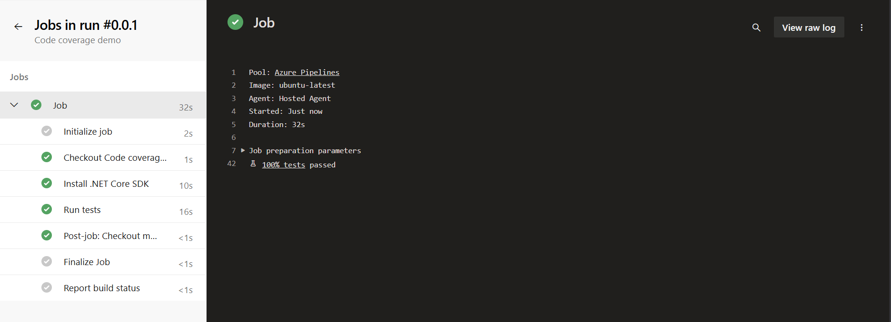

### Run the pipeline when a pull request is created

So far, the pipeline is triggered when a change is pushed to the `main` branch.
Ideally, you also want to run the pipeline when a pull request is created to validate the changes.

For this, a policy needs to be added to the `main` branch.
Go to the branches tab in your Azure DevOps project, and open the branch policies of the `main` branch (hover with your mouse over the branch, and click on the 3 dots).

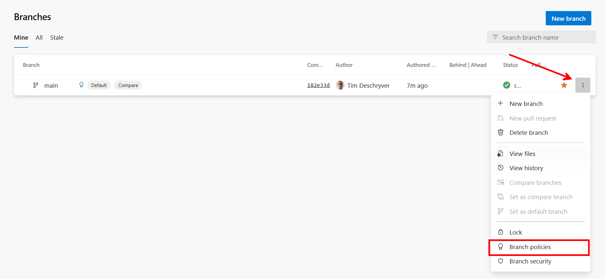

Click on the "Add build validation" button to add a build validation policy.

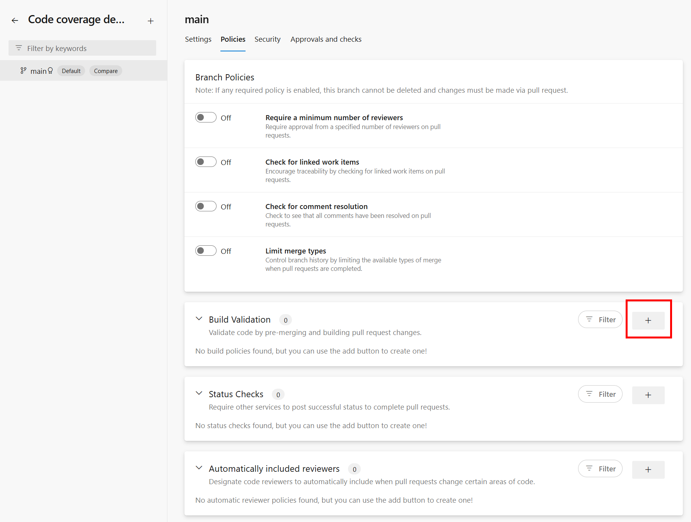

Select the pipeline you created earlier (this should be already a selector) and click on the "Save" button.
Additionally, you can also give it a proper name. This name will be displayed in the pull request.
The default name is the name of the pipeline.

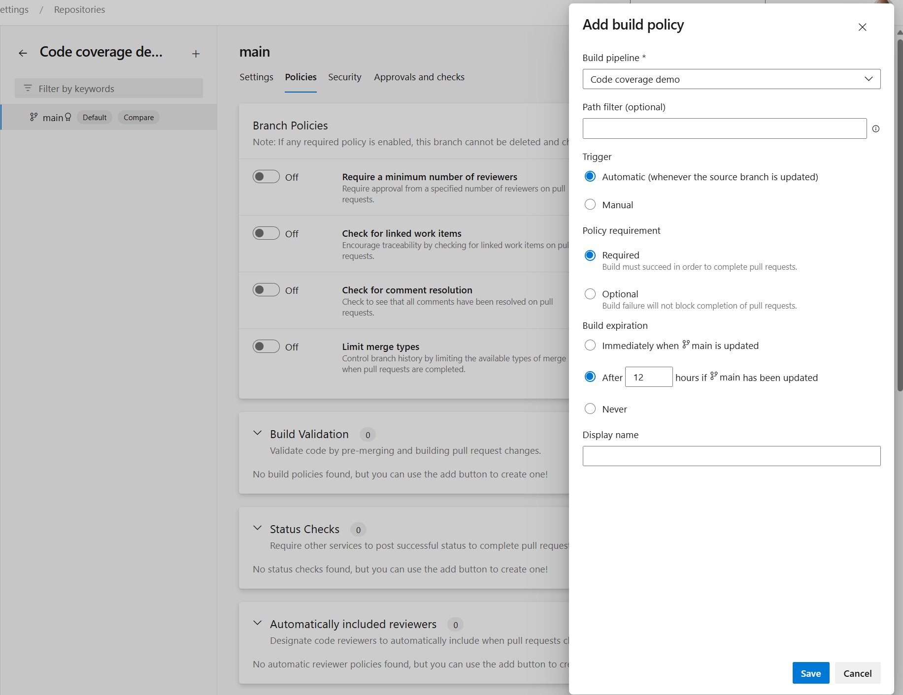

This step denies that commits can directly be pushed to the `main` branch, and forces you to create new branches that can be merged using pull requests.
When a pull request is created, the pipeline is triggered and the changes are validated.

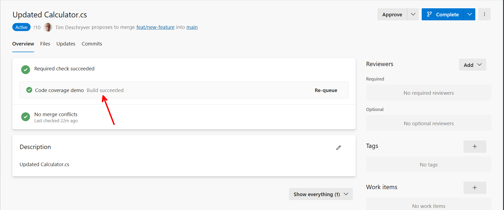

## Adding code coverage

As it turns out, adding code coverage to the pipeline is not as hard as I remembered it to be.
To collect the code coverage, add the [`--collect` argument](https://learn.microsoft.com/en-us/dotnet/core/tools/dotnet-test#arguments) to the `test` command. This argument accepts a data collector, which can be `Code Coverage` or `XPlat Code Coverage`. Both have the same result, but there are some nuances between their behavior.

I prefer to use the `Code Coverage` data collector because I think it's more straightforward.
Let's take a look at the updated pipeline.

```yml{23}:.azure-pipelines/code-coverage.pipeline.yml
name: "0.0$(Rev:.r)"

trigger:
  - main

pool:
  vmImage: 'ubuntu-latest'

steps:
- task: UseDotNet@2
  displayName: 'Install .NET Core SDK'
  inputs:
    # I like to use the global.json file to specify the version of the SDK
    # For more info see https://learn.microsoft.com/en-us/dotnet/core/tools/global-json    
    useGlobalJson: true
    # But, you can also specify the version here
    # version: 8.x

- task: DotNetCoreCLI@2
  displayName: 'Run tests'
  inputs:
    command: 'test'
    arguments: '--collect "Code Coverage"'
```

After this change (and running the pipeline), you should see the code coverage in the test results.
On the overview page, you can see the percentage of the code coverage.

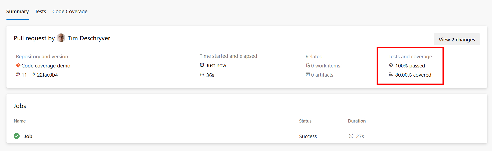

When you click on it, you will see the details of the code coverage.
For more details about the coverage, you can download the coverage file and open it in Visual Studio. This experience will highlight the code that is covered and not covered by the tests.


You can notice that the code coverage is also calculated for the test projects.
This can be OK, but it can also skew the results.
To exclude the test projects from the code coverage, you need to create a `.runsettings` file and specify the test assemblies to include or exclude.

Create a file called `coverage.runsettings` in the root of your repository with the following content.
To keep things simple, I'm only excluding the modules that end with `Tests.dll`.

:::tip
For more information about the `.runsettings` file, see the [The \*.runsettings file documentation](https://learn.microsoft.com/en-us/visualstudio/test/configure-unit-tests-by-using-a-dot-runsettings-file#the-runsettings-file).
:::

```xml{8-12}:coverage.runsettings
<?xml version="1.0" encoding="utf-8"?>
<RunSettings>
  <DataCollectionRunSettings>
    <DataCollectors>
      <DataCollector friendlyName="Code Coverage">
        <Configuration>
          <CodeCoverage>
            <ModulePaths>
              <Exclude>
               <ModulePath>.*Tests.dll</ModulePath>
              </Exclude>
            </ModulePaths>
          </CodeCoverage>
        </Configuration>
      </DataCollector>
    </DataCollectors>
  </DataCollectionRunSettings>
</RunSettings>
```

When you have created the `.runsettings` file, you need to specify it in the `test` command using the `--settings` argument.

```yml{23}:.azure-pipelines/code-coverage.pipeline.yml
name: "0.0$(Rev:.r)"

trigger:
  - main

pool:
  vmImage: 'ubuntu-latest'

steps:
- task: UseDotNet@2
  displayName: 'Install .NET Core SDK'
  inputs:
    # I like to use the global.json file to specify the version of the SDK
    # For more info see https://learn.microsoft.com/en-us/dotnet/core/tools/global-json    
    useGlobalJson: true
    # But, you can also specify the version here
    # version: 8.x

- task: DotNetCoreCLI@2
  displayName: 'Run tests'
  inputs:
    command: 'test'
    arguments: '--collect "Code Coverage" --settings "./coverage.runsettings"'
```

After running the pipeline, you should see that the code coverage is calculated without the test projects.

### XPlat Code Coverage

To be fair, I don't know the exact details of the differences between the `Code Coverage` and `XPlat Code Coverage` (Coverlet) data collectors.
But, what I can do is describe the differences in behavior that I've noticed.

The `XPlat Code Coverage` data collector automatically excludes the test projects from the code coverage, which means you don't need to create a `.runsettings` file to exclude them.

The second difference is that while it calculates the code coverage, it doesn't show the results within the Azure DevOps pipeline.
An additional build step is needed to publish the code coverage results to Azure DevOps, for this the [`PublishCodeCoverageResults` task](https://learn.microsoft.com/en-us/azure/devops/pipelines/tasks/reference/publish-code-coverage-results-v2?view=azure-pipelines) is used.

The last difference is that the `XPlat Code Coverage` creates a `coverage.cobertura.xml` file, which cannot be downloaded nor opened in Visual Studio. To view the results, you need to use a third-party tool like [Coverlet](https://github.com/coverlet-coverage/coverlet).
Maybe that there's a plugin for this, but I haven't searched for it.

The updated pipeline with the `XPlat Code Coverage` data collector looks as follows.

```yml{19-23, 25-28}:.azure-pipelines/code-coverage.pipeline.yml
name: "0.0$(Rev:.r)"

trigger:
  - main

pool:
  vmImage: 'ubuntu-latest'

steps:
- task: UseDotNet@2
  displayName: 'Install .NET Core SDK'
  inputs:
    # I like to use the global.json file to specify the version of the SDK
    # For more info see https://learn.microsoft.com/en-us/dotnet/core/tools/global-json    
    useGlobalJson: true
    # But, you can also specify the version here
    # version: 8.x

- task: DotNetCoreCLI@2
  displayName: 'Run tests'
  inputs:
    command: 'test'
    arguments: '--collect "XPlat Code Coverage"'

- task: PublishCodeCoverageResults@2
  displayName: "Publish code coverage"
  inputs:
    summaryFileLocation: '$(Agent.TempDirectory)/**/coverage.cobertura.xml'
```

After running the pipeline, you should see the code coverage in the test results.

### Format

To specify the format of the output file you can use the `Format` argument.
From my experience, this doesn't have a big impact on the capabilities and the results of the code coverage.

```bash
dotnet test  --collect "Code Coverage;Format=Cobertura"
```

## Pull request comments

To make the code coverage more visible, you can add a comment to the pull request with the code coverage percentage.
This is a [feature that Azure DevOps provides out of the box](https://learn.microsoft.com/en-us/azure/devops/pipelines/test/codecoverage-for-pullrequests?view=azure-devops). This feature works with both the `Code Coverage` and `XPlat Code Coverage` data collectors.

To enable this feature, create a `azurepipelines-coverage.yml` file in the root of your repository, and enable the `comments` option.
You can also specify a `target` percentage, which will be used to determine if the code coverage (for the added code) is sufficient.

```yml:azurepipelines-coverage.yml
coverage:
  status:          
    comments: on  
    diff:          
      target: 70%
```

After this change, the code coverage will be added as a comment to the pull request with each push.

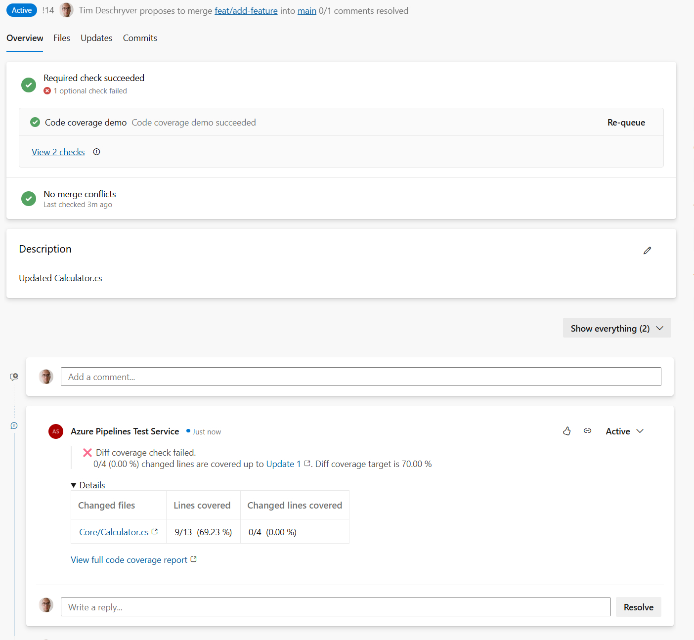

When reviewing the PR, this feature helps to investigate which lines are (not) covered by the tests.
Within the code editor, you will see highlights in the gutter, which indicate the code coverage.

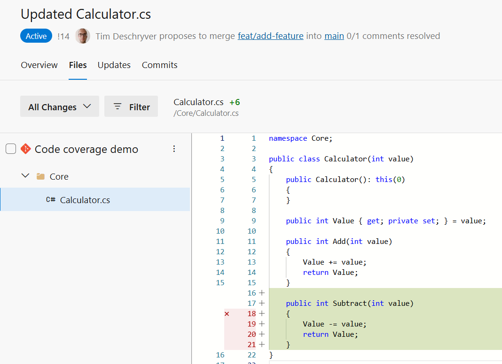

To ensure that the target is met to merge the pull request, you can add a "Status Check" via the branch policies view.
This feature can be helpful to increase the code coverage over time.

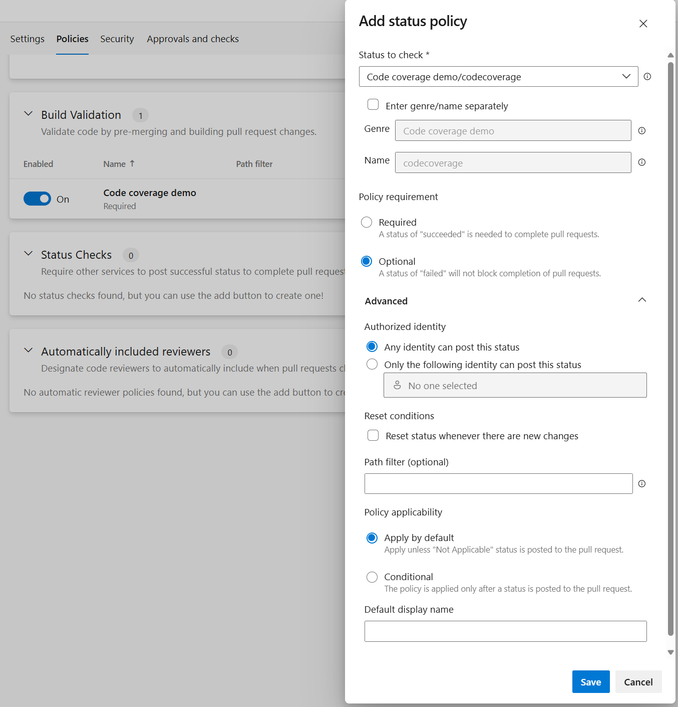

:::tip
I suggest making this optional because it requires that the target is always met even when unrelated files are changed (docs, pipelines).
I believe this is the case because the code coverage difference will be 0 in this.
:::

## Enforcing a minimum code coverage

To strictly enforce the code coverage, you can install and use the [`Build Quality Checks` extension](https://marketplace.visualstudio.com/items?itemName=mspremier.BuildQualityChecks). This extension allows you to set a minimum code coverage percentage and fails the pipeline when the target is not met.

```yaml
- task: BuildQualityChecks@9
  displayName: 'Check build quality'
  inputs:
    checkCoverage: true
    coverageThreshold: 70
```

## Conclusion

To be honest with you, I'm not a big fan of code coverage as a metric to measure the quality of a codebase.
However, I do like the Pull Request comments feature, because it can help to review the code during a pull request and it can indicate a missing part.
I believe that it raises awareness about the importance of adding proper tests, and reminds the team that some tests are in fact important.

To accomplish this, I've shown you how to include code coverage to your Azure DevOps pipeline, and how to integrate it with the pull request comments feature.
