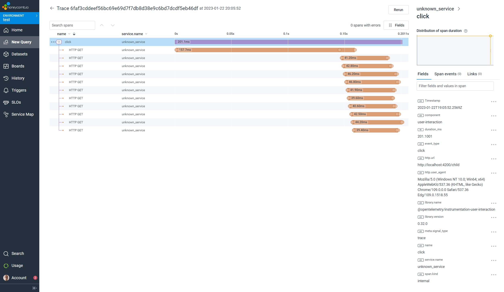
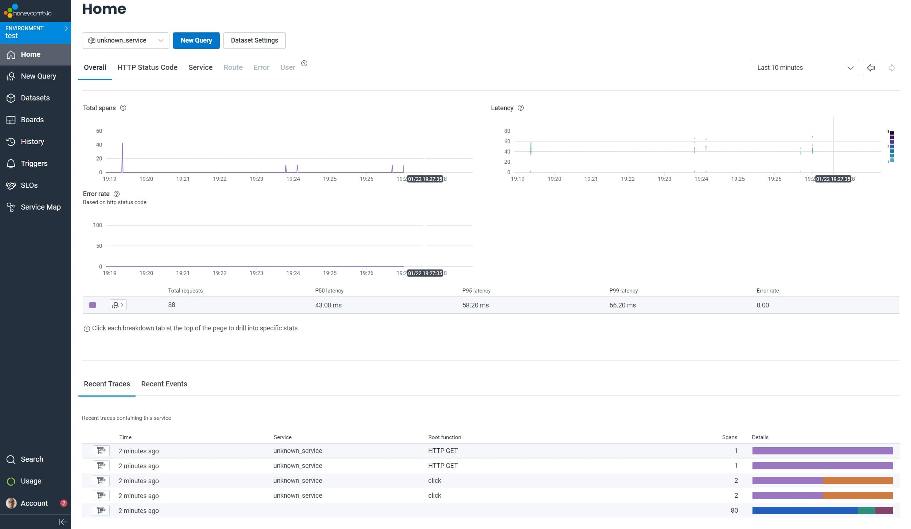
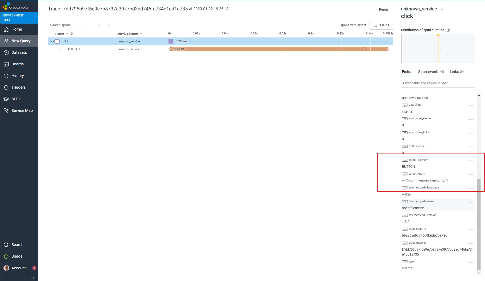

OpenTelemetry is a part of [Cloud Native Computing Foundation (CNCF)](https://www.cncf.io/projects/opentelemetry/), and is the standard to monitor your application.

> OpenTelemetry makes robust, portable telemetry a built-in feature of cloud-native software.

With the use of Signals, which are traces, logs, and metrics, OpenTelemetry gives you a good insight into the state of the application.
This helps you to get a better understanding of the application and can help you to detect problems and possible problems in the future.
There are official packages for most of the ecosystems, including one for JavaScript (with TypeScript support) in a Node.js environment and one to use in a browser context, the latter is the one that we'll explore in this blog post.

OpenTelemetry is something I discovered at the end of 2022 and didn't know I needed. It's high up on my list of technologies that I want to explore and know better this year.
While there is already useful content surrounding this topic, and the official documentation also provides lots of goodies in the sorts of API documentation, guides, and examples, I might write about my experience with OpenTelemetry in the future.
But for frontend applications using TypeScript, I find that there's a lack of information about using OpenTelemetry. That's why I want to already take the time and share how I added OpenTelemetry to an application built with Angular.

In this blog post we learn how to configure the OpenTelemetry SDK to get graphs like the following.



## Setup

I followed the ["Getting Started" documentation](https://opentelemetry.io/docs/instrumentation/js/getting-started/browser/) to add OpenTelemetry to my application.
This leads to the following bare code, in which some parts are left out but will be covered on later.

The code registers two main essentials:

- instrumentations, which are responsible to create traces for specific events
- processors, which are run to process the data before being sent (with the use of an exporter)

```ts:instrument.ts
import { registerInstrumentations } from '@opentelemetry/instrumentation';
import { WebTracerProvider } from '@opentelemetry/sdk-trace-web';

const provider = new WebTracerProvider();
provider.addSpanProcessor(/* TODO */);
provider.register();

registerInstrumentations({
    instrumentations: [
        /* TODO */
    ],
});
```

To follow along with me, install the initial packages that are used in the above snippet:

```bash
npm install @opentelemetry/sdk-trace-web @opentelemetry/instrumentation
```

## Creating Traces with Instrumentations

A [trace](https://opentelemetry.io/docs/concepts/signals/traces/) represents a collection of events (spans is the correct term) that are related to each other.
It usually starts with an initial event that is invoked by an end user.

> Traces give us the big picture of what happens when a request is made by a user or an application.

We can for example create a trace when a button is clicked.
But, instead of writing this code manually, I'm using the [`@opentelemetry/auto-instrumentations-web` package](https://www.npmjs.com/package/@opentelemetry/auto-instrumentations-web).

`@opentelemetry/auto-instrumentations-web` bundles some packages and does most of the heavy lifting for us.
It automatically creates traces for most of the important events, this includes:

- user events, e.g. when a button is clicked
- information about the initial page load, e.g. resources that are downloaded and how long it took
  HTTP traffic, .e.g. the endpoint that is called with the response status and response time

> The `@opentelemetry/auto-instrumentations-web` package can also serve as a solid base to introduce the usefulness of OpenTelemetry to your team.

To start collecting the events add the exported `getWebAutoInstrumentations` method to the instrumentations collection.
By default, this creates traces for all of the above events, but you can choose to opt out of individual packages.
The following example uses the default configuration for all packages.

```ts{3, 11-17}:instrument.ts
import { registerInstrumentations } from '@opentelemetry/instrumentation';
import { WebTracerProvider } from '@opentelemetry/sdk-trace-web';
import { getWebAutoInstrumentations } from '@opentelemetry/auto-instrumentations-web';

const provider = new WebTracerProvider();
provider.addSpanProcessor(/* TODO */);
provider.register();

registerInstrumentations({
    instrumentations: [
        getWebAutoInstrumentations({
            // not needed to add the following, but it better shows the intention
            '@opentelemetry/instrumentation-document-load': {},
            '@opentelemetry/instrumentation-user-interaction': {},
            '@opentelemetry/instrumentation-fetch': {},
            '@opentelemetry/instrumentation-xml-http-request': {},
        }),
    ],
});
```

To follow along with me, install the additional packages that are used in the above snippet:

```bash
npm install @opentelemetry/auto-instrumentations-web
```

> Depending on the version you need to enable the [`skipLibCheck` tsconfig option](https://www.typescriptlang.org/tsconfig/skipLibCheck.html) because the package may contain invalid types.

## Sending Traces with Processors and Exporters

Now that the instrumentations are plugged in and are creating traces, we need to start sending them somewhere so they can be useful.
You can either send them directly to a backend, or to your hosted [collector](https://opentelemetry.io/docs/collector/) (recommended).

To send the traces (and later logs and metrics), we use one or more [processors](https://opentelemetry.io/docs/collector/configuration/#processors) (to transform/batch signals) and an [exporter](https://opentelemetry.io/docs/collector/configuration/#exporters) (how to send signals).

To give a good overview to see which traces are created and when they're exported, the most simple solution is to log them to the console.
But this isn't useful in a production environment, and it also isn't visual and doesn't show you the big picture.

Instead, I encourage you to directly use a solution that is used in a production environment, and which is also capable to analyze the collected telemetry data.
This way you also get the hang of how to use your tools that are used in production for when it really matters.
Luckily, there is no difference between the signals that are logged to the console and the ones that are sent to a backend/collector.

The good tools also immediately show you the signals that are received without any delay.
This means you can see the signals in real time, just like in the console.
The big benefit of this is that the signals are aggregated into views and graphs that give you a better overview.
They show you when the signal is created, together with its parent and children.

You can spin up your own collector and/or backend, or use a cloud-based solution.
When I dove into OpenTelemetry I used [Honeycomb](https://www.honeycomb.io/), which is used in the next examples.

> You can create a free account in the [Honeycomb application](https://ui.honeycomb.io/)

To send the traces add a processor and exporter to the web tracer provider.
In the following example, the `ConsoleSpanExporter` export is used to log the traces, and the `OTLPTraceExporter` exporter is used to send them to Honeycomb.

The `ConsoleSpanExporter` exporter uses a `SimpleSpanProcessor`, while the `OTLPTraceExporter` exporter uses the `BatchSpanProcessor` processor.
The latter batches the traces before handing them to the exporter, while the `SimpleSpanProcessor` processor directly forwards the traces.

```ts{4-6, 9, 13-14, 16-26}:instrument.ts
import { registerInstrumentations } from '@opentelemetry/instrumentation';
import {
    WebTracerProvider,
    ConsoleSpanExporter,
    SimpleSpanProcessor,
    BatchSpanProcessor,
} from '@opentelemetry/sdk-trace-web';
import { getWebAutoInstrumentations } from '@opentelemetry/auto-instrumentations-web';
import { OTLPTraceExporter } from '@opentelemetry/exporter-trace-otlp-http';

const provider = new WebTracerProvider();

// For demo purposes only, immediately log traces to the console
provider.addSpanProcessor(new SimpleSpanProcessor(new ConsoleSpanExporter()));

// Batch traces before sending them to HoneyComb
provider.addSpanProcessor(
    new BatchSpanProcessor(
        new OTLPTraceExporter({
            url: 'https://api.honeycomb.io/v1/traces',
            headers: {
                'x-honeycomb-team': 'YOUR_KEY_HERE',
            },
        }),
    ),
);

provider.register();

registerInstrumentations({
    instrumentations: [
        getWebAutoInstrumentations({
            '@opentelemetry/instrumentation-document-load': {},
            '@opentelemetry/instrumentation-user-interaction': {},
            '@opentelemetry/instrumentation-fetch': {},
            '@opentelemetry/instrumentation-xml-http-request': {},
        }),
    ],
});
```

To follow along with me, install the additional packages that are used in the above snippet:

```bash
npm install @opentelemetry/exporter-trace-otlp-http
```

## Traces overview

To start instrumenting your Angular application, create a new `instrument.ts` file and copy-paste the current state of the snippet into it.

```ts:instrument.ts
import { registerInstrumentations } from '@opentelemetry/instrumentation';
import {
    WebTracerProvider,
    ConsoleSpanExporter,
    SimpleSpanProcessor,
    BatchSpanProcessor,
} from '@opentelemetry/sdk-trace-web';
import { getWebAutoInstrumentations } from '@opentelemetry/auto-instrumentations-web';
import { OTLPTraceExporter } from '@opentelemetry/exporter-trace-otlp-http';

const provider = new WebTracerProvider();

// For demo purposes only, immediately log traces to the console
provider.addSpanProcessor(new SimpleSpanProcessor(new ConsoleSpanExporter()));

// Batch traces before sending them to HoneyComb
provider.addSpanProcessor(
    new BatchSpanProcessor(
        new OTLPTraceExporter({
            url: 'https://api.honeycomb.io/v1/traces',
            headers: {
                'x-honeycomb-team': 'YOUR_KEY_HERE',
            },
        }),
    ),
);

provider.register();

registerInstrumentations({
    instrumentations: [
        getWebAutoInstrumentations({
            '@opentelemetry/instrumentation-document-load': {},
            '@opentelemetry/instrumentation-user-interaction': {},
            '@opentelemetry/instrumentation-fetch': {},
            '@opentelemetry/instrumentation-xml-http-request': {},
        }),
    ],
});
```

Next, import the file into the `main.ts` file.

```ts{6}:main.ts
import { bootstrapApplication } from '@angular/platform-browser';
import { provideHttpClient } from '@angular/common/http';
import { provideRouter } from '@angular/router';
import { AppComponent } from './app/app.component';

import './instrument';

bootstrapApplication(AppComponent, {
    providers: [provideHttpClient()],
});
```

Now, when you load the application you should see some traces in the console.
These traces hold the information about the document load.
The traces should also be visible in honeycomb (we'll see how this looks like later).

Let's also add a button to fetch some resources.
For this, add the following code to the `AppComponent`.

```ts:app.component.ts
import { HttpClient } from '@angular/common/http';
import { Component } from '@angular/core';

@Component({
  selector: 'app-root',
  template: `
    <button
      (click)="btnClick()"
      id="my-awesome-button"
      class="some-classy-button"
    >
      Click me
    </button>
  `,
  styles: [],
  standalone: true,
})
export class AppComponent {
  constructor(private http: HttpClient) {}

  btnClick() {
    this.http
      .get<{id:number, title:string}[]>('https://jsonplaceholder.typicode.com/todos/')
      .subscribe((todos) => {
        for (const i of (todos).filter((todo) => todo.id <= 10)) {
          this.http
            .get('https://jsonplaceholder.typicode.com/todos/' + i.id)
            .subscribe();
        }
      });
  }
}
```

Now, when you click the button you should see more traces coming in.
The new traces include user interactions (because you clicked the button), and requests (to the JSON placeholder API).

You also see these traces in honeycomb.



When we click a trace to see the details, we can see that the trace contains a lot of information.
We can for example, when we open the click event we can see which element is clicked and that the click triggered a fetch request.



We can also see what API endpoint was called, including the response status and response time.


## Zone Context

But, there's room for improvement.
In the example used in this post, we can see that the click triggers an HTTP request, that actually results in multiple requests.
Only the initial request shows up in the graph, and the rest of the requests are not visible.
They are however visible as individual traces.

This is because a trace is not aware of the context in which it was created.
To fix this, we need to introduce zones.

If you're familiar with zones in Angular this should ring a bell.
Within a zone, all underlying traces are aware of the parent.
This means that the click event creates a zone, and all the HTTP requests within the zone are grouped in this zone.

> Fun fact: it uses Angular's zone.js!

```ts{10, 29-31}:instrument.ts
import { registerInstrumentations } from '@opentelemetry/instrumentation';
import {
    WebTracerProvider,
    ConsoleSpanExporter,
    SimpleSpanProcessor,
    BatchSpanProcessor,
} from '@opentelemetry/sdk-trace-web';
import { getWebAutoInstrumentations } from '@opentelemetry/auto-instrumentations-web';
import { OTLPTraceExporter } from '@opentelemetry/exporter-trace-otlp-http';
import { ZoneContextManager } from '@opentelemetry/context-zone';

const provider = new WebTracerProvider();

// For demo purposes only, immediately log traces to the console
provider.addSpanProcessor(new SimpleSpanProcessor(new ConsoleSpanExporter()));

// Batch traces before sending them to HoneyComb
provider.addSpanProcessor(
    new BatchSpanProcessor(
        new OTLPTraceExporter({
            url: 'https://api.honeycomb.io/v1/traces',
            headers: {
                'x-honeycomb-team': 'YOUR_KEY_HERE',
            },
        }),
    ),
);

provider.register({
  contextManager: new ZoneContextManager(),
});


registerInstrumentations({
    instrumentations: [
        getWebAutoInstrumentations({
            '@opentelemetry/instrumentation-document-load': {},
            '@opentelemetry/instrumentation-user-interaction': {},
            '@opentelemetry/instrumentation-fetch': {},
            '@opentelemetry/instrumentation-xml-http-request': {},
        }),
    ],
});
```

This results in a trace that includes all the HTTP requests triggered by the click, which looks like this:


## Conclusion

That's it!

With the help of the packages provided by OpenTelemetry we can now see what's going on in our Angular application.
We didn't have to write custom code to instrument our application, we just had to add a few lines to configure the OpenTelemetry SDK.

In the next posts we'll look at how to make this code more "Angulary", include more information in our traces to make it easier to monitor, how to log errors, and more.
