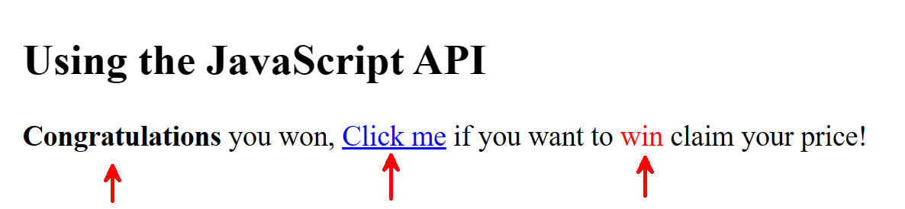
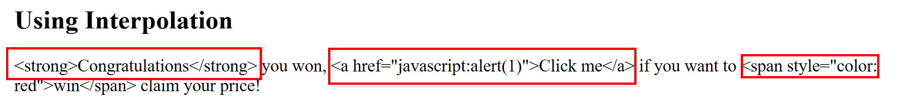
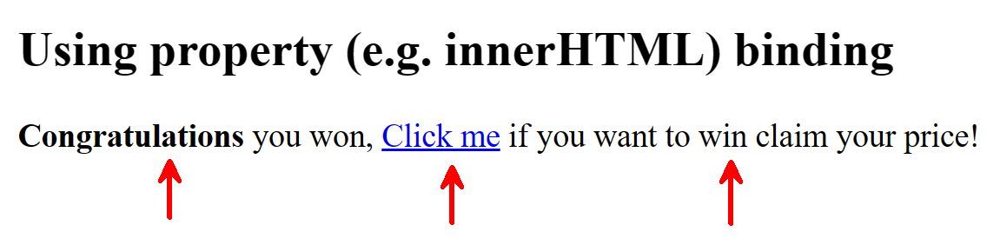
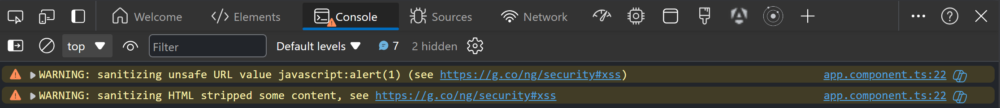

## Cross-Site Scripting (XSS)

[Cross-Site Scripting (XSS)](https://owasp.org/www-community/attacks/xss/) is a security vulnerability that allows an attacker to inject malicious code into a web application.
For years, it's been on the OWASP Top 10 list of the most critical security risks to web applications, in the latest version (published in 2021) it's [ranked 3rd](https://owasp.org/Top10/A03_2021-Injection/).

If this is the first time you've heard about XSS, I would say that this is normal because Angular does a great job of protecting us from this threat behind the scenes.
Nevertheless, I think it's important to understand what it is, and how Angular protects us from it.

A simple example to illustrate the concept of XSS is an inserted `script` tag that executes malicious code.
This can be easy to detect. Attackers have become more sophisticated with their manners, for example using an image tag with a `src` attribute that points to an invalid location.
When the browser tries to load the image, it will execute the JavaScript code in the `onerror` attribute.

```html
</img>
```

Another example is an anchor tag with a `href` attribute that executes JavaScript code.

```html
<a href="javascript:alert(1)">Click me!</a>
```

The above examples simply show an alert, but an attacker could do much worse.

:::note
These examples are just a few of the many ways an attacker can exploit a web application.
For more exploits, you can take a look at the [Vulnerability Payload List](https://github.com/payloadbox/xss-payload-list).
Some of these payloads are really creative and scary.
:::

## Angular's built-in protection

So how does Angular protect us from these attacks?
The answer is simple: Angular is very skeptical and treats all values as untrusted by default.

When a value is used within the DOM template either using interpolation or property binding, Angular sanitizes and escapes untrusted values.

### Default JavaScript behavior

Before we go over some examples of how Angular handles this, let's first take a look at the default JavaScript behavior.
Consider the following malicious input:

```ts
const maliciousInput = `
    <strong>Congratulations</strong> you won, 
    <a href="javascript:alert(1)">Click me</a> 
    if you want to <span style="color: red">win</span> claim your price!`;
```

To render this input in the DOM, we can use the following JavaScript code:

```ts
const element = document.querySelector('div.target');
element.innerHTML = maliciousInput;
```

When this gets rendered to the DOM, the following will happen:

- the HTML entities (`strong`, `a`, `span`) are rendered
- the JavaScript code in the `href` attribute will be executed when the link is clicked
- the style attribute is rendered



### Using interpolation

Now compare the default behavior with Angular's behavior.

Using Angular's interpolation, we can render the same malicious input:

```html
<div>{{ maliciousInput }}</div>
```

When this gets rendered to the DOM, the following will happen:

- the input is escaped and is rendered as plain text

Resulting in the following output.
Because the input is rendered as plain text, the JavaScript code is not interpreted as code by the browser and thus not executed when the link is clicked.

```html
<div>
	" <strong>Congratulations</strong> you won,
	<a href="javascript:alert(1)">Click me</a>
	if you want to <span style="color: red">win</span> claim your price! "
</div>
```



### Using property binding

Angular also allows us to render the input using property binding:

```html
<div [innerHTML]="maliciousInput"></div>
```

When this gets rendered to the DOM, the following will happen:

- the HTML entities (`strong`, `a`, `span`) are rendered
- the JavaScript code is marked as unsafe and is not executed on click (note that links within the `href` attribute are not sanitized and will redirect the user to that location)
- the style attribute is stripped

Resulting in the following output.

```html
<div>
	<strong>Congratulations</strong> you won,
	<a href="unsafe:javascript:alert(1)">Click me</a>
	if you want to <span>win</span> claim your price!
</div>
```



When Angular detects that a value is untrusted, it will sanitize the value before rendering it to the DOM.
If this occurs, a warning will be logged to the console (in dev mode).



### DomSanitizer

If for some reason you need to manually sanitize a value, you can use the `DomSanitizer` service.
This can be used to fix the preceding example [Default JavaScript behavior](#default-javascript-behavior).

Instead of directly setting the `innerHTML` of an element, you can use the `DomSanitizer` service to sanitize the value before rendering it to the DOM.

```ts
import { DomSanitizer } from '@angular/platform-browser';
import { SecurityContext } from '@angular/core';

domSanitizer = inject(DomSanitizer);

const element = document.querySelector('div.target');
element.innerHTML = this.domSanitizer.sanitize(SecurityContext.HTML, maliciousInput);
```

This has the same effect as using property binding in Angular.

## The technicals on how Angular protects us

So how does Angular protect us from these attacks?
Using the code in `@core/sanitization` Angular analyzes the input string and sanitizes and escapes untrusted values.
Without going into too much detail, you can take a look at the source code.
Here we can see that Angular keeps an allowlist of safe values and escapes all other values.

- [Valid Elements](https://github.com/angular/angular/blob/1519b5bd2fd45ac68b14dd548dc8b2b2dce30cbc/packages/core/src/sanitization/html_sanitizer.ts#L63-L64)
- [Valid Attributes](https://github.com/angular/angular/blob/1519b5bd2fd45ac68b14dd548dc8b2b2dce30cbc/packages/core/src/sanitization/html_sanitizer.ts#L94)
- [Safe URL](https://github.com/angular/angular/blob/1519b5bd2fd45ac68b14dd548dc8b2b2dce30cbc/packages/core/src/sanitization/url_sanitizer.ts#L38)

:::tip
[Alisa Duncan](https://twitter.com/AlisaDuncan) has a great webinar on this topic, see [Staying Safe and Secure with Angular](https://www.youtube.com/watch?v=wbED-Ch7BeM) for the recording of it during ng-conf.
:::
