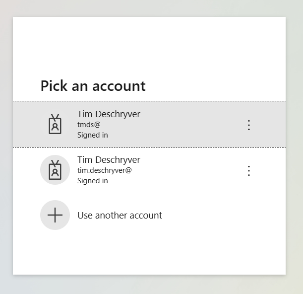

When you have multiple Microsoft tenants, you probably already know that Microsoft asks you to select the right tenant during the sign-in process. While this seems to be a minor inconvenience, it can be annoying when you have to do this multiple times in a row.

This looks as follows:



In the screenshot above, the user gets a list of all the accounts that are already authenticated, and the user has to select the right one to proceed.
If the session is expired, the user has to authenticate again by providing a password and/or a Multi-Factor Authentication (MFA) code.

As a solution, Microsoft provides a way to automatically select the right tenant for applications that use the OpenId Connect protocol.
This is done by adding a `domain_hint` query parameter to the authorization request, which you need to set to the domain of the tenant you want to authenticate against.
For example, if you want to authenticate against the `acme.com` tenant, you need to set the `domain_hint` query parameter to `acme.com`, which results in the following query parameter: `domain_hint=acme.com`.

When the domain hint is set, Microsoft will automatically select the right tenant (if the session is still valid), and the user doesn't have to select the tenant manually.

:::tip
Instead of setting the `domain_hint` query parameter, you can also set the `login_hint` query parameter to the email address of the user you want to authenticate.
The `login_hint` will also automatically prefill the email address in the login form.
This is useful if the user already has entered the email address in your application.
:::

## Configuring Angular Auth OIDC Client

If you are using the Angular Auth OIDC Client library ([angular-auth-oidc-client](https://angular-auth-oidc-client.com/docs/intro)), you can easily configure the domain hint by setting the `customParamsAuthRequest` property in the `OpenIdConfiguration` configuration object.

```ts:app.config.ts{17-19}
import { ApplicationConfig } from '@angular/core';
import { AuthModule, LogLevel } from 'angular-auth-oidc-client';

export const appConfig: ApplicationConfig = {
  providers: [
    provideAuth({
      config: {
        authority: '<your authority address here>',
        redirectUrl: window.location.origin,
        postLogoutRedirectUri: window.location.origin,
        clientId: '<your clientId>',
        scope: 'openid profile email offline_access',
        responseType: 'code',
        silentRenew: true,
        useRefreshToken: true,
        logLevel: LogLevel.Debug,
        customParamsAuthRequest: {
          domain_hint: 'acme.com',
        }
      },
    }),
  ],
};
```

It's also possible to set this parameter when the `authorize` method is invoked, by setting the `customParams` property.
This can be useful when you want to set the domain hint dynamically, but I recommend setting it in the configuration object to automatically set it for every authorize request.

```ts
oidcSecurityService.authorize({ customParams: { domain_hint: 'acme.com' } });
```

## Conclusion

It's possible to improve the user experience by automatically selecting the right Microsoft tenant when the user has multiple sessions active in different tenants.
This can be done by setting the `domain_hint` query parameter to the domain of the tenant you want to authenticate against.

For more information, see [Microsoft's documentation](https://learn.microsoft.com/en-us/entra/identity/enterprise-apps/home-realm-discovery-policy).
