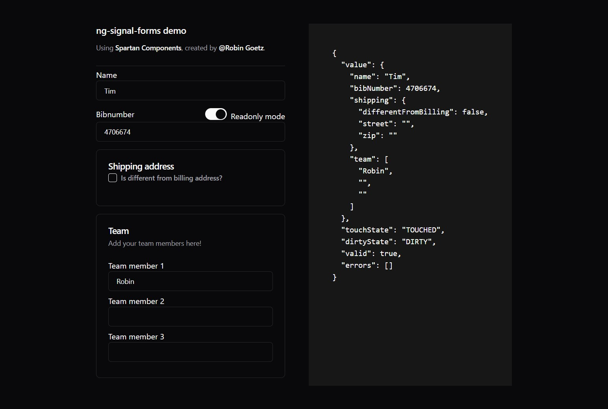

## Table of contents

<!-- TOC -->

- [`FormField<T>`](#formfieldt)
  - [`FormField<T>` States](#formfieldt-states)
- [`FormGroup<T>`](#formgroupt)
  - [Nested form groups](#nested-form-groups)
  - [Collections](#collections)
  - [`FormGroup<T>` States](#formgroupt-states)
- [Validators](#validators)
  - [Validation messages](#validation-messages)
  - [Validation based on other fields](#validation-based-on-other-fields)
  - [Disable validators](#disable-validators)
- [Additional States](#additional-states)
  - [`hidden` state](#hidden-state)
  - [`disabled` and `readonly` states](#disabled-and-readonly-states)
- [Form values](#form-values)
  - [Read](#read)
  - [Write](#write)
- [Good to know](#good-to-know)
  - [Making use of the existing `NgModel`](#making-use-of-the-existing-ngmodel)
  - [Debugging](#debugging)
- [Conclusion](#conclusion)
- [What's next](#what-and-39-s-next)
<!-- TOC -->

When the Angular teams introduced [signals](https://angular.dev/guide/signals) I needed a playing ground to get familiar with it, so I decided to use signals internally to build a new API for Angular forms.
It was then that I realized that using signals to create forms is a good fit that provides plenty of flexibility and a good experience.
These signal driven forms, take the best out of Template Driven Forms and Reactive Forms with a sprinkle of signals on top of it.

:::note
[Josh Morony](https://twitter.com/joshuamorony) also came to the conclusion that [SIGNALS can make Angular 'REACTIVE' forms more reactive](https://www.youtube.com/watch?v=cxoew5rmwFM).
:::

I am writing this blog post to share an idea, in which the implementation is still a work in progress.
If you're a fan of the idea, feel free to try it out, provide feedback, or help with the implementation.

Signal forms are built on top of the existing battle-tested functionality.
On the template side, it uses the power and the convenience of `ngModel`.
Using this technique the template model and the domain model can stay in sync.
For the typescript side, signal forms have a similar API to reactive forms (with a few additional utility functions), and replaces RxJS with signals.
Because signal form uses a similar API, I think it should be simple to transition from Reactive forms to signal forms if you're interested and motivated.

Let's take a look at the code to give you an idea of what this looks like.

## `FormField<T>`

A signal form is built using the `createFormField` and `createFormGroup` methods.
The most simple example is the form field `FormField`, which is created using `createFormField`.

```ts {4-8}
import { createFormField } from 'ng-signal-forms';

export class AppComponent {
	// implicit type
	name = createFormField('');

	// or be explicit about the type
	name = createFormField<string>('');
}
```

The first argument of `createFormField` accepts the initial value of the field.
The initial value is used to implicitly infer its type.
The above example creates a `FormField<string>` that contains the current value of a field and the current state of the control.

To render/bind the field to an HTML element, use the `ngModel` attribute in combination with the `formField` attribute.
To the latter, you pass the form field instance.

```razor {3}
<div>
  <label for='name'>Name</label>
  <input ngModel [formField]='name' id='name' />
</div>
```

### `FormField<T>` States

As mentioned earlier the `formField` attribute is the glue between the domain model and the HTML element, which keeps the value and state in sync.
This results in the HTML element getting the appropriate classes and attributes, reflecting the internal state of the form field.

A signal field sets the following classes:

- validity: `ng-valid`, `ng-invalid`, and `ng-pending` (more on this subject later)
- user interaction: `ng-untouched` and `ng-touched`
- value changes: `ng-pristine` and `ng-dirty`

_Notice that Signal Forms follows the convention of the official Angular forms._

Signal Forms are also able to set the following attributes (more on this later).
This is different from Angular Forms, and this is useful to reflect the internal state of the HTML element, which can improve the experience:

- `disabled`, when a form field is disabled
- `readonly`, when a form field is read-only

## `FormGroup<T>`

Of course, a form consists of multiple fields.
To combine fields into a form (or a group), use the `createFormGroup` method.

To build the form, pass an object to `createFormGroup` where the keys are the field names, and the values are the form fields.

```ts {4-7}
import { createFormField, createFormGroup } from 'ng-signal-forms';

export class AppComponent {
	formModel = createFormGroup({
		name: createFormField(''),
		bibNumber: createFormField<number | undefined>(undefined),
	});
}
```

For simple forms without additional options/configurations, the form fields can also be created in a shorter version.
Instead of using `createFormField`, the initial value can be provided directly.

```ts {4-7}
import { createFormGroup } from 'ng-signal-forms';

export class AppComponent {
	formModel = createFormGroup({
		name: '',
		bibNumber: undefined,
	});
}
```

To use the `formModel` in the HTML template, access the form fields using the `controls` property of the form model.

```razor {3, 8}
<div>
  <label for='name'>Name</label>
  <input ngModel [formField]='formModel.controls.name' id='name' />
</div>

<div>
  <label for='bib'>Bib number</label>
  <input type="number" ngModel [formField]='formModel.controls.bibNumber' id='bib' />
</div>
```

### Nested form groups

Once you're familiar with form groups, you can also nest form groups.
Using the `createFormGroup` method, you can create a nested form group.
On the HTML side, use the `controls` property to drill down into the nested form group.

:::code-group

```ts {4-8} [title=TypeScript Form Definition]
import { createFormField, createFormGroup } from 'ng-signal-forms';

export class AppComponent {
	formModel = createFormGroup({
		address: createFormGroup({
			street: createFormField(''),
		}),
	});
}
```

```razor {5} [title=HTML Template]
<fieldset>
  <legend>Address</legend>
  <div>
    <label for='street'>Street</label>
    <input ngModel [formField]='formModel.controls.address.controls.street' id='street' />
  </div>
</fieldset>
```

:::

### Collections

Besides an object, the `createFormGroup` method also accepts an array of form fields (or form groups).
To render the form fields in the HTML template, use the `controls` method to iterate over the form fields and bind each control to an input element.

:::code-group

```ts {4-10} [title=TypeScript Form Definition]
import { createFormField, createFormGroup } from 'ng-signal-forms';

export class AppComponent {
	formModel = createFormGroup({
		team: createFormGroup([createFormField(''), createFormField(''), createFormField('')]),
	});
}
```

```razor {3-8} [title=HTML Template]
<fieldset>
  <legend>Team members</legend>
  @for (member of formModel.controls.team.controls(); track $index) {
    <div>
      <label for='member-{{$index}}'>Team member {{$index}}</label>
      <input ngModel [formField]='member' id='member-{{$index}}' />
    </div>
  }
</fieldset>
```

:::

### `FormGroup<T>` States

Form groups use identical states as form fields.
Except, form groups do not interact with the HTML element directly, in other words, they do not set classes or attributes on the HTML element.

The state of a form group is derived (computed) from the state of its form fields.
If one field is dirty, the form group's state is set to dirty.
If one field is touched, the form group's state is set to touched.

The exception is the valid state, which is derived from its own validity and the validity of its form fields.

A form group does not have disabled or read-only states, because these states are not applicable to a form group.

## Validators

A form is useless without validation.
Signal forms provide a set of default validators, which can be used to validate form fields and groups.

To register a validator, pass an array of validators to the form field options.
The default validators are available via the `V` export.
How you can create a custom validator will be mentioned in the future.

To render the validation error to the user, retrieve the error using the `hasError` method of the form control.
The example below also makes use of the `touched` method to only show the error when the user has interacted with the field.

:::code-group

```ts {5-7} [title=TypeScript Form Definition]
import { createFormField, createFormGroup, V } from 'ng-signal-forms';

export class AppComponent {
	formModel = createFormGroup({
		name: createFormField('', {
			validators: [V.required()],
		}),
	});
}
```

```razor {4-8} [title=HTML Template]
<div>
  <label for='name'>Name</label>
  <input ngModel [formField]='formModel.controls.name' id='name' />
  @if (formModel.controls.name.touched()) {
    @if (formModel.controls.name.hasError('required')) {
      <p class="text-[0.8rem] font-medium text-destructive">Name is required.</p>
    }
  }
</div>
```

:::

:::note
There are more ways to show the validation error to the user, which can be discussed in a future blog post.
:::

### Validation messages

To show a validation message to the user, the error message can be provided to the validator.
This is often easier to set at this point instead of doing this in the HTML template, it also allows you to reuse messages in different forms.

To add a message to a validator, pass an object to the validator where the `message` property is set to a function that returns the message.
The function receives the validator's configuration as an argument, which can be used to create a dynamic message.

The validation message can be retrieved using the `errorMessage` method of the form control.

:::code-group

```ts {8-11} [title=TypeScript Form Definition]
import { createFormField, createFormGroup, V } from 'ng-signal-forms';

export class AppComponent {
	formModel = createFormGroup({
		name: createFormField('', {
			validators: [
				V.required(),
				{
					validator: V.minLength(2),
					message: ({ minLength }) => `Name must be at least ${minLength} characters`,
				},
			],
		}),
	});
}
```

```razor {7-11} [title=HTML Template]
<div>
  <label for='name'>Name</label>
  <input type='text' id='name' ngModel [formField]='formModel.controls.name' hlmInput />
  @if (formModel.controls.name.touched()) {
    @if (formModel.controls.name.hasError('required')) {
      <p class="text-[0.8rem] font-medium text-destructive">Name is required.</p>
    } @else if (formModel.controls.name.hasError('minLength')) {
      <p class="text-[0.8rem] font-medium text-destructive">
        {{ formModel.controls.name.errorMessage('minLength') }}
      </p>
    }
  }
</div>
```

:::

### Validation based on other fields

In some cases, the validation of a field depends on the value of another field.
This is where in my eyes, signal forms shine.

For example, a password confirmation field should be valid when it matches the password field.

To create a validator that depends on another field, use the `value` signal to react to value changes of the other field.
Because the value of the other field is a signal, the validator is automatically re-evaluated when the value of the other field changes.

The easiest way to achieve this is to create a form group, and reference to form field instances.

On the HTML side, everything remains the same (the validation messages are left out for brevity).

:::code-group

```ts {5-17} [title=TypeScript Form Definition]
import { createFormField, createFormGroup, V } from 'ng-signal-forms';

export class AppComponent {
	formModel = createFormGroup({
		passwords: createFormGroup(() => {
			const password = createFormField('', {
				validators: [V.required()],
			});
			const passwordConfirmation = createFormField('', {
				validators: [V.equalsTo(password.value)],
			});

			return {
				password,
				passwordConfirmation,
			};
		}),
	});
}
```

```razor [title=HTML Template]
<div>
    <label for='password'>Password</label>
    <input type='password' ngModel [formField]='formModel.controls.passwords.controls.password' id='password' />
</div>
<div>
    <label for='password-confirmation'>Password Confirmation</label>
    <input type='password' ngModel [formField]='formModel.controls.passwords.controls.passwordConfirmation' id='password-confirmation' />
</div>
```

:::

### Disable validators

We've seen how to reference other fields within a validator.
Using the same technique, you can also disable validators based on the value of another field or source.

To disable a validator, use the `disabled` property of the validator configuration.

:::code-group

```ts {13, 21} [title=TypeScript Form Definition]
import { createFormField, createFormGroup, V } from 'ng-signal-forms';

export class AppComponent {
	formModel = createFormGroup({
		shipping: createFormGroup(() => {
			const differentFromBilling = createFormField(false);
			return {
				differentFromBilling,
				street: createFormField('', {
					validators: [
						{
							validator: V.required(),
							disable: () => !differentFromBilling.value(),
						},
					],
				}),
				zip: createFormField('', {
					validators: [
						{
							validator: V.required(),
							disable: () => !differentFromBilling.value(),
						},
					],
				}),
			};
		}),
	});
}
```

```razor [title=HTML Template]
<section>
  <div>
    <h3>Shipping address</h3>
    <div>
        <label>
          <input type="checkbox" ngModel [formField]='formModel.controls.shipping.controls.differentFromBilling' id='differentFromBilling'  />
          Is different from billing address?
        </label>
    </div>
  </div>
  <div>
    <div>
      <label for='street'>Street</label>
      <input ngModel [formField]='formModel.controls.shipping.controls.street' id='street' />
    </div>

    <div>
      <label for='zip'>Zip</label>
      <input ngModel [formField]='formModel.controls.shipping.controls.zip' id='zip' />
    </div>
  </div>
</section>
```

:::

## Additional States

### `hidden` state

In the [Disable validators](#disable-validators) example we've seen how to disable validators based on the value of another field.
To create a better user experience, Signal Forms also keeps track of the "hidden" state of controls, which can be used to hide HTML elements.

To hide a form field, set the `hidden` property of the form field options.
Just like any other configuration, we can use signals to reactively hide the form field based on other signal sources, in this case, a form field.

:::code-group

```ts {10, 19} [title=TypeScript Form Definition]
import { createFormField, createFormGroup, V } from 'ng-signal-forms';

export class AppComponent {
	formModel = createFormGroup({
		shipping: createFormGroup(() => {
			const differentFromBilling = createFormField(false);
			return {
				differentFromBilling,
				street: createFormField('', {
					hidden: () => !differentFromBilling.value(),
					validators: [
						{
							validator: V.required(),
							disable: () => !differentFromBilling.value(),
						},
					],
				}),
				zip: createFormField('', {
					hidden: () => !differentFromBilling.value(),
					validators: [
						{
							validator: V.required(),
							disable: () => !differentFromBilling.value(),
						},
					],
				}),
			};
		}),
	});
}
```

```razor {12-18, 20-24} [title=HTML Template]
<section>
  <div>
    <h3>Shipping address</h3>
    <div>
        <label>
          <input type="checkbox" ngModel [formField]='formModel.controls.shipping.controls.differentFromBilling' id='differentFromBilling'  />
          Is different from billing address?
        </label>
    </div>
  </div>
  <div>
    <!-- using the control flow API -->
    @if(!formModel.controls.shipping.controls.street.hidden()){
        <div>
          <label for='street'>Street</label>
          <input ngModel [formField]='formModel.controls.shipping.controls.street' id='street' />
        </div>
    }

    <!-- using the hidden attribute-->
    <div [hidden]="formModel.controls.shipping.controls.zip.hidden()">
      <label for='zip'>Zip</label>
      <input ngModel [formField]='formModel.controls.shipping.controls.zip' id='zip' />
    </div>
  </div>
</section>
```

:::

### `disabled` and `readonly` states

In [`FormField<T>` States](#formfieldt) we've seen that form fields automatically set the `disabled` and `readonly` attributes on the HTML element.
But we haven't seen how we can accomplish this on the form's side.

This is getting a bit boring because I keep repeating myself, but to set the `disabled` and `readonly` state of a form field, use the `disabled` and `readonly` properties of the form field options.
Because the html element is coupled to the form field, the html element will automatically reflect the state of the form field.

```ts {8}
import { createFormField, createFormGroup, V } from 'ng-signal-forms';

export class AppComponent {
	readonlyBibNumber = signal(false);

	formModel = createFormGroup({
		bibNumber: createFormField<number | undefined>(4706674, {
			readOnly: () => this.readonlyBibNumber(),
		}),
	});
}
```

If you want to opt out of this behavior, set the `propagateState` attribute to `false`.

```razor
<input type='number' ngModel [formField]='formModel.controls.bibNumber' id='bib' [propagateState]="false"  />
```

## Form values

### Read

To read the value of a form field or form group, use the `value` signal.
This will return the current value of the form field or form group.

```ts {5, 7-8}
export class AppComponent {
    formModel = createFormGroup({...})

    protected submit(): void {
       console.log(this.formModel.value())

      // or from a specific field
      console.log(this.formModel.controls.shipping.controls.street.value())
    }
}
```

While submitting the form, you can also check the valid state of the form fields and form groups using the `valid` signal.

```ts {5-7}
export class AppComponent {
    formModel = createFormGroup({...})

    protected submit(): void {
      if(this.formModel.valid()){
       console.log(this.formModel.value())
      }
    }
}
```

### Write

:::warning
This is definitely an area that needs to be improved.
:::

Currently, it's not easy to update a form group... but you're able to set the value of an individual form field.
Because we're working with signals we can use the methods `set` and `update` (of the signals) to update the value of the form field.

```ts {5-6}
export class AppComponent {
    formModel = createFormGroup({...})

    protected setValue(): void {
        this.formModel.controls.name.value.set('John Doe');
        this.formModel.controls.bibNumber.value.update(v => v*10);
    }
}
```

## Good to know

### Making use of the existing `NgModel`

Because Signal Forms is built on top of the existing `NgModel`, it's possible to reuse features in combination with Signal Forms.
For example, the `ngModelOptions` attribute can be used to set the update strategy of the form field, in the example below the form's field value is updated on blur.

```razor
<input id="username" ngModel [formField]="formModel.controls.name" [ngModelOptions]="{updateOn: 'blur'}"/>
```

### Debugging

To debug a form I like to use an `effect` to log the value and state of the form when it changes.

```ts
export class AppComponent {
  formModel = createFormGroup({...});
  debug = effect(() => {
    console.log('value:', this.formModel.value());
    console.log('valid:', this.formModel.valid());
  })
}
```

Another trick is to use the `json` pipe to log the value and state of the form in the HTML template.

```razor
<pre>{{
    {
      value: formModel.value(),
      touchState: formModel.touchedState(),
      dirtyState: formModel.dirtyState(),
      valid: formModel.valid(),
      errors: formModel.errorsArray(),
    } | json
}}
</pre>
```

## Conclusion

Signal Forms provides a new way to create forms in Angular.
It's built on top of the existing `NgModel` with a similar API to `ReactiveForms`, and uses signals to create a reactive and flexible form.
Powered by the reactive nature of signals, the goal is to create complex forms with ease.

Signals are a good fit for this because of the reactive mechanism.
The form can react to value changes to trigger the affected validators.

The idea behind Signal Forms is that all the logic is included within the form model.
That's why the extra states such as hidden, disabled, and readonly are added.
These can also easily react to signal changes to enable/disable their value.
The HTML is only responsible to render the current state of the form.

The result is a good-looking, flexible, and reactive form.



Take a look the complete code that is used in this blog post to create the form example above.
If you want to play around with this example, take a look at [GitHub repository](https://github.com/timdeschryver/spartan-signal-forms).

:::code-group

```ts [title=app.component.ts]
import { createFormField, createFormGroup, SignalInputDirective, V } from 'ng-signal-forms';

@Component({
	selector: 'app-root',
	standalone: true,
	imports: [
		RouterOutlet,
		FormsModule,
		JsonPipe,
		HlmInputDirective,
		HlmButtonDirective,
		HlmLabelDirective,
		SignalInputDirective,
		HlmAlertDirective,
		HlmIconComponent,
		HlmAlertIconDirective,
		HlmAlertTitleDirective,
		HlmAlertDescriptionDirective,
		AppErrorComponent,
		HlmSeparatorDirective,
		BrnSeparatorComponent,
		HlmButtonDirective,
		HlmCheckboxComponent,
		HlmCardDirective,
		HlmCardHeaderDirective,
		HlmCardTitleDirective,
		HlmCardDescriptionDirective,
		HlmCardContentDirective,
		HlmCardFooterDirective,
		HlmCheckboxComponent,
		HlmSwitchComponent,
		HlmButtonDirective,
	],
	templateUrl: './app.component.html',
	styleUrl: './app.component.css',
	host: {
		class: 'text-foreground block antialiased',
	},
})
export class AppComponent {
	protected readonlyBibNumber = signal(false);

	protected formModel = createFormGroup({
		name: createFormField('', {
			validators: [
				V.required(),
				{
					validator: V.minLength(2),
					message: ({ minLength }) => `Name must be at least ${minLength} characters`,
				},
			],
		}),
		bibNumber: createFormField<number | undefined>(4706674, {
			readOnly: () => this.readonlyBibNumber(),
		}),
		shipping: createFormGroup(() => {
			const differentFromBilling = createFormField(false);
			return {
				differentFromBilling,
				street: createFormField('', {
					validators: [
						{
							validator: V.required(),
							disable: () => !differentFromBilling.value(),
						},
					],
					hidden: () => !differentFromBilling.value(),
				}),
				zip: createFormField('', {
					validators: [
						{
							validator: V.required(),
							disable: () => !differentFromBilling.value(),
						},
					],
					hidden: () => !differentFromBilling.value(),
				}),
			};
		}),
		team: createFormGroup([createFormField(''), createFormField(''), createFormField('')]),
	});

	private debug = effect(() => {
		console.log('value:', this.formModel.value());
		console.log('valid:', this.formModel.valid());
	});

	protected submit(): void {
		console.log({
			value: this.formModel.value(),
			valid: this.formModel.valid(),
		});
	}

	protected reset(): void {
		this.formModel.reset();
	}

	protected prefill(): void {
		this.formModel.controls.name.value.set('John Doe');
		this.formModel.controls.bibNumber.value.update((v) => (v ?? 0) * 10);
		this.formModel.controls.shipping.controls.differentFromBilling.value.set(true);
		this.formModel.controls.shipping.controls.street.value.set('Street');
		this.formModel.controls.shipping.controls.zip.value.set('Zip');
	}

	protected toggleReadonly(): void {
		this.readonlyBibNumber.update((v) => !v);
	}
}
```

```razor [title=app.component.html]
<div class='w-full flex justify-center p-12 gap-12'>
  <div class='flex-initial w-96'>
    <div>
      <h3 class='text-lg font-medium'>ng-signal-forms demo</h3>
      <p class='text-sm text-muted-foreground'>Using <a hlmBtn target='_blank' variant='link' class='p-0'
          href='https://www.spartan.ng/documentation/introduction'>Spartan Components</a>, created by <a hlmBtn
          target='_blank' variant='link' class='p-0' href='https://twitter.com/goetzrobin'>&#64;Robin Goetz</a>.</p>
    </div>

    <brn-separator hlmSeparator />

    <div class="mb-4">
      <label for='name'>Name</label>
      <input type='text' id='name' ngModel [formField]='formModel.controls.name' hlmInput class="w-full"/>
      @if (formModel.controls.name.touched()) {
        @if (formModel.controls.name.hasError('required')) {
          <app-error>Name is required.</app-error>
        } @else if (formModel.controls.name.hasError('minLength')) {
          <app-error>
            {{ formModel.controls.name.errorMessage('minLength') }}
          </app-error>
        }
      }
    </div>

    <div class="mb-4">
      <label for='bib'>Bibnumber <span class="float-right"><hlm-switch class="mr-2" (changed)="toggleReadonly()" />Readonly mode</span></label>
      <input type='number' id='bib' ngModel [formField]='formModel.controls.bibNumber' hlmInput class="w-full" />
    </div>

    <section hlmCard class="mb-4">
      <div hlmCardHeader>
        <h3 hlmCardTitle>Shipping address</h3>
        <div hlmCardDescription>
            <label class='flex items-center' hlmLabel>
              <hlm-checkbox ngModel [formField]='formModel.controls.shipping.controls.differentFromBilling' id='differentFromBilling' class="mr-2" />
              Is your shipping address different from billing address?
            </label>
        </div>
      </div>
      <div hlmCardContent>
        <!-- using control flow-->
        @if(!formModel.controls.shipping.controls.street.hidden()){
          <div class="mb-4">
            <label for='street'>Street</label>
            <input type='text' id='street' ngModel [formField]='formModel.controls.shipping.controls.street' hlmInput class="w-full"/>
          </div>
        }

        <!-- using the hidden attribute-->
        <div [hidden]="formModel.controls.shipping.controls.zip.hidden()">
          <label for='zip'>Zip</label>
          <input type='text' id='zip' ngModel [formField]='formModel.controls.shipping.controls.zip' hlmInput class="w-full"/>
        </div>
      </div>
    </section>

    <section hlmCard class="mb-4">
      <div hlmCardHeader>
        <h3 hlmCardTitle>Team</h3>
        <div hlmCardDescription>
          Add your team members here!
        </div>
      </div>
      <div hlmCardContent>
        @for (member of formModel.controls.team.controls(); track $index) {
          <div class="mb-2">
            <label for='member-{{$index}}'>Team member {{$index+1}}</label>
            <input type='text' id='member-{{$index}}' ngModel [formField]='member' hlmInput class="w-full"/>
          </div>
        }
      </div>
    </section>
  </div>

  <div class="bg-neutral-900 p-8">
    <div class="mb-4">
      <button hlmBtn variant='outline' class="mr-2" (click)="submit()">Submit Form</button>
      <button hlmBtn variant='outline' class="mr-2" (click)="prefill()">Prefill Form</button>
      <button hlmBtn variant='outline' class="mr-2" (click)="reset()">Reset Form</button>
   </div>
    <pre>{{
        {
          value: formModel.value(),
          touchState: formModel.touchedState(),
          dirtyState: formModel.dirtyState(),
          valid: formModel.valid(),
          errors: formModel.errorsArray(),
        } | json
      }}
        </pre>
  </div>
</div>
```

:::

For more examples, see the examples of [Signal Forms](https://github.com/timdeschryver/ng-signal-forms/tree/main/apps/example/src/app)

## What's next

Signal Forms is still a work in progress, any feedback and help with the implementation is more than welcome.
There are still some rough edges that need to be ironed out, and some features that need to be added.
If you're interested in contributing, use [GitHub](https://github.com/timdeschryver/ng-signal-forms), the comments below, or simply send me a message.

I think that Signal Forms is a good fit for Angular, and I'm excited to see where this will go.
