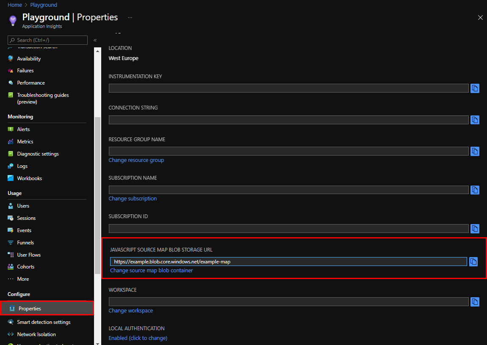
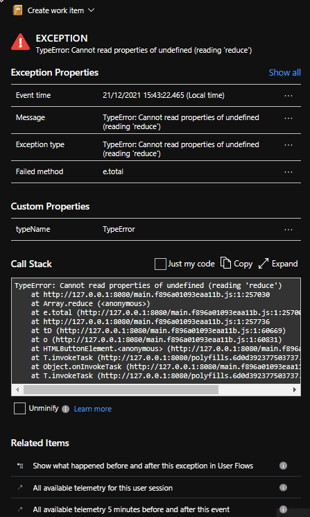

Because you're already here, I'm assuming that you're already familiar with [Application Insights](https://docs.microsoft.com/en-us/azure/azure-monitor/app/app-insights-overview), and that you're looking at how you can configure it within an Angular application. So I'm not going to waste any time, and we're diving right in.

## Installing Application Insights libraries

The first thing we need to do is to install the required libraries `@microsoft/applicationinsights-angularplugin-js` and `@microsoft/applicationinsights-web`.

```bash
npm i @microsoft/applicationinsights-angularplugin-js @microsoft/applicationinsights-web
```

## Configure Application Insights with the Angular plugin

Next, we define an `Insights` service that acts as an abstraction layer around the building blocks that both libraries provide. This service consumes the Application Insights JavaScript API to initialize an `ApplicationInsights` instance that is configured with the Application Insights Instrumentation Key. To hook into the Angular route lifecycle, which is required to send accurate page view data to Application Insights, the `AngularPlugin` is added to the extensions.

Notice that I'm not using the environment to set the instrumentation key, instead, I prefer to use a configuration file to [only build my application once](/blog/angular-build-once-deploy-to-multiple-environments) and deploy the same build to multiple environments.

Later, the `Insights` service can be injected into the Angular application to send events or traces to Application Insights. Therefore, some methods are exposed on the service.

```ts:insights.service.ts
import { Injectable } from '@angular/core';
import { Router } from '@angular/router';
import { AngularPlugin } from '@microsoft/applicationinsights-angularplugin-js';
import { ApplicationInsights } from '@microsoft/applicationinsights-web';

@Injectable()
export class Insights {
    private angularPlugin = new AngularPlugin();
    private appInsights = new ApplicationInsights({
        config: {
            instrumentationKey: this.appConfig.insights.instrumentationKey,
            extensions: [this.angularPlugin],
            extensionConfig: {
                [this.angularPlugin.identifier]: {
                    router: this.router,
                },
            },
        },
    });

    constructor(private router: Router, private appConfig: AppConfig) {
        this.appInsights.loadAppInsights();
    }

    // expose methods that can be used in components and services
    trackEvent(name: string): void {
        this.appInsights.trackEvent({ name });
    }

    trackTrace(message: string): void {
        this.appInsights.trackTrace({ message });
    }
}
```

In the example above, only the required configuration options are set, for the full reference of the available configuration options, see [Application Insights JavaScript configuration options](https://docs.microsoft.com/en-us/azure/azure-monitor/app/javascript#configuration), and the [Angular plugin configuration](https://github.com/microsoft/applicationinsights-angularplugin-js/blob/main/projects/applicationinsights-angularplugin-js/src/lib/applicationinsights-angularplugin-js.component.ts#L16).

## Sending errors to Application Insights

The next step is to import the `Insights` service into an Angular module.
You can do this inside of the `AppModule`, but I prefer to create an extra Angular module.
This module groups all of the insights related pieces into a single Angular module.

To send the exception information to Application Insights, the `ApplicationinsightsAngularpluginErrorService` is configured as the default Angular `ErrorHandler`.

```ts{6-12}:insights.module.ts
import { ErrorHandler, NgModule } from '@angular/core';
import { ApplicationinsightsAngularpluginErrorService } from '@microsoft/applicationinsights-angularplugin-js';
import { Insights } from './insights.service';

@NgModule({
  providers: [
    Insights,
    {
      provide: ErrorHandler,
      useClass: ApplicationinsightsAngularpluginErrorService,
    },
  ],
})
export class InsightsModule {}
```

Because the Angular error handler is overwritten with the application insights error handler, the default behavior that errors are logged to the console is removed.
This isn't very handy while we're developing, because we don't notice the errors anymore.
To re-enable the default behavior, the default Angular error handler `ErrorHandler` is added to the `errorServices` collection of the `AngularPlugin` within the Insights service that we created in the previous step.

```ts{16}:insights.service.ts
import { Injectable, ErrorHandler } from '@angular/core';
import { Router } from '@angular/router';
import { AngularPlugin } from '@microsoft/applicationinsights-angularplugin-js';
import { ApplicationInsights } from '@microsoft/applicationinsights-web';

@Injectable()
export class Insights {
    private angularPlugin = new AngularPlugin();
    private appInsights = new ApplicationInsights({
        config: {
            instrumentationKey: this.appConfig.insights.instrumentationKey,
            extensions: [this.angularPlugin],
            extensionConfig: {
                [this.angularPlugin.identifier]: {
                    router: this.router,
                    errorServices: [new ErrorHandler()],
                },
            },
        },
    });

    constructor(private router: Router, private appConfig: AppConfig) {
        this.appInsights.loadAppInsights();
    }

    // expose methods that can be used in components and services
    trackEvent(name: string): void {
        this.appInsights.trackEvent({ name });
    }

    trackTrace(message: string): void {
        this.appInsights.trackTrace({ message });
    }
}
```

## Initialize the `Insights` service

The `Insights` service must be initialized before it can start logging views and exceptions. You can do that by injecting the service in the `InsightsModule` module. This way when the `InsightsModule` is loaded, the `Insights` service is also initialized.

```ts{15}:insights.module.ts
import { ErrorHandler, NgModule } from '@angular/core';
import { ApplicationinsightsAngularpluginErrorService } from '@microsoft/applicationinsights-angularplugin-js';
import { Insights } from './insights.service';

@NgModule({
  providers: [
    Insights,
    {
      provide: ErrorHandler,
      useClass: ApplicationinsightsAngularpluginErrorService,
    },
  ],
})
export class InsightsModule {
    constructor(private insights: Insights) {}
}
```

The last step is to add the `InsightsModule` to the `imports` array of the `AppModule`.

```ts{7, 15}:app.module.ts
import { HttpClientModule } from '@angular/common/http';
import { NgModule } from '@angular/core';
import { FormsModule } from '@angular/forms';
import { BrowserModule } from '@angular/platform-browser';

import { AppComponent } from './app.component';
import { InsightsModule } from './insights';

@NgModule({
    declarations: [AppComponent],
    imports: [
        BrowserModule,
        HttpClientModule,
        FormsModule,
        InsightsModule
    ],
    bootstrap: [AppComponent],
})
export class AppModule {}
```

Now, all page views and exceptions are logged to Application Insights.

## Helpful stack traces in Application Insights

Unfortunately, the stack trace of an error isn't very helpful in Application Insights because it logs the minified version of the code. This makes it hard to find the root cause of the error, and where the error occurred.

For example, take a look at the following stack trace.
It tells us the error is at `main.f896a01093eaa11b.js:1:257030`, but good luck figuring this out.

```txt
TypeError: Cannot read properties of undefined (reading 'reduce')
    at http://127.0.0.1:8080/main.f896a01093eaa11b.js:1:257030
    at Array.reduce (<anonymous>)
    at e.total (http://127.0.0.1:8080/main.f896a01093eaa11b.js:1:257005)
    at http://127.0.0.1:8080/main.f896a01093eaa11b.js:1:257736
    at tD (http://127.0.0.1:8080/main.f896a01093eaa11b.js:1:60669)
    at o (http://127.0.0.1:8080/main.f896a01093eaa11b.js:1:60831)
    at HTMLButtonElement.<anonymous> (http://127.0.0.1:8080/main.f896a01093eaa11b.js:1:128113)
    at T.invokeTask (http://127.0.0.1:8080/polyfills.6d0d392377503737.js:1:7169)
    at Object.onInvokeTask (http://127.0.0.1:8080/main.f896a01093eaa11b.js:1:89807)
    at T.invokeTask (http://127.0.0.1:8080/polyfills.6d0d392377503737.js:1:7090)
```

To make this readable and useful there's an option to unminify the code, resulting in the following stack trace, which is a lot better.
We can clearly see which component and/or method caused the error and also the line number, in this case, `webpack:///apps/example-app/src/app/app.component.ts:29:26`.

```txt
TypeError: TypeError: Cannot read properties of undefined (reading 'reduce')
    at reduce (webpack:///apps/example-app/src/app/app.component.ts:29:26)
    at listenerFn (webpack:///node_modules/@angular/core/fesm2020/core.mjs:14963:15)
    at executeListenerWithErrorHandling (webpack:///node_modules/@angular/core/fesm2020/core.mjs:15001:21)
    at eventHandler (webpack:///node_modules/@angular/platform-browser/fesm2020/platform-browser.mjs:461:37)
    at apply (webpack:///node_modules/zone.js/fesm2015/zone.js:406:30)
    at invokeTask (webpack:///node_modules/@angular/core/fesm2020/core.mjs:25463:32)
    at onInvokeTask (webpack:///node_modules/zone.js/fesm2015/zone.js:405:59)
```

To enable this option, we need to upload the source map files to Application Insights.
This can be done by manually dragging and dropping the source map files on the stack trace window, but this isn't very convenient.

There's also another option to automatically have the source map files available. For this, we need to create a container within an [Azure Storage Account](https://docs.microsoft.com/en-us/azure/storage/common/storage-account-overview). When the container is created, you can upload the source map files via Azure or within your CI/CD pipeline by using the [Azure File Copy task](https://docs.microsoft.com/en-us/azure/devops/pipelines/tasks/deploy/azure-file-copy?view=azure-devops). For a detailed guide on how to do this, see the [docs](https://docs.microsoft.com/en-us/azure/azure-monitor/app/source-map-support).

Once the storage container is configured, you can set it as the default source map URL within your Application Insights properties.



You can now switch to a better-looking stack trace.



## Sending custom events and traces to Application Insights

Lastly, because we wrote the `Insights` service we can inject the service into Angular components and services. This allows us to send custom events and traces to Application Insights with the `trackEvent` and `trackTrace` methods, which we've exposed in the `Insights` service.

```ts{9, 12}:app.component.ts
import { Component } from '@angular/core';
import { Insights } from './insights.service';

@Component({
    selector: 'app-root',
    template: `...`,
})
export class AppComponent {
    constructor(private insights: Insights) {}

    buttonClicked() {
        this.insights.trackTrace('Button is clicked');
    }
}
```

## Conclusion

To make it easy to send data to Azure Application Insights in your Angular application, we make use of the Application Insights SDKs from Microsoft.

We've bundled the two libraries in a custom `Insights` service and module. This isolates the code from the rest of the application and makes it easy to change in the future if the API changes.

This also has the advantage that we can inject our Insights service into Angular components and services to send custom events and traces to Application Insights.

We've also seen how to make the stack traces in Application Insights readable by uploading the source map files into Azure Storage.
