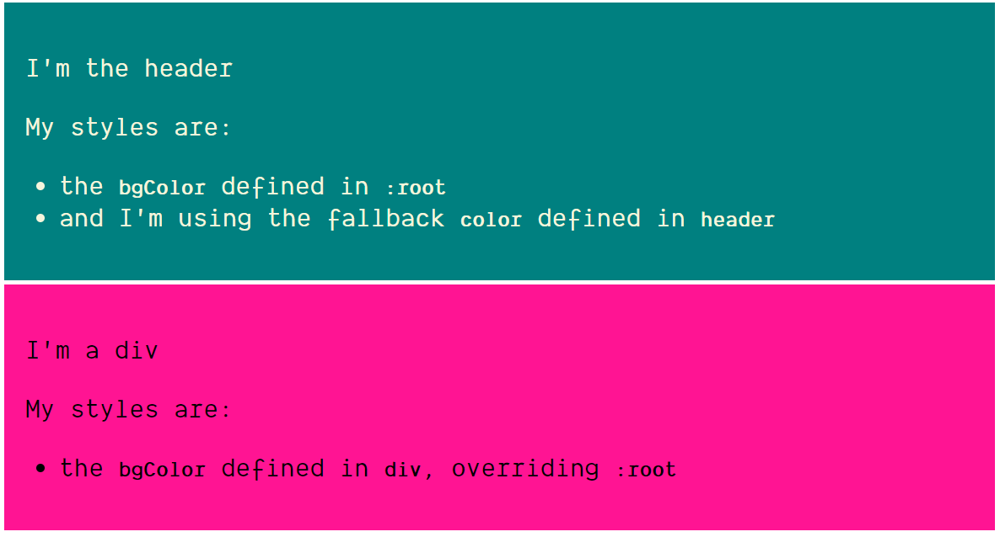
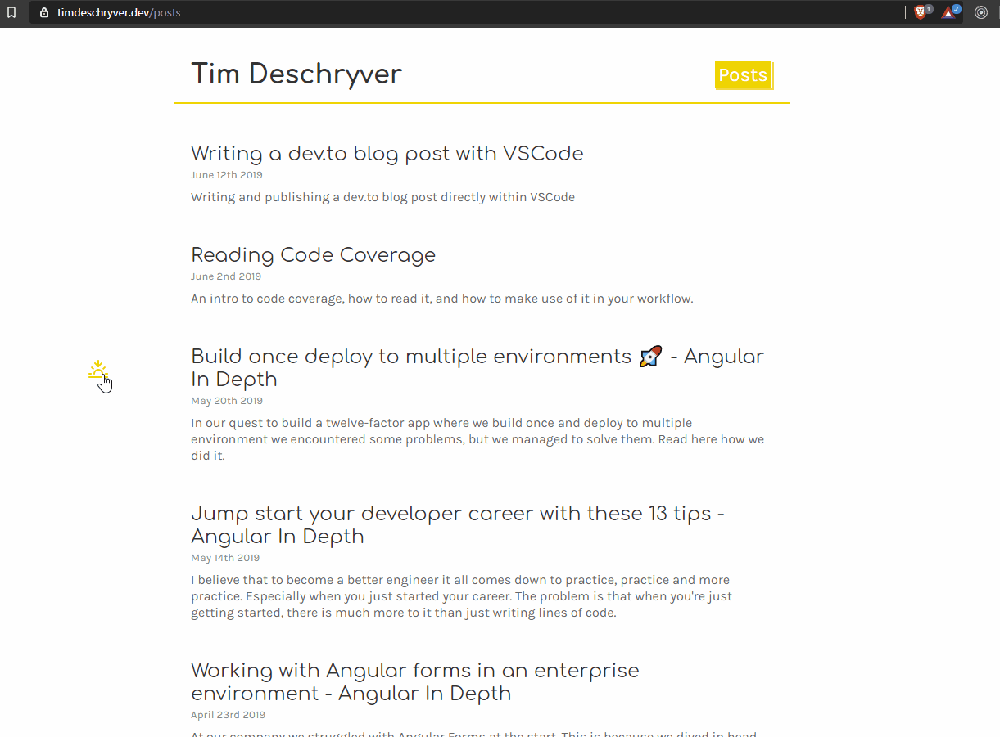

At first when I heard of [css variables](https://www.w3.org/TR/css-variables/) when it was introduced, I was a bit skeptical. Why would anyone use it if there are extension languages as scss, sass, less and stylus. After several years, I started to notice more and more peoples using it, writing about it and talking about it. I was missing out on something... It took a while but after using it here and there, I was hooked. In this post I'll cover what convinced me to explore css variables further and to start using them in projects.

## Usage

To declare variables, define them in a selector and prefix the variable names with two dashes (`--`):

```css
div {
	--bgColor: deeppink;
}
```

A popular approach is to define variables with the `:root` selector, this way you're defining a global variable:

```css
:root {
	--bgColor: teal;
}
```

To use the variables, use the `var()` function:

```css
div {
	background: var(--bgColor);
}
```

The `var()` function accepts a second parameter, which is used as a fallback if the variable has not been declared:

```css
header {
	background: var(--bgColor);
	color: var(--color, beige);
}
```

The snippets above results in:



## Themes

With css variables, creating a theme becomes simple.

Depending on the `body`'s class we can set the variable to its appropriate value:

```css
body.sunrise {
	--background-color: #fff;
	--text-color: #333;
}

body.sunset {
	--background-color: #333;
	--text-color: #fff;
}
```

We can then use these variables when we style elements:

```css
html,
body {
	background: var(--background-color);
	color: var(--text-color);
}
```

If the `body`'s class changes to `sunrise` or `sunset`, the css variables will cascade to all of the selectors.
In our case, we'll transition to a light or dark theme:



## JavaScript API

This is, in my opinion, the best part. CSS variables have a JavaScript API to get and set variables.

To get a variable, use the [`getPropertyValue` method](https://developer.mozilla.org/en-US/docs/Web/API/CSSStyleDeclaration/getPropertyValue):

```js
getComputedStyle(document.documentElement).getPropertyValue('--color');
```

To get a value from an element, first select that element with [`querySelector`](https://developer.mozilla.org/en-US/docs/Web/API/Document/querySelector):

```js
getComputedStyle(document.querySelector('h1')).getPropertyValue('--color');
```

To set a variable value, use [`style.setProperty`](https://developer.mozilla.org/en-US/docs/Web/API/CSSStyleDeclaration/setProperty):

```js
document.documentElement.style.setProperty('--color', 'red');
```

To set a value on an element:

```js
document.querySelector('h1').style.setProperty('--color', 'blue');
```

This API opens up some opportunities to use css variables in a clean way.

I encountered this use case a couple of days ago by [David K.](https://twitter.com/DavidKPiano) in one of his [XState](https://xstate.js.org) demos at [https://codepen.io/davidkpiano/pen/zWrRye](https://codepen.io/davidkpiano/pen/zWrRye). He uses css variables to create a selection box when the user drags the mouse across the screen.

The css of the selectbox uses the variables to know the four corners (based on the starting point and the current position of the mouse) of the box:

```css
.selectbox {
	left: calc(var(--mouse-x1));
	top: calc(var(--mouse-y1));
	width: calc((var(--mouse-x2) - var(--mouse-x1)));
	height: calc((var(--mouse-y2) - var(--mouse-y1)));

	color: rgba(255, 255, 255, 0.5);
	background: rgba(0, 0, 0, 0.1);
	border: 2px solid currentColor;
	position: absolute;
	transition: opacity 0.3s ease-in-out;
}
```

Listen on the mouse events, and update the the mouse points accordingly:

```js
document.documentElement.style.setProperty('--mouse-x1', ctx.selectArea.x1 + 'px');
document.documentElement.style.setProperty('--mouse-y1', ctx.selectArea.y1 + 'px');
document.documentElement.style.setProperty('--mouse-x2', ctx.selectArea.x2 + 'px');
document.documentElement.style.setProperty('--mouse-y2', ctx.selectArea.y2 + 'px');
```


## Ending word

If you are like me and didn't see the usefulness of css variables, or didn't know these existed.
I hope this post opened the door to start exploring their use cases.
I stumbled by accident on the JavaScript API, but this API opened my eyes for their real world usages and I'm looking forward to using and seeing them more in the future.
