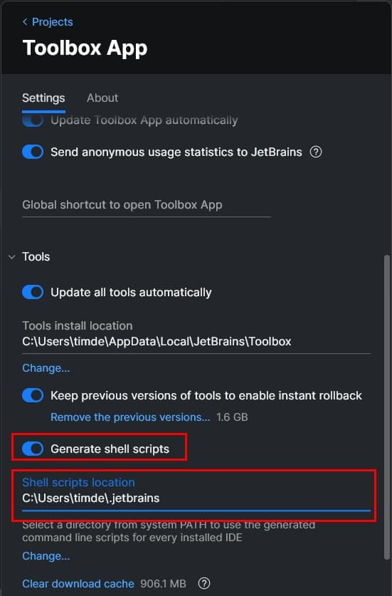
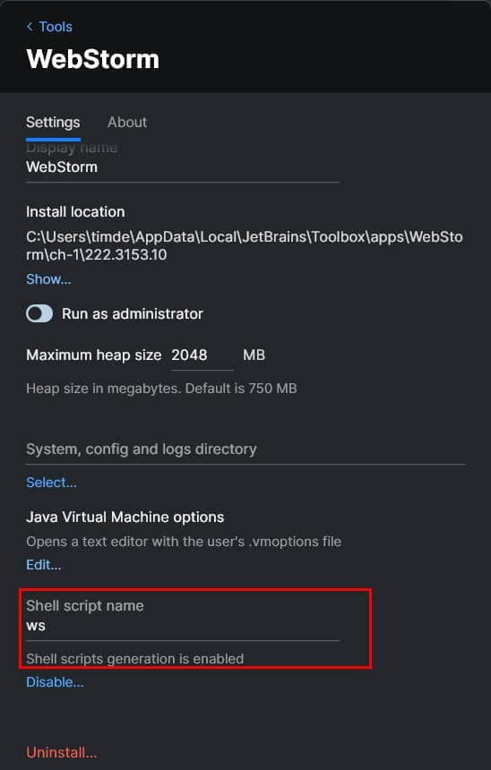

The [JetBrains Toolbox App](https://www.jetbrains.com/toolbox-app/) makes it easy to install JetBrain products and keep
them updated.
One caveat of using the Toolbox App, is that your shell scripts might not work anymore.
Luckily, there's a two-step process to configure the Jetbrains Toolbox App to work with your shell scripts.

As a workaround, open up the JetBrains Toolbox App Settings, enable the "generate shell scripts" option
and set the "Shell scripts location" to a folder of your choice.

For reference, I created a `.jetbrains` folder within my user folder.

```txt
C:\Users\{user}\.jetbrains
```



You can check if everything went well by opening the specified folder.
It should contain all the JetBrains products.


Lastly, create a new PATH environment variable and point it to the same folder.

Restart your shell and you should be able to open the JetBrains IDEs from the command line.

As a bonus, you can also rename the shell scripts to custom names.
For example, I've configured WebStorm to start with the `ws` command.
To do this, go to the settings of the tool, scroll to the bottom, and rename the shell script name.


