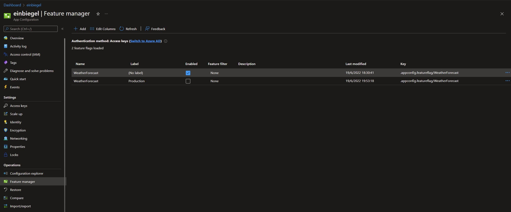
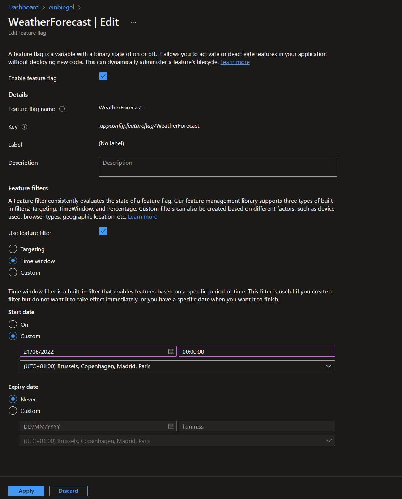

Before we get to the actual content of this post, let's first talk about the concept of feature flags.
A feature flag is a way to enable or disable a feature, or code path within an application.

Ideally, "the switch" when you turn a feature on or off shouldn't have an effect on the code, nor should it require a new release of the code. It's just a toggle that you can flip on or off via some kind of configuration.

This can come in various forms:

- a condition based on the environment, to enable a feature during Q&A, while disabling it in production until it's ready for production;
- a feature that needs to be rolled out to a specific user, or user group, e.g. to testers;
- a time-based feature that needs to be rolled out in the future, or for a certain amount of time, for example, to show a banner;
- let the client decide if the feature is enabled or not, based on the user's preferences;

What I like about feature flags in the .NET ecosystem, is that you can start out simple and then add more to it when you need it. As you see later on in this blog post, the most useful feature flags are already implemented and you just have to plug them in.

Now, let's implement a naive feature flag in .NET and extend it to end up with a more robust solution.

## Table of contents <!-- omit in toc -->

- [Setting the stage](#setting-the-stage)
- [Implementing a basic feature flag](#implementing-a-basic-feature-flag)
- [Configurable feature flag](#configurable-feature-flag)
- [Introducing standards with the Feature Management package](#introducing-standards-with-the-feature-management-package)
  - [Built-in filters](#built-in-filters)
- [Writing a Custom Filter Implementation](#writing-a-custom-filter-implementation)
  - [Using Parameters within Custom Filters](#using-parameters-within-custom-filters)
- [FeatureGate for MVC Controllers](#featuregate-for-mvc-controllers)
- [Azure Feature Management](#azure-feature-management)
- [Conclusion](#conclusion)

## Setting the stage

To follow along with me, create a new application with the following commands.

```bash
dotnet new webapi -minimal -o FeatureFlagsInNet
cd .\FeatureFlagsInNet
```

Next, open the application in your IDE and open the `Program.cs` file.
Here you'll find code that already implements a `GET` endpoint to retrieve a collection of weather forecasts.

A trimmed-down version of the code, with only the essentials (the swagger implementation is removed), looks like this.

```cs{11-23}:Program.cs
var builder = WebApplication.CreateBuilder(args);

var app = builder.Build();
app.UseHttpsRedirection();

var summaries = new[]
{
    "Freezing", "Bracing", "Chilly", "Cool", "Mild", "Warm", "Balmy", "Hot"
};

app.MapGet("/weatherforecast", () =>
{
    var forecast = Enumerable.Range(1, 5).Select(index =>
        new WeatherForecast
        (
            DateTime.Now.AddDays(index),
            Random.Shared.Next(-20, 55),
            summaries[Random.Shared.Next(summaries.Length)]
        ))
        .ToArray();

    return Results.Ok(forecast);
});

app.Run();

record WeatherForecast(DateTime Date, int TemperatureC, string? Summary)
{
    public int TemperatureF => 32 + (int)(TemperatureC / 0.5556);
}
```

To verify that the current setup works, run the application and navigate to [https://localhost:{portnumber}/weatherforecast](https://localhost:{portnumber}/weatherforecast) (don't forget to update the port number).

```bash
dotnet watch run
```

If everything went well, you should see a collection of forecasts.
For me, this gives me the following result.

```json:weatherforecasts.json
[
    {
        "date": "2022-06-18T14:38:57.4853538+02:00",
        "temperatureC": -4,
        "summary": "Freezing",
        "temperatureF": 25
    },
    {
        "date": "2022-06-19T14:38:57.4853797+02:00",
        "temperatureC": -7,
        "summary": "Scorching",
        "temperatureF": 20
    },
    {
        "date": "2022-06-20T14:38:57.48538+02:00",
        "temperatureC": -10,
        "summary": "Cool",
        "temperatureF": 15
    },
    {
        "date": "2022-06-21T14:38:57.4853802+02:00",
        "temperatureC": -9,
        "summary": "Mild",
        "temperatureF": 16
    },
    {
        "date": "2022-06-22T14:38:57.4853804+02:00",
        "temperatureC": 20,
        "summary": "Bracing",
        "temperatureF": 67
    }
]
```

## Implementing a basic feature flag

With everything ready, we can start to implement a feature flag in the weather forecasts endpoint.

To keep things simple, let's say that the endpoint is enabled or disabled based on the flag.

The most basic feature flag is a simple `if` statement based on a boolean condition.

To implement the feature flag, define a `forecastEnabled` variable.
This variable's value decides the return value of the endpoint, when:

- `true` (feature flag is enabled), the endpoint returns the forecast data;
- `false` (feature flag is disabled), the endpoint returns a not found (`404`) status code;

```cs{6,14-16}:Program.cs
var builder = WebApplication.CreateBuilder(args);

var app = builder.Build();
app.UseHttpsRedirection();

var forecastEnabled = true;
var summaries = new[]
{
    "Freezing", "Bracing", "Chilly", "Cool", "Mild", "Warm", "Balmy", "Hot"
};

app.MapGet("/weatherforecast", () =>
{
    if(!forecastEnabled) {
        return Results.NotFound();
    }

    var forecast =  Enumerable.Range(1, 5).Select(index =>
        new WeatherForecast
        (
            DateTime.Now.AddDays(index),
            Random.Shared.Next(-20, 55),
            summaries[Random.Shared.Next(summaries.Length)]
        ))
        .ToArray();

    return Results.Ok(forecast);
});

app.Run();

record WeatherForecast(DateTime Date, int TemperatureC, string? Summary)
{
    public int TemperatureF => 32 + (int)(TemperatureC / 0.5556);
}
```

## Configurable feature flag

So far, this doesn't really make sense.
The feature flag is either enabled or disabled for all of the clients.
To enable the forecasts endpoint, the `forecastEnabled` variable needs to be changed in code, and the application needs to be re-released.

Having to do this defeats the reasons why feature flags are useful.
The first step that needs to be taken to make this feature flag useful, is to find a way to dynamically change its value.

To achieve this, the feature's condition needs to be defined outside of the application code.
As the result, it allows us to change the setting during a release, and thus can the build artifact can be reused in multiple stages of the CI/CD pipeline.

An example: the feature flag can be enabled for a staging environment, while it can be disabled for a production environment.

A way to configure the feature flag conditions is to use the appsettings.
Therefore, we add an extra section `FeatureFlags`, within the section we also create the `WeatherForecast` property.

```json{9-11}:appsettings.json
{
    "Logging": {
        "LogLevel": {
            "Default": "Information",
            "Microsoft.AspNetCore": "Warning"
        }
    },
    "AllowedHosts": "*",
    "FeatureFlags": {
        "WeatherForecast": true
    }
}
```

To use the newly introduced configuration, replace the `forecastEnabled` variable with the value from the appsettings.

```cs{13}:Program.cs
var builder = WebApplication.CreateBuilder(args);

var app = builder.Build();
app.UseHttpsRedirection();

var summaries = new[]
{
    "Freezing", "Bracing", "Chilly", "Cool", "Mild", "Warm", "Balmy", "Hot"
};

app.MapGet("/weatherforecast", () =>
{
    if (!builder.Configuration.GetValue<bool>("FeatureFlags:WeatherForecast"))
    {
        return Results.NotFound();
    }

    var forecast =  Enumerable.Range(1, 5).Select(index =>
        new WeatherForecast
        (
            DateTime.Now.AddDays(index),
            Random.Shared.Next(-20, 55),
            summaries[Random.Shared.Next(summaries.Length)]
        ))
        .ToArray();

    return Results.Ok(forecast);
});

app.Run();

record WeatherForecast(DateTime Date, int TemperatureC, string? Summary)
{
    public int TemperatureF => 32 + (int)(TemperatureC / 0.5556);
}
```

## Introducing standards with the Feature Management package

Instead of defining our own standards, we can also use Microsoft's implementation from the `Microsoft.FeatureManagement.AspNetCore` NuGet package.

To install the package, run the following command.

```bash
dotnet add package Microsoft.FeatureManagement.AspNetCore
```

After the package is installed, we can refactor our custom implementation with the generic implementation.
To do this:

- import the `Microsoft.FeatureManagement` namespace;
- register the `AddFeatureManagement` service;
- inject the `IFeatureManager` into the endpoint;
- use the `IFeatureManager.IsEnabledAsync` method to check if the feature is enabled;

```cs{1, 4-5, 15, 17-20}:Program.cs
using Microsoft.FeatureManagement;

var builder = WebApplication.CreateBuilder(args);
builder.Services
    .AddFeatureManagement(builder.Configuration.GetSection("FeatureFlags"));

var app = builder.Build();
app.UseHttpsRedirection();

var summaries = new[]
{
    "Freezing", "Bracing", "Chilly", "Cool", "Mild", "Warm", "Balmy", "Hot"
};

app.MapGet("/weatherforecast", async (IFeatureManager manager) =>
{
    if (!await manager.IsEnabledAsync("WeatherForecast"))
    {
        return Results.NotFound();
    }

    var forecast = Enumerable.Range(1, 5).Select(index =>
        new WeatherForecast
        (
            DateTime.Now.AddDays(index),
            Random.Shared.Next(-20, 55),
            summaries[Random.Shared.Next(summaries.Length)]
        ))
        .ToArray();

    return Results.Ok(forecast);
});

app.Run();

record WeatherForecast(DateTime Date, int TemperatureC, string? Summary)
{
    public int TemperatureF => 32 + (int)(TemperatureC / 0.5556);
}
```

The configuration within the `appsettings.json` file doesn't need to be changed and can be reused as-is.
This step doesn't seem to be a big change, but it gives us the opportunity to do more...

### Built-in filters

Besides a defined and consistent way to configure the feature flags, the package also provides a couple feature flag implementations (filters) for the most common scenarios.

With the Feature Management package, we can enable or disable a feature flag (`true` or `false`), just like before.
But the package also has a "filters" concept. With filters, a feature flag can be on or off based on certain conditions.
Each filter has its configuration schema (in JSON), but the way we verify that the feature is enabled remains the same for all filters.

In addition to the built-in filters, you can also write your own custom implementations.

The following filters are available:

- `PercentageFilter`, to randomly enable/disable the feature based on a percentage;
- `TimeWindowFilter`, to enable the feature during a predefined window with a start and end time;
- `TargetingFilter`, to enable the feature for a specific user, or group of users (for this filter, a percentage can also be set);

For more info about these, you can take a look at the [docs](https://docs.microsoft.com/en-us/azure/azure-app-configuration/howto-feature-filters-aspnet-core).

> Important: As far as I know, the `TargetingFilter` filter cannot be used when the Minimal API structure is used. When you register the filter, you'll receive the error: System.InvalidOperationException: Unable to resolve service for type 'Microsoft.FeatureManagement.FeatureFilters.ITargetingContextAccessor' while attempting to activate 'Microsoft.FeatureManagement.FeatureFilters.TargetingFilter'.

These filters are available from the `Microsoft.FeatureManagement.FeatureFilters` namespace and must be registered individually.

The rest of the code remains the same.
In other words, this doesn't change how we verify that the feature flag is enabled.

```cs{2,7-8}:Program.cs
using Microsoft.FeatureManagement;
using Microsoft.FeatureManagement.FeatureFilters;

var builder = WebApplication.CreateBuilder(args);
builder.Services
    .AddFeatureManagement(builder.Configuration.GetSection("FeatureFlags"))
    .AddFeatureFilter<PercentageFilter>()
    .AddFeatureFilter<TimeWindowFilter>();

var app = builder.Build();
app.UseHttpsRedirection();

var summaries = new[]
{
    "Freezing", "Bracing", "Chilly", "Cool", "Mild", "Warm", "Balmy", "Hot"
};

app.MapGet("/weatherforecast", async (IFeatureManager manager) =>
{
    if (!await manager.IsEnabledAsync("WeatherForecast"))
    {
        return Results.NotFound();
    }

    var forecast = Enumerable.Range(1, 5).Select(index =>
        new WeatherForecast
        (
            DateTime.Now.AddDays(index),
            Random.Shared.Next(-20, 55),
            summaries[Random.Shared.Next(summaries.Length)]
        ))
        .ToArray();

    return Results.Ok(forecast);
});

app.Run();

record WeatherForecast(DateTime Date, int TemperatureC, string? Summary)
{
    public int TemperatureF => 32 + (int)(TemperatureC / 0.5556);
}
```

As said before, while the way we consume the feature flags remains the same, the way we configure them is different.

As you can see below, the type of filter is appointed with the `Name` property.
With the `Parameters` property, the configuration of the filter is set for the percentage and the time window filters.

```json{10-42}:appsettings.json
{
    "Logging": {
        "LogLevel": {
            "Default": "Information",
            "Microsoft.AspNetCore": "Warning"
        }
    },
    "AllowedHosts": "*",
    "FeatureFlags": {
        "WeatherForecastPercentage": {
            "EnabledFor": [
                {
                    "Name": "Microsoft.Percentage",
                    "Parameters": {
                        "Value": 50
                    }
                }
            ]
        },
        "WeatherForecastTimeWindow": {
            "EnabledFor": [
                {
                    "Name": "Microsoft.TimeWindow",
                    "Parameters": {
                        "Start": "Mon, 06 Jun 2022 00:00:00 GMT",
                        "End": "Mon, 13 Jun 2022 00:00:00 GMT"
                    }
                },
                {
                    "Name": "Microsoft.TimeWindow",
                    "Parameters": {
                        "Start": "Mon, 04 Jul 2022 00:00:00 GMT",
                    }
                },
                {
                    "Name": "Microsoft.TimeWindow",
                    "Parameters": {
                        "End": "Mon, 11 Jul 2022 00:00:00 GMT"
                    }
                },
            ]
        }
    }
}
```

An example configuration for the targeting filter is shown below.
Instead of the `Parameters` property, the filter is configured with the `Audience` property.

```json{10-32}:appsettings.json
{
    "Logging": {
        "LogLevel": {
            "Default": "Information",
            "Microsoft.AspNetCore": "Warning"
        }
    },
    "AllowedHosts": "*",
    "FeatureFlags": {
        "WeatherForecastTargeting": {
            "EnabledFor": [
                {
                    "name": "Microsoft.Targeting",
                    "parameters": {
                        "Audience": {
                            "Users": ["username1", "username2"],
                            "Groups": [
                                {
                                    "Name": "BetaUsers",
                                    "RolloutPercentage": 100
                                },
                                {
                                    "Name": "Internal",
                                    "RolloutPercentage": 75
                                }
                            ],
                            "DefaultRolloutPercentage": 0
                        }
                    }
                }
            ]
        }
    }
}
```

## Writing a Custom Filter Implementation

To implement your own filter logic, create a class that implements the `IFeatureFilter` interface and register the service.

The `IFeatureFilter` interface lets you implement the `EvaluateAsync` method.
Here, you must write your own logic to determine if the feature is enabled or not.

The method receives the `FeatureFilterEvaluationContext` argument, which contains the configuration object.
To have access to the filter's parameters, use the `FeatureFilterEvaluationContext.Parameters.Get<T>()` method.

```cs{7, 44-53, 55-59}:Program.cs
using Microsoft.FeatureManagement;

var builder = WebApplication.CreateBuilder(args);

builder.Services
    .AddFeatureManagement(builder.Configuration.GetSection("FeatureFlags"))
    .AddFeatureFilter<MyCustomFilter>();

var app = builder.Build();

app.UseHttpsRedirection();

var summaries = new[]
{
    "Freezing", "Bracing", "Chilly", "Cool", "Mild", "Warm", "Balmy", "Hot"
};

app.MapGet("/weatherforecast", async (IFeatureManager manager) =>
{
    if (!await manager.IsEnabledAsync("WeatherForecast"))
    {
        return Results.NotFound();
    }

    var forecast = Enumerable.Range(1, 5).Select(index =>
        new WeatherForecast
        (
            DateTime.Now.AddDays(index),
            Random.Shared.Next(-20, 55),
            summaries[Random.Shared.Next(summaries.Length)]
        ))
        .ToArray();

    return Results.Ok(forecast);
});

app.Run();

record WeatherForecast(DateTime Date, int TemperatureC, string? Summary)
{
    public int TemperatureF => 32 + (int)(TemperatureC / 0.5556);
}

[FilterAlias(nameof(MyCustomFilter))]
public class MyCustomFilter : IFeatureFilter
{
    public Task<bool> EvaluateAsync(FeatureFilterEvaluationContext evaluationContext, CancellationToken cancellationToken = default)
    {
        var settings = evaluationContext.Parameters.Get<MyCustomFilterSettings>()
            ?? throw new ArgumentNullException(nameof(MyCustomFilterSettings));
        return Task.FromResult(settings.LuckyNumber == 47);
    }
}

public class MyCustomFilterSettings
{
    public int LuckyNumber { get; set; }
}
```

Via the `FilterAlias` attribute, the name of the filter is set.
This is the same name that needs to be used within the configuration to couple the configuration to the filter.

```json{10-19}:appsettings.json
{
    "Logging": {
        "LogLevel": {
            "Default": "Information",
            "Microsoft.AspNetCore": "Warning"
        }
    },
    "AllowedHosts": "*",
    "FeatureFlags": {
        "WeatherForecast": {
            "EnabledFor": [
                {
                    "name": "MyCustomFilter",
                    "parameters": {
                        "LuckyNumber": 47
                    }
                }
            ]
        }
    }
}
```

### Using Parameters within Custom Filters

A filter can also receive parameters that are only known at runtime.
This could, for example, be an alternative to the `TargetingFilter` filter for minimal Apis, because it could receive the HTTP context or subset from it.

To create filters with parameters, replace the `IFeatureFilter` with the `IContextualFeatureFilter` interface.
After this change, the `EvaluateAsync` method receives the additional parameters.

In the example below, a header is read and passed to the filter, but this could also be the `HttpContext`, a `ClaimsPrinciple`, or something else.

```cs{21, 48, 52, 61-64}:Program.cs
using Microsoft.AspNetCore.Mvc;
using Microsoft.FeatureManagement;

var builder = WebApplication.CreateBuilder(args);

builder.Services
    .AddFeatureManagement(builder.Configuration.GetSection("FeatureFlags"))
    .AddFeatureFilter<MyCustomFilter>();

var app = builder.Build();

app.UseHttpsRedirection();

var summaries = new[]
{
    "Freezing", "Bracing", "Chilly", "Cool", "Mild", "Warm", "Balmy", "Hot"
};

app.MapGet("/weatherforecast", async (IFeatureManager manager, [FromHeader(Name = "X-Lucky-Number")] int? inputNumber) =>
{
    if (!await manager.IsEnabledAsync("WeatherForecast", new MyCustomFilterContext { InputNumber = inputNumber ?? 0 }))
    {
        return Results.NotFound();
    }

    var forecast = Enumerable.Range(1, 5).Select(index =>
        new WeatherForecast
        (
            DateTime.Now.AddDays(index),
            Random.Shared.Next(-20, 55),
            summaries[Random.Shared.Next(summaries.Length)]
        ))
        .ToArray();

    return Results.Ok(forecast);
});

app.Run();

record WeatherForecast(DateTime Date, int TemperatureC, string? Summary)
{
    public int TemperatureF => 32 + (int)(TemperatureC / 0.5556);
}

[FilterAlias(nameof(MyCustomFilter))]
public class MyCustomFilter : IContextualFeatureFilter<MyCustomFilterContext>
{
    public Task<bool> EvaluateAsync(FeatureFilterEvaluationContext evaluationContext, MyCustomFilterContext context, CancellationToken cancellationToken = default)
    {
        var settings = evaluationContext.Parameters.Get<MyCustomFilterSettings>()
            ?? throw new ArgumentNullException(nameof(MyCustomFilterSettings));
        return Task.FromResult(settings.LuckyNumber == context.InputNumber);
    }
}

public class MyCustomFilterSettings
{
    public int LuckyNumber { get; set; }
}

public class MyCustomFilterContext
{
    public int InputNumber { get; set; }
}
```

## FeatureGate for MVC Controllers

This part is only available if your application is built by using controllers, and not with the Minimal Api structure.

Instead of checking if a feature is enabled within the code, you can use the `FeatureGate` attribute to disable a whole controller or a specific endpoint. The parameter passed to the attribute is the name of the feature that's set in the configuration.

```cs{1,3}
using Microsoft.FeatureManagement.Mvc;

[FeatureGate("WeatherForecast")]
public class WeatherForecastController : ControllerBase
{
}
```

```cs{1,6}
using Microsoft.FeatureManagement.Mvc;

public class WeatherForecastController : ControllerBase
{
    [HttpGet]
    [FeatureGate("WeatherForecast")]
    public async IActionResult Get()
    {
    }
}
```

## Azure Feature Management

So far, so good, but we can do better.

The current implementation has one drawback.
When the configuration is changed the application needs to be restarted to have an effect.
This has an impact on the users.

If you want to modify a feature flag without restarting the application, you can use the Feature Management feature from Azure.
This allows us to dynamically change the configuration of the feature flags.

Read the [docs](https://docs.microsoft.com/en-us/azure/azure-app-configuration/manage-feature-flags) on how to install and manage the feature flags in Azure ([pricing table](https://azure.microsoft.com/en-us/pricing/details/app-configuration/#pricing)).

In the Azure Portal, you can create and remove feature flag definitions, and configure their filters.
This is similar to what we had in the `appsettings.json` file, but it now has a user interface.

As an example, see the following screenshot that defines the `WeatherForecast` feature flag within the Azure Portal.
You can also notice that a label can be added to the feature flags, this is useful to create groups of features.



The configuration view of the feature flag looks like this:



To use the Azure Feature Management in code, first install the needed NuGet packages.

```bash
dotnet add package Microsoft.Azure.AppConfiguration.AspNetCore
dotnet add package Microsoft.Extensions.Configuration.AzureAppConfiguration
```

Before we can use the Azure Feature Management, we first need to configure the Azure App Configuration.
During the configuration, we connect to the specified Azure resource and enable the feature flags to feature.
While we do that, we also have the option to define which feature flags need to be registered based on their label.

The Azure Configuration can further be tweaked to fit your needs, e.g. set the cache duration, for more information about all the options sees the [docs](https://docs.microsoft.com/en-us/azure/azure-app-configuration/enable-dynamic-configuration-aspnet-core).

In the example below, we read all the feature flags that don't have a label defined, and also the feature flags for the current environment. The order is important here because the latter overrides the former.
Using this approach makes it easy to enable features for all environments (feature flags without a label), except for the production environment (feature flags with "Production" as the label).

While using the Azure Feature Management, don't forget to register the feature flag management feature, and the filters that are used, just as before in the previous examples that aren't using Azure.

```cs{3,7-20, 22, 30}
using Microsoft.FeatureManagement;
using Microsoft.FeatureManagement.FeatureFilters;
using Microsoft.Extensions.Configuration.AzureAppConfiguration;

var builder = WebApplication.CreateBuilder(args);

builder.Host.ConfigureAppConfiguration((config, appBuilder) =>
{
    appBuilder.AddAzureAppConfiguration(azureConfig =>
    {
        azureConfig
            .Connect("Endpoint=https://name.azconfig.io;Id=id")
            // include all settings without a label
            .Select(KeyFilter.Any, LabelFilter.Null)
            // include all settings with the label that corresponds to the current environment
            // this overrides the previous setting if there are any
            .Select(KeyFilter.Any, config.HostingEnvironment.EnvironmentName);
        azureConfig.UseFeatureFlags();
    });
});.

builder.Services.AddAzureAppConfiguration();

builder.Services
    .AddFeatureManagement()
    .AddFeatureFilter<PercentageFilter>();

var app = builder.Build();

app.UseAzureAppConfiguration();
app.UseHttpsRedirection();

var summaries = new[]
{
    "Freezing", "Bracing", "Chilly", "Cool", "Mild", "Warm", "Balmy", "Hot"
};

app.MapGet("/weatherforecast", async (IFeatureManager manager) =>
{
    if (!await manager.IsEnabledAsync("WeatherForecast"))
    {
        return Results.NotFound();
    }

    var forecast = Enumerable.Range(1, 5).Select(index =>
        new WeatherForecast
        (
            DateTime.Now.AddDays(index),
            Random.Shared.Next(-20, 55),
            summaries[Random.Shared.Next(summaries.Length)]
        ))
        .ToArray();

    return Results.Ok(forecast);
});

app.Run();

record WeatherForecast(DateTime Date, int TemperatureC, string? Summary)
{
    public int TemperatureF => 32 + (int)(TemperatureC / 0.5556);
}
```

As the last step, the feature settings from the `appsettings.json` file can be removed, Azure is now the owner of it.

## Conclusion

In this post, we started off with a naive approach to implementing a feature flag.
It required us to recompile and redeploy the application in order to change the application's behavior.

The first step towards a better solution was to refactor the implementation by relocating the feature flag configuration from the code into the `appsettings.json` file. As result, the feature flag was declarative and the application could be redeployed (with a different behavior) without recompiling it and thus making it easy to turn off certain features in a specified environment. As a side-effect, the application now also meets the criteria of a [twelve-factor app](https://12factor.net/).

To introduce a standard the next step was to use the .NET Feature Management Api.
An additional benefit of using the Feature Management Api is that we have the possibility to target specific users.
Beyond only having an application-wide feature flag, a feature flag can be configured based on different conditions.
This feature is called a "filter", and the Feature Management Api has three filters built-in, the `PercentageFilter`, `TimeWindowFilter`, and `TargetingFilter` filters

What I like the most about the Feature Management Api is that it doesn't require us to change the way how we verify if a feature flag is enabled or not in code, because everything is done by having a configuration.

Lastly, to give us maximum flexibility, the Azure Feature Management was added.
Instead of storing the configuration in the `appsettings.json` file, the feature flags are now managed within the Azure Portal.
We now aren't obligated to restart the application when we make changes to the configuration before those changes take effect.
After making changes to the configuration, the application automatically updates at run-time via the dynamic configuration.
