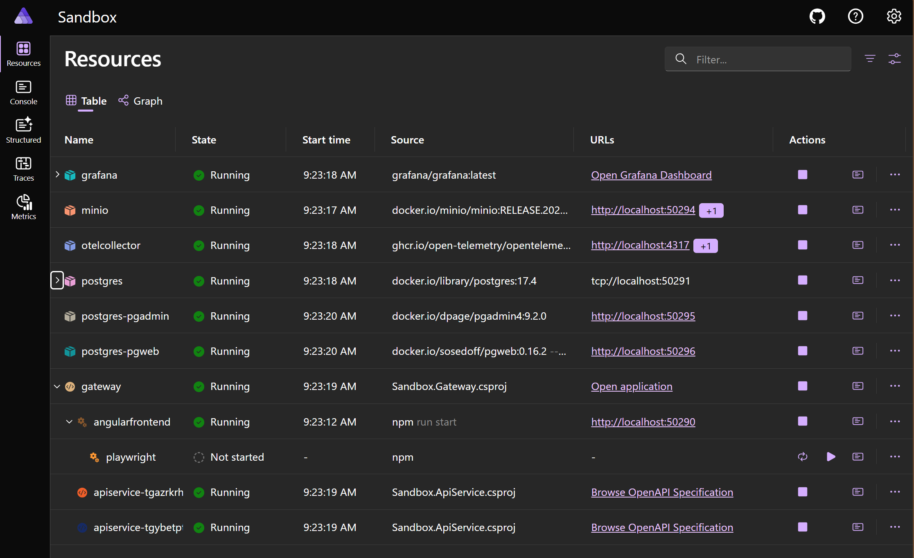
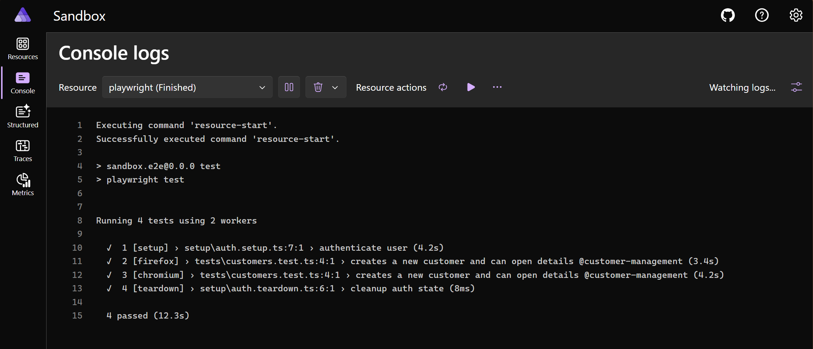
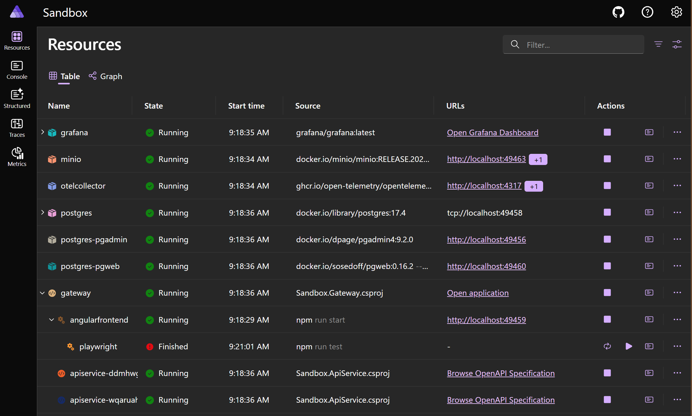
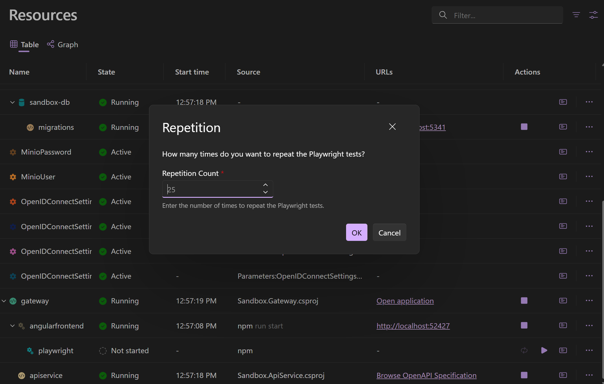

I want to show you a little trick on how you can integrate a (TypeScript) Playwright test project within Aspire's dashboard, to be able run them on from the dashboard.
This makes it very convenient to quickly run your tests without having to use an IDE or the command line.

## .NET Aspire configuration

The default behavior is that all projects are automatically started when the Aspire application starts.
However, using [`WithExplicitStart`](https://learn.microsoft.com/en-us/dotnet/api/aspire.hosting.resourcebuilderextensions.withexplicitstart), it's possible to start an application explicitly when you need it. After the execution, the application shuts down, and you can restart it later. This is useful for certain tasks, such as running database migrations/seeds, or in this case, running Playwright tests.

To add Playwright tests to your Aspire dashboard, first add the Playwright project as a Node.js application to your Aspire project by using the `AddNpmApp` method.
This is identical to how you would add any other Node.js application, but instead of serving the application, we want to run the Playwright tests.
`AddNpmApp` accepts the name of the application, the path to the project, and the command to run the tests. For my case, I used the `test` command, which is defined in the `package.json` file of the Playwright project. Aspire will run the command using the `npm` CLI.

Because we don't want the Playwright tests to run automatically when the Aspire application starts, we use the `WithExplicitStart` method on the resource builder.

> Adds an ExplicitStartupAnnotation annotation to the resource so it doesn't automatically start with the app host startup.

The Playwright tests are written on my Angular frontend application, and require the URL of the application to run the tests against.
Since the Angular application is also included in my Aspire project, I can reference it using the `WithReference` method. In my case, I referenced the [YARP (Yet Another Reverse Proxy)](https://learn.microsoft.com/en-us/aspnet/core/fundamentals/servers/yarp/yarp-overview) project (`gateway`), which serves the Angular application. If you're not using a Proxy, it can of course also be a reference to the Angular application as another Node.js application. Behind the scenes, Aspire creates an environment variable containing the URL of the referenced application, which can be used in the Playwright configuration to set the `baseURL` for the tests.

I also created a new environment variable `ASPIRE` and set it to `true`. I needed this to provide the correct context in which the tests are run so that I could adjust the behavior accordingly. But, more on that in a moment.

Finally, I excluded the Playwright resource from the manifest using the `ExcludeFromManifest` method.
This will prevent the Playwright project from being published when building/deploying the Aspire application.
We want this to only be available in the development environment, so it doesn't make sense to include it in the production build.

In code, this looks like the following:

```cs{5-7,9-12}:Program.cs
var builder = DistributedApplication.CreateBuilder(args);

if (builder.Environment.IsDevelopment())
{
    var playwright = builder
        .AddNpmApp("playwright", "../Sandbox.EndToEndTests", "test")
        .WithExplicitStart()
        .WithPlaywrightRepeatCommand()
        .WithReference(gateway)
        .WithEnvironment("ASPIRE", "true")
        .ExcludeFromManifest()
        .WithParentRelationship(gateway);
}

builder.Build().Run();
```

When you visit the dashboard, you see that the Playwright resource is listed there, and that it's not started yet.
Because I created a parent relationship, the Playwright resource will be displayed under the Angular application in the dashboard.
This is a nice visual grouping of the resources.



To run the Playwright tests, simply click the "Play" button next to the Playwright resource in the dashboard.
You can follow the progress of the tests, and you can open the logs by selecting the "Logs" button.



When the tests are finished, the result is visualized in the dashboard with a finished success or error icon.
At this point, the logs are still available, so you can inspect the output of the tests.



## Playwright configuration

The .NET configuration defines two important things for the Playwright tests:

1. It sets the `ASPIRE` environment variable to `true`, which is important for the Playwright tests to know that they are running in the Aspire environment so they can adjust their behavior accordingly.
1. It includes a reference to the Angular application, which is necessary to run the Playwright tests against the correct application URL.

Both of these settings are used while defining the Playwright configuration to configure the test setup.

The `ASPIRE` variable determines the reporter used for the Playwright tests. If the `ASPIRE` variable is set, it uses the `list` reporter, which is more suitable for the Aspire dashboard. The reporter logs the test results in a more compact format, and it exits the process after the tests are finished (otherwise, the process keeps running with the `html` reporter).

The application URL, which is accessed using the `services__gateway__http__0` variable, ensures that the Playwright tests are run against the correct application URL.
If the environment variable is not set, it falls back to the `APPLICATION_URL` variable, which is set within the CI environment.

The impacted Playwright configuration file looks like this:

```ts{7, 9}:playwright.config.ts
import { defineConfig, devices } from '@playwright/test';

/**
 * See https://playwright.dev/docs/test-configuration.
 */
export default defineConfig({
    reporter: process.env.CI ? [['github'], ['html'], ['dot']] : process.env['ASPIRE'] ? 'list' : 'html',
    use: {
        baseURL: process.env['services__gateway__http__0'] || process.env.APPLICATION_URL,
    },
});
```

## Tip: Adding a custom command to repeat Playwright tests

In the example above, you might have noticed the `WithPlaywrightRepeatCommand` extension method.
This method adds a custom command to the resource, which allows you to repeat the Playwright tests.
I used this to run the tests multiple times in a row, which is useful to ensure that the tests are stable, and because I needed to create some load on the application.

Without going into too much detail, this method spawns a new process that runs the Playwright tests with the `pnpm run test --repeat-each=<N>` command.
Before running the command, it prompts the user to enter the number of times to repeat the tests.
The output is forwarded to the Aspire dashboard logs so you can always follow the progress of the tests.

```cs:CommandResourceBuilderExtensions.cs
internal static class CommandResourceBuilderExtensions
{
    public static IResourceBuilder<NodeAppResource> WithPlaywrightRepeatCommand(this IResourceBuilder<NodeAppResource> builder, int repeatCount = 25)
    {
        var commandOptions = new CommandOptions
        {
            IconName = "ArrowRepeatAll",
            IsHighlighted = true,
        };

        builder.WithCommand(
            name: "repeat-playwright-tests",
            displayName: "Repeat Playwright Tests",
            executeCommand: async (context) => {
                // Available from Aspire 9.4.0
                var interactionService = context.ServiceProvider.GetRequiredService<IInteractionService>();
                var prompt = await interactionService.PromptInputAsync("Repetition", "How many times do you want to repeat the Playwright tests?", new InteractionInput
                {
                    Label = "Repetition Count",
                    Description = "Enter the number of times to repeat the Playwright tests.",
                    InputType = InputType.Number,
                    Required = true,
                    Placeholder = "25",
                });

                if (prompt.Canceled)
                {
                    return CommandResults.Success();
                }
                return await OnRunCommand(builder, context, $"pnpm run test --repeat-each={prompt.Result}"),
            },
            commandOptions: commandOptions);

        return builder;
    }

    private static async Task<ExecuteCommandResult> OnRunCommand(IResourceBuilder<NodeAppResource> builder, ExecuteCommandContext context, string command)
    {
        var loggerService = context.ServiceProvider.GetRequiredService<ResourceLoggerService>();
        var logger = loggerService.GetLogger(context.ResourceName);

        var processStartInfo = new ProcessStartInfo()
        {
            FileName = "cmd",
            RedirectStandardOutput = true,
            RedirectStandardInput = true,
            WorkingDirectory = builder.Resource.WorkingDirectory
        };

        var process = Process.Start(processStartInfo) ?? throw new InvalidOperationException("Failed to start process");
        await process.StandardInput.WriteLineAsync($"{command} & exit");

        while (!process.StandardOutput.EndOfStream)
        {
            string line = await process.StandardOutput.ReadLineAsync() ?? string.Empty;
            logger.LogInformation("{Line}", line);
        }

        return CommandResults.Success();
    }
}
```



## Recap

In this post, I showed you how to integrate Playwright tests into the .NET Aspire dashboard.
Because we don't want the Playwright tests to run automatically when the Aspire application starts, we use the `WithExplicitStart` method to prevent the tests from running automatically.

I find this a useful feature to have in the dashboard, as it allows me to quickly run the tests without having to switch to your IDE or the command line.
Instead, I can just click the "Play" button in the dashboard, and the tests will run in the background.
This is a quick way to make sure that I didn't break the application with my latest changes.

You can find the complete code of the example on [GitHub](https://github.com/timdeschryver/sandbox).
