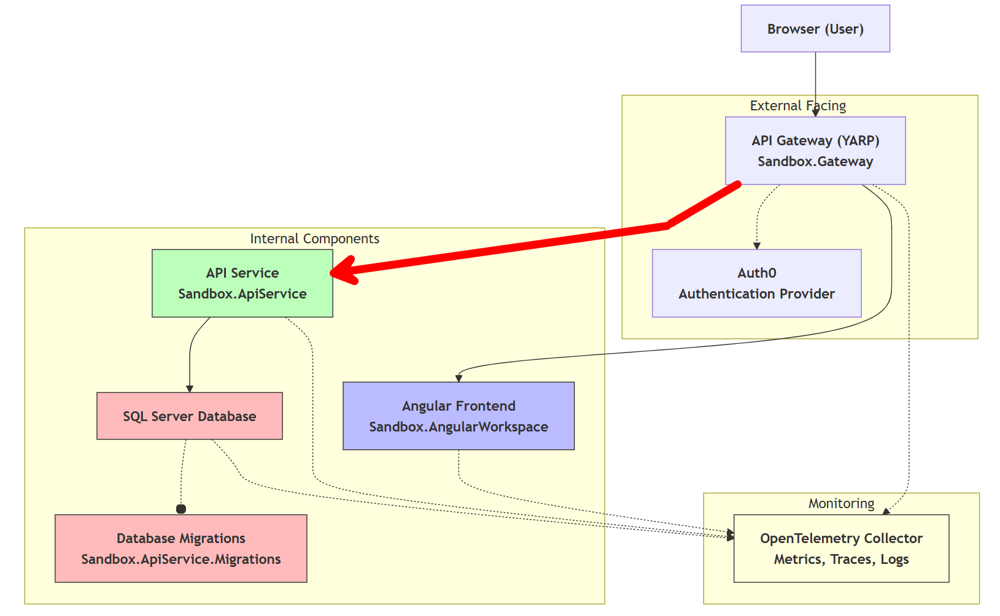

So far, we've set up a Backend for Frontend (BFF) that handles the user authentication flow and serves as an intermediary between the frontend and backend services.
This BFF is the only application that's exposed to the public internet, while the other services are protected behind it.

While the BFF handles the first layer of security, it's crucial to ensure that the backend services also validate the user's identity and permissions. In this post, we'll explore how to forward authenticated calls to a downstream API using YARP ([Yet Another Reverse Proxy](https://learn.microsoft.com/en-us/aspnet/core/fundamentals/servers/yarp/getting-started)) (the red arrow in the picture below). This is particularly useful in scenarios where you have a BFF architecture and need to securely communicate with other services on behalf of the user.



:::info
As we've discussed in previous posts, the BFF pattern helps to centralize the handling of authentication and authorization, making it easier to manage security concerns. By using YARP, we can efficiently route requests from our BFF to downstream APIs while ensuring that the user's identity and permissions are correctly propagated.
:::

## How does service-to-service authentication work

The BFF stores a cookie with user's session information, and this information needs to be passed down to the next API in the chain. However, we're not going to forward the cookie directly. Instead of forwarding the cookie, we will obtain the access token from the user's session using [OAuth 2.0 Token Exchange](https://datatracker.ietf.org/doc/html/rfc8693), and include the token in the Authorization header of the request towards the downstream API. This practice makes the setup scalable, and we're following the best practices for building API backends.

## Why is an access token preferred

But why do we add this overhead instead of forwarding the cookie directly? There are several reasons:

- The API remains stateless: By using access tokens, we can ensure that the downstream API remains stateless. This means that the API doesn't need to maintain any session state, which simplifies scaling and reduces complexity.
- A token is more portable: Access tokens can be easily passed between different services and applications, while cookies are tied to a specific domain and may not be accessible by other services.
- The size of the token is smaller: Access tokens are typically smaller in size compared to cookies. While this is negligible for a single request, it adds up when dealing with a high volume of requests. This can lead to reduced network overhead and improved performance.

## Implementing the solution

### Setup using Duende.AccessTokenManagement.OpenIdConnect

While it's possible to retrieve the access token manually (through `context.HttpContext.GetTokenAsync("access_token");`), it doesn't automatically handle token expiration and most importantly the refresh cycle when the token is expired.
To simplify the implementation, we can use the [Duende.AccessTokenManagement.OpenIdConnect](https://docs.duendesoftware.com/accesstokenmanagement/) library, which provides built-in support for token management, including automatic token refresh. This functionality was also [planned](https://github.com/dotnet/aspnetcore/issues/8175) to be included in ASP.NET v10, but sadly it's postponed for now.

To install the Duende library, run the following command in your BFF project:

```bash
dotnet add package Duende.AccessTokenManagement.OpenIdConnect
```

Next, register the access token management services using `AddOpenIdConnectAccessTokenManagement()` in your `Program.cs` file.
Because it makes use of a cache to store the tokens, you might also need to add a cache implemention, the example below uses the distributed memory cache.

```cs [filename=Program.cs] [linenumber=1,9-19] [source=https://github.com/timdeschryver/Sandbox/blob/main/Sandbox.Gateway/Program.cs#L13-L14]
using Duende.AccessTokenManagement.OpenIdConnect;

var builder = WebApplication.CreateBuilder(args);

builder.AddServiceDefaults();

builder.Services.AddReverseProxy(builder.Configuration);
builder.Services.AddAuthenticationSchemes(builder.Configuration);

builder.Services.AddDistributedMemoryCache();
builder.Services.AddOpenIdConnectAccessTokenManagement();

builder.Services.AddProblemDetails();

var app = builder.Build();

app.UseStatusCodePages();
app.UseExceptionHandler();

app.UseAuthentication();
app.UseAuthorization();

app.MapGroup("bff")
    .MapUserEndpoints();

app.MapReverseProxy();
app.MapDefaultEndpoints();

app.Run();
```

### Create a YARP transformer

YARP provides a flexible way to modify requests and responses using [transformers](https://learn.microsoft.com/en-us/aspnet/core/fundamentals/servers/yarp/transforms?view=aspnetcore-9.0).

To modify the outgoing requests and add the access token to the Authorization header, we need to create a custom transformer by implementing the `RequestTransform` base class.

The transformer below checks if the user is authenticated, retrieves the access token using the extension method `GetUserAccessTokenAsync()` (coming from the Duende library), and adds it to the Authorization header of the outgoing request.

```cs [filename=AddBearerTokenToHeadersTransform.cs] [source=https://github.com/timdeschryver/Sandbox/blob/main/Sandbox.Gateway/Transformers/AddBearerTokenToHeadersRequestTransform.cs] [linenumber=11, 19]
internal sealed class AddBearerTokenToHeadersTransform(ILogger<AddBearerTokenToHeadersTransform> logger) : RequestTransform
{
    public override async ValueTask ApplyAsync(RequestTransformContext context)
    {
        if (context.HttpContext.User.Identity is not { IsAuthenticated: true })
        {
            return;
        }

        // This also handles token refreshes
        var accessToken = await context.HttpContext.GetUserAccessTokenAsync();
        if (!accessToken.Succeeded)
        {
            logger.LogError("Could not get access token: {GetUserAccessTokenError} for request path: {RequestPath}. {Error}", accessToken.FailedResult.Error, context.HttpContext.Request.Path.Value, accessToken.FailedResult.ErrorDescription);
            return;
        }

        logger.LogInformation("Adding bearer token to request headers for request path: {RequestPath}", context.HttpContext.Request.Path.Value);
        context.ProxyRequest.Headers.Authorization = new AuthenticationHeaderValue("Bearer", accessToken.Token.AccessToken);
    }
}
```

The method `GetUserAccessTokenAsync()` takes care of retrieving the access token from the user's session and handles token refreshes if necessary.

:::tip
If you're not using YARP, you can still use the same logic to add the access token to the outgoing HTTP requests of a `HttpClient`.
For more information, check the [official documentation](https://docs.duendesoftware.com/accesstokenmanagement/web-apps/).
:::

### Register the transformer with YARP

Finally, we need to register the custom transformer with YARP in the `AddReverseProxy` method. This can be done by adding a call to `AddTransforms` and including our transformer in the configuration. Because we only want to add the access token when the route requires authentication, we can check if the `AuthorizationPolicy` is set on the route. This is a step not to be missed, as we don't want to add the Authorization header when it's not needed, for example when calling external services that are not in our control.

```cs [filename=Extensions.cs] [linenumber=3,11-14] [source=https://github.com/timdeschryver/Sandbox/blob/main/Sandbox.Gateway/Extensions.cs#L24-L34]
public static IServiceCollection AddReverseProxy(this IServiceCollection services, IConfiguration configuration)
{
    services.AddSingleton<AddBearerTokenToHeadersTransform>();

    services
        .AddReverseProxy()
        .LoadFromConfig(configuration.GetSection("ReverseProxy"))
        .AddTransforms(builderContext =>
        {
            if (!string.IsNullOrEmpty(builderContext.Route.AuthorizationPolicy))
            {
                builderContext.RequestTransforms.Add(builderContext.Services.GetRequiredService<AddBearerTokenToHeadersTransform>());
            }

            builderContext.RequestTransforms.Add(new RequestHeaderRemoveTransform("Cookie"));
        })
        .AddServiceDiscoveryDestinationResolver();

    return services;
}
```

### Removing the cookie

After all previous steps, the outgoing request will contain both the Authorization header with the access token.
This means we can remove the cookie from the outgoing request, which is done by adding a `RequestHeaderRemoveTransform` to the transforms collection.

```cs [filename=Extensions.cs] [linenumber=16] [source=https://github.com/timdeschryver/Sandbox/blob/main/Sandbox.Gateway/Extensions.cs#L24-L34]
public static IServiceCollection AddReverseProxy(this IServiceCollection services, IConfiguration configuration)
{
    services.AddSingleton<AddBearerTokenToHeadersTransform>();

    services
        .AddReverseProxy()
        .LoadFromConfig(configuration.GetSection("ReverseProxy"))
        .AddTransforms(builderContext =>
        {
            if (!string.IsNullOrEmpty(builderContext.Route.AuthorizationPolicy))
            {
                builderContext.RequestTransforms.Add(builderContext.Services.GetRequiredService<AddBearerTokenToHeadersTransform>());
            }

            builderContext.RequestTransforms.Add(new RequestHeaderRemoveTransform("Cookie"));
        })
        .AddServiceDiscoveryDestinationResolver();

    return services;
}
```

## Conclusion

In this post, we've explored how to forward authenticated calls to a downstream API using YARP in a BFF architecture. By leveraging the `Duende.AccessTokenManagement.OpenIdConnect` library, we simplified the process of managing access tokens and ensured that our backend services can securely authorize requests on behalf of the user.
By simply configuring YARP to use a custom transformer, we can keep this logic encapsulated and reusable across different routes and services.
This approach enhances the security of our application architecture.
