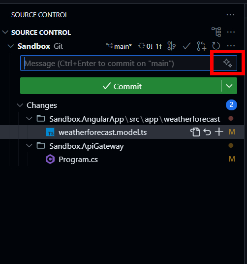
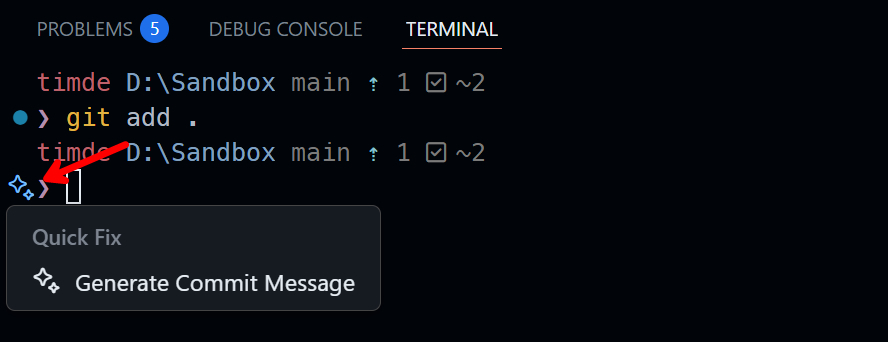
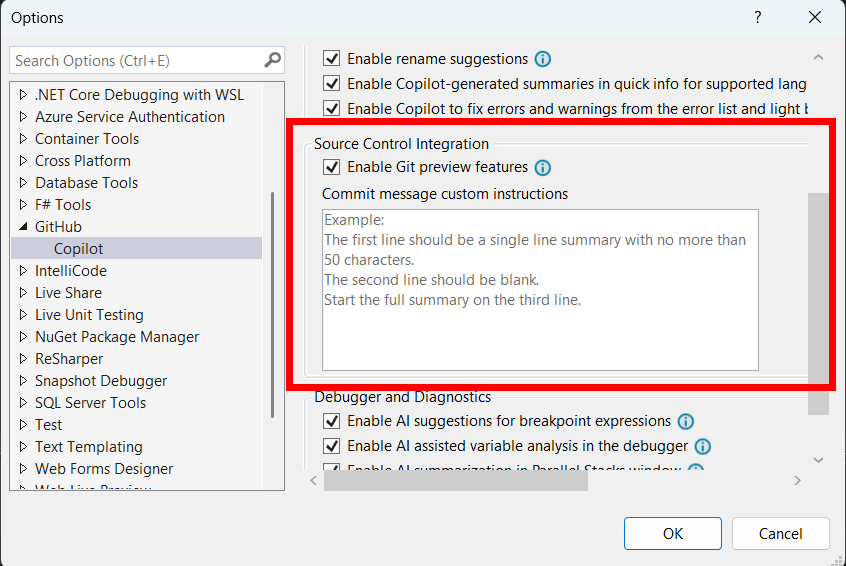

If you're reading this blog post, you're probably already familiar with GitHub Copilot and are already using it to write or review code.
You might also have noticed that Copilot can generate commit messages for you.

By default, the commit message feature looks at the git history to write the commit message in the same style as the previous commit messages.
This keeps the commit messages consistent over time.

This makes sense but you might want to give Copilot more instructions.
Or, when your team decides to use a different commit message structure, or you're starting a new project, you might want to change the default commit message format.

## Visual Studio Code

If you're already using the commit message feature, you noticed it isn't like using the Copit chat or edit features, in which you prompt and interact with Copilot.
Instead, you just need to click the "Generate Commit Message with Copilot" button in the commit message input field.



So how can you control the commit message that Copilot generates?

I recently learned from [Burke Holland](https://twitter.com/burkeholland) that it's possible to [append a general set of instructions](https://burkeholland.github.io/posts/essential-custom-instructions/) while interacting with Copilot. These instructions are always included while using the chat or edit features. For more information you can also look at the official documentation at [Adding custom instructions for GitHub Copilot](https://docs.github.com/en/copilot/customizing-copilot/adding-custom-instructions-for-github-copilot#enabling-or-disabling-custom-instructions)).

I thought this would also work for the commit messages, but it doesn't.
Luckily, there's a quick solution to this problem.
Visual Studio Code has a handful of [settings](https://code.visualstudio.com/docs/copilot/copilot-customization#_settings) on Copilot prompts.

For the earlier mentioned features such as chat or edit, the setting `github.copilot.chat.codeGeneration.useInstructionFiles` is used, which is enabled by default.

Similar to the other corresponding features, there's a setting to add default instructions for each commit message generation.
The setting accepts an array of strings with the instructions or a reference to a file containing the instructions (it can also be a mix of both).
Personally, I prefer the latter.

For the commit message feature, this is the  `github.copilot.chat.commitMessageGeneration.instructions` setting.
This looks like this:

```json:.vscode/settings.json
{
    "github.copilot.chat.commitMessageGeneration.instructions": [
        "Follow the conventional commit message format.",
        "Limit the first line to 72 characters or less."
 ]
}
```

Which is identical to the following setup using a markdown file containing the instructions:

```json:.vscode/settings.json
{
    "github.copilot.chat.commitMessageGeneration.instructions": [
 {
            "file": ".github/commit-instructions.md"
 }
 ]
}
```

```md:./github/commit-instructions.md
Follow the conventional commit message format.

Limit the first line to 72 characters or less.
```

Including the settings file within the workspace makes it also shareable with your team members.

:::tip
It's also possible to use the generate commit message feature using the VSCode Integrated Terminal.
After the `git add` command, there will be some stars visible in the terminal.
When you click on them, the commit message is generated.


:::

## Visual Studio

If you're using Visual Studio, you can also add the instructions using the Copilot options.

.
