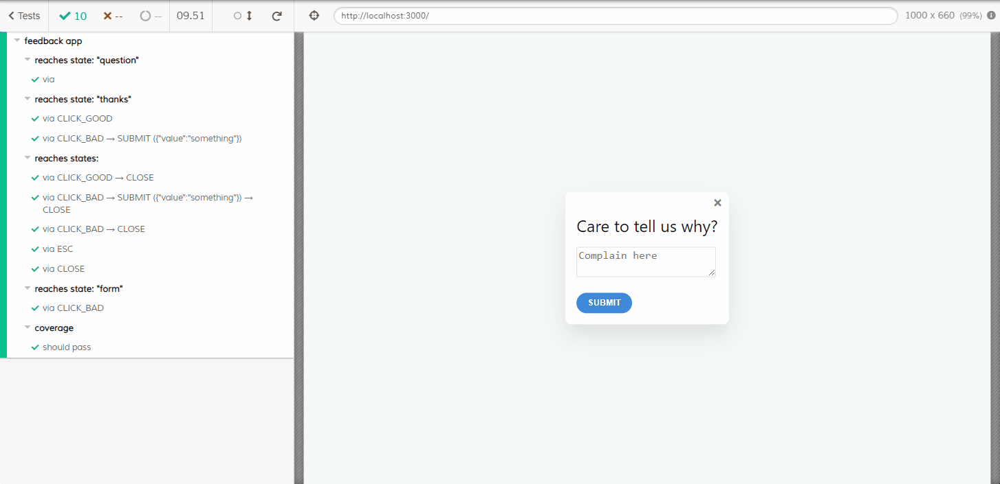

This article is inspired by the talk ["Write Fewer Tests! From Automation to Autogeneration"](https://www.youtube.com/watch?v=tpNmPKjPSFQ) given by [David Khourshid](https://twitter.com/DavidKPiano). The talk showcases XState's new library [@xstate/test](https://xstate.js.org/docs/packages/xstate-test/), which helps you to write or, better yet, not write tests.

During the talk, David writes tests for a React component using Jest and Puppeteer. Because I'm a Cypress and XState fan, I wanted to rewrite the same test, but this time using Cypress for fun and practice. As a starting point, I'm re-using the [source code](https://github.com/davidkpiano/xstate-test-demo) of the demo. The demo application is a multi-step form.

## A reusable state machine across tests

`@xstate/test` adds a `test` property to the `meta` property for each state. The `test` property accepts a callback and, in this callback, we can write an assertion against the current state of the application. When a test has run, it will invoke the `test` callback to verify that the application is in the correct state.

The state machine in the demo application adds the test code directly within the state machine. This couples the state machine to a specific testing library.

One of the advantages of state machines is that these are library/framework agnostic, which I highlighted in a previous article ["My love letter to XState and statecharts ♥"](/blog/my-love-letter-to-xstate-and-statecharts).
To make the state machine reusable across different testing libraries, the first step I took was to extract the test code from the state machine. By doing this, we also exclude the test code from the production build.

```js{12-14, 28-30, 38-40, 46-48}:before
describe('feedback app', () => {
  const feedbackMachine = Machine({
    id: 'feedback',
    initial: 'question',
    states: {
      question: {
        on: {
          CLICK_GOOD: 'thanks',
          CLICK_BAD: 'form',
          CLOSE: 'closed'
        },
        meta: {
          test: ({ getByTestId }) => {
            assert.ok(getByTestId('question-screen'));
          }
        }
      },
      form: {
        on: {
          SUBMIT: [
            {
              target: 'thanks',
              cond: (_, e) => e.value.length
            }
          ],
          CLOSE: 'closed'
        },
        meta: {
          test: ({ getByTestId }) => {
            assert.ok(getByTestId('form-screen'));
          }
        }
      },
      thanks: {
        on: {
          CLOSE: 'closed'
        },
        meta: {
          test: ({ getByTestId }) => {
            assert.ok(getByTestId('thanks-screen'));
          }
        }
      },
      closed: {
        type: 'final',
        meta: {
          test: ({ queryByTestId }) => {
            assert.isNull(queryByTestId('thanks-screen'));
          }
        }
      }
    }
  });
```

```js:after
// extract the states from the state machine and remove the test code
export const feedbackStates = {
  id: 'feedback',
  initial: 'question',
  states: {
    question: {
      on: {
        CLICK_GOOD: 'thanks',
        CLICK_BAD: 'form',
        ESC: 'closed',
        CLOSE: 'closed',
      },
    },
    form: {
      on: {
        SUBMIT: [
          {
            target: 'thanks',
            cond: (_, e) => e.value.length,
          },
        ],
        CLOSE: 'closed',
      },
    },
    thanks: {
      on: {
        CLOSE: 'closed',
      },
    },
    closed: {
      type: 'final',
    },
  },
}

// re-create the existing machine
export const feedbackMachine = Machine(feedbackStates)
```

## Configuring the states for Cypress

The second step was to re-add the `test` properties to the appropriate states.
For this, I created a helper function `addTests` to make the test readable and simple.

This helper function, will iterate over all states and add the test meta property to each state.

```js:utils.js
function addTests(state, tests) {
  return {
    ...state,
    states: Object.entries(state.states).reduce((s, [stateKey, stateValue]) => {
      return {
        ...s,
        [stateKey]: {
          ...stateValue,
          meta: {
            ...stateValue.meta,
            test: tests[stateKey],
          },
        },
      }
    }, {}),
  }
}
```

In the tests, we create a new state machine by using the same states and by adding a test case for each state.
The argument that you can already see in each test case will be defined during the next steps.

```js:feedback.spec.js
const feedbackMachine = Machine(
  addTests(feedbackStates, {
    question: ({ findByTestId }) => {
      findByTestId('question-screen')
    },
    form: ({ findByTestId }) => {
      findByTestId('form-screen')
    },
    thanks: ({ findByTestId }) => {
      findByTestId('thanks-screen')
    },
    closed: ({ findByTestId }) => {
      findByTestId('thanks-screen').should('not.exist')
    },
  }),
)
```

As you can see, these test cases seem a lot like the existing tests.
This is because both tests are written using [Testing Library](https://testing-library.com).

## Generating test plans

Because the entire application is represented with a state machine, it is possible to calculate the next possible states.
By using algorithms, for example [Dijkstra's algorithm](https://en.wikipedia.org/wiki/Dijkstra%27s_algorithm), `@xstate/test` generates a path to end up in a specific state. It does this for each possible state.

This means that by using this method, we can test every state of the application.
In practice, it will probably generate tests that will end up into states you haven't thought of.

In the snippet below we use the `createModel` method to create the test model, and the `testModel.getSimplePathPlans` method to generate the tests for the feedback machine. Next, we iterate over each generated test plan, create a test for the plan, and assert that test with the `path.test` method. Here, we pass the `cy` variable as the argument to the test method. Because we imported `@testing-library/cypress` the `findBy` query commands will be added to the global `cy` variable, which makes them available to use in the tests.

```js:feedback.spec.js
const testModel = createModel(feedbackMachine)
const testPlans = testModel.getSimplePathPlans()

testPlans.forEach((plan, i) => {
  describe(plan.description, () => {
    plan.paths.forEach((path, i) => {
      it(path.description, () => {
        return cy.visit('/').then(() => {
          return path.test(cy)
        })
      })
    })
  })
})
```

## Interacting with the application

To interact with the application we re-use the events of the real state machine.
The generated test plans will execute these events and wait untill they are executed.
Afterward, the test plan verifies if the application is in the correct state.

To configure the events during the tests, we must use the `withEvents` method on the test model.
It's here where we interact with the application, for every event.

```js:feedback.spec.js
const testModel = createModel(feedbackMachine).withEvents({
  CLICK_GOOD: ({ findByTestId }) => {
    findByTestId('good-button').click()
  },
  CLICK_BAD: ({ findByTestId }) => {
    findByTestId('bad-button').click()
  },
  CLOSE: ({ findByTestId }) => {
    findByTestId('close-button').click()
  },
  ESC: () => {
    cy.get('body').type('{esc}')
  },
  SUBMIT: {
    exec: ({ findByTestId }, event) => {
      findByTestId('response-input').type(event.value)
      findByTestId('submit-button').click()
    },
    cases: [{ value: 'something' }],
  },
})
```

## Coverage

To verify that the generated test plans cover each possible state, the test model has a `testCoverage` method.
This will throw an error, and the error message will say which state node is missing from the coverage.

```js:feedback.spec.js
  describe('coverage', () => {
    it('should pass', () => {
      testModel.testCoverage()
    })
  })
})
```

## Conclusion

This way of writing tests will take some time to getting used to, but I can already see how this can be useful.
It gives me confidence that the whole application is tested and that there won't be any uncovered states that I haven't thought of.
Writing these tests is simple, and it doesn't take a long time to write them. Especially, in comparison to writing manual tests.

To me, this exploration verified that we can keep [XState](https://xstate.js.org/) library/framework agnostic.
And also, that by using [Testing Library](https://testing-library.com) we can write tests in a similar way for all the JavaScript frameworks and for all the test runners.

Herein lies the true power of both libraries, and this emphasizes what I believe in.
Which is, that we shouldn't care which framework and libraries are used to build an application.
This is also why I like Cypress because it hides the implementation details.

For a more detailed explanation with more possibilities and advantages, I'm referring you to the [docs](https://xstate.js.org/docs/packages/xstate-test/#quick-start) and the article [Model-Based Testing in React with State Machines](https://css-tricks.com/model-based-testing-in-react-with-state-machines/), written by the same David.



The entire Cypress test looks as follows, and the entire code for this article can be found on [GitHub](https://github.com/timdeschryver/xstate-test-demo/tree/cypress).

```js:feedback.spec.js
/// <reference types="cypress" />

const { Machine } = require('xstate')
const { createModel } = require('@xstate/test')
const { feedbackStates } = require('../../../src/feedbackMachine')

function addTests(state, tests) {
  return {
    ...state,
    states: Object.entries(state.states).reduce((s, [stateKey, stateValue]) => {
      return {
        ...s,
        [stateKey]: {
          ...stateValue,
          meta: {
            ...stateValue.meta,
            test: tests[stateKey],
          },
        },
      }
    }, {}),
  }
}

describe('feedback app', () => {
  const feedbackMachine = Machine(
    addTests(feedbackStates, {
      question: ({ findByTestId }) => {
        findByTestId('question-screen')
      },
      form: ({ findByTestId }) => {
        findByTestId('form-screen')
      },
      thanks: ({ findByTestId }) => {
        findByTestId('thanks-screen')
      },
      closed: ({ findByTestId }) => {
        findByTestId('thanks-screen').should('not.exist')
      },
    }),
  )

  const testModel = createModel(feedbackMachine).withEvents({
    CLICK_GOOD: ({ findByTestId }) => {
      findByTestId('good-button').click()
    },
    CLICK_BAD: ({ findByTestId }) => {
      findByTestId('bad-button').click()
    },
    CLOSE: ({ findByTestId }) => {
      findByTestId('close-button').click()
    },
    ESC: () => {
      cy.get('body').type('{esc}')
    },
    SUBMIT: {
      exec: ({ findByTestId }, event) => {
        findByTestId('response-input').type(event.value)
        findByTestId('submit-button').click()
      },
      cases: [{ value: 'something' }],
    },
  })

  const testPlans = testModel.getSimplePathPlans()

  testPlans.forEach((plan, i) => {
    describe(plan.description, () => {
      plan.paths.forEach((path, i) => {
        it(path.description, () => {
          return cy.visit('http://localhost:3000/').then(() => {
            return path.test(cy)
          })
        })
      })
    })
  })

  describe('coverage', () => {
    it('should pass', () => {
      testModel.testCoverage()
    })
  })
})
```
