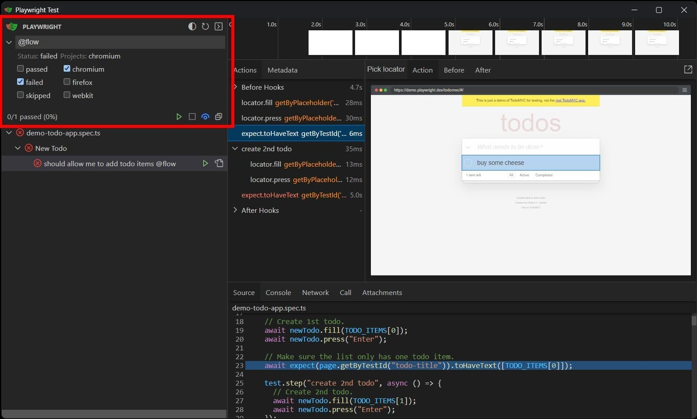
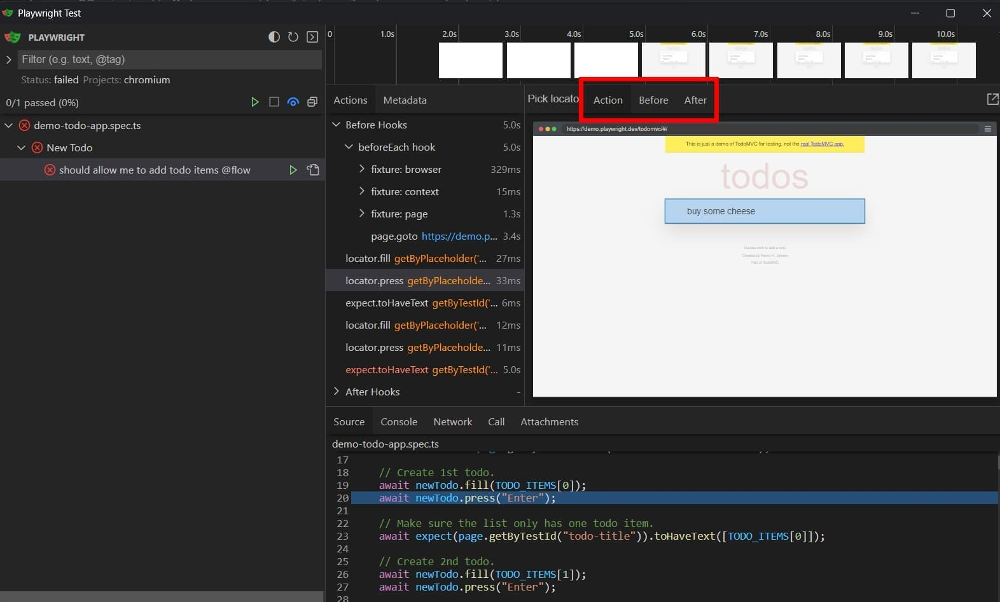
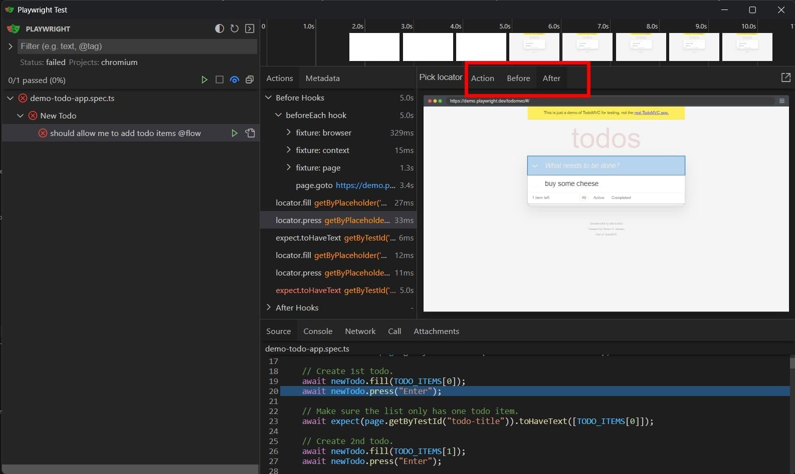
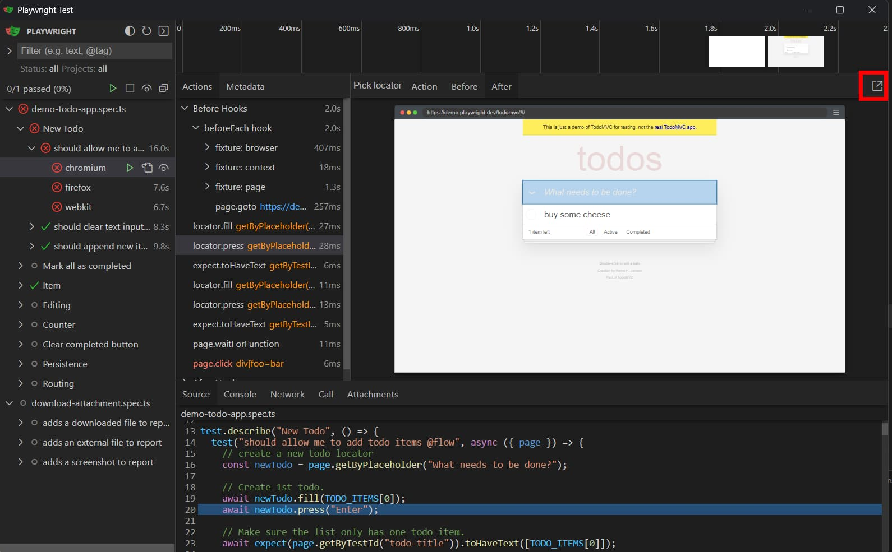
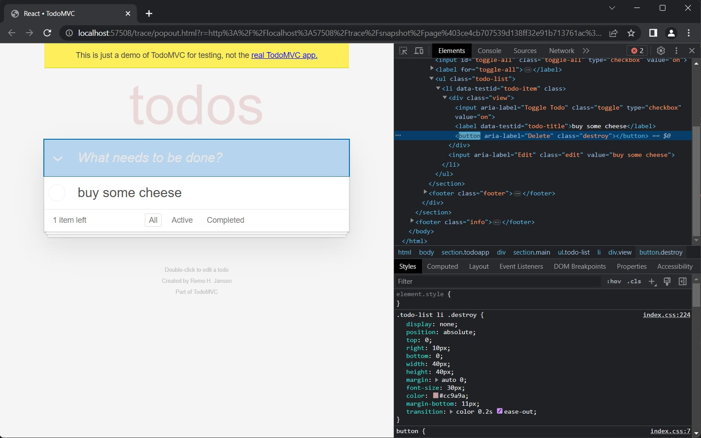
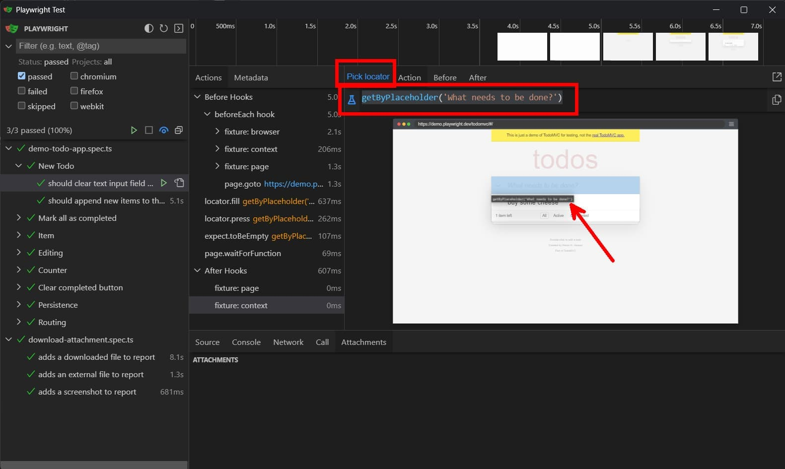
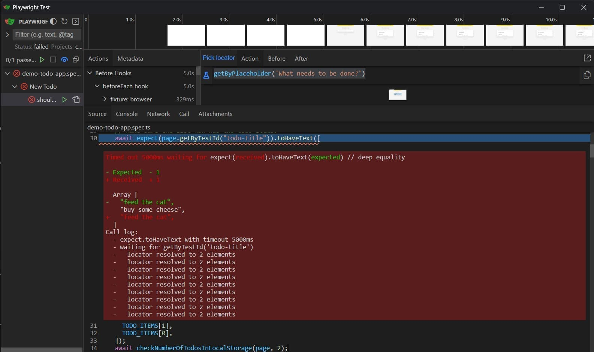
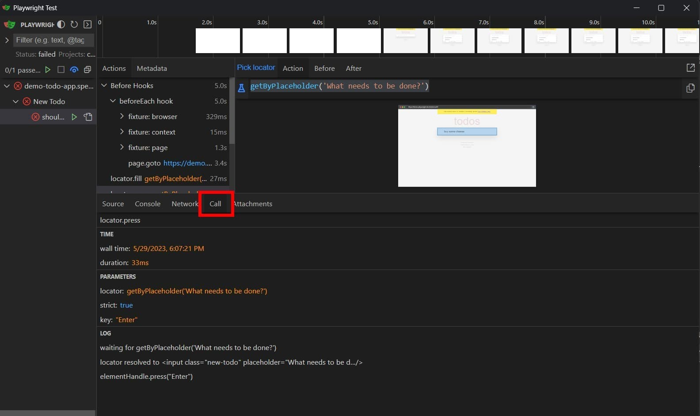
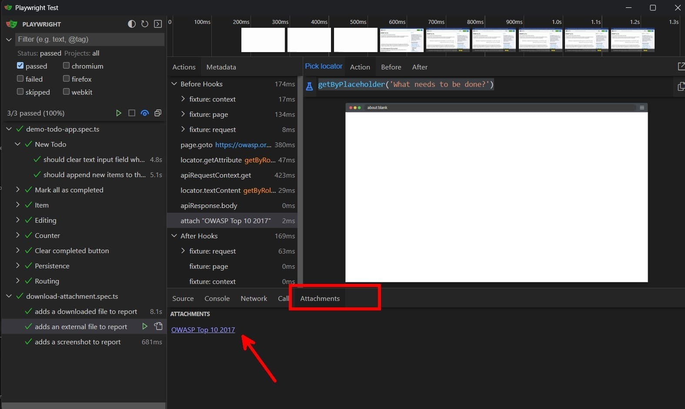
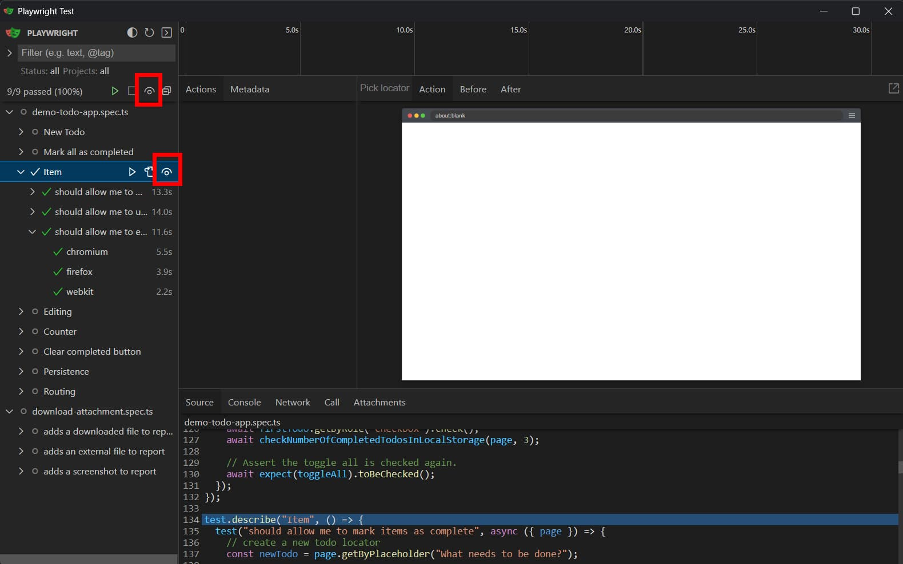

In [previous blog posts](/blog?q=Playwright) we've already seen that the team behind [Playwright](https://playwright.dev/) has put a lot of effort into providing a good testing experience.

We can see this with the documentation and samples, its CLI, the [Visual Studio Code extension](https://marketplace.visualstudio.com/items?itemName=ms-playwright.playwright), the code generation feature, and the fast execution time with the help of (free) parallelization of tests.

A crucial thing that was still missing from the Playwright ecosystem was a visual test runner.
But this changes with [Playwright v1.32](https://playwright.dev/docs/release-notes#introducing-ui-mode-preview) as it introduces a new UI mode.
While we already had the trace viewer, the new UI mode is a lot more than that.

I'm excited about this new feature, and I think it will make it even easier to get started with Playwright.
I'm also sure that this helps to get more people on board with Playwright.
Without the UI mode, it was only possible to run the tests from the command line, and this might not be the most intuitive way to get started with Playwright. Especially when you're not coming from a "technical" development background.

In this blog post, we'll take a look at the UI mode and see how it improves the overall experience.


In the above screenshot, you can see the new UI mode in action.
This feature is available when you run the `playwright test` command with the `--ui` flag.

```bash
npx playwright test --ui
```

Within the interface you can see the following:

- the test results
- a visual of the browser that's interacting with the page
- a timeline including screenshots
- the execution time of each interaction, test, and total time
- each action (including hooks)
- the test code that's been or is being executed, which automatically follows the current action
- more details about a user interaction, network request, or the console
- get access to the attached artifacts

If the UI mode was just a read-only view of the test results, it would not be that interesting.
But, the UI mode is a lot more than that.
It shines when you start to interact with it, and doing this can drastically improve your workflow.

Let's see in which ways the UI mode can help you to achieve a better Playwright experience.

## Filter tests

The UI allows you to filter the tests by name, [tag](../create-and-run-playwright-test-sets-using-tags-and-grep/index.md), status, and project.
When a filter is active Playwright only shows and runs the tests that match the filter.

This is a great way to run a subset of tests, for example, when you're working on a specific feature or when you want to run tests that have failed.



## Investigate the before and after states

Playwright keeps track of the state of the page during the test execution.
Because of this, it is possible to take a look at the state of the page before, during, and after an action (interaction or expectation), also known as time-travel debugging

This is beneficial when you're debugging a test because you can see how an interaction affects (or doesn't affect) the page.
Once you're used to this feature, you can't imagine how you could live without it.

As an example, let's take a user that interacts with a todo list and creates a new todo item.
Using the Action and Before view, we see the input field contains the todo item before the user presses the 'Enter' key.



When the After view is active we notice that the new todo is added to the todo list and the input field is cleared.



## Pop-out mode

While time-traveling is useful, you might want to take a closer look and investigate the page from up close.
The pop-out mode just opens a browser window on the current step and you can open the DevTools and view the DOM.





## Using the Locator picker

A hard thing about writing tests is finding the correct selector.
But, it's not always as easy as it sounds to pick the right selector.

Picking a "bad" selector (e.g. using CSS classes) leads to brittle tests, which can be time-consuming and frustrating to maintain.
To help you with this, Playwright has the locator picker.

To use the Locator picker, simply click on the locator icon and start hovering over the elements on the page.
When you hover over an element, Playwright suggests a selector for that element.



## Get access to more information using the Source and Call tabs

When a test fails, the UI mode shows the failure details within the Source tab.
For more info about the failure (e.g. the retries), you can open the Call tab which has more details about the action.
You can also use the Call tab for successful tests, this then contains the same information (time, parameters, expected value, return value, logs, ...).

Instead of having to debug the test, using the Source or Call tab immediately shows you what went wrong.





## Attachments

You can [attach downloaded files, screenshots, and videos to the test results](../include-attachments-to-your-playwright-report/index.md).
This is useful to manually verify the correctness of the downloaded file, otherwise, you need to manually download the file and open it and this can become dreadful.

Luckily, the UI mode makes it easy to open the attachments, which was a [feature request by me](https://github.com/microsoft/playwright/issues/22736).

To open the attachment, click the attach action and then open the Attachments tab.



## Watch mode

For a faster feedback loop, you can use the watch mode to run the tests when a file is changed.
The watch mode can be configured to only (re-)execute the selected tests.

To enable watch mode, click the watch icon either in the top right corner of the sidebar for all tests, or use the watch icon for a specific file or test to enable watch mode for that selection.



## Conclusion

In this post I've shown you the possibilities with the new UI mode, and why these features within the UI mode are helpful.
I believe that the UI mode brings a lot of value to Playwright, and I'm sure that it will help to get more people on board with Playwright.

Instead of having to run the tests from the command line (or Visual Studio Code), which is not the most user-friendly, the new UI mode is more intuitive and easier to use. This is especially true for people that don't have a developer or testing background.
