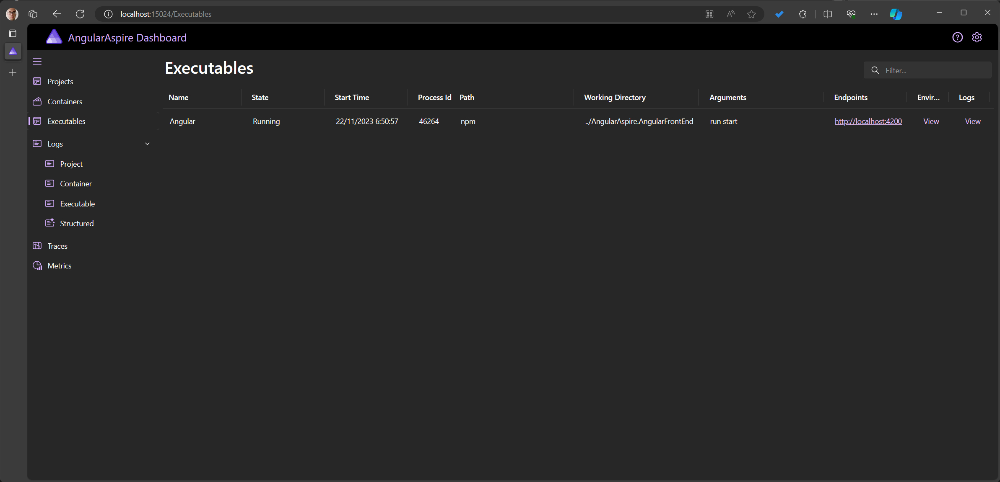
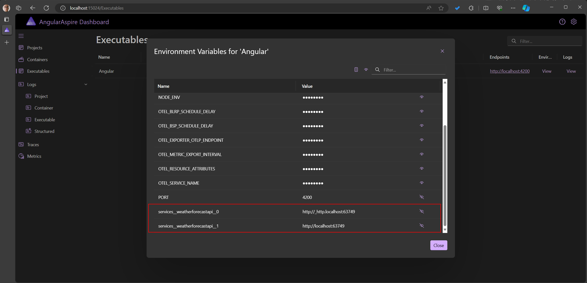
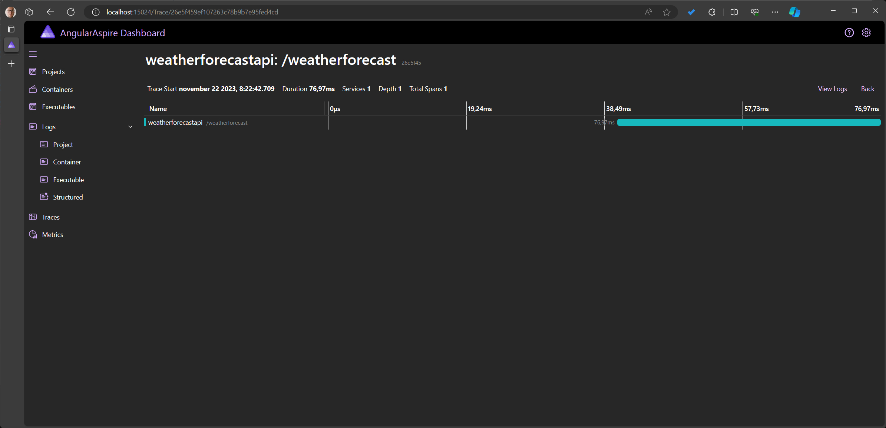

As a big fan of [Project Tye](https://github.com/dotnet/tye), I was happy to see that its successor .NET Aspire was announced during .NET Conf 2023.
This is a big deal to me because I use Tye daily to increase my productivity.

I'm using Tye as a collection of all my client's projects, and make use of it to spin up my local development environment with a single command.
Usually, the collection consists of multiple .NET WebApi projects and one or more Angular applications, in which these applications need to communicate with each other.

From the first look, .NET Aspire does this as well, and does this better.

Not only does .NET Aspire orchestrate a multi-project setup, but it also gives you an opinionated - but configurable - starting point, which takes advantage of Cloud Native Computing Foundation (CNCF) standards to provide additional features and benefits.
A pleasing little detail is also a revamped dashboard that looks nicer and includes a dark theme.

## .NET Aspire

To go over what .NET Aspire is and why it exists, I refer to the [.NET Aspire overview Documentation](https://learn.microsoft.com/en-us/dotnet/aspire/get-started/aspire-overview) and the [announcement](https://devblogs.microsoft.com/dotnet/introducing-dotnet-aspire-simplifying-cloud-native-development-with-dotnet-8/). You can also watch the [recording](https://www.youtube.com/watch?v=z1M-7Bms1Jg) of the .NET Conf talk. These resources will explain it better than I can at the moment.

:::info

.NET Aspire is an opinionated, cloud ready stack for building observable, production ready, distributed applications.​ .NET Aspire is delivered through a collection of NuGet packages that handle specific cloud-native concerns. Cloud-native apps often consist of small, interconnected pieces or microservices rather than a single, monolithic code base. Cloud-native apps generally consume a large number of services, such as databases, messaging, and caching.

.NET Aspire helps with:

- **Orchestration**: .NET Aspire provides features for running and connecting multi-project applications and their dependencies.
- **Components**: .NET Aspire components are NuGet packages for commonly used services, such as Redis or Postgres, with standardized interfaces ensuring they connect consistently and seamlessly with your app.
- **Tooling**: .NET Aspire comes with project templates and tooling experiences for Visual Studio and the dotnet CLI help you create and interact with .NET Aspire apps.

:::

## Adding An Angular Project to .NET Aspire Application Host

While .NET Aspire has many built-in [components](https://learn.microsoft.com/en-us/dotnet/aspire/components-overview?tabs=dotnet-cli) available, a Node.js project isn't one of them (for now?).
But, the [samples](https://github.com/dotnet/aspire-samples/tree/main) provide some insights on how this task can be achieved.

The result is an `AddNpmApp` extension method to register a Node.js project, in our case this will be an Angular project.

```cs AngularAspire.AppHost/Program.cs {5-7}
var builder = DistributedApplication.CreateBuilder(args);

var weatherforecastApi = builder.AddProject<Projects.WeatherForecastAPI>("weatherforecastapi");

builder
    .AddNpmApp("AngularFrontEnd", "../AngularAspire")
    .WithServiceBinding(scheme: "http", hostPort: 4200);

builder.Build().Run();
```

### Creating a Node.js Application

Here we see the implementation of the `AddNpmApp` extension method.
`AddNpmApp` defines and configures the command on how to start the Node.js application and invokes `AddNodeApp`, which creates a new `NodeAppResource`.

Within an Angular project, this means running the `npm run start` command within the Angular directory.

```cs NodeAppHostingExtension.cs
internal static class NodeAppHostingExtension
{
    public static IResourceBuilder<NodeAppResource> AddNodeApp(this IDistributedApplicationBuilder builder, string name, string command, string workingDirectory, string[]? args = null)
    {
        var resource = new NodeAppResource(name, command, workingDirectory, args);

        builder.Services.TryAddEnumerable(ServiceDescriptor.Singleton<IDistributedApplicationLifecycleHook, NodeAppAddPortLifecycleHook>());

        return builder.AddResource(resource)
            .WithEnvironment("NODE_ENV", builder.Environment.IsDevelopment() ? "development" : "production")
            .ExcludeFromManifest();
    }

    public static IResourceBuilder<NodeAppResource> AddNpmApp(this IDistributedApplicationBuilder builder, string name, string workingDirectory, string scriptName = "start")
        => builder.AddNodeApp(name, "npm", workingDirectory, ["run", scriptName]);
}
```

The class `NodeAppResource` creates a specific type of a `ExecutableResource`.

```cs NodeAppResource
internal class NodeAppResource(string name, string command, string workingDirectory, string[]? args)
    : ExecutableResource(name, command, workingDirectory, args){}
```

The `NodeAppResource` instances are used within `NodeAppAddPortLifecycleHook` to append their port bindings to the process environment variables.

```cs NodeAppAddPortLifecycleHook.cs
internal class NodeAppAddPortLifecycleHook : IDistributedApplicationLifecycleHook
{
    public Task BeforeStartAsync(DistributedApplicationModel appModel, CancellationToken cancellationToken = default)
    {
        var nodeApps = appModel.Resources.OfType<NodeAppResource>();
        foreach (var app in nodeApps)
        {
            if (app.TryGetServiceBindings(out var bindings))
            {
                var envAnnotation = new EnvironmentCallbackAnnotation(env =>
                {
                    var multiBindings = bindings.Count() > 1;

                    if (multiBindings)
                    {
                        foreach (var binding in bindings)
                        {
                            var serviceName = multiBindings ? $"{app.Name}_{binding.Name}" : app.Name;
                            env[$"PORT_{binding.Name.ToUpperInvariant()}"] = $"{{{{- portForServing \"{serviceName}\" -}}}}";
                        }
                    }
                    else
                    {
                        env["PORT"] = $"{{{{- portForServing \"{app.Name}\" -}}}}";
                    }
                });

                app.Annotations.Add(envAnnotation);
            }
        }

        return Task.CompletedTask;
    }
}
```

## Using environment variables in Angular for an easier project configuration

Next, when you start the .NET Aspire Application host you should see the Angular application (an executable) on the dashboard.



This already helps to bootstrap your development environment, and we can further improve the Angular setup to fully leverage .NET Aspire.

Instead of configuring the connection between projects via hardcoded strings (api URLs, connection strings, ...) within the project, we can create references to other projects using .NET Aspire.
In the snippet below, a reference to the weather forecast API is created for the Angular project.

```cs AngularAspire.AppHost/Program.cs {7}
var builder = DistributedApplication.CreateBuilder(args);

var weatherforecastApi = builder.AddProject<Projects.WeatherForecastAPI>("weatherforecastapi");

builder
    .AddNpmApp("AngularFrontEnd", "../AngularAspire")
    .WithReference(weatherforecastApi)
    .WithServiceBinding(scheme: "http", hostPort: 4200);

builder.Build().Run();
```

Doing this adds the weather forecast's API URL to the environment variables of the Angular project.
Via the dashboard, we can also inspect the configured variables.



This is a useful feature because we don't need to configure and maintain these dependencies manually.

Because Angular doesn't support to use of environment variables out of the box within the application, I prefer to make use of a [proxy](https://angular.dev/tools/cli/serve#proxying-to-a-backend-server).
The proxy will proxy (forward) all requests to the configured endpoint, to the desired endpoint.
Within the proxy's configuration file, you'll be able to access the environment variables to set the backend's address.

:::info
I also encourage to use of a proxy to create a [more secure environment using a Backend For Frontend (BFF)](../lets-make-our-spa-more-secure-by-consuming-a-duende-bff-with-angular/index.md).
:::

To configure the proxy, create a new `proxy.conf.js` file within the root of your Angular project, and set the target using the name of the referenced API within the .NET Aspire Application Host.
In the configuration above we named the weather forecast API `weatherforecastapi`, which results in the `services__weatherforecastapi__1` environment variable name.

```js proxy.conf.js
module.exports = {
	// Forward all requests to `http://localhost:4200/api`, to `http://localhost:5187/`
	'/api': {
		target: process.env['services__weatherforecastapi__1'],
		pathRewrite: {
			'^/api': '',
		},
	},
};
```

Next, add the config to your `angular.json` file:

```json angular.json {14-16}
{
	"serve": {
		"builder": "@angular-devkit/build-angular:dev-server",
		"configurations": {
			"production": {
				"buildTarget": "AngularAspire:build:production"
			},
			"development": {
				"buildTarget": "AngularAspire:build:development"
			}
		},
		"defaultConfiguration": "development",
		"options": {
			"proxyConfig": "proxy.conf.js"
		}
	}
}
```

After this, we're all set to go.
When the Angular application sends a request to the backend, we should receive the response, and we should also find a trace on the Aspire dashboard.
These traces (and logs) are an additional benefit you get out-of-the-box when using .NET Aspire.



It should also be possible to create and send traces via the front end as we've seen in [Adding OpenTelemetry to an Angular Application](../adding-opentelemetry-to-an-angular-application/index.md), but for now this [doesn't seem to be supported](https://github.com/dotnet/aspire/issues/857).

## Conclusion

In this post, we've seen how to add an Angular application to a .NET Aspire Application Host.

This is useful for mono repositories because your whole environment can be configured with .NET Aspire.
Instead of starting multiple applications, you can just run the Application Host to run multiple applications with a single command.

Because it uses CNCF standards you also get some useful features for free.
Observability is the biggest one, in my opinion.
The traces and logs within the dashboard help to get a detailed overview of what the application is doing, this is a huge time saver when you need to debug an issue.

You can find the example application my [GitHub](https://github.com/timdeschryver/AspireWithAngular).
