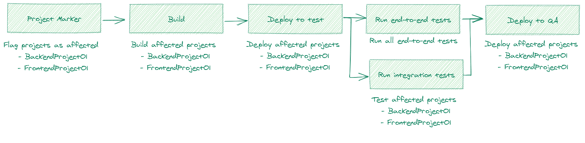
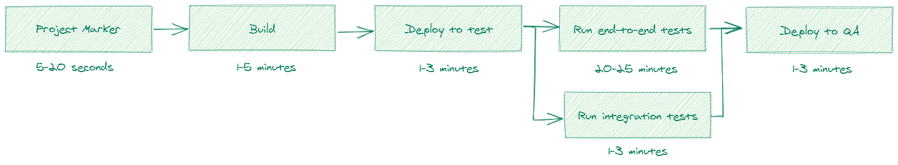

Our team uses a [monorepo](https://www.atlassian.com/git/tutorials/monorepos) that includes 20 projects. All of these projects need to be build and deployed (to two different environments) with every merged Pull Request.
Besides our projects, we also include another 10 artifacts from other teams during a deploy.
Currently, this isn't fast. Despite that all the steps of a stage are run in parallel, it still takes a full hour to run our CI/CD pipeline.

1. the build stage of our projects take between 10 and 15 minutes
1. the deploy stage to a test environment (hosted on a Virtual Machine) lasts between the 15 and 20 minutes
1. the test stage (end-to-end and integration tests in parallel) takes another 20 to 25 minutes
1. the second deploy stage to a QA environment (hosted on a Virtual Machine) takes up another 15 and 20 minutes


This isn't ideal and results in wasted time and some frustration in our team.

If we take a closer into the different stages, we see that:

- there's one project during the build stage that consistently runs for 10 minutes
- deploying one project is fast, but because of the number of projects that need to be deployed it takes a long time
- the integration tests are fast, while the end-to-end tests are slowing down the test stage

With these observations in mind, we can see that culprit is one slow build and the number of projects that need to be deployed.

> Note: we tried to use multiple deploy agents on the server, but for some reason, this resulted in many errors during the deploy stage. Most of the time there was always one project where the deploy failed with the vague error `the process is already in use`.

We recently upgraded our servers, and while it helped to speed up the build stage, it surely didn't have the desired effect we were hoping for. Because all of the steps run in parallel we couldn't improve the pipeline speed this way either.

**So if we can't work harder, we must work smarter**.

With the inspiration of [NX](https://nx.app/), the solution to a faster CI/CD pipeline is to only build and deploy the projects that are affected in the last commit.

So how do we accomplish this within an Azure DevOps pipeline?

### Finding affected projects

To detect projects that are modified we created a new [stage](https://docs.microsoft.com/en-us/azure/devops/pipelines/process/stages?view=azure-devops&tabs=yaml) `ProjectMarker`, which will be the first stage of the pipeline.

The `ProjectMarker` stage creates a new [environment variable](https://docs.microsoft.com/en-us/azure/devops/pipelines/process/variables?view=azure-devops&tabs=yaml%2Cbatch) `AffectedProjects` that can be used in the next stages to determine if a project needs to build and deployed. (Side note: if you're not using stages in your pipeline, this idea will still work but the syntax to read the `AffectedProjects` environment is different.)

The `ProjectMarker` stage just has a single job `Mark` that contains a single step `Marker`.

```yml{2-8}:pipeline-cicd.yml
stages:
  - stage: ProjectMarker
    jobs:
      - job: Mark
        timeoutInMinutes: 2
        steps:
          - script: node affected-projects-marker $(Build.Reason) $(Build.SourceBranch)
            name: Marker
```

The `Marker` step runs a NodeJS script with the `$(Build.Reason)` and the `$(Build.SourceBranch)` [predefined variables](https://docs.microsoft.com/en-us/azure/devops/pipelines/build/variables?view=azure-devops&tabs=yaml#build-variables-devops-services) as arguments.

The source code of the `affected-projects-marker` script looks as follows.
We're not going into details of the script, but you can take a look at it, and then we'll go over the idea behind it together.

```js:affected-projects-marker.js
const { execSync } = require('child_process')

var [buildReason, sourceBranch] = process.argv.slice(2)

/**
 * Projects with their relative path
 */
const projects = {
  BackendProject01: 'Backend/Project01',
  BackendProject02: 'Backend/Project02',
  BackendProject03: 'Backend/Project03',
  BackendConfig: 'Backend/Config/config.json',

  FrontendProject01: 'Frontend/Project01',
}

/**
 * Dependencies of a project
 * What other projects should run when project X is modified
 * For example, a change in BackendProject01 results in a new version of FrontendProject01
 * Note: this is recursive
 */
const projectDependencies = {
  BackendProject01: ['FrontendProject01'],
  BackendProject02: ['FrontendProject01'],
  BackendConfig: ['BackendProject01', 'BackendProject02'],
}

const [branch] = git('rev-parse --abbrev-ref HEAD')
const [commitMessage] = git('log -1 --pretty=%B')

// we still have the possibility to build and deploy all projects in certain scenarios
const runAllProjects =
  buildReason === 'Manual' ||
  sourceBranch.startsWith('refs/heads/release') ||
  commitMessage.includes('--allProjects')

log(`buildReason: ${buildReason}`)
log(`sourceBranch: ${sourceBranch}`)
log(`branch: ${branch}`)
log(`commitMessage: ${commitMessage}`)
log(`runAllProjects: ${runAllProjects}`)

let affectedProjects = Object.keys(projects)

if (!runAllProjects) {
  // identify affected projects by looking at the paths of modified files
  const changePaths = git('diff HEAD HEAD~ --name-only')
  log(`changePaths: \n\t${changePaths.join('\n\t')}`)

  affectedProjects = Object.entries(projects)
    .filter(([_, path]) =>
      changePaths.some((cp) => cp.toLowerCase().startsWith(path.toLowerCase())),
    )
    .map(([project]) => project)

  // walk the project dependencies and add affected projects
  affectedProjects.push(...findDeps(affectedProjects))
  function findDeps(markers, crawled = []) {
    if (!markers.length) return []
    const dependencies = Object.entries(projectDependencies)
      .filter(
        ([project, projectDependencies]) =>
          markers.includes(project) && projectDependencies.length,
      )
      .map(([_, projectDependencies]) => projectDependencies)
      .reduce((all, current) => unique([...all, ...current]), [])
      .filter((depedency) => !crawled.includes(depedency))

    return unique([...markers, ...findDeps(dependencies, markers)])
  }
}

const uniqueProjects = unique(affectedProjects)

for (const marker of uniqueProjects) {
  log(`Affected: ${marker}`, '\u001b[36m')
}

/**
 * Set the environment variable of pipeline
 * Don't forget to use the `isOutput` flag so it can be used in other stages and jobs (https://docs.microsoft.com/en-us/azure/devops/pipelines/process/variables?view=azure-devops&tabs=yaml%2Cbatch#set-a-multi-job-output-variable)
 */
console.log(
  `echo ##vso[task.setvariable variable=AffectedProjects;isOutput=true]${uniqueProjects.join(
    ';',
  )}`,
)

function log(message, color = '\u001b[0m') {
  console.log(color, `[affected-projects-marker] ${message}`, '\u001b[0m')
}

function unique(arr) {
  return [...new Set(arr)]
}

function git(command) {
  return execSync(`git ${command}`)
    .toString('utf-8')
    .split('\n')
    .map((a) => a.trim())
    .filter((a) => a.length > 0)
}
```

While the script is written in JavaScript, it can be rewritten in any language. The most important thing in the script is to determine what projects are modified within the last commit and to assign these modified projects to an environment variable. I commented all steps along the way, so it should be possible to rewrite the script.

In the `affected-projects-marker.js` script we use the [git diff command](https://git-scm.com/docs/git-diff) `git diff HEAD HEAD~ --name-only` to get all of the paths of files that are modified. When we have that information, we can then map it to a project.

In the `affected-projects-marker.js` script we also have a dependency "graph" because one project could affect another project.

Once all affected projects are known, we create a new environment variable `AffectedProjects` and assign all the affected projects to the `AffectedProjects` variable. With this variable, we can make successive jobs smarter.

Let's take a look at an example:

If the last commit includes a change to the shopping cart feature, the `git diff` command might look like this:

```bash
$ git diff HEAD HEAD~ --name-only

docs/add-to-card.md
Backend/Project01/Api/CommandHandler/AddToCart.cs
```

Because the commit includes a change to the `AddToCart.cs` file of the `BackendProject01` project, `BackendProject01` will be marked as affected.

In the script, we also defined that `BackendProject01` has a dependency on `FrontendProject01`.
Thus, because `BackendProject01` is affected, the project `FrontendProject01` is also added to the affected projects.

As a result of the commit, the `AffectedProjects` environment variable has the value `BackendProject01;FrontendProject01`.

### Build affected projects

To only build the projects that are affected, we use the `AffectedProjects` environment variable inside a [condition](https://docs.microsoft.com/en-us/azure/devops/pipelines/process/conditions?view=azure-devops&tabs=yaml).

To access the `AffectedProjects` [environment variable in the next stages](https://docs.microsoft.com/en-us/azure/devops/pipelines/process/expressions?view=azure-devops#job-to-job-dependencies-across-stages), use the name of the stage, job, and task.
In our case this means we can access the `AffectedProjects` environment variable with `stageDependencies.ProjectMarker.Mark.outputs['Marker.AffectedProjects']`:

- `ProjectMarker` is the name of the first stage
- `Mark` is the name of the job in the first stage
- `Marker` is the name of the task that executes the `affected-projects-marker.js` script

It's important that stages who want to use a custom-defined environment variable of another stage, explicitly add the stage (in which the environment variable is defined in) to the `dependsOn` property of the stage that wants to use the environment variable.
We have to do this because [by default a stage can only access environment variables from its previous stage](https://docs.microsoft.com/en-us/azure/devops/release-notes/2020/sprint-168-update#jobs-can-access-output-variables-from-previous-stages).

In our case, this means that we need to add a dependency to the `ProjectMarker` stage to stages that want to make use of the `AffectedProjects` variable. Next, we can use the environment variable inside a condition to run or skip a job.

```yml{13-14,18,26}:pipeline-cicd.yml
stages:
  - stage: ProjectMarker
    jobs:
      - job: Mark
        timeoutInMinutes: 2
        steps:
          - script: node affected-projects-marker $(Build.Reason) $(Build.SourceBranch)
            name: Marker

  - stage: Build
    # important to add the stage here
    # https://docs.microsoft.com/en-us/azure/devops/release-notes/2020/sprint-168-update#jobs-can-access-output-variables-from-previous-stages
    dependsOn:
      - ProjectMarker
    jobs:
      - job: BackendProject01_BuildAndPublish
        # use the project names defined in the affected-projects-marker.js script
        condition: eq(contains(stageDependencies.ProjectMarker.Mark.outputs['Marker.AffectedProjects'], 'BackendProject01'), true)
        steps:
          - template: './task/build-api.yml'
            parameters:
              SourceFolder: 'Backend/Project01'
              ArtifactName: 'BackendProject01'
      - job: 'BackendProject02_BuildAndPublish'
        # use the project names defined in the affected-projects-marker.js script
        condition: eq(contains(stageDependencies.ProjectMarker.Mark.outputs['Marker.AffectedProjects'], 'BackendProject02'), true)
        steps:
          - template: './task/build-api.yml'
            parameters:
              SourceFolder: 'Backend/Project02'
              ArtifactName: 'BackendProject02'
      # and so on...
```

### Deploy affected projects

For the deploy stage, we can use the same technique.

1. Create a new `Deploy` stage
1. Add a dependency on the `ProjectMarker` stage
1. Add a condition to the job to check if the job's project is added to the `AffectedProjects` environment variable

```yml{28-30}:pipeline-cicd.yml
stages:
  - stage: ProjectMarker
    jobs:
      - job: Mark
        timeoutInMinutes: 2
        steps:
          - script: node affected-projects-marker $(Build.Reason) $(Build.SourceBranch)
            name: Marker

  - stage: Build
    # important to add the stage here
    # https://docs.microsoft.com/en-us/azure/devops/release-notes/2020/sprint-168-update#jobs-can-access-output-variables-from-previous-stages
    dependsOn:
      - ProjectMarker
    jobs:
      - job: BackendProject01_BuildAndPublish
        # use the project names defined in the affected-projects-marker.js script
        condition: eq(contains(stageDependencies.ProjectMarker.Mark.outputs['Marker.AffectedProjects'], 'BackendProject01'), true)
        steps:
          - template: './task/build-api.yml'
            parameters:
              SourceFolder: 'Backend/Project01'
              ArtifactName: 'BackendProject01'

  - stage: Deploy
    # important to add the stage here
    # https://docs.microsoft.com/en-us/azure/devops/release-notes/2020/sprint-168-update#jobs-can-access-output-variables-from-previous-stages
    dependsOn:
      - ProjectMarker
      - Build
    jobs:
      deployment: BackendProject01_Deploy
      # use the project names defined in the affected-projects-marker.js script
      condition: eq(contains(stageDependencies.ProjectMarker.Mark.outputs['Marker.AffectedProjects'], 'BackendProject01'), true)
      environment:
        name: 'QA'
        resourceType: VirtualMachine
        tags: Backend
      strategy:
        runOnce:
          deploy:
            steps:
              - template: 'task/deploy-artifacts/deploy-db.yml'
                parameters:
                  ArtifactName: 'BackendProject01.Database'
              - template: 'task/deploy-artifacts/deploy-core-api.yml'
                parameters:
                  ArtifactName: 'BackendProject01.Api'
  # and so on...
```

This gives us the following flow of the refactored pipeline:



### Only run affected Cypress tests

A few weeks after I wrote this blog post, I encountered the blog post, [Test grepping in Cypress using Module API](https://filiphric.com/test-grepping-in-cypress), written by [Filip Hric](https://twitter.com/filip_hric/). In this post, Filip explains how to run specific Cypress tests by using the `cypress.run()` method.

Based on his knowledge, I changed the default `cypress run` command to a custom implementation that only runs the affected tests based on the `Marker.AffectedProjects` variable that we set in the release pipeline.

I came up with the following script that maps affected projects to the Cypress tests. The Cypress test are grouped per feature in a directory.

```js:run-affected-cypress-tests.js
const cypress = require('cypress')

// Read the affected projects
const [projectsArg] = process.argv.slice(2)
const affectedProjects = (projectsArg || '').split(';').filter(Boolean)

// A mapping to map which projects affect a specific feature
const affectedProjectsToE2E = {
  FeatureA: {
    projects: ['BackendProject01', 'FrontendProject01'],
    directories: ['feature-a'],
  },
  FeatureB: {
    projects: ['BackendProject02', 'FrontendProject01'],
    directories: ['feature-b'],
  },
}

// Filter features based on affected projected argument
const affectedDirectories = Object.values(affectedProjectsToE2E).reduce(
  (e2eToRun, e2eGroup) => {
    if (
      affectedProjects.length === 0 ||
      e2eGroup.projects.some((p) => affectedProjects.includes(p))
    ) {
      return [...e2eToRun, ...e2eGroup.directories]
    }

    return e2eToRun
  },
  [],
)

console.log('Running following E2E tests ' + affectedDirectories.join(';'))

// Run cypress for specific features (grouped in directories)
cypress.run({
  spec: affectedDirectories.map(
    (directory) => `./cypress/integration/${directory}/*.ts`,
  ),
})
```

The yaml file to run the Cypress tests is straightforward, we use the np, task to run the `run-affected-cypress-tests.js` script and we pass it the affected projects as an argument.

```yml{6,13}:e2e-tests.yml
jobs:
  - job: Run_E2E_Tests
    displayName: Run Affected E2E Tests
    variables:
      retries: 1
      AffectedProjects: $[stageDependencies.ProjectMarker.Mark.outputs['Marker.AffectedProjects']]
    steps:
      - task: Npm@1
        displayName: 'Run E2E'
        inputs:
          command: custom
          workingDir: '$(Pipeline.Workspace)\Artifacts\E2E'
          customCommand: 'node run-affected-cypress-tests.js -- $(AffectedProjects)'
```

### Conclusion

The trick to making your CI/CD pipeline faster is to lower the amount of work.
By only building and deploying the projects that are modified, we save a lot of time.

In the worst-case scenario, we still have to wait 10 minutes during the build stage when that one slow project is affected.
But this only happens sporadically. When that slow project isn't included, the build stage now only takes 2 minutes on average and sometimes it even takes just a few seconds.

The two deployment stages are now more consistent.
A commit usually affects 2 projects, making the deploy stage run in 1 minute on average.

Besides the time saved to run the pipeline, this technique also consumes fewer resources.
This has the advantage that:

- other pipelines don't need to wait until a build or release agent is free
- it's cheaper (and more effective) in comparison to upgrading servers to speed up your builds
- a deploy is more reliable and is causing fewer errors than before

Yes, occasionally when all of the projects are affected, we still have to wait an hour but 90% of the time this won't be the case.

Because we made our CI/CD pipeline smarter, we've shortened the feedback loop from a merged Pull Request, to a new deploy to our QA environment. We don't waste time, and more importantly, the developers are happy.

The time that's invested into making your Azure DevOps pipeline smarter, by adding these checks, quickly repays itself after just a couple of runs.

## The end result

Our latest run, with affected 2 projects, took 23 minutes in total, which is more than 50% faster than the original run:

- 5 seconds for the stage to mark the projects as affected
- 1.5 minutes to build the projects
- 50 seconds for the deployment to the test environment
- 20 minutes spend into testing our environment
- 1 minute for the second deploy stage to a QA environment



As you can see, the test stage takes up most of the time, 20 minutes, or 85% of the total time.
We could try to make this stage smarter and only run certain tests, but this will take more time to implement and to maintain.
I also don't want to cut into these end-to-end tests because they prevent regression and they make sure that our software is working.

With the modified test stage ([Only run affected Cypress tests](#only-run-affected-cypress-tests)), we managed to spare another 14 minutes.
