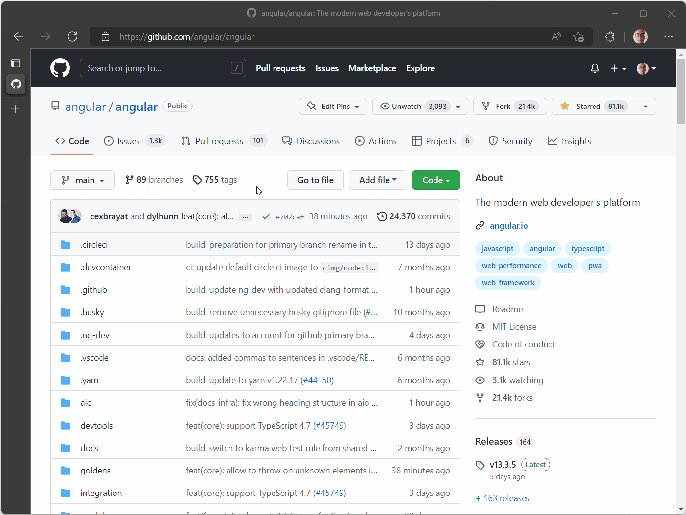
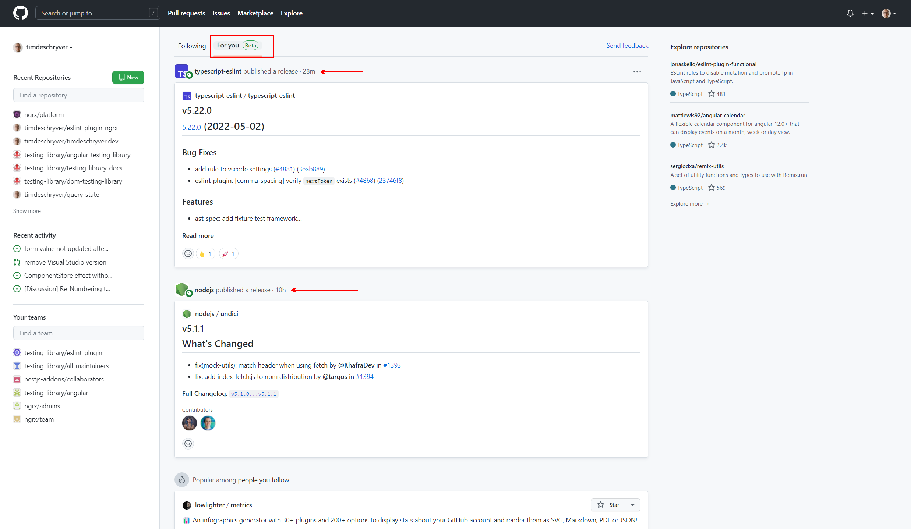
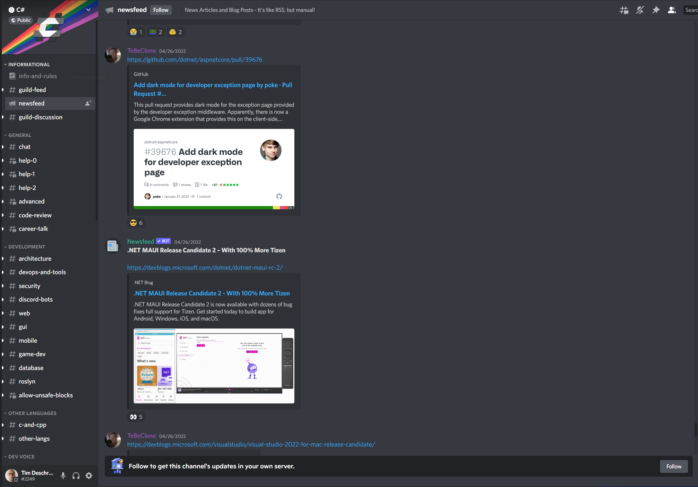

Staying up-to-date with your favorite frameworks, libraries, and tools takes time.
In this post let's explore new and older ways to optimally follow the progression and new trends.

## GitHub

### GitHub Releases

Use the watch functionally of a GitHub repository to get a notification when the project releases a new version.
To do so, click on "Watch", then click on "Custom", and lastly check the "Releases" option.

Now, you receive a notification in your GitHub inbox when a new release is published.

While you're at it, you can also check the "Discussions" checkbox.
This could be interesting if repositories use discussions to discuss new features.

### GitHub "For you" feed

The new "For you" feed (which is currently in beta) is useful to see what's going on.
This feed contains events that are relevant to you, the content is based on the people and organizations that you follow, and the repositories that you've starred.

The feed includes new releases, with a link to the release notes.

## Twitter

The reason why I joined Twitter a few years ago was to follow some of the "big names" within the JavaScript community.
Later, this was extended by following the maintainers of the libraries and frameworks that I was using, or which I was interested in. On Twitter, you'll find a lot of information, including news about new releases, requests for comments on new features, sneak peeks, and more.

## Twitter Communities

Recently, Twitter also released "Communities" which is a way to find people that share your interests.
Previously, to browse through some of your interests, you had to search on a hashtag, which wasn't very convenient.
Twitter Communities make this easy, in a community you'll find people posting a variety of information on the topic.

For example, take a look at the [dotnet community](https://twitter.com/i/communities/1488624124817666051).

## Discord

Discord is becoming more popular, and more projects have a Discord server.
If the project has a Discord server, there's a high chance that the server has one or more channels to keep you informed about new releases. These channels are maintained by the project members and/or community maintainers, or could be automated by using bots.

The announcement channel is the channel to keep an eye out for.
The channel has a megaphone (📢) icon in front of its name and is often called "Announcements", or "Newsfeed".
On this channel, you can find the latest news and important updates about the project.

A good second channel is the community channel (if the server has one), where you can find people that share their own content, or content that they found interesting.

Joining a Discord server also has the benefit that you can chat with the maintainers and other members that share your interests.
This way, you can ask questions, and if you want to, you can help other people.
Helping others with their questions and problems is a great way to get your feet wet if you want to be actively involved.
By doing so you will learn a lot, and it will expose you to new ideas that you haven't thought of before.

You can find me on the following Discord channels:

- [Angular](https://discord.com/invite/angular)
- [NgRx](https://discord.com/invite/ngrx)
- [Testing Library](https://discord.com/invite/testing-library)
- [C#](https://discord.com/invite/csharp)

## Community Content

### Blogs

Another way, to stay up-to-date, is to subscribe to a blog, or to manually visit the website regularly.
If you don't know a blog to follow, do a search on the topic and you'll probably find a top 10 list.

Instead of subscribing to a one-person blog, you can also use a blog platform where multiple content creators can post their content, for example, the two most popular blogging platforms at the moment are [dev.to](https://dev.to/) and [hashnode](https://hashnode.com/).

Another trick is to use an aggregator or a newsletter, which sums up the most important updates and content.
By using an aggregator, you don't need to browse through many resources to stay up-to-date.
For example, [The Morning Dew](https://www.alvinashcraft.com/)

### Videos

If reading content is not your thing, you can also watch videos.
More content creators are using YouTube as a platform to share their knowledge.
You can find a range of videos on YouTube of different lengths, simple overviews, in-depth tutorials, podcasts, and more.

I like the following video channels:

- [Brandon Roberts](https://www.youtube.com/c/BrandonRobertsDev)
- [Nick Chapsas](https://www.youtube.com/c/Elfocrash)
- [dotNET](https://www.youtube.com/c/dotNET)
- [This is Tech Talks](https://www.youtube.com/c/ThisisTechTalks)

### Podcasts

Speaking about podcasts, I find podcasts useful when I'm busy doing something else.
For example, while I'm commuting to work, or when I'm on a run.

I listen to the following technical podcasts:

- [.NET Rocks](https://www.dotnetrocks.com/)
- [Front End Happy Hour](https://www.frontendhappyhour.com/)
- [The Hanselminutes Podcast](https://www.hanselminutes.com/)
- [The Unhandled Exception](https://unhandledexceptionpodcast.com/)
- [WebRush](https://webrush.io/)

## Conclusion

Yes, you have to invest some time to stay up-to-date.
But this is the time that you put into yourself and your career.
In the long run, this has a positive impact on your growth.

Luckily, there are many ways to stay up-to-date.
Pick a way that works for you, and enjoy the continuous learning experience.

Enjoy, and happy learning!
