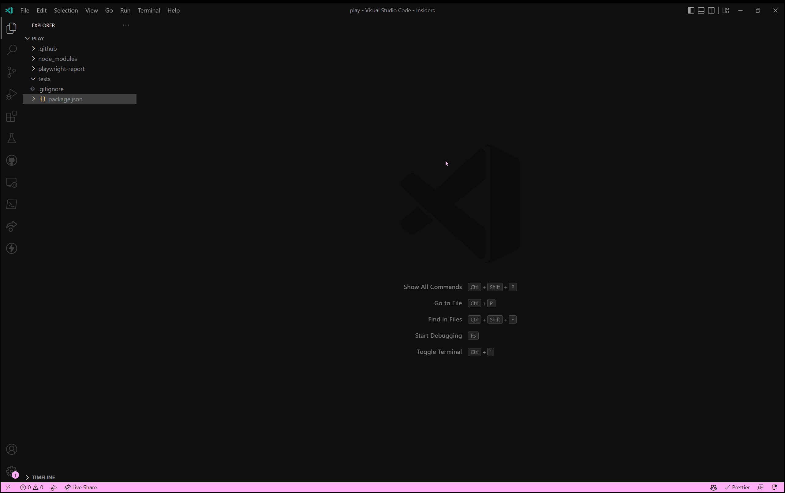

This post shows you how to upload files with Playwright.
To keep it basic, let's just take a page with a simple upload input element, and let's also show the filename after it's been uploaded.

As usual, I start [writing my Playwright test](../writing-your-first-playwright-test/index.md) by starting the codegen tool.
Because I installed the [Playwright extension for Visual Studio Code](https://marketplace.visualstudio.com/items?itemName=ms-playwright.playwright), I can quickly start the codegen tool via the command palette.

Let's take a look at the codegen tool in action to upload a file.



When we're done with the codegen tool, we end up with a new test file and the following generated code.
I already highlighted the most important lines.

```ts{9, 12}:tests/test-1.spec.ts
import { test, expect } from '@playwright/test';

test('test', async ({ page }) => {

    // Go to http://127.0.0.1:8080/
    await page.goto('http://127.0.0.1:8080/');

    // Click input[name="file-upload"]
    await page.locator('input[name="file-upload"]').click();

    // Upload fixture.pdf
    await page.locator('input[name="file-upload"]').setInputFiles('fixture.pdf');

    // Click text=fixture.pdf
    await page.locator('text=fixture.pdf').click();

});
```

As we can see in the generated test, we can use the [`page.setInputFiles`](https://playwright.dev/docs/api/class-page#page-set-input-files) method to upload one or more files.

So far so good, but when you run the test, you probably get the following error.

```bash
npx playwright test

Running 1 test using 1 worker
  1) [chromium] › test-1.spec.ts:3:1 › test ========================================================

    Error: ENOENT: no such file or directory, stat 'C:\Users\timde\dev\playgrounds\playwright-demo\fixture.pdf'
```

The error says that the file that we want to upload doesn't exist.
If we take a closer, we can notice that the codegen tools only sets the filename of the uploaded file, not the path to the file.
Because of this, the file cannot be found while the test is running.

To fix this problem, change the test so that it uses a relative path (starting from the root of the project) to the file.

I like to create a `fixtures` folder inside the `tests` folder for generic files that I want to use in my tests.
Specific files for a test can be added right next to the test file, which makes it obvious that it's specific to a test.

The modified test looks like this.

```ts{12}:tests/test-1.spec.ts
import { test, expect } from '@playwright/test';

test('test', async ({ page }) => {

    // Go to http://127.0.0.1:8080/
    await page.goto('http://127.0.0.1:8080/');

    // Click input[name="file-upload"]
    await page.locator('input[name="file-upload"]').click();

    // Upload fixture.pdf
    await page.locator('input[name="file-upload"]').setInputFiles('./tests/fixtures/fixture.pdf');

    // Click text=fixture.pdf
    await page.locator('text=fixture.pdf').click();

});
```

After this change, the test passes.
More importantly, we've seen how to upload files with Playwright.

```bash
npx playwright test

Running 1 test using 1 worker

  1 passed (1s)
```
