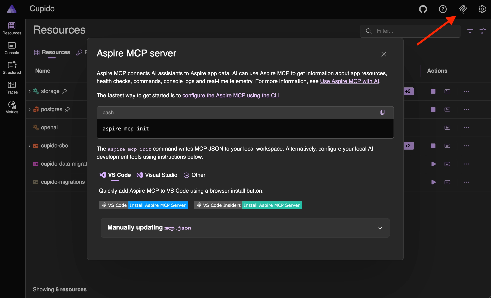

## Why AI coding agents need runtime context

A coding agent is as good as the context you provide it. With Aspire MCP, you can give your AI coding agents context from your running system, enabling them to make better, well-informed suggestions.

## Source code does not tell the whole story

Modern applications are no longer simple, isolated systems. They are composed of APIs, databases, message brokers, background workers, caches, containers, and external services. Understanding how all these pieces interact can be harder than writing the code itself.

While OpenTelemetry, Aspire, and AI agents are still relatively new and are still evolving quickly, they are becoming important tools in modern software development. When I'm working on projects, I can't imagine working without them anymore. Individually, they are already powerful tools, and together they reinforce each other.

## The runtime context stack

### OpenTelemetry gives you the signals

OpenTelemetry provides the foundation for observability. It captures structured logs, distributed traces, and metrics, making it possible to understand what happens inside a system at runtime. Instead of guessing why a request is slow or why a service fails, OpenTelemetry gives developers the data needed to investigate the real behavior of the system.

### Aspire: application model and local orchestration

Aspire orchestrates your distributed environment and gives you a structured way to model the different parts of your system using code. With Aspire, we get an isolated local development environment, with OpenTelemetry integrated from the start and support for building and deploying the application model. Logs, traces, and resource statuses are all centralized in one place, and are easily accessible in the Aspire dashboard.

### AI agents: better context means better suggestions

AI agents add another layer on top of this.
While agents already help us write, understand, and maintain code and documentation, they can do much more when they have access to the right context (information). Instead of just looking at the source code, they can also inspect the runtime behavior of the system and make more informed suggestions. This is where OpenTelemetry and Aspire come in. They already have the context that AI agents need to understand the behavior of the system, resulting in more useful assistance.

## What becomes possible

This means that instead of manually investigating logs, traces, and metrics to understand the behavior of the system, or manually debugging the application, you can ask your AI agent to do it for you.

When these three tools work together, you can ask your AI agent to analyze the runtime behavior of your system, and to provide insights and suggestions based on that. The results are more accurate and useful than if it only had access to the source code.

This is useful in different scenarios, for example:

- analyze logs to find the source of an error
- identify the root cause of a performance issue
- pinpoint the source of a failure in a distributed system
- document the flow through the system
- act as a rubber duck to explain the behavior of the system

It can often go one step further: after identifying a likely issue, it can suggest and implement a fix that you can review.

## Aspire MCP: connecting your agent to the running application

[Aspire MCP](https://aspire.dev/get-started/aspire-mcp-server/) is a local MCP server exposed by Aspire.
MCP is a protocol that lets AI tools communicate with external systems in a structured way. In our case, the external system is the Aspire application model.

### How to enable Aspire MCP

To install the Aspire MCP server, click on the MCP icon in the top right corner of the Aspire dashboard, and follow the instructions to install the MCP server. Once installed, you can enable it for your application.



You can also run the following command in your terminal to install the MCP server, follow the setup wizard, and optionally include skills and the Playwright CLI:

```bash
aspire agent init
```

### What your agent can inspect

When the MCP server is enabled, your AI code agent can use the [exposed tools](https://aspire.dev/get-started/aspire-mcp-server/#tools), such as reading the available resources, logs, and traces, enabling it to perform better.

Because the tools are exposed through MCP, they can be used by MCP-compatible AI tools, such as GitHub Copilot, Codex, or Claude Code.
There is no unified configuration format for every tool yet, so the setup differs per client. Luckily, the above `init` command does its best to already set up the correct integration for you based on the environment you are using. For example, if you are using GitHub Copilot, it will add the MCP server to the settings for you in Visual Studio Code.

## Example

Imagine a front-end application that suddenly shows an empty screen.

The code looks fine at first sight. The page calls the API, the API calls another service, and the UI expects data back. Without runtime context, an AI coding agent can only inspect the source code and guess where the problem might be.

With Aspire MCP, the agent can inspect the running application instead. It can check the resource status, see that one downstream service is unhealthy, read the API logs, follow the trace from the front-end request through the backend, and connect the empty screen to the service that is actually failing.

This changes the investigation.
Instead of asking "what in this code could be wrong?", the agent can ask "what actually happened when this request ran?".

### Example prompt

An example prompt could be:

```txt
The front-end application shows an empty screen when I open the orders page.
Please investigate this using the Aspire MCP tools before suggesting a fix.
```

Or a longer version of the prompt to be more specific about the investigation:

```txt
The front-end application shows an empty screen when I open the orders page.
Please investigate this using the Aspire MCP tools before suggesting a fix.

Include the following checklist to structure your investigation:

Check:
- the status of the Aspire resources
- the logs for the front-end, API, and downstream services
- the trace for the failing request
- any unhealthy or unavailable dependencies

I want you to determine:
- which request from the front-end is failing
- whether the API receives the request
- which downstream service is involved
- whether that service is unhealthy, unavailable, or returning an error
- the most likely root cause based on the runtime data
- the safest fix or next step
```

:::tip

Install the new [Aspire extension](https://marketplace.visualstudio.com/items?itemName=microsoft-aspire.aspire-vscode) for Visual Studio Code. The extension enhances the editor with Aspire information in the sidebar, and it also has the MCP server integration.

:::

## Conclusion

OpenTelemetry provides the raw runtime logs, traces, and metrics. Aspire organizes those signals and connects them to the application model. AI agents can use that structured context to help debug issues, explain failures, identify performance problems, and suggest improvements.

That changes how we use coding agents, with the result of a significantly enhanced development experience.

Instead of manually collecting logs, copying trace output, and explaining the current state of the system in a prompt, you can ask the agent to inspect the running application directly.

The AI agent quality also sees improvements. It doesn't guess anymore, the agent uses the runtime context to analyze the system's behavior, resulting in more reliable insights and suggestions.

This allows us to spend less time on manual investigation, and more time on building reliable software that creates value.
