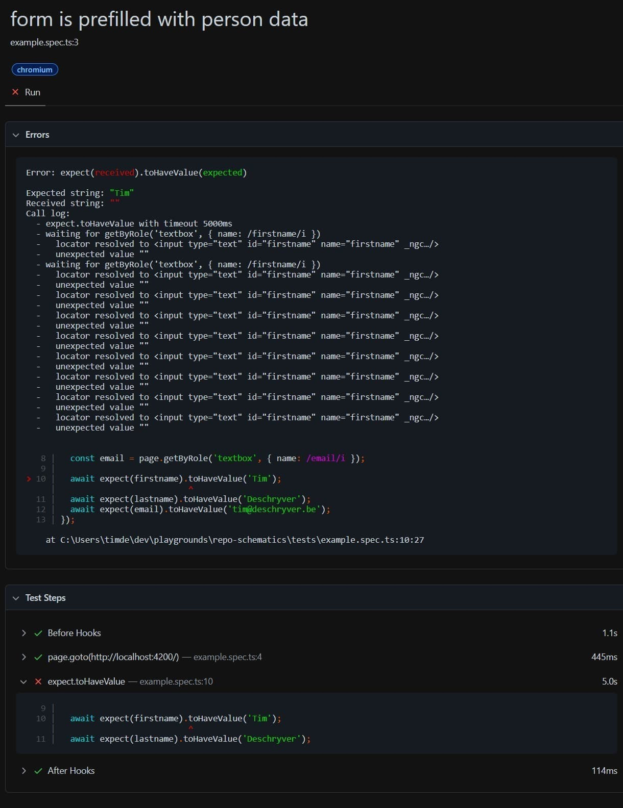
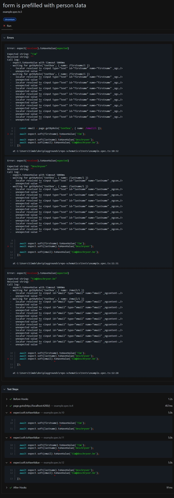

In this blog post, we take a look at Playwright's (soft) assertions to improve the test report.
Going from this report which doesn't give a lot of information:



To a better experience like this:



> Soft assertion is a feature that I frequently use in the .NET world, which I blogged about in [Assertion Scopes, the one FluentAssertions feature you didn't know you needed](../assertion-scopes-the-one-fluentassertions-feature-you-didnt-know-you-needed/index.md).

So what does this mean and why should you care?

With soft assertions, you can write multiple assertions in a single test without having to worry that one of them fails and bail out of the test.
Instead, you can verify of all assertions are successful when you're interested in the outcome.

Compare both behaviors, and you can see how soft assertions can improve the flow of writing (and fixing) test cases.

Let me give you an example of where I think soft assertions are useful.

Let's say that we're writing an application that contains a form in which you want to verify that all fields are prefilled correctly.
A test for this looks like this, we get the form fields and use `expect` to check that each field has the correct value.

```ts{8-10}:form.spec.ts
import { test, expect } from '@playwright/test';

test('form is prefilled with person data', async ({ page }) => {
    const firstname = page.getByRole('textbox', { name: /firstname/i });
    const lastname = page.getByRole('textbox', { name: /lastname/i });
    const email = page.getByRole('textbox', { name: /email/i });

    await expect(firstname).toHaveValue('Tim');
    await expect(lastname).toHaveValue('Deschryver');
    await expect(email).toHaveValue('tim@deschryver.be');
});
```

Now, imagine one of the form fields that has an incorrect value.
Of course, causing the test to fail.


With this behavior, you need to fix the bug and rerun the test with the hope that the other assertions are passing for the test case to succeed.
But of course... there is another bug, and again, the test case fails.
This repetitive loop goes on and on until the test finally turns green.
I find this counterproductive and it can also demotivate me, especially after a hard day.

Luckily there's a solution to this problem.

By using soft assertions in Playwright, the cycle of fixing the assertions is fine-tuned to just one single step.
The test can be refactored to the following, where we swap `expect` with `expect.soft`.

```ts{8-10}:form.spec.ts
import { test, expect } from '@playwright/test';

test('form is prefilled with person data', async ({ page }) => {
    const firstname = page.getByRole('textbox', { name: /firstname/i });
    const lastname = page.getByRole('textbox', { name: /lastname/i });
    const email = page.getByRole('textbox', { name: /email/i });

    await expect.soft(firstname).toHaveValue('Tim');
    await expect.soft(lastname).toHaveValue('Deschryver');
    await expect.soft(email).toHaveValue('tim@deschryver.be');
});
```

The refactored version results that the test case continuing to execute even if one or more assertions fail.
In the next image, we can see that all assertions are executed and that all fields are incorrect.


When using soft assertions in Playwright the test's outcome is verified when the test case is fully executed.
This is not always the behavior that you want.
In some cases, you want to bail early when you detect that the state of the application is not what you expect it to be.
For example, you don't want to submit the form when it's not filled in correctly because you already know that it will fail.
Bailing early saves you time and resources.

To prevent the test to run further you need to use `test.info().errors`, which contains a collection of errors for the current test.
When the collection is not empty, you can throw an error to stop the test execution.

```ts{12}:form.spec.ts
import { test, expect } from '@playwright/test';

test('form is prefilled with person data', async ({ page }) => {
    const firstname = page.getByRole('textbox', { name: /firstname/i });
    const lastname = page.getByRole('textbox', { name: /lastname/i });
    const email = page.getByRole('textbox', { name: /email/i });

    await expect.soft(firstname).toHaveValue('Tim');
    await expect.soft(lastname).toHaveValue('Deschryver');
    await expect.soft(email).toHaveValue('tim@deschryver.be');

    expect(test.info().errors).toHaveLength(0);

    await page.getByRole('button', { name: /submit/i }).click();
});
```
