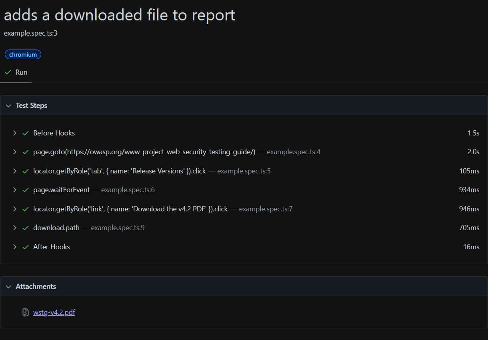
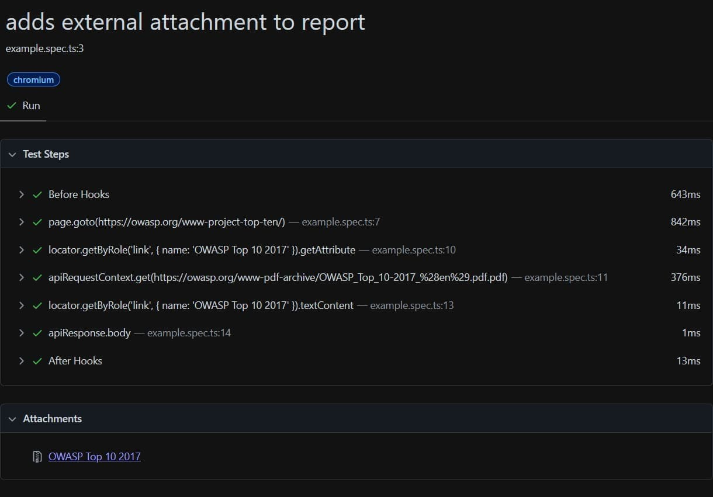
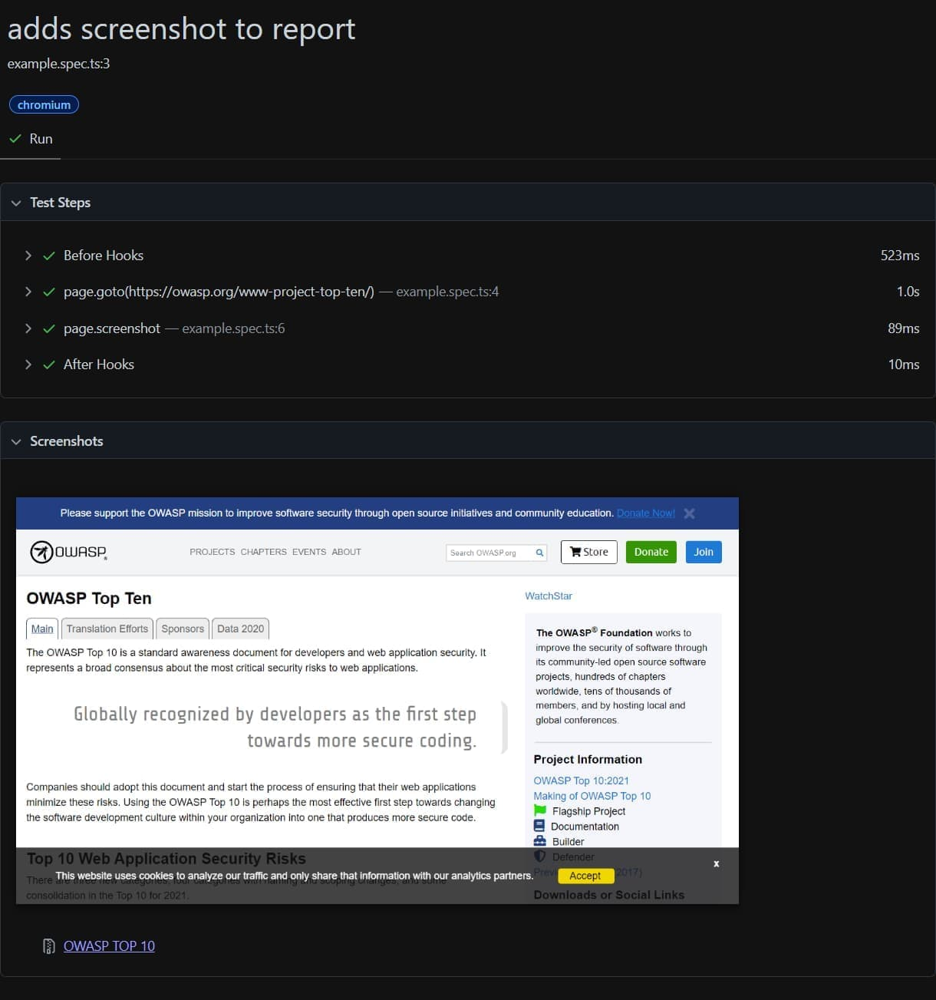

Automated testing with Playwright is a great way to ensure your application is working correctly, but testing a file can be a challenge.

This is not a simple task to automate and needs to be tested by a human to be thorough.
However, we can do our best to make this easier than manually having to open the application, and then interact with it, just to download the file.
This could be OK once or twice, but this quickly becomes a tedious task very fast. As a result that this test will be "forgotten".

Luckily, Playwright has a solution.
By adding the file to the test report - which can later be included in an artifact created by a pipeline - the tester can easily access and download the file to check it.

:::info
To set up a CI pipeline running Playwright, see [GitHub Actions](https://playwright.dev/docs/ci-intro) or [Azure DevOps](../playwright-in-an-azure-devops-pipeline/index.md).
:::

In this post, I will show you multiples ways how to add a file (or screenshot) to your Playwright report using [testInfo.attach](https://playwright.dev/docs/api/class-testinfo#test-info-attach). To use `TestInfo`, add it as the second parameter of the test method.

## Add a downloaded file to the report

The first option is to add a file that is downloaded by the browser:

- First, create a "hook" that waits for the download, and then click the element to start the download (2)
- Add the file to the report, use `suggestedFilename` to get the name of the file, and `path` to include the temporary path of the downloaded file (3)

```ts{8-11, 13-18}:download.spec.ts
import { test } from '@playwright/test';

test('adds a downloaded file to report', async ({ page }, testInfo) => {
    // 1. Navigate to the page
    await page.goto('https://owasp.org/www-project-web-security-testing-guide/');
    await page.getByRole('tab', { name: 'Release Versions' }).click();

    // 2. Wait for the download
    const downloadPromise = page.waitForEvent('download');
    await page.getByRole('link', { name: 'Download the v4.2 PDF' }).click();
    const download = await downloadPromise;

    // 3. Add the PDF to the report
    const path = await download.path();
    // ^ AppData\Local\Temp\playwright-artifacts-KZfOpF\19df2a33-9f96-465a-acb5-3dc1b9041e71
    await testInfo.attach(download.suggestedFilename(), {
        path: path!,
    });
});
```



## Add an external file to the report

The second solution is to add a file that is available as an URL:

- The first step is to grab the URL of the file (2)
- Next, use the [`APIRequestContext`](https://playwright.dev/docs/api/class-apirequestcontext) to download the file (3)
- Lastly, add the file to the report by adding the request's body (4)

```ts{7-9, 11-12, 14-17}:external.spec.ts
import { test } from '@playwright/test';

test('adds an external file to report', async ({ page, request }, testInfo) => {
    // 1. Navigate to the page
    await page.goto('https://owasp.org/www-project-top-ten/');

    // 2. Grab the PDF link
    const link = await page.getByRole('link', { name: 'OWASP Top 10 2017' });
    const href = await link.getAttribute('href');

    // 3. Download the PDF
    const pdfRequest = await request.get('https://owasp.org' + href);

    // 4. Add the PDF to the report
    await testInfo.attach((await link.textContent())!, {
        body: await pdfRequest.body(),
    });
});
```



## Add a screenshot to the report

The last way is to take a screenshot of the page and attach it to the report.
For this,

- Simply take a screenshot of the page, or a specific element on the page (2)
- Include the image using `body` and set the content type by using `contentType` (3)

```ts{7-8, 10-14}:screenshot.spec.ts
import { test } from '@playwright/test';

test('adds a screenshot to report', async ({ page }, testInfo) => {
    // 1. Navigate to the page
    await page.goto('https://owasp.org/www-project-top-ten/');

    // 2. Take a screenshot
    const screenshot = await page.screenshot();

    // 3. Add the screenshot to the report
    await testInfo.attach('OWASP TOP 10', {
        body: screenshot,
        contentType: 'image/png',
    });
});
```



## Conclusion

In this post, we've seen how we can attach different files as an attachment to the Playwright report.
Doing this makes it easier to access these files in order to verify their correctness.

Even if these files are not verified on each run, we can store a history of these files.
In the case that something is off, we can go back in time and pinpoint the exact commit that has caused the difference,
