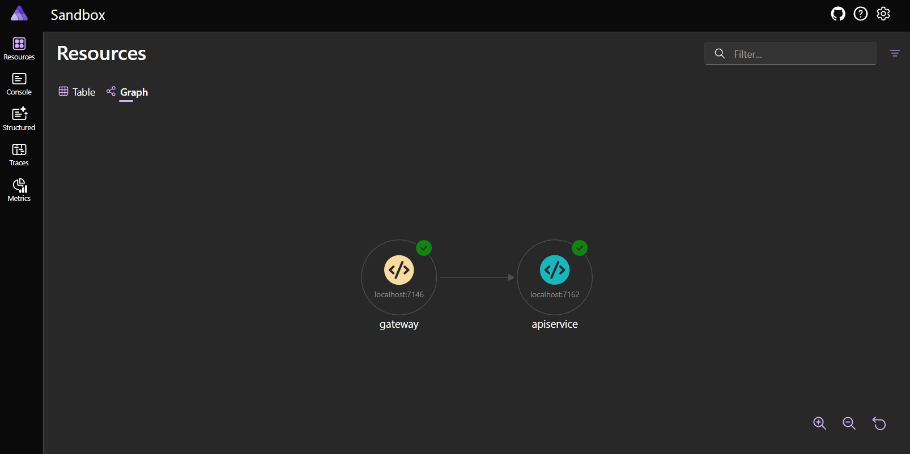
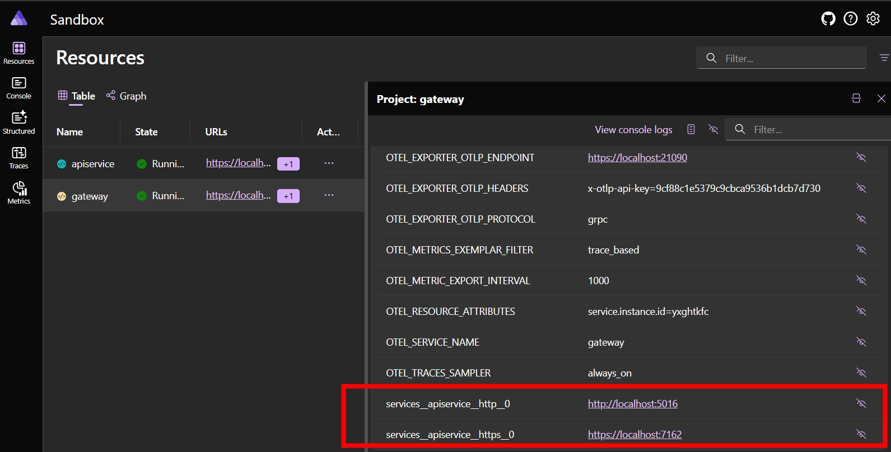
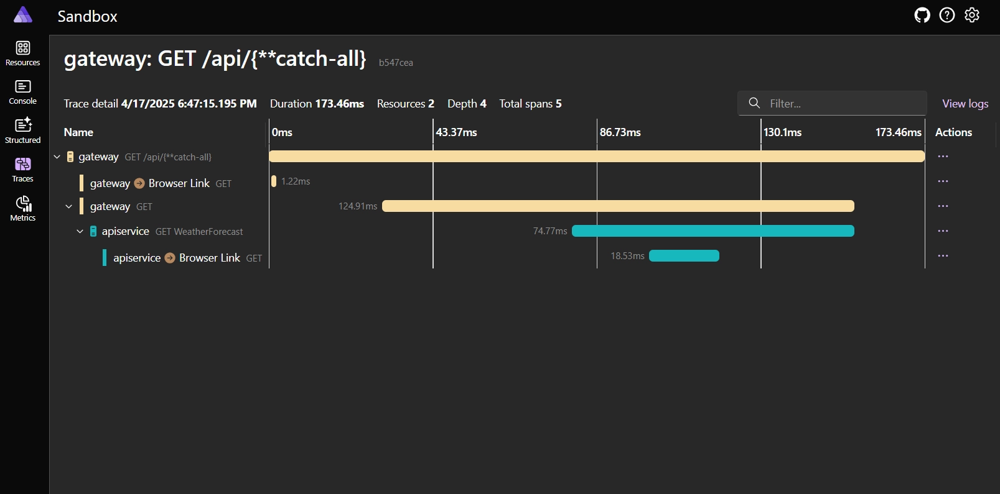

More projects are moving towards the Backend for Frontend (BFF) pattern to provide a more tailored and efficient interaction between a frontend application (e.g. an Angular application) and its backend services (e.g. a .NET WebAPI). This pattern has a couple of benefits:

- No more irritating [CORS issues](https://developer.mozilla.org/en-US/docs/Web/HTTP/CORS) when calling APIs from the frontend.
- Improved security by not storing user and application secrets in the frontend code.
- A simplified authentication process for the frontend, as the BFF can handle authentication and authorization on behalf of the frontend application.
- The applications' performance increases as the BFF can aggregate multiple backend services into a single API endpoint, reducing the number of network calls from the frontend.

To build the BFF, we can use [YARP (Yet Another Reverse Proxy)](https://learn.microsoft.com/en-us/aspnet/core/fundamentals/servers/yarp/yarp-overview), which is a reverse proxy library for ASP.NET Core. YARP allows you to create a reverse proxy server to route requests to different backend services based on the request URL or other criteria.

:::note
YARP is also available as a [Docker container](https://hub.docker.com/r/microsoft/dotnet-nightly-yarp) (in preview).
:::

In this article, we're going to explore how to create and integrate YARP within [.NET Aspire](https://learn.microsoft.com/en-us/dotnet/aspire/get-started/aspire-overview).
The YARP project is going to act as a **secure BFF**, and will play the role of a traffic controller between the frontend (this will be added in a future post) and the backend services.

## Prerequisites

I assume there's already a working .NET Aspire project, which contains a WebAPI project.
If you need help setting up a new .NET Aspire project, please refer to the [Getting Started with .NET Aspire](https://learn.microsoft.com/en-us/dotnet/aspire/get-started/build-your-first-aspire-app) documentation.

You should end up with a solution, in which a WebAPI project is added to the Aspire AppHost.
In the example below the WebAPI project is referred to as `apiservice`.

```cs{3}:Sandbox.AppHost/Program.cs
var builder = DistributedApplication.CreateBuilder(args);

builder.AddProject<Projects.Sandbox_ApiService>("apiservice");

builder.Build().Run();
```

## Add a new YARP project

The first step is to create a new YARP project within the existing solution.
Because there's no template for YARP, create a new Empty ASP.NET Core Web API project, I named mine `Gateway`.

If you're Visual Studio make sure that the "Enlist in Aspire orchestration" checkbox is checked (checked by default) in the wizard, so that the new project is added to the existing solution. This will automatically register the new project in the Aspire AppHost, and it will be available for orchestration.
You can also do this manually by adding a project reference from the `AppHost` project to the new `Gateway` project, and registering the project to Aspire.

```cs{4}:Sandbox.AppHost/Program.cs
var builder = DistributedApplication.CreateBuilder(args);

builder.AddProject<Projects.Sandbox_ApiService>("apiservice");
builder.AddProject<Projects.Sandbox_Gateway>("gateway");

builder.Build().Run();
```

To verify that the project is registered correctly, run the AppHost project and check the Aspire Dashboard.
Using the graph view, you should see the `apiservice` and `gateway` projects connected to each other.
To view the dashboard, run the AppHost project.



The newly created Gateway project should be empty for now, with the exception of adding Aspire's [service defaults](https://learn.microsoft.com/en-us/dotnet/aspire/fundamentals/service-defaults). This is going to be important later on because it adds service discovery functionality. It adds more than this, such as configuring OpenTelemetry, but that's not the focus of this article.

```cs{3}:Sandbox.Gateway/Program.cs
var builder = WebApplication.CreateBuilder(args);

builder.AddServiceDefaults();

var app = builder.Build();

app.Run();
```

### Install YARP Packages

After the project is created, add the [Yarp.ReverseProxy](https://www.nuget.org/packages/Yarp.ReverseProxy/) and [Microsoft.Extensions.ServiceDiscovery.Yarp](https://www.nuget.org/packages/Microsoft.Extensions.ServiceDiscovery.Yarp) NuGet packages.

```bash
dotnet add package Yarp.ReverseProxy
dotnet add package Microsoft.Extensions.ServiceDiscovery.Yarp
```

When the packages are installed, update the `Program` file to add and use YARP:

```cs{4,8}:Sandbox.Gateway/Program.cs
var builder = WebApplication.CreateBuilder(args);

builder.AddServiceDefaults();
builder.Services.AddReverseProxy();

var app = builder.Build();

app.MapReverseProxy();

app.Run();
```

## Reference the API to the Gateway

With YARP we want to redirect incoming requests to the `apiservice` API, but we don't want to maintain each API's URL in the YARP project.
While this doesn't seem like a big deal for now with only one API, it can become a real burden when the number of APIs increases, or when it's going to be released.

That's where the Aspire can help us.
Aspire is responsible for orchestrating the different projects in the solution, and it can manage the dependencies effectively.

With Aspire we can "link" projects together, in our case the gateway (YARP) needs to be aware of the `apiservice` WebAPI project.
To achieve this, we can use the `WithReference` method to add a reference to the `apiservice` project from the `gateway` project.

```cs{3-7}:Sandbox.AppHost/Program.cs
var builder = DistributedApplication.CreateBuilder(args);

var api = builder.AddProject<Projects.Sandbox_ApiService>("apiservice");
var gateway = builder.AddProject<Projects.Sandbox_Gateway>("gateway")
    .WithReference(api)
    .WaitFor(api)
    .WithExternalHttpEndpoints();

builder.Build().Run();
```

We're not there yet, but in the end we want to keep our internals safe and hidden from the outside world (when the project is deployed).
The only resource that should be exposed to the outside world is the `gateway` project, all the traffic should go through it.
That's why the code above marks the `gateway` project as an external resource with the `WithExternalHttpEndpoints` method.

By creating this reference between the `gateway` and `apiservice` projects, the `apiservice` address is registered as an environment variable in the `gateway` project.
This is visible within the Aspire Dashboard:



## Configure YARP

YARP is configured by providing a set of routes and clusters in the `appsettings.json` file.
This can also be done via code, but I personally find it easier to use the JSON configuration.

The routes define how requests are matched and routed to the appropriate backend services, while the clusters define the backend services themselves.

In the configuration below, we define a route that matches requests to `/api/{**catch-all}` and routes them to a cluster named `apiservice`.
The cluster contains a single destination, which is the address of the backend service.

This means that any requests to `/api` is going to be forwarded to the `apiservice` backend service.

```json{8-31}:appsettings.json
{
	"Logging": {
		"LogLevel": {
			"Default": "Information",
			"Microsoft.AspNetCore": "Warning"
		}
	},
	"ReverseProxy": {
		"Routes": {
			"apiservice": {
				"ClusterId": "apiservice",
				"Match": {
					"Path": "/api/{**catch-all}"
				},
				"Transforms": [
					{
						"PathRemovePrefix": "/api"
					}
				]
			}
		},
		"Clusters": {
			"apiservice": {
				"Destinations": {
					"apiservice": {
						"Address": "http://apiservice"
					}
				}
			}
		}
	}
}
```

Please notice that the address of the backend service is not set to a specific URL.
Instead, it's set to `http://apiservice`, which is the name we gave to the WebAPI project while registering it in the Aspire AppHost.

You can also see that the YARP configuration includes a transform that removes the `/api` prefix from the request path before forwarding it to the backend service.
I'm doing this because the WebAPI project doesn't make use of the `/api` prefix in its routes.
I like to add a prefix to the routes in the YARP project, so that I can easily distinguish the routes, and avoid any conflicts with any duplicate routes when more projects are added.

Lastly, the YARP configuration can be loaded from the `appsettings.json` file by using the `LoadFromConfig` method in the `Program.cs` file.

```cs{4-6}:Sandbox.Gateway/Program.cs
var builder = WebApplication.CreateBuilder(args);

builder.AddServiceDefaults();
builder.Services
    .AddReverseProxy()
    .LoadFromConfig(builder.Configuration.GetSection("ReverseProxy"));

var app = builder.Build();

app.MapReverseProxy();

app.Run();
```

To try this out, run the AppHost project and navigate to the gateway URL in your browser, and append `https://{gateway:portnumber}/api/weatherforecast` to the URL.
We expect to see the weather forecast data returned from the `apiservice`, because our request is being routed through the `gateway` project, to `https://{apiservice:portnumber}/weatherforecast`.

But this isn't the case.
If we take a look at the error, which is available in the Aspire logs, we can see that the YARP project is unable to resolve the `apiservice` address.
We get the following error:

```txt
name_resolution_error
http://apiservice/weatherforecast
```

## Service discovery

This happens because the `apiservice` is not discovered correctly, and thus isn't using the correct address.
To resolve this, invoke the `AddServiceDiscoveryDestinationResolver` (coming from the `Microsoft.Extensions.ServiceDiscovery.Yarp` NuGet package) method in the `Program.cs` file of the YARP project.

```cs{7}:Sandbox.Gateway/Program.cs
var builder = WebApplication.CreateBuilder(args);

builder.AddServiceDefaults();
builder.Services
    .AddReverseProxy()
    .LoadFromConfig(builder.Configuration.GetSection("ReverseProxy"))
    .AddServiceDiscoveryDestinationResolver();

var app = builder.Build();

app.MapReverseProxy();

app.Run();
```

With this change, the YARP project is able to resolve the `apiservice` address correctly, to the correct route `https://{apiservice:portnumber}`.
In my case it routes `https://localhost:7146/api/weatherforecast` to `https://localhost:7162/weatherforecast`.

You can follow this request within the Aspire Dashboard, by looking at the trace view.
Resulting in the trace trail:

- the initiator of the request, which is a navigation to the `/api/weatherforecast` endpoint;
- YARP is handling the incoming request;
- YARP is forwarding the request to the `apiservice`;
- The `apiservice` returning a successful response;



## Conclusion

In this article, we explored how to integrate YARP within a .NET Aspire project.
We used Aspire's service discovery to automatically resolve the backend service address without hardcoding URLs in the YARP configuration.

In the next blog posts, we will explore how to add authentication to the YARP project to secure the API endpoints.
We will also add an Angular frontend project to the solution, and configure it to use the YARP project as a BFF.

If you can't wait, check out my [Sandbox](https://github.com/timdeschryver/sandbox) for the complete code.
