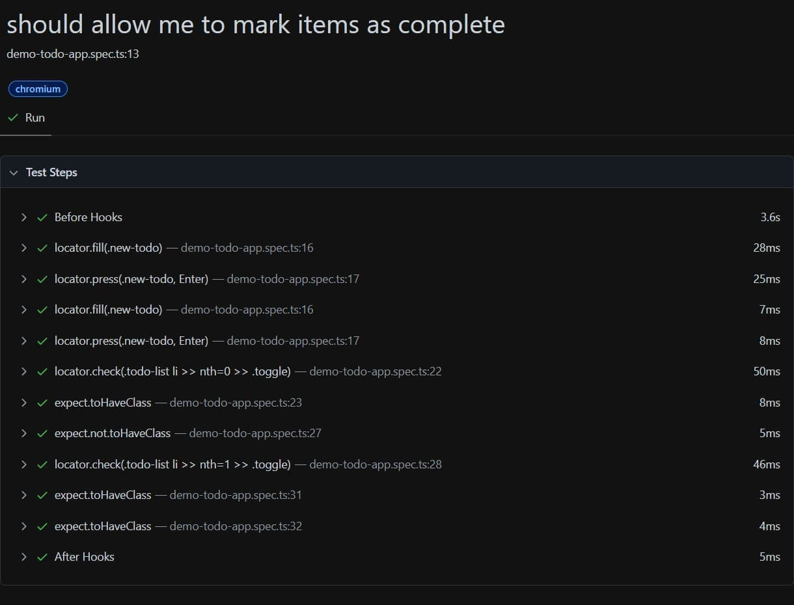
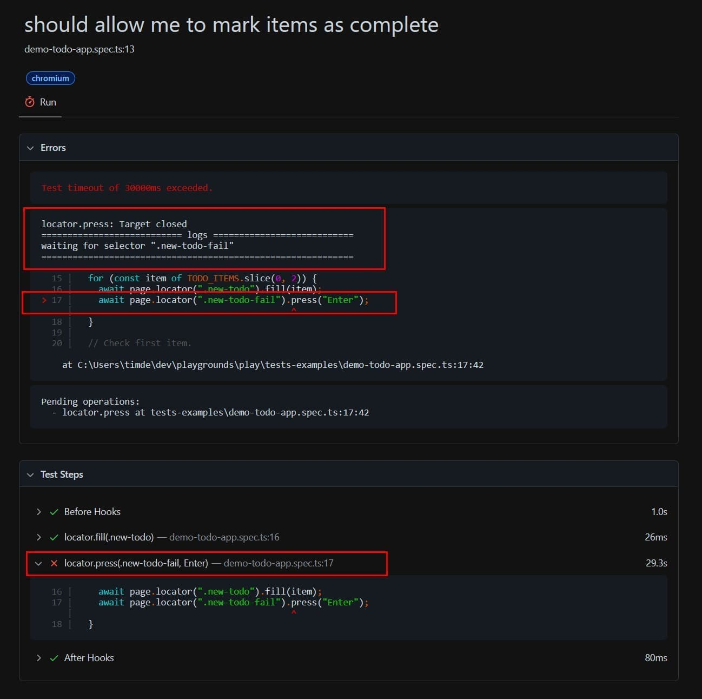
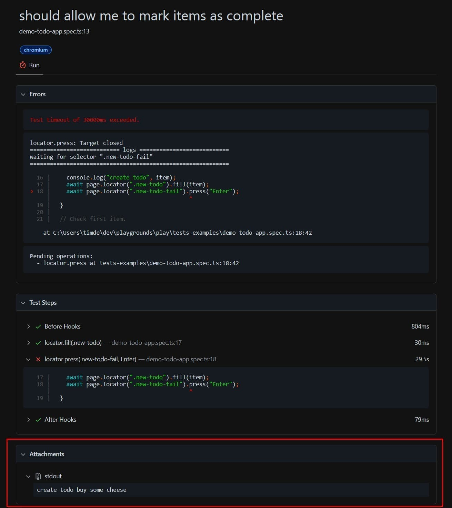
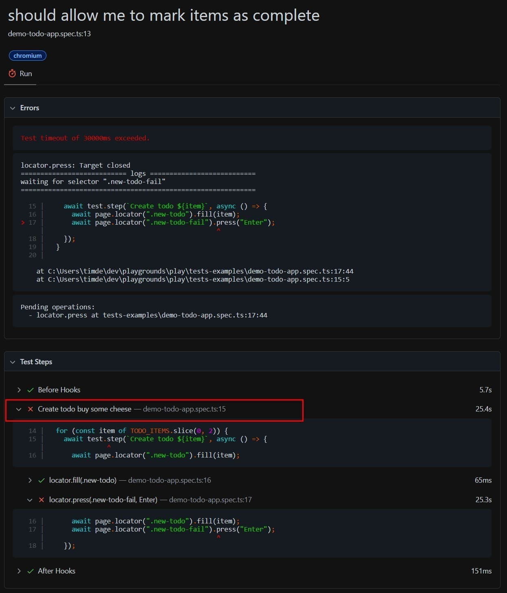
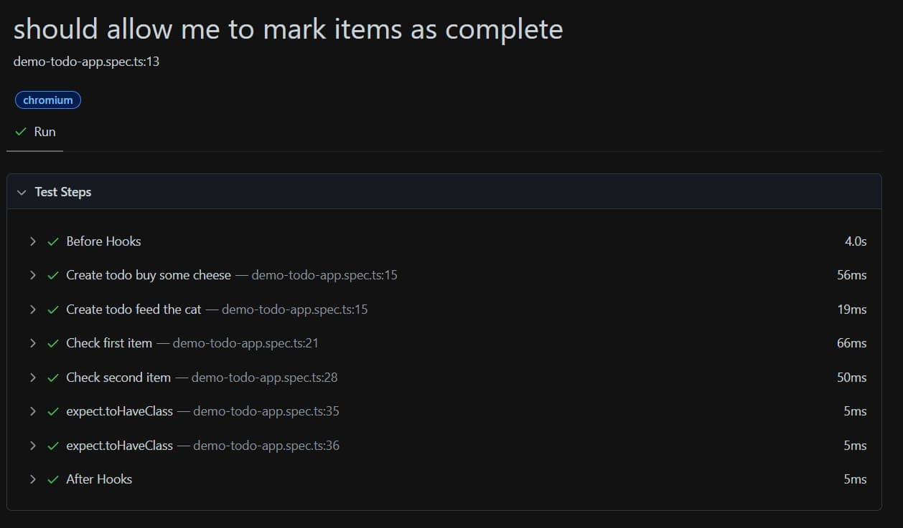

It's always useful to know why a test fails.
Ideally, we immediately see why (and which line(s)) causes the test to fail.
But this isn't always easy to know when you have a test that contains multiple steps.
This is where a good test runner helps you to win some time.

> Dividing an end-to-end test into multiple steps is a popular practice because it makes the test cases faster to execute and because you probably built on top of the created/changed data.

For me, this is important because I like to write whole flows in an end-to-end test, _this way I'm confident that everything works_, but it's even helpful for simpler test cases.
Luckily, Playwright can give us a hand and can quickly point us toward the problem.

As an example, let's take a closer look at a Playwright example, which is generated as an example with the init command (`npm init playwright`).

## 👎 Code comments

The test case below isn't large, but it's already containing symptoms of a test that is not well-structured and hard to maintain.
As you can notice, the test case is divided into multiple steps.
Each step contains a comment to make the intent of the code block (a step) clear to the reader.

In these cases, a step can be compared to a smaller test case within the bigger test.

```ts{2,8,13,18}
test('should allow me to mark items as complete', async ({ page }) => {
    // Create two items.
    for (const item of TODO_ITEMS.slice(0, 2)) {
        await page.locator('.new-todo').fill(item);
        await page.locator('.new-todo').press('Enter');
    }

    // Check first item.
    const firstTodo = page.locator('.todo-list li').nth(0);
    await firstTodo.locator('.toggle').check();
    await expect(firstTodo).toHaveClass('completed');

    // Check second item.
    const secondTodo = page.locator('.todo-list li').nth(1);
    await expect(secondTodo).not.toHaveClass('completed');
    await secondTodo.locator('.toggle').check();

    // Assert completed class.
    await expect(firstTodo).toHaveClass('completed');
    await expect(secondTodo).toHaveClass('completed');
});
```

Let's also take a look at the Playwright report for the test case.



We can see that all the user actions and asserts are added to the report.
It's even possible to expand them and to see the corresponding code.
This is fine when everything works, but let's see what the Playwright report looks like when the same test fails.



Looking at the Playwright report it's still clear why the test fails, which is "waiting for selector '.new-todo-fail'".
In other words, it can't find the `.new-todo-fail` selector.

There's even the line number with the code block that causes the test to fail.
While it's something, I don't find this ideal because we don't see the full context.
We have to open the test file manually to get the full picture of the test, for example, to know the steps before.

In this specific example, we don't know which to-do item caused the test to fail.
This might be a trigger for you to know what to do next in order to fix the failing test.

## 👎 Log statements

As a countermeasure for this problem, I usually see a lot of projects that add `console.log` statements to get more information.

So, let's include them in the test and see what happens.
In the following example, log statements are added to know which todo is created, and which todo is checked.

```ts{4,13,19}
test('should allow me to mark items as complete', async ({ page }) => {
    // Create two items.
    for (const item of TODO_ITEMS.slice(0, 2)) {
        console.log('create todo', item);
        await page.locator('.new-todo').fill(item);
        await page.locator('.new-todo-fail').press('Enter');
    }

    // Check first item.
    const firstTodo = page.locator('.todo-list li').nth(0);
    await firstTodo.locator('.toggle').check();
    await expect(firstTodo).toHaveClass('completed');
    console.log('checked', TODO_ITEMS[0]);

    // Check second item.
    const secondTodo = page.locator('.todo-list li').nth(1);
    await expect(secondTodo).not.toHaveClass('completed');
    await secondTodo.locator('.toggle').check();
    console.log('checked', TODO_ITEMS[1]);

    // Assert completed class.
    await expect(firstTodo).toHaveClass('completed');
    await expect(secondTodo).toHaveClass('completed');
});
```

The test still fails when it's re-executed, but the added logs are now included in the Playwright report.



While this is better, I still don't find this to be ideal because the information is scattered.
We receive all the pieces, but we have to put the pieces together to get the full picture.

## 👍 Steps

So far, we've seen that code comments and log statements offer a way to better understand the test, but they aren't ideal.
The best solution in my opinion is to use the `test.step` function.

We can replace the comments and log statements, with the `test.step` function, which accepts two arguments.
The first argument is a description, and the second argument is a function that contains the code that we want to test.
This signature should be familiar, as it's almost identical to the `test` function.

The refactored test with steps looks like this.

```ts{3-6,9-13,15-19}
test('should allow me to mark items as complete', async ({ page }) => {
    for (const item of TODO_ITEMS.slice(0, 2)) {
        await test.step(`Create todo ${item}`, async () => {
            await page.locator('.new-todo').fill(item);
            await page.locator('.new-todo-fail').press('Enter');
        });
    }

    await test.step(`Check first item`, async () => {
        const firstTodo = page.locator('.todo-list li').nth(0);
        await firstTodo.locator('.toggle').check();
        await expect(firstTodo).toHaveClass('completed');
    });

    await test.step(`Check second item`, async () => {
        const secondTodo = page.locator('.todo-list li').nth(1);
        await expect(secondTodo).not.toHaveClass('completed');
        await secondTodo.locator('.toggle').check();
    });

    await expect(firstTodo).toHaveClass('completed');
    await expect(secondTodo).toHaveClass('completed');
});
```

But the refactored test has a small problem because we don't have access to the `firstTodo` and `secondTodo` variables anymore.
To fix this, return the variables within the `test.step` function, and assign them to a variable.

```ts{9,13,16,20}
test('should allow me to mark items as complete', async ({ page }) => {
    for (const item of TODO_ITEMS.slice(0, 2)) {
        await test.step(`Create todo ${item}`, async () => {
            await page.locator('.new-todo').fill(item);
            await page.locator('.new-todo-fail').press('Enter');
        });
    }

    const firstTodo = await test.step(`Check first item`, async () => {
        const firstTodo = page.locator('.todo-list li').nth(0);
        await firstTodo.locator('.toggle').check();
        await expect(firstTodo).toHaveClass('completed');
        return firstTodo;
    });

    const secondTodo = await test.step(`Check second item`, async () => {
        const secondTodo = page.locator('.todo-list li').nth(1);
        await expect(secondTodo).not.toHaveClass('completed');
        await secondTodo.locator('.toggle').check();
        return secondTodo;
    });

    await expect(firstTodo).toHaveClass('completed');
    await expect(secondTodo).toHaveClass('completed');
});
```

Now, when the test is executed, it results in the following Playwright report.



The Playwright report now includes the steps in detail, and we can easily find what caused the test to fail.

When we eventually fix the test, the Playwright report contains a nice summary of each step.



## Conclusion

To summarize, we can replace comments and log statements with the `test.step` function.
By adding descriptive step descriptions it becomes easier to understand what is happening while reading the test case.

The steps also give a well-organized summary of the flow because these are included in the Playwright test report, which makes it easier to find the cause of the failure.
As a benefit, these reports can also be useful used while talking about the flow of the test.
