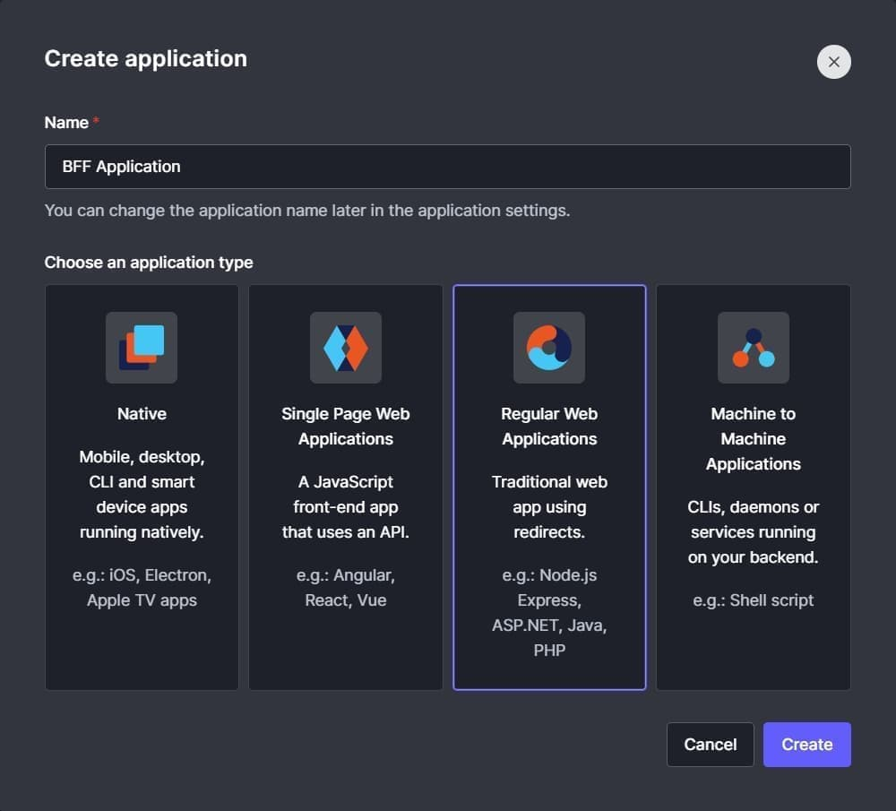
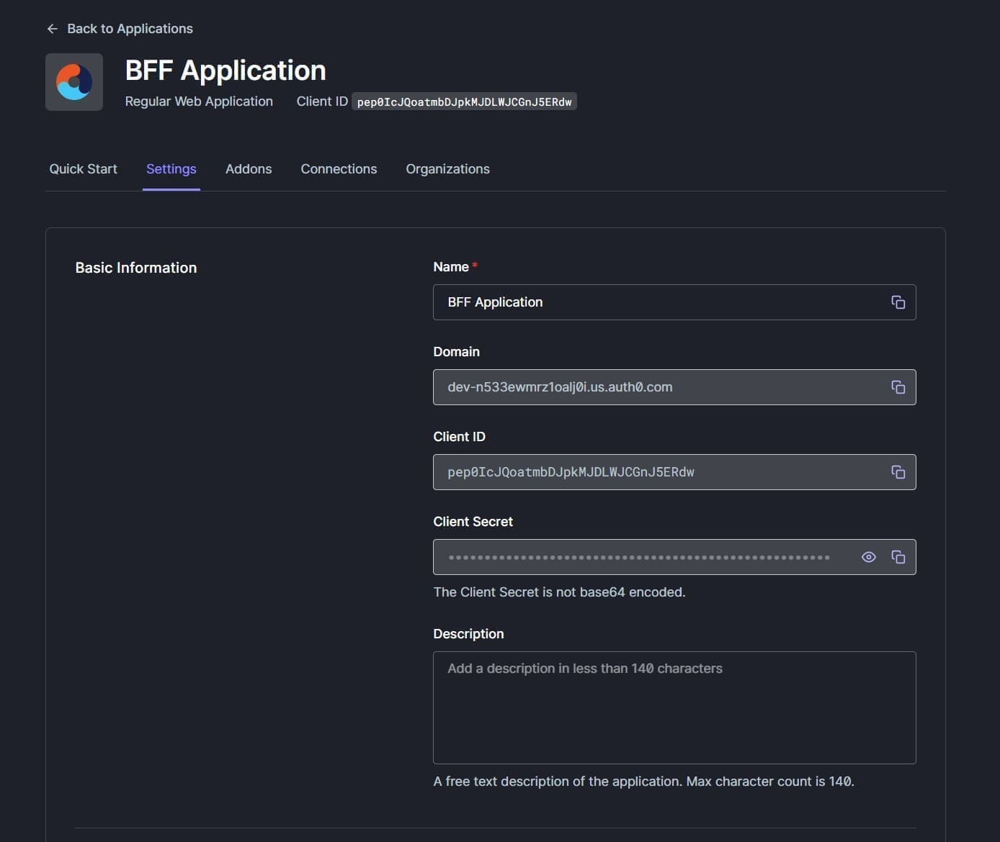
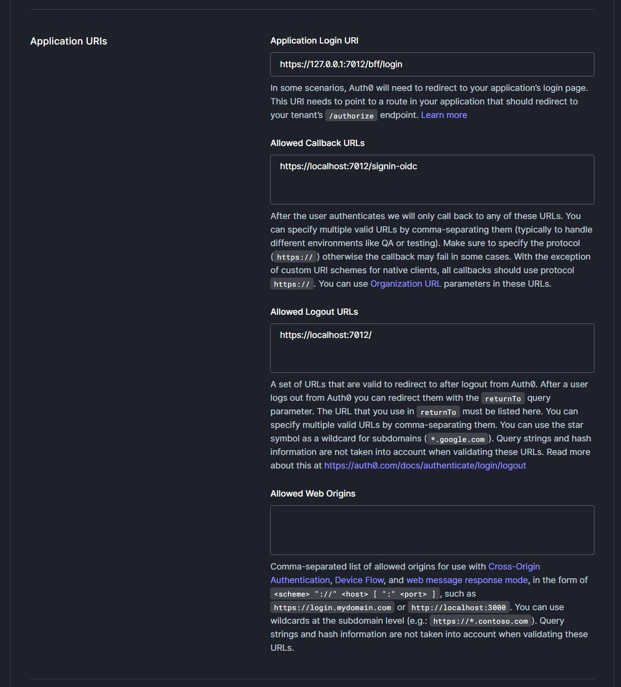
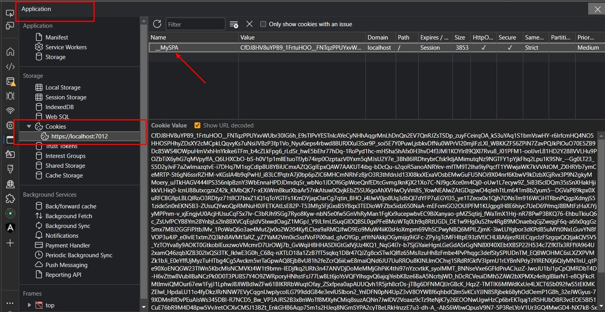

The Backend for Frontend (BFF) architecture is gaining popularity for multiple reasons.

The main reason, for me as a developer, for using a BFF is that it simplifies the communication between the front-end and multiple backend services.
Instead of having the frontend communicate with multiple backend services, the frontend communicates with a single BFF service that will then communicate with the backend services.

The BFF is responsible to prepare the data in the shape that the frontend expects.
This can be for one backend service, or the BFF can aggregate data from multiple backend services.
Doing this work in the BFF service improves the user experience because the frontend delegates this work to the BFF service, resulting in a faster experience for the user.

## The security aspect of a BFF

This sounds good, but another big reason for using a BFF is security.

Most of the frontend applications are currently using the Implicit (grant) flow to authenticate users.
It's the flow where you store the access token in the browser, and where you append the token to the requests to the backend service.
Sadly, as we know too well, the browser is not a secure place to store the access token.
This makes it that this flow has a serious security flaw.
Because the access token is exposed to the frontend application, it becomes vulnerable to access token leakage.
That's why the Implicit flow is [not recommended anymore](https://oauth.net/2/grant-types/implicit/#:~:text=It%20is%20not%20recommended%20to,been%20received%20by%20the%20client.). In fact, this has been the case for 3 years already.

> It is not recommended to use the implicit flow (and some servers prohibit this flow entirely) due to the inherent risks of returning access tokens in an HTTP redirect without any confirmation that it has been received by the client.

Sadly, the Implicit flow is still widely used by many Single Page Applications.

Besides the security risk, **many browser vendors are starting to restrict the use of third-party cookies across site boundaries because of the extra vulnerabilities they bring**.
This also has a big impact on the Implicit flow and breaks the current silent token renewal implementation.

So, what can we do to solve these risks?
The BFF architecture solves both problems:

- it doesn't expose the access token to the frontend application;
- it doesn't rely on browser changes;

### How the BFF architecture solves the security risks

Instead of the frontend application is responsible to handle the authentication process by communicating with the Identity Provider (and storing the access token), the BFF now becomes in charge of the authentication process.
By using the Authorization Code flow with [Proof Key for Code Exchange (PKCE)](https://www.rfc-editor.org/rfc/rfc7636), the BFF architecture solves these security issues.

The PKCE flow is the recommended flow to prevent CSRF and authorization code injection attacks.
The BFF using the PKCE flow hides the vulnerable information from the frontend application, and thus also from the attackers.

In this blog post, we'll set up a .NET BFF using the [Duende.BFF NuGet Package](https://www.nuget.org/packages/Duende.BFF/) in combination with [Auth0](https://auth0.com/).

## Creating an Auth0 Application

:::info
To follow along with me, you can create a (free) Auth0 account [here](https://auth0.com/signup).
:::

The first thing we need to do is to create a new Auth0 application.
Give the application a name and select the "Regular Web Applications" application type, even though in the end it's consumed by a SPA.



When the application is created, open the "Settings" tab and grab the basic information from the "Basic Information" section, which we'll use later to configure the BFF .NET API.



Lastly, scroll down until you see the "Application URIs" section.
Here, add the following URIs.
You can get the port number from the `launchSettings.json` file when the .NET API is created in the next step.
For me, my Web API is running on port number `7012`.

| URL                   | Value                                                                                             |
| --------------------- | ------------------------------------------------------------------------------------------------- |
| Application Login URI | https://127.0.0.1:7012/bff/login (for some reason you need to use 127.0.0.1 instead of localhost) |
| Allowed Callback URLs | https://localhost:7012/signin-oidc                                                                |
| Allowed Logout URLs   | https://localhost:7012/                                                                           |



## Creating a BFF API

Next, create a new .NET WebApi project using the `dotnet` CLI.
While creating the project, also add the `Duende.BFF` NuGet package to the project.
This package contains the necessary components to secure browser-based frontends (e.g. SPAs or Blazor WASM applications) with ASP.NET Core backends.
You could write this integration yourself, but I'm sure the Duende team got more knowledge about this topic than I am.

```bash
dotnet new webapi -o MyBFFApplication -minimal
cd ./MyBFFApplication
dotnet add package Duende.BFF
```

Open the `MyBFFApplication` project in your favorite editor and add the following code to the `Program.cs` file:

```cs{1, 8-44, 46-48, 61-63, 66-67, 87-88}:Program.cs
using Microsoft.IdentityModel.Protocols.OpenIdConnect;

var builder = WebApplication.CreateBuilder(args);

builder.Services.AddEndpointsApiExplorer();
builder.Services.AddSwaggerGen();

builder.Services
    // Configure ASP.NET Authentication
    .AddAuthentication(options =>
    {
        options.DefaultScheme = "Cookies";
        options.DefaultChallengeScheme = "oidc";
        options.DefaultSignOutScheme = "oidc";
    })
    // Configure ASP.NET Cookie Authentication
    .AddCookie("Cookies", options =>
    {
        options.ExpireTimeSpan = TimeSpan.FromHours(8);
        options.SlidingExpiration = false;
        options.Cookie.Name = "__MySPA";
        // When the value is Strict the cookie will only be sent along with "same-site" requests.
        options.Cookie.SameSite = SameSiteMode.Strict;
    })
    // Configure OpenID Connect
    .AddOpenIdConnect("oidc", options =>
    {
        options.Authority = "https://dev-n533ewmrz1oalj0i.us.auth0.com";
        options.ClientId = "pep0IcJQoatmbDJpkMJDLWJCGnJ5ERdw";
        options.ClientSecret = "AUTH0-BASIC-INFORMATION-CLIENTSECRET";

        options.ResponseType = OpenIdConnectResponseType.Code;
        options.ResponseMode = OpenIdConnectResponseMode.Query;

        // Go to the user info endpoint to retrieve additional claims after creating an identity from the id_token
        options.GetClaimsFromUserInfoEndpoint = true;
        // Store access and refresh tokens in the authentication cookie
        options.SaveTokens = true;

        options.Scope.Clear();
        options.Scope.Add("openid");
        options.Scope.Add("profile");
        options.Scope.Add("offline_access");
    });

// Register BFF services and configure the BFF middleware
builder.Services.AddBff();
builder.Services.AddAuthorization();

var app = builder.Build();

// Configure the HTTP request pipeline.
if (app.Environment.IsDevelopment())
{
    app.UseSwagger();
    app.UseSwaggerUI();
}

app.UseHttpsRedirection();

app.UseAuthentication();
// Use the BFF middleware (must be before UseAuthorization)
app.UseBff();
app.UseAuthorization();

// Adds the BFF management endpoints (/bff/login, /bff/logout, ...)
app.MapBffManagementEndpoints();

var summaries = new[]
{
    "Freezing", "Bracing", "Chilly", "Cool", "Mild", "Warm", "Balmy", "Hot", "Sweltering", "Scorching"
};

app.MapGet("/api/weatherforecast", () =>
{
    var forecast = Enumerable.Range(1, 5).Select(index =>
        new WeatherForecast
        (
            DateOnly.FromDateTime(DateTime.Now.AddDays(index)),
            Random.Shared.Next(-20, 55),
            summaries[Random.Shared.Next(summaries.Length)]
        ))
        .ToArray();
    return forecast;
})
.WithName("GetWeatherForecast")
.AsBffApiEndpoint()
.RequireAuthorization()
.WithOpenApi();

app.Run();

record WeatherForecast(DateOnly Date, int TemperatureC, string? Summary)
{
    public int TemperatureF => 32 + (int)(TemperatureC / 0.5556);
}
```

## What does this get us?

This setup gives us the most basic setup to secure your endpoints.
Most of the implementation is using the built-in ASP.NET functionality to configure the authentication and to require that the user is authorized to access the weather forecast endpoint.

Let's take a look at what happens when we invoke a couple of endpoints.

First, let's try to access the `/api/weatherforecast` endpoint.
As expected because the weather forecast is annotated with `RequireAuthorization()` and we're currently not authenticated this request results in a `401 Unauthorized` response, with the corresponding logs:

```bash
Authorization failed. These requirements were not met:
DenyAnonymousAuthorizationRequirement: Requires an authenticated user.
```

To authenticate us, we need to call the `/bff/login` endpoint, which is provided by the `Duende.BFF` package.
If the .NET Web API and Auth0 are configured correctly, this endpoint redirects us to the Auth0 login page.
After logging in, we're redirected back to the API.

At this point, you should see a Cookie with the name `__MySPA` (configured within the `Services.AddCookie` method) in your browser.
To verify that the Cookie exists, open de Developer Tools in your browser, go to the `Application` tab, and click on the cookies.



If you see a cookie with the name `__MySPA`, this means that you're correctly authenticated and you're good to go.

Next, let's try to access the `/api/weatherforecast` endpoint again.
To my surprise, this still results in a `401 Unauthorized` response.
This time with a different cause:

```bash
fail: Duende.Bff.Endpoints.BffMiddleware[1]
      Anti-forgery validation failed. local path: '/api/weatherforecast'
```

After reading the logs, this makes sense.
The BFF middleware is configured to require an anti-forgery token for the requests.
By default, the BFF middleware expects the `X-CSRF` header to be present in the request with a value of `1`.
To change these defaults, you can override the options within the `Services.AddBff` method.

As we could see, when this header is not present, then the request is rejected.

When the correct anti-forgery token is present, the request is accepted and the response is returned.

To get the information about the authenticated user, there's the `/bff/user` endpoint.
In my case, this returns the following information when I'm authenticated via GitHub:

```json:/bff/user
[
    { "type": "nickname", "value": "timdeschryver" },
    {
        "type": "http://schemas.xmlsoap.org/ws/2005/05/identity/claims/name",
        "value": "Tim Deschryver"
    },
    { "type": "picture", "value": "https://avatars.githubusercontent.com/u/28659384?v=4" },
    { "type": "updated_at", "value": "2023-04-10T10:17:53.6720000Z" },
    {
        "type": "http://schemas.xmlsoap.org/ws/2005/05/identity/claims/nameidentifier",
        "value": "github|28659384"
    },
    { "type": "sid", "value": "-8PY-AuhF53pC_OU3aBiPZnzMShXimCk" },
    { "type": "bff:logout_url", "value": "/bff/logout?sid=-8PY-AuhF53pC_OU3aBiPZnzMShXimCk" },
    { "type": "bff:session_expires_in", "value": 28754 }
]
```

Lastly, to end the user's session use the `/bff/logout` endpoint and append the session id, which is added to the user response.
In this case, this is `https://localhost:7012/bff/logout?sid=-8PY-AuhF53pC_OU3aBiPZnzMShXimCk`.

## Conclusion

While the primary reason for using the BFF architecture for me was developer convenience, I recently learned (see the [resources](#resources) below) and realized that it also provides a more secure way of building applications. Because, in short, storing sensitive tokens in the browser is broken beyond repair.

In this blog post, we've seen how to transfer the authentication process from the SPA to the .NET Web API.
In doing so, we removed the security risk of leaking tokens to potential attackers.
Additionally, we made our application future-proof of changing browser implementations.

The BFF architecture provides an answer to this security flaw.
Instead of storing the tokens in the browser, a cookie is used on the server to hold the user's information.
A BFF also reduces the attack surface, because the BFF is the only trusted application (instead of the SPA and the API).
By using a BFF we centralize the authentication and authorization process.

From my limited experience, it looks like that a BFF using the Authorization Code flow with PKCE has fewer moving parts in comparison to the Implicit flow.
This makes it easier to understand, implement, deploy, and maintain.

In the next blog post, we'll consume this BFF from an Angular application.

## Resources

- [OAuth 2.0 Security Best Current Practice](https://datatracker.ietf.org/doc/html/draft-ietf-oauth-security-topics)
- [Microsoft Design Patterns: Backends for Frontends pattern](https://learn.microsoft.com/en-us/azure/architecture/patterns/backends-for-frontends)
- [Duende docs: BFF Security Framework](https://docs.duendesoftware.com/identityserver/v6/bff/overview/)
- [JetBrains webinar with Dominick Baier: Securing SPAs and Blazor Applications using the BFF (Backend for Frontend) Pattern](https://www.youtube.com/watch?v=DdNssiaIY_Q)
- [Comparing the backend for frontend (BFF) security architecture with an SPA UI using a public API by Damien Bowden (damienbod)](https://damienbod.com/2022/01/10/comparing-the-backend-for-frontend-bff-security-architecture-with-an-spa-ui-using-a-public-api/)
- [From the Implicit flow to PKCE: A look at OAuth 2.0 in SPAs by Dr. Philippe De Ryck](https://pragmaticwebsecurity.com/articles/oauthoidc/from-implicit-to-pkce.html)
- [Auth0 Docs: Authorization Code Flow with Proof Key for Code Exchange (PKCE)](https://auth0.com/docs/get-started/authentication-and-authorization-flow/authorization-code-flow-with-proof-key-for-code-exchange-pkce)
