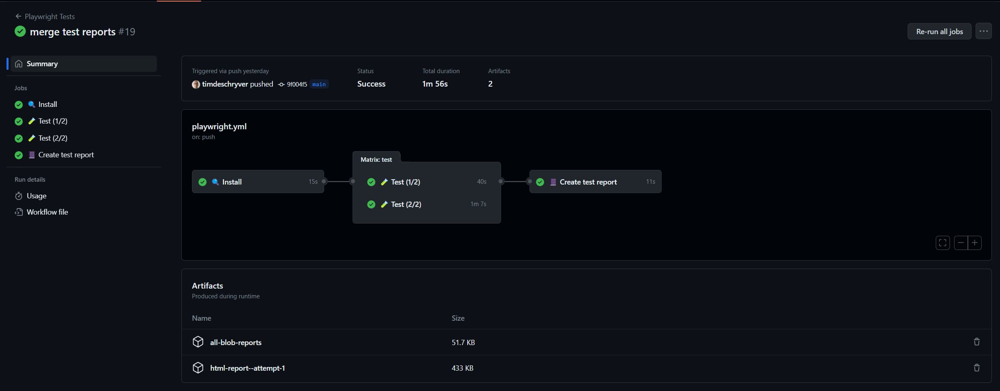

```yaml{72-78,80-107}:playwright.yml
name: Playwright Tests

on:
  push:
    branches: [main, master]
  pull_request:
    branches: [main, master]

jobs:
  install:
    timeout-minutes: 60
    name: 🔍 Install
    runs-on: ubuntu-latest
    steps:
      - uses: actions/checkout@v3
      - uses: actions/setup-node@v3

      - name: Cache node_modules
        uses: actions/cache@v3
        id: cache-node-modules
        with:
          path: |
            node_modules
          key: modules-${{ hashFiles('package-lock.json') }}

      - name: Cache Playwright binaries
        uses: actions/cache@v3
        id: cache-playwright
        with:
          path: |
            ~/.cache/ms-playwright
          key: playwright-${{ hashFiles('package-lock.json') }}

      - name: Install dependencies
        if: steps.cache-node-modules.outputs.cache-hit != 'true'
        run: npm ci

      - name: Install Playwright Browsers
        if: steps.cache-playwright.outputs.cache-hit != 'true'
        run: npx playwright install --with-deps

  test:
    name: 🧪 Test (${{ matrix.shard }}/${{ strategy.job-total }})
    needs: install
    timeout-minutes: 60
    runs-on: ubuntu-latest
    strategy:
      fail-fast: false
      matrix:
        shard: [1, 2]
    steps:
      - uses: actions/checkout@v3
      - uses: actions/setup-node@v3

      - name: Cache node_modules
        uses: actions/cache@v3
        with:
          path: |
            node_modules
          key: modules-${{ hashFiles('package-lock.json') }}

      - name: Cache Playwright
        uses: actions/cache@v3
        with:
          path: |
            ~/.cache/ms-playwright
          key: playwright-${{ hashFiles('package-lock.json') }}

      - name: Run Playwright tests
        run: npx playwright test --shard=${{ matrix.shard }}/${{ strategy.job-total }}

      - name: Upload report
        if: always()
        uses: actions/upload-artifact@v3
        with:
          name: all-blob-reports
          path: blob-report
          retention-days: 1

  create-report:
    name: 📔 Create test report
    if: always()
    needs: [test]

    runs-on: ubuntu-latest
    steps:
    - uses: actions/checkout@v3
    - uses: actions/setup-node@v3

    - name: Install dependencies
      run: npm ci

    - name: Download blob reports from GitHub Actions Artifacts
      uses: actions/download-artifact@v3
      with:
        name: all-blob-reports
        path: all-blob-reports

    - name: Merge into HTML Report
      run: npx playwright merge-reports --reporter html ./all-blob-reports

    - name: Upload HTML report
      uses: actions/upload-artifact@v3
      with:
        name: html-report--attempt-${{ github.run_attempt }}
        path: playwright-report
        retention-days: 7
```
