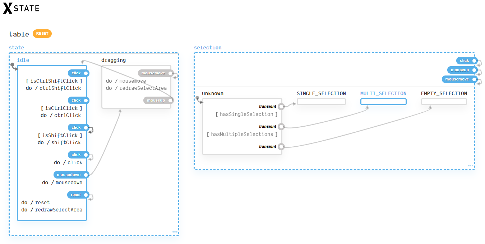

[XState](https://xstate.js.org/) is a JavaScript library created by [David K. 🎹](https://twitter.com/DavidKPiano).

> XState is a library for creating, interpreting, and executing statecharts. Statecharts are a formalism for modeling stateful, reactive systems. Computer scientist David Harel presented this formalism as an extension to state machines in his 1987 paper [Statecharts: A Visual Formalism for Complex Systems](https://www.inf.ed.ac.uk/teaching/courses/seoc/2005_2006/resources/statecharts.pdf).

My journey with XState started a year ago, after seeing David Khourshid's talk [Infinitely Better UIs with Finite Automata](https://www.youtube.com/watch?v=VU1NKX6Qkxc). What he said resonated with me. What really hit me, was that I was designing (UI state) in a bad way, that I made it myself complicated because I didn't know better. The highlighted example was a simple AJAX request, and to handle all of the possible scenarios the code becomes tangled real quick. David calls this the bottom-up (🍑🆙) approach.

What appealed to me in XState is that it felt familiar and as a nice extra, the code I saw from multiple demo's was that it was readable and easy to understand.
At first, I saw it as a declarative redux store, a store with a guard at the door to keep malicious types out of the store, instead of a store where the door is always wide open.
The only difference that was visible was that there were no reducers. With XState (or state machines in general), state is modified through transitions. The idea is slightly different, but the result remains the same, a new state. Now, after some proof of concepts I want to share what I like about XState.

## Why I like XState

- Harder to introduce "invalid" state
- Thinking about state and state transitions is the first step to build (part of) an application, it forces you think about the logic before writing code
- TypeScript, creating an XState machine is completely type safe
- It's possible to export a state machine to a state visualizer, where you can see all state transitions in one clear image
- State machines and statecharts aren't something new, the concept was already battle-tested before I was born
- Just like redux, state is deterministic
- The docs are well written and searchable so it's easy to find what you're looking for
- The logic can be understood and discussed with non-developers

## Reflection on initial thoughts

While the examples were easy to understand, it was harder to write my first machines. Because it's easy to see what's going on in a machine, without much code, in a human-readable way, the complexity to create a machine is hidden. It was new to me to write code in such a declarative manner, and it took some time to get used to it. Once the syntax was familiar it became a whole lot easier to write a machine, what takes the most time now, is to draw the model of the state and the transitions.

XState has some resembles with redux, but they're not the same.
Instead of having one global store where you dispatch all of your actions to, XState has multiple smaller stores (Actors) to send events to. This architecture is called the [Actor model](https://en.wikipedia.org/wiki/Actor_model). An actor holds state, can receive a message and decides what to do with the message, send messages to other actors, and create more actors.
The other difference is that a machine is really explicit, you can't end up in a bad state by accident. Whereas it's easier to find yourself in an invalid state with redux.
I believe having used a redux architecture before, certainly helped me to get started.

A nice benefit is that a machine is UI framework/library agnostic, it's not bound to a specific UI framework. It's possible to reuse the same machine in multiple UI frameworks, the difference is the view layer and how a user interacts with the view. All of the (business) logic is written once, in the machine. It lets you treat [UI as an afterthought](https://michel.codes/blogs/ui-as-an-afterthought) and this is what I hadn't thought of. That's why I wanted to create an experiment to create a machine and use it with Angular, React, Svelte and Vue. The table machine contains the logic of a table component.

## Demo project: [xstate-table](https://github.com/timdeschryver/xstate-table)

The [state visualizer](https://statecharts.github.io/xstate-viz/) of the table machine looks as follows:

On the left side of the picture, the state logic is visible. The table can be in an `idle` state and in a `dragging` state.
When the table is in the `idle` state, there are click actions and some of them have a guard clause. For example, the `ctrlClick` action will only be fired when the condition `isCtrlClick` is met. The "normal" click action will only be triggered when none of the other click guards are met.

There's also a `mousedown` action, which transitions the state from `idle` to `dragging`. While the table machine is in the `dragging` state, `mousemove` will manage the selected rows and will also trigger a new render of the select box with its new coordinates.

On the right side of the picture, you can see the selection state of the table machine. Every `click`, `mouseup` and `mousemove` action results in a new state: `SINGLE_SELECTION`, `MULTI_SELECTION`, or `EMPTY_SELECTION`.

In the code we can use these states to show the selectbox or to disable buttons.

The code can be found on [GitHub](https://github.com/timdeschryver/xstate-table), or in the following sandboxes:

- [Angular](https://stackblitz.com/edit/xstate-angular-table)
- [React](https://codesandbox.io/s/1dtmk)
- [Svelte](https://codesandbox.io/s/yb6lq)
- [Vue](https://codesandbox.io/s/707t4)

## Thoughts on the demo project

It was a simple experiment, but I'm happy with the results. Once the machine was written it was easy to implement the machine across the different frameworks, even when I'm not fluent in all of them. The documentation has a section on how to use a machine within a framework, these examples provided guidance to get started. For React, there is even a `@xstate/react` library that has a `useMachine` hook, which does all of the heavy lifting. Based on `useMachine`, I created a Svelte store. For Angular (RxJS) and Vue, the documentation provided an example.

For my experiment, the table machine was 100% reusable, so I'm calling this experiment a success. The one thing I changed with each framework is how the table rows were getting selected (used to determine if the row was within the select box). The default implementation with `document.querySelectorAll` did its job but each framework has its own way to `ref` an HTML element. I don't know why I wanted to use the implementation of the framework, I just wanted to know if I could.

I'm happy with the code, if I would come back to it in a few months I'm sure that I would want to change it here and there but the important part is that it will be readable.

## Ending word

XState is not a replacement to redux, I still like my redux. They both serve different needs. I see XState as a perfect place to put the logic of components. If I would have to create the same table component but without XState, I would've ended up with some messy code that would be hard to comprehend.

There is a learning curve but I would like you to give XState and statecharts a try in a throw-away project, or even in a production application. So far, I only used it to get familiar with it but I'm looking forward to using it in a production project. Even without having used it in a production project, I'm certain my code has improved just because I started looking at problems and state from a different perspective.

The initial cost to set up a state machine might take longer in comparison to imperative code. In the long run, when more features are added and (last minute) changes are requested, a state machine brings you a solid base to write and maintain your code.

For me, the most important points to use XState or statecharts would be that it's declarative and explicit, it's hard to create invalid state. The nice extra's that you get with it, is the tooling around it and the portability across frameworks.

## More resources

- [XState docs](https://xstate.js.org/)
- [Erik Mogensen - Welcome to the world of Statecharts](https://statecharts.github.io/)
- [David Khourshid - Reactive State Machines and Statecharts | Uphill Conf 2019](https://www.youtube.com/watch?v=GSHQFx7PG20)
- [David Khourshid - Simplifying Complex UIs with Finite Automata & Statecharts | JSConf Iceland 2018](https://www.youtube.com/watch?v=RqTxtOXcv8Y)
- [David Khourshid - Reactive State Machines and Statecharts | ReactiveConf 2018](https://www.youtube.com/watch?v=DrHccvns-L0)
- [Shawn McKay - Drawing Apps with XState v4 | React Van](https://www.youtube.com/watch?v=jw03YmNffks)
- [Learn With Jason - Let’s learn state machines with David K. Piano!](https://www.youtube.com/watch?v=czi24DqUfSA)
