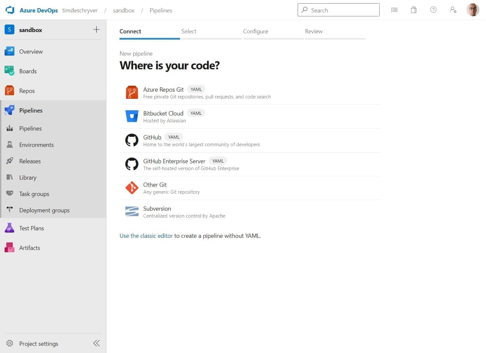
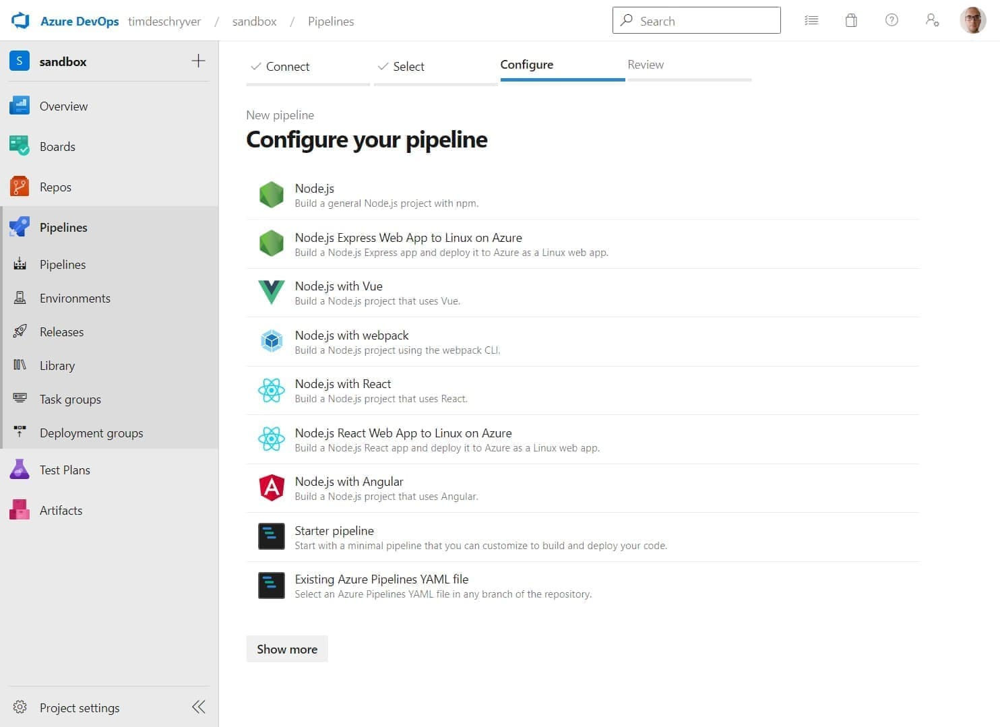
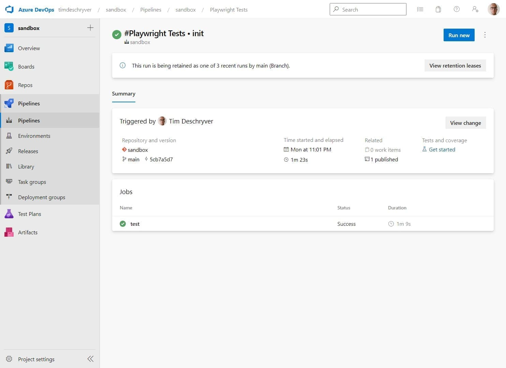
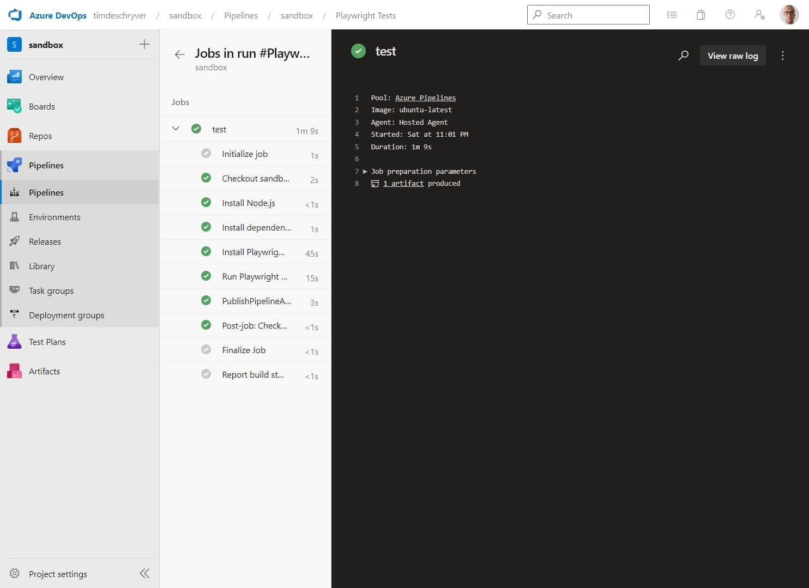
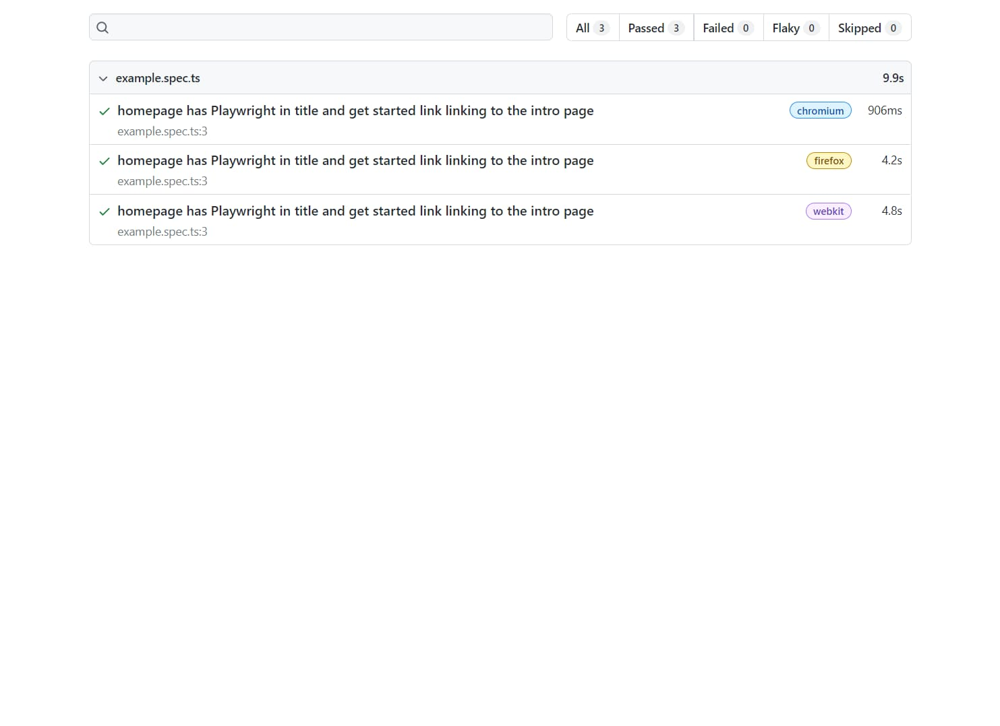

When you introduce [Playwright](https://playwright.dev/) in a codebase, you can use the `init` command to scaffold a fresh setup.

```bash
npm init playwright@latest
```

The scaffolding includes the installation of Playwright, a pre-configured setup, a sample test, and an optional GitHub Actions workflow.

In this post, the generated GitHub workflow is migrated into an Azure DevOps pipeline.
The pipeline installs Node.js, installs the dependencies (browsers included), runs the tests, and publishes the test artifact.
Because Playwright uses the CI environment variable to determine some behavior, we manually set this variable to `true` (this is done automatic via GitHub actions). If you don't set this variable, then the test reporter will continue to stay open after the tests are finished.

```yaml:.azure-pipeline/playwright.yml
name: Playwright Tests

variables:
  CI: true

trigger:
  - main

jobs:
  - job: test
    timeoutInMinutes: 60
    pool:
      vmImage: "ubuntu-latest"

    steps:
      - task: NodeTool@0
        inputs:
          versionSpec: "16.x"
        displayName: "Install Node.js"

      - script: |
          npm ci
        displayName: "Install dependencies"

      - script: |
          npx playwright install --with-deps
        displayName: "Install Playwright Browsers"

      - script: |
          npx playwright test
        displayName: "Run Playwright tests"

      - publish: $(System.DefaultWorkingDirectory)/playwright-report
        artifact: playwright-report
        # always create the artifact, this is useful for debugging failed tests
        condition: always()
```

Within GitHub, this pipeline is automatically run when new commits are pushed to the `main` branch of the repository.
With Azure DevOps, the pipeline needs to first be manually created before it can be triggered.

To do so, go to the pipeline pages and create a new pipeline.
On this page select "Azure Repos Git", then select your repository.



Next, select the "Existing Azure Pipelines YAML file" option and selected the above file if it's already pushed.
Otherwise, select "Start pipeline" and copy-paste the above YAML into the editor.



The resulting pipeline should look like this:


Now, you can click on "Run pipeline" to run the pipeline for the first time.
When the pipeline is completed, it should give you the "success" page.



To view the test results, click on the "test" job.



Lastly, you can download the test artifacts to see the test results.



With the next push to the `main` branch, the pipeline will be automatically triggered.
Happy testing!
