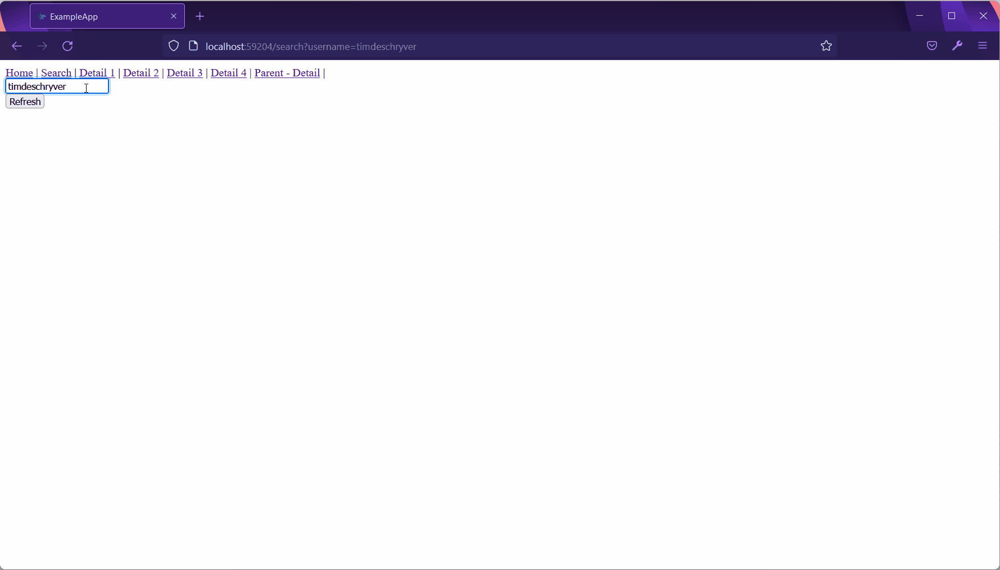
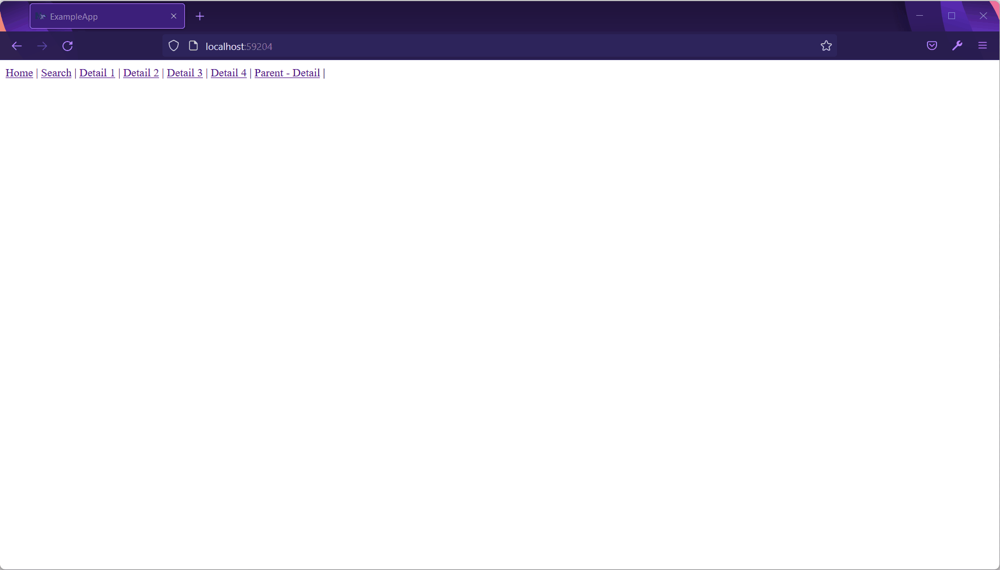

I find that we write a lot of the same code for components that just fetch data and render the result.
This also sounds like a trivial job, but in reality, keeping the client state in sync with the server state has a couple of catches and things can get more complicated than expected.

That's why I was thinking about how we can simplify and unify this process. Meanwhile, I also want to make the pit of success wider, and therefore this solution should be robust and include helpful utilities.

The idea takes inspiration from react-query, swr, and multiple routes implementations from SvelteKit and other frameworks built on top of React. I call it [ngx-query-state](https://github.com/timdeschryver/query-state/).

The main idea is to make working with HTTP requests easier and to provide a better experience to the users.
From the technical side, the component needs to configure how it wants to make HTTP requests, the rest are implementations details, which are abstracted in ngx-query-state.

Let's take a look at the most basic example, a component that displays the result of an HTTP request.
The component provides the service in which it makes an HTTP request with [`provideQueryState`](https://github.com/timdeschryver/query-state/blob/main/docs/api/query-state.providequerystate.md) and as a result, the [`QueryState` instance](https://github.com/timdeschryver/query-state/blob/main/docs/api/query-state.querystate.md) is injected into the component.

On `QueryState`, we can access the HTTP response with the `data$` Observable. This is used in the example below to render the collection of customers.

```ts{6-11, 13-15, 18}
import { QueryState, provideQueryState } from 'query-state';

@Component({
    selector: 'example-customers',
    template: `
        <div *ngFor="let customer of (queryState.data$ | async)?.data">
            <div>{{ customer.id }}</div>
            <div>{{ customer.name }}</div>
            <div>{{ customer.address }}</div>
            <a [routerLink]="[customer.id]">Details</a>
        </div>
    `,
    providers: provideQueryState(CustomersService, {
        name: CustomersComponent.name,
    }),
})
export class CustomersComponent {
    constructor(public readonly queryState: QueryState<Customer[]>) {}
}
```

While the above is going to render the customers, it doesn't take into account that the request can fail.
Nor, does it has any indication that a request is pending and waiting for its result.
When this happens, the user just gets to see an empty screen.

We can write a more robust implementation to provide a better experience.
ngx-query-state provides a `query-state-template` component and the `qsIdle`, `qsLoading`, and `qsError` directives. Based on the state of the request, the corresponding template is rendered. This way, we can represent the current state to the user.

```ts{6-23}
import { QueryState, provideQueryState } from 'query-state';

@Component({
    selector: 'example-customers',
    template: `
        <query-state-template [queryState]="queryState.data$">
            <ng-template qsLoading>
                <div>Loading...</div>
            </ng-template>

            <ng-template [qsIdle]="queryState.data$" let-customers>
                <div *ngFor="let customer of customers">
                    <div>{{ customer.id }}</div>
                    <div>{{ customer.name }}</div>
                    <div>{{ customer.address }}</div>
                    <a [routerLink]="[customer.id]">Details</a>
                </div>
            </ng-template>

            <ng-template qsError let-error>
                <div>{{ error | translateError }}</div>
            </ng-template>
        </query-state-template>
    `,
    providers: provideQueryState(CustomersService, {
        name: CustomersComponent.name,
    }),
})
export class CustomersComponent {
    constructor(public readonly queryState: QueryState<Customer[]>) {}
}
```

Though, this has a few drawbacks.
This can get repetitive, the template looks bloated, and it's also hard to create the same behavior across multiple components.
To keep this as simple as possible, you can implement your own loading and error templates, which are used as the default templates but can still be overwritten in specific cases.

For example, a custom loading component looks like this.

```ts
import { LoadingTemplateComponent } from 'query-state';

@Component({
	selector: 'example-loading',
	template: `
		<div>
			<loading></loading>
			{{ retries ? 'this is taking a little longer than expected... ( ' + retries + ' )' : '' }}
		</div>
	`,
})
export class CustomLoadingComponent implements LoadingTemplateComponent {
	retries?: number;
}
```

This component can then be configured as the default loading component.
The same can be done for the error component.
To do this, provide your component to the `QUERY_STATE_LOADING_COMPONENT` and `QUERY_STATE_ERROR_COMPONENT` tokens.

```ts{8-17}
import {
  QUERY_STATE_ERROR_COMPONENT,
  QUERY_STATE_LOADING_COMPONENT,
} from 'query-state';

@NgModule({
    declarations: [AppComponent],
    providers: [
        {
            provide: QUERY_STATE_LOADING_COMPONENT,
            useValue: CustomLoadingComponent,
        },
        {
            provide: QUERY_STATE_ERROR_COMPONENT,
            useValue: CustomErrorComponent,
        },
    ],
    bootstrap: [AppComponent],
})
export class AppModule {}
```

With the default components set, the components that render the data can be refactored, leaving just the essentials.

```ts{6-23}
import { QueryState, provideQueryState } from 'query-state';

@Component({
    selector: 'example-customers',
    template: `
        <query-state-template [queryState]="queryState.data$">
            <ng-template [qsIdle]="queryState.data$" let-customers>
                <div *ngFor="let customer of customers">
                    <div>{{ customer.id }}</div>
                    <div>{{ customer.name }}</div>
                    <div>{{ customer.address }}</div>
                    <a [routerLink]="[customer.id]">Details</a>
                </div>
            </ng-template>
        </query-state-template>
    `,
    providers: provideQueryState(CustomersService, {
        name: CustomersComponent.name,
    }),
})
export class CustomersComponent {
    constructor(public readonly queryState: QueryState<Customer[]>) {}
}
```

Until now, we haven't seen the service that invokes the HTTP request.
This service is just your normal HTTP wrapper service but it also implements the [`QueryService` interface](https://github.com/timdeschryver/query-state/blob/main/docs/api/query-state.queryservice.md), which has the `query` method that gets invoked from the `QueryState` instance.

```ts{9-11}
import { QueryService } from 'query-state';

@Injectable({
    providedIn: 'root',
})
export class CustomersService implements QueryService {
    constructor(private http: HttpClient) {}

    query(): Observable<Customer[]> {
        return this.http.get<Customer[]>(`${environment.url}/customers`);
    }
}
```

The basics are covered, so let's add a search parameter to customers' query.

To implement this, add an input control to the HTML template and pass the `valueChanges` Observable to the `queryState.update` method. Now, when the input changes the query method is re-invoked with the updated search parameters.
As a side-effect, the URL is also updated and includes all the search parameters.
I find this useful because it creates shareable links, and makes it easier to take a look at the trace logs.

```ts{6-8,32}
import { QueryState, provideQueryState } from 'query-state';

@Component({
    selector: 'example-customers',
    template: `
        <form>
            <input type="text" name="name" [ngModel]="name" required />
        </form>
        <query-state-template [queryState]="queryState.data$">
            <ng-template [qsIdle]="queryState.data$" let-customers>
                <div *ngFor="let customer of customers">
                    <div>{{ customer.id }}</div>
                    <div>{{ customer.name }}</div>
                    <div>{{ customer.address }}</div>
                    <a [routerLink]="[customer.id]">Details</a>
                </div>
            </ng-template>
        </query-state-template>
    `,
    providers: provideQueryState(CustomersService, {
        name: CustomersComponent.name,
    }),
})
export class CustomersComponent implements AfterViewInit {
    @ViewChild(NgForm) form!: NgForm;
    name = this.queryState.queryParams.name || '';

    constructor(public readonly queryState: QueryState<Customer[]>) {}

  ngAfterViewInit(): void {
    if (this.form.valueChanges) {
      this.queryState.update(this.form.valueChanges.pipe(debounceTime(500)));
    }
  }
}
```

Because the search includes a name parameter the query service also needs to be updated.
The `query` method receives the `QueryParams`, which include the URL params and query params.

```ts{9,11-13}
import { QueryService, QueryParams } from 'query-state';

@Injectable({
    providedIn: 'root',
})
export class CustomersService implements QueryService {
    constructor(private http: HttpClient) {}

    query(params: QueryParams): Observable<Customer[]> {
        return this.http.get<Customer[]>(`${environment.url}/customers`, {
            params: {
                name: params.queryParams['name'],
            },
        });
    }
}
```

Most applications also contain screens to modify an entity.
For this, the service is re-exposed via the `QueryState`.
Via the re-exposed service, it becomes possible to invoke the methods of the service.

Because these methods mostly return observables, there's the `effect` method to automatically handle subscriptions.
When the component is destroyed, all subscriptions are also cleaned up.

With the re-exposed service in combination with the `effect` method, we can implement side-effects, e.g. updating an entity.

```ts{16-25}
import { QueryState, provideQueryState } from 'query-state';

@Component({
    selector: 'example-customers',
    template: '...',
    providers: provideQueryState(CustomersService, {
        name: CustomersComponent.name,
    }),
})
export class CustomersComponent implements AfterViewInit {
    constructor(
        public readonly queryState: QueryState<Customer[], CustomersService>,
        private router: Router,
    ) {}

    submit(): void {
        this.queryState.effect(
            this.queryState.service.update({
                firstname: this.model.firstname,
                id: this.model.id,
                lastname: this.model.lastname,
            }),
            () => this.router.navigate(['/customers']),
        );
    }
}
```

We've seen the most important helpers that ngx-query-state offers.
Besides these helpers, ngx-query-state also includes the following features (that can be configured):

- ✅ Caching - render the cached version while it's refreshed in the background
- ✅ Retry - automatically retry a failed query 3 times with exponential backoff
- ✅ Revalidation - revalidate the current version on time intervals, screen focus, online detection

Consider this as a proof of concept, and feel free to try out [ngx-query-state](https://github.com/timdeschryver/query-state) in your own projects, or in the examples included in the repository.

Feedback is welcome so let me know what you think via [Twitter](https://twitter.com/tim_deschryver) or [GitHub](https://github.com/timdeschryver/query-state)!
What can be improved, what are you missing, would you use it, ...

Use the following command to install ngx-query-state to your project.

```bash
npm install ngx-query-state
```

### Examples





### Playground

<iframe src="https://stackblitz.com/github/timdeschryver/query-state" title="query-state"
></iframe>
