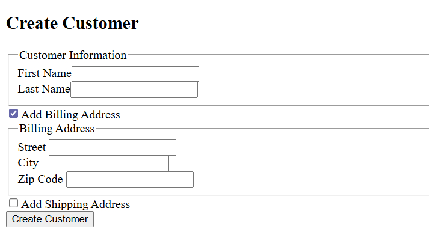

In this blog post we will refactor an existing Angular form to use the new Signal Forms feature, which will be introduced in Angular 21 as an experimental feature. This won't be a detailed introduction to Signal Forms, for that I highly recommend looking at the [Extra Resources](#extra-resources) section at the end of this post, these resources have helped me during the refactoring process.

Signal forms is a new way to build forms in Angular, it leverages signals to provide a more declarative and efficient way to manage form state and validation.
Compared to the already existing Template Driven Forms and Reactive Forms, Signal Forms leans more towards the Reactive Forms approach, but uses Signals instead of Observables. This change in underlying technology allows for a more seamless integration with Angular's reactivity model and change detection.
With the addition of Signal Forms, the Angular team took the opportunity to rethink and redesign the forms API.

The example form is a small form with a first and last name field, both required.
It also consists of two optional address groups (for billing and shipping), which are only shown when the corresponding checkbox is checked.
Putting my best designer hat on, the form looks like this:



## Creating the Form

Because I'm #TeamTemplateDrivenForms, the original form was built using that approach. This means that the form is mostly defined within the HTML template, including the validation rules. Only the model is defined on the TypeScript side.

Using Signal Forms, the form is defined entirely in the TypeScript code, and the HTML template is only used to bind the form fields to the UI elements.
To create the form, use the `form` function from the `@angular/forms/signals` package that takes the form model as an argument (this needs to be a signal).
I like to create a separate method to initialize the form model, which can be reused to reset the form later on.

```typescript [name=customer-form.component.ts] [source=https://github.com/timdeschryver/Sandbox/blob/main/Sandbox.AngularWorkspace/projects/sandbox-app/src/app/customer-management/customer-form/customer-form.ts]
@Component({...})
export class CustomerForm {
	protected readonly customerForm = form(signal(this.initializeCustomerModel()));

	private initializeCustomerModel(): CustomerFormModel {
		return {
			firstName: '',
			lastName: '',
			hasBillingAddress: false,
			billingAddress: {
				city: '',
				street: '',
				zipCode: '',
			},
			hasShippingAddress: false,
			shippingAddress: {
				city: '',
				street: '',
				zipCode: '',
				note: '',
			},
		};
	}
}
```

Within the HTML template, the model properties are bound to form fields using the `field` directive. This requires us to import the `Field` directive from `@angular/forms/signals` and add it to the `imports` array of the component decorator.

This translates to the following HTML:

:::code-group

```html [title=Template] [highlight=6,11] [name=customer-form.component.html] [source=https://github.com/timdeschryver/Sandbox/blob/main/Sandbox.AngularWorkspace/projects/sandbox-app/src/app/customer-management/customer-form/customer-form.html]
<form novalidate>
	<fieldset>
		<legend>Customer Information</legend>
		<div>
			<label for="firstName">First Name</label>
			<input id="firstName" type="text" [field]="customerForm.firstName" />
		</div>

		<div>
			<label for="lastName">Last Name</label>
			<input id="lastName" type="text" [field]="customerForm.lastName" />
		</div>
	</fieldset>
</form>
```

```ts [title=Component] [highlight=2] [name=customer-form.component.ts] [source=https://github.com/timdeschryver/Sandbox/blob/main/Sandbox.AngularWorkspace/projects/sandbox-app/src/app/customer-management/customer-form/customer-form.ts]
@Component({
	imports: [Field],
})
export class CustomerForm {
	protected readonly customerForm = form(signal(this.initializeCustomerModel()));

	private initializeCustomerModel(): CustomerFormModel {
		return {
			firstName: '',
			lastName: '',
			hasBillingAddress: false,
			billingAddress: {
				city: '',
				street: '',
				zipCode: '',
			},
			hasShippingAddress: false,
			shippingAddress: {
				city: '',
				street: '',
				zipCode: '',
				note: '',
			},
		};
	}
}
```

:::

## Validation

Of course, a form isn't very useful without validation.
With Signal Forms, validation rules are defined within the second argument of the `form` function.

This is a callback function that provides a `path` parameter that is the root level of the given form model.
Via the `path` variable you can access all the form fields and groups to define validation rules.

The rules themselves are similar to the ones used in Reactive Forms, but are standalone functions that are imported from the `@angular/forms/signals` package.
In the example below, we only use the `required` and `maxLength` validators, but there are more built-in validators available, and you can also create custom validators. At the time of writing this, the built-in validators are: `required`, `minLength`, `maxLength`, `min`, `max`, `pattern`, and `email`.

```typescript [highlight=3-12] [name=customer-form.component.ts] [source=https://github.com/timdeschryver/Sandbox/blob/main/Sandbox.AngularWorkspace/projects/sandbox-app/src/app/customer-management/customer-form/customer-form.ts]
@Component({...})
export class CustomerForm {
	protected readonly customerForm = form(signal(this.initializeCustomerModel()), (path) => {
		// Can also set a specific error message
		required(path.firstName, { message: 'First name is required' });
		maxLength(path.firstName, 255);
		required(path.lastName);
		// Can also set a dynamic max length
		maxLength(path.lastName, (lastName) => {
			return lastName.value() ? 255 : 0;
		});
	});

	private initializeCustomerModel(): CustomerFormModel {
		return {
			firstName: '',
			lastName: '',
			hasBillingAddress: false,
			billingAddress: {
				city: '',
				street: '',
				zipCode: '',
			},
			hasShippingAddress: false,
			shippingAddress: {
				city: '',
				street: '',
				zipCode: '',
				note: '',
			},
		};
	}
}
```

The validation is enabled by default, but it's possible to add a condition to only enable the validation when certain criteria are met. An example follows in the [Nested Groups](#nested-groups) section.

The errors are exposed on each field via the `errors` property, which is a signal that emits the current validation errors (if there are no errors the collection is empty). The error is expressed as a [`ValidationErrors` object](https://github.com/angular/angular/blob/main/packages/forms/signals/src/api/validation_errors.ts#L309) that contains a `kind` (identifies the kind of error), the `field` (the field associated with this error), and an optional `message` (human readable error message) property.

```ts [name=validation_errors.ts] [source=https://github.com/angular/angular/blob/main/packages/forms/signals/src/api/validation_errors.ts]
export interface ValidationError {
	/** Identifies the kind of error. */
	readonly kind: string;
	/** The field associated with this error. */
	readonly field: FieldTree<unknown>;
	/** Human readable error message. */
	readonly message?: string;
}
```

To display the errors in the UI, we can loop over the `errors` collection and display each error message.
To keep it simple, this example just displays the JSON representation of the error object.
In a real-world application, I would recommend creating a dedicated component to display the errors in a more user-friendly way, or use a directive to dynamically for each field like I did in my [Sandbox application](https://github.com/timdeschryver/Sandbox/blob/main/Sandbox.AngularWorkspace/projects/form-validation-lib/src/lib/error.ts).

```angular-html [highlight=4-6] [name=customer-form.component.html] [source=https://github.com/timdeschryver/Sandbox/blob/main/Sandbox.AngularWorkspace/projects/sandbox-app/src/app/customer-management/customer-form/customer-form.html]
<div>
	<label for="firstName">First Name</label>
	<input id="firstName" type="text" [field]="customerForm.firstName" />
	@for (error of customerForm.firstName().errors(); track $index) {
		<div>{{ error | json }}</div>
	}
</div>
```

To check the validatity of a field, use the `valid`, `invalid`, and `pending` (useful for async validation) signals.
There is no `status` property to get the current state as a string.

### Differences

At runtime, there are some differences compared to the existing form implementations:

- The validators are added to the input element as attributes, e.g. `required` and `maxlength`.
- The name attribute is automatically generated based on the form field's path within the form model. This ensures that each form field has a unique name, which is important for form submission and accessibility.
- There are no classes added to the input element to indicate the validation state (`ng-valid` and `ng-invalid`, `ng-touched`, etc.).

```html [name=generated-output.html]
<input id="firstName" type="text" name="ng.form0.firstName" required="" maxlength="255" />
```

### Field states

Each form field has a set of signals to track its state, such as `touched` (there is no `untouched` counterpart), `dirty` (there is no `pristine` counterpart), `disabled`, `readonly`, and `hidden`. Just as we're used to, the form field updates the `touched` and `dirty` states automatically based on user interaction. There are also the `markAsTouched()` and `markAsDirty()` methods to update the state programmatically.

Similar to how we define the validation rules, the conditions for the `disabled`, `readonly`, and `hidden` states are be defined within the second argument of the `form` function.

```typescript [highlight=9-16] [name=customer-form.component.ts] [source=https://github.com/timdeschryver/Sandbox/blob/main/Sandbox.AngularWorkspace/projects/sandbox-app/src/app/customer-management/customer-form/customer-form.ts]
@Component({...})
export class CustomerForm {
	protected readonly customerForm = form(signal(this.initializeCustomerModel()), (path) => {
		required(path.firstName);
		maxLength(path.firstName, 255);
		required(path.lastName);
		maxLength(path.lastName, 255);

		// Always
		disabled(path.firstName);
		// Based on a condition
		readonly(path.lastName, (lastName) => {
			return lastName.value() === 'Tim'
		});
		// Based on a different property in the form
		hidden(path.shippingAddress, (logic) => !logic.valueOf(path.hasShippingAddress));;
	});

	private initializeCustomerModel(): CustomerFormModel {
		return {
			firstName: '',
			lastName: '',
			hasBillingAddress: false,
			billingAddress: {
				city: '',
				street: '',
				zipCode: '',
			},
			hasShippingAddress: false,
			shippingAddress: {
				city: '',
				street: '',
				zipCode: '',
				note: '',
			},
		};
	}
}
```

### Differences

Just as with validation, these states affect the input element at runtime:

- The `disabled` and `readonly` states are reflected as attributes on the input element. If these conditions are set to a parent group, they are applied to all child fields. The `hidden` state does not affect the input element, it's up to you to hide the element in the UI based on this state
- Again, there are no classes added to the input element to indicate the state (`ng-touched`, `ng-dirty`, `ng-pristine`, etc.).

## Nested groups

The example form contains two nested groups for the billing and shipping address.
Both have the same structure (city, street, and zip code), but the shipping address has an additional note field.
Instead of repeating the same code twice, we can create some reusable components for the address fields.

The first part is that we can use the `schema` function to define the structure and validation rules for an address. This function takes a callback that provides a `path` parameter, similar to the one used in the `form` function.

```typescript [name=customer-form.component.ts] [source=https://github.com/timdeschryver/Sandbox/blob/main/Sandbox.AngularWorkspace/projects/sandbox-app/src/app/customer-management/customer-form/customer-form.ts]
const addressSchema = schema<Address>((path) => {
	required(path.street);
	minLength(path.street, 3);
	required(path.city);
	minLength(path.city, 3);
	required(path.zipCode);
	minLength(path.zipCode, 3, { message: 'Zip code must be between 3 and 5 characters long.' });
	maxLength(path.zipCode, 5, { message: 'Zip code must be between 3 and 5 characters long.' });
});
```

Next, we can apply this schema to both address groups in the main form definition.
Because the billing and shipping address are only applicable when the corresponding checkbox is checked, the `address` `schema` is only applied when the checkbox is checkbox. In code we use the `applyWhen` function for this, if the schema can always be applied, use the `apply` function instead.

```typescript [highlight=9-10, 12-16] [name=customer-form.component.ts] [source=https://github.com/timdeschryver/Sandbox/blob/main/Sandbox.AngularWorkspace/projects/sandbox-app/src/app/customer-management/customer-form/customer-form.ts]
@Component({...})
export class CustomerForm {
	protected readonly customerForm = form(signal(this.initializeCustomerModel()), (path) => {
		required(path.firstName);
		maxLength(path.firstName, 255);
		required(path.lastName);
		maxLength(path.lastName, 255);

		hidden(path.billingAddress, (logic) => !logic.valueOf(path.hasBillingAddress));
		applyWhen(path.billingAddress, (logic) => logic.valueOf(path.hasBillingAddress), addressSchema);

		hidden(path.shippingAddress, (logic) => !logic.valueOf(path.hasShippingAddress));
		applyWhen(path.shippingAddress, (logic) => logic.valueOf(path.hasShippingAddress), addressSchema);
		minLength(path.shippingAddress.note, (logic) => {
			return logic.value() ? 10 : 0;
		});
	});

	private initializeCustomerModel(): CustomerFormModel {
		return {
			firstName: '',
			lastName: '',
			hasBillingAddress: false,
			billingAddress: {
				city: '',
				street: '',
				zipCode: '',
			},
			hasShippingAddress: false,
			shippingAddress: {
				city: '',
				street: '',
				zipCode: '',
				note: '',
			},
		};
	}
}
```

In the example above you can also see the usage of the `hidden` function to hide the address groups when the corresponding checkbox is not checked.
This makes it easy to manage the visibility of the groups based on the form state, instead of adding custom logic in the HTML template.

Lastly, we can create a reusable component for the address fields that takes an address as input.
While defining the input, the `Property` type is used. To be honest, I don't know if this is the best approach, but I like the simplicity of it.

The HTML of the address sub form is identical to the fields of the main form.

:::code-group

```typescript [title=Component] [name=customer-address.component.ts] [source=https://github.com/timdeschryver/Sandbox/blob/main/Sandbox.AngularWorkspace/projects/sandbox-app/src/app/customer-management/shared/customer-address/customer-address.ts]
@Component({...})
export class CustomerAddress {
	public readonly address = input.required<Property<Address>>();
}
```

```html [title=Template] [name=customer-address.component.html] [source=https://github.com/timdeschryver/Sandbox/blob/main/Sandbox.AngularWorkspace/projects/sandbox-app/src/app/customer-management/shared/customer-address/customer-address.html]
<div>
	<label
		>Street
		<input type="text" [field]="address().street" />
	</label>
</div>

<div>
	<label>
		City
		<input type="text" [field]="address().city" />
	</label>
</div>

<div>
	<label
		>Zip Code
		<input type="text" [field]="address().zipCode" />
	</label>
</div>

<ng-content />
```

:::

The main form HTML now uses this component for both address groups, passing the corresponding address as input.
These address groups are only shown when the corresponding checkbox is checked, based on the `hidden` state of the group.

```angular-html [highlight=22-27, 35-45] [name=customer-form.component.html] [source=https://github.com/timdeschryver/Sandbox/blob/main/Sandbox.AngularWorkspace/projects/sandbox-app/src/app/customer-management/customer-form/customer-form.html]
<form novalidate>
	<h2>Create Customer</h2>

	<fieldset>
		<legend>Customer Information</legend>
		<div>
			<label for="firstName">First Name</label>
			<input type="text" [field]="customerForm.firstName" />
		</div>

		<div>
			<label for="lastName">Last Name</label>
			<input id="lastName" type="text" [field]="customerForm.lastName" />
		</div>
	</fieldset>

	<div>
		<input type="checkbox" id="hasBillingAddress" [field]="customerForm.hasBillingAddress" />
		<label for="hasBillingAddress">Add Billing Address</label>
	</div>

	@if (!customerForm.billingAddress().hidden()) {
		<fieldset>
			<legend>Billing Address</legend>
			<sandbox-customer-address [address]="customerForm.billingAddress" />
		</fieldset>
	}

	<div>
		<input type="checkbox" id="hasShippingAddress" [field]="customerForm.hasShippingAddress" />
		<label for="hasShippingAddress">Add Shipping Address</label>
	</div>

	@if (!customerForm.shippingAddress().hidden()) {
		<fieldset>
			<legend>Shipping Address</legend>
			<sandbox-customer-address [address]="customerForm.shippingAddress">
				<div>
					<label for="note">Note</label>
					<textarea id="note" [field]="customerForm.shippingAddress.note"></textarea>
				</div>
			</sandbox-customer-address>
		</fieldset>
	}
</form>
```

The `note` property also shows that we can traverse into nested groups to bind fields to the UI elements.

## Submitting the Form

There are also some changes regarding form submission.
The form submission is handled by listening to the `submit` event of the form element, and passes the click event to the handler method.
In the following example you can also notice that the `submitting` signal is used to disable the submit button while the form is being submitted.

```angular-html [name=customer-form.component.html] [source=https://github.com/timdeschryver/Sandbox/blob/main/Sandbox.AngularWorkspace/projects/sandbox-app/src/app/customer-management/customer-form/customer-form.html]
<form novalidate (submit)="submmitCustomerForm($event)">
	<button type="submit" [disabled]="customerForm().submitting()">
		@if (customerForm().submitting()) {
			Creating Customer
		} @else {
			Create Customer
		}
	</button>
</form>
```

The `submitting` signal is managed by Angular. To trigger the submit action, the `submit` function from the `@angular/forms/signals` package is used. This function takes the form signal and a callback that contains the logic to execute the form submission. Within the callback, the form is passed as an argument.

Important to note is that the callback is only invoked when the form is valid. If the form is invalid, the callback is not invoked, and the `submitting` signal remains `false`.

Before invoking the callback, the `submit` method sets the `submitting` signal to `true`, and once the callback completes (either successfully or with an error), it resets the `submitting` signal back to `false`.
It also marks all fields, including the form itself, as touched and dirty.

Because the `submit` function is a `Promise`, we must `await` it.

```typescript [name=customer-form.component.ts] [source=https://github.com/timdeschryver/Sandbox/blob/main/Sandbox.AngularWorkspace/projects/sandbox-app/src/app/customer-management/customer-form/customer-form.ts]
@Component({...})
export class CustomerForm {
	protected async submmitCustomerForm(event: Event): Promise<void> {
		event.preventDefault();

		await submit(this.customerForm, async (form) => {
			const formValue = form().value();
			return await firstValueFrom(
				this.customersService
					.createCustomer({
						firstName: formValue.firstName,
						lastName: formValue.lastName,
						// Extra check to clear previously filled fields when checkbox is unchecked
						billingAddress: formValue.hasBillingAddress
							? {
									city: formValue.billingAddress.city,
									street: formValue.billingAddress.street,
									zipCode: formValue.billingAddress.zipCode,
								}
							: null,
						// Extra check to clear previously filled fields when checkbox is unchecked
						shippingAddress: formValue.hasShippingAddress
							? {
									city: formValue.shippingAddress.city,
									street: formValue.shippingAddress.street,
									zipCode: formValue.shippingAddress.zipCode,
									note: formValue.shippingAddress.note ? formValue.shippingAddress.note : null,
								}
							: null,
					})
					.pipe(
						map(() => {
							form().reset();
							form().value.set(this.initializeCustomerModel());
							return null;
						}),
						catchError((error: unknown): Observable<OneOrMany<WithOptionalField<ValidationError>>> => {
							return of({
								kind: 'server',
								message:
									error instanceof HttpErrorResponse
										? error.error.title
										: 'An unexpected error occurred, please try again.',
							});
						}),
					),
			);
		});
```

In the previous example, the form data is sent to a backend service using an `HttpClient` call.
Because the `submit` is asynchronous, and the HTTP call returns an `Observable`, we must convert it to a `Promise`. To do this, I used the `firstValueFrom` function from `rxjs`, which resolves the `Promise` with the first emitted value from the `Observable`.

If the HTTP call is successful, the form is reset to its initial state using the `reset()` method, this resets all field states (touched, dirty, validations) of the form.
However, it does not reset the form value, so it's value is reset manually by calling the `set` method of the `value` signal.

If the HTTP call fails, the error is caught using the `catchError` operator from `rxjs`, and a server-side validation error is returned. This error is automatically added to the form's `errors` collection, and can be displayed in the UI.

The form itself also has a collection of its own `errors`. Which can be useful, but more useful is the ability to access all the errors including those its child fields. With the new signal forms, we can access these errors directly via the `errorSummary` signal, which is also available on each field and group.
Just as with the errors of a field, the summary is a collection of `ValidationError` objects, which can easily be traversed and displayed within the UI.

```angular-html [name=customer-form.component.html] [source=https://github.com/timdeschryver/Sandbox/blob/main/Sandbox.AngularWorkspace/projects/sandbox-app/src/app/customer-management/customer-form/customer-form.html]
@if (customerForm().touched() && customerForm().invalid()) {
	<h3>Validation summary:</h3>
	<ul>
		@for (error of customerForm().errorSummary(); track $index) {
			<li>{{ error | json }}</li>
		}
	</ul>
}
```

### Differences

If you have payed close attention to the `submit` snippets you might have spotted the [`novalidate` attribute](https://developer.mozilla.org/en-US/docs/Web/API/HTMLFormElement/noValidate) on the form element, as well as the `event.preventDefault()` call in the submit handler.

This is done to prevent the browser's built-in validation from interfering with Angular's validation. Because the validators are added as attributes to the input elements, the browser automatically validate the form before it can submit, which is not desired in this case. With template driven forms or reactive forms, Angular prevents this automatically.

## Additional notes

Some extra thoughts while I was looking at the documentation and playing around with Signal Forms, but didn't fit in the previous sections.

- In the form model you can see that every field is initialized with a default value, and not with `null` or `undefined`. This is is done on purpose, because otherwise the signal definitions are harder to type correctly. It can also act finicky, while binding it to a field. This keeps accessing the field values simple and type-safe.
- Instead of creating a custom validator, it's possible to use the `error` function to define a custom validation rule directly within the form definition. This can be useful in scenarios where the validation logic is simple and doesn't need to be reused elsewhere.

```ts [name=customer-form.component.ts] [source=https://github.com/timdeschryver/Sandbox/blob/main/Sandbox.AngularWorkspace/projects/sandbox-app/src/app/customer-management/customer-form/customer-form.ts]
error(
	customerForm.firstName,
	({ value }) => !/^[a-z]+$/i.test(value()),
	'Alphabet characters only',
);
```

- Each field has a unique name that is automatically generated based on its path within the form model. This is a huge improvement for accessibility concerns, as it can serve to bind elements like labels and error messages to the corresponding form fields.
- It seems simpler to create cross-field validation rules and async validation rules, for more info see Manfred Steyer's blog post in the [Extra Resources](#extra-resources) section.

## Conclusion

Signal Forms aims to simplify the API and improve performance by reducing the amount of boilerplate code needed to manage the form.
By fiddling around using this small form that contains some often-used logic, I can see the potential of Signal Forms to become my go-to approach for building forms in Angular applications. While it's still in an experimental stage, it does already contains many features to build complex forms. While it can and will evolve over time, I would already consider it for applications that are not used in production environments.

One of the main reasons I like the new API is the conditional logic that can be applied to validation rules and field states. This makes it easy to manage complex forms with dynamic behavior. This was the main reason I was #TeamTemplateDrivenForms.

I also like that the form definition is now entirely in the TypeScript code, which makes it easier to reason about. The whole form is now defined in one place, instead of being split between the HTML template and the TypeScript code. I can also see that this can make it easier to test the form logic, as you're not required to render the HTML template to test the form (allthough I don't do this, and I also don't recommend it, see [Angular Testing Library](https://timdeschryver.dev/blog?q=angular+testing+library) for the reasons behind it).

The benefit it has over Reactive Forms is that it's now built on top of Signals, which are more efficient than Observables for this use case as it needs to react on state changes (and not on events).

Because I test my forms from a user's perspective, this change to Signal Forms didn't affect my testing approach. The removal of the `ng-` classes did not affect my tests. On the other hand, it makes it a harder to style the form based on its state. Maybe that this is a feature that will be added in the future.

There's one point that I don't like.
I'm not a big fan of the validation attributes being added to the input elements. For example, the `maxlength` attribute is added to the input element, which will cut off the input when the user reaches the maximum length. This can be frustrating for users, especially when they paste a long text and don't notice that it has been cut off. I would prefer to have more control over this behavior, for example by providing an option to disable this feature. Maybe that this already exists, but I haven't come across it yet.

This makes me now in the camp of #TeamSignalForms.

The code used within this blog post can be accessed in [repository](https://github.com/timdeschryver/Sandbox/tree/main/Sandbox.AngularWorkspace) (this will continue to change with the new versions), or you can also check out the [commit in which I refactored](https://github.com/timdeschryver/Sandbox/pull/54/files#diff-e9281f4cfd6b0708e39b676062896d0f20ca1615645fd00faf3c7b04ff99734a) the form to use Signal Forms.

## Extra Resources

- [All About Angular’s New Signal Forms (blogpost)](https://www.angulararchitects.io/blog/all-about-angulars-new-signal-forms/), by Manfred Steyer
- [Signal Forms Custom Fields — Simplifying FieldValueAccessor (YouTube)](https://www.youtube.com/watch?v=gvL_mTQZIYE), by Dmytro Mezhenskyi
