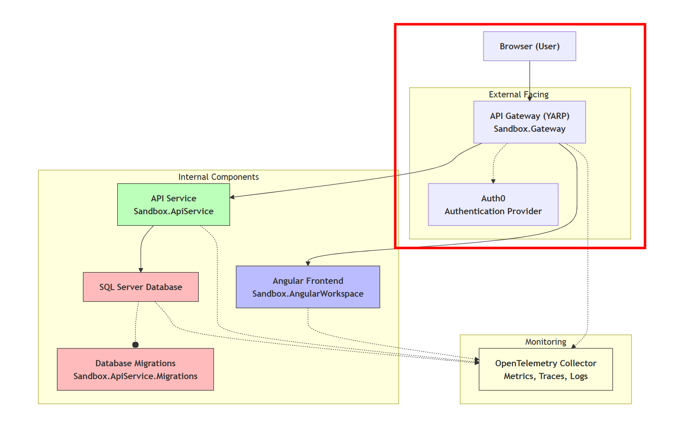

The first step towards building a secure system is a good authentication mechanism.
This is your first layer of defense from an application security standpoint.
One of the reasons the BFF (Backend for Frontend) pattern is used, is exactly to provide a solid foundation.

In this post I will cover the following items:

- Adding cookie-based authentication to a ASP.NET (API) Application
- Authenticating a user through an identity provider (Auth0 in my case)
- Creating endpoints to login, logout and get user information (this will later-on be consumed by the application)

I'm using my [Sandbox](https://github.com/timdeschryver/Sandbox) as demo application, which follows the following architecture within a .NET Aspire solution:



The application is publicly available via the Proxy/Gateway (YARP) project, which redirects the requests to the correct internal service. Since the user interacts with the application through the Proxy, it's also the YARP application that handles authentication flow and knows about the user session.

The focus for this post is the red circled area of the architectural diagram. In future posts, I will cover how to secure the internal systems (.NET and Angular) as well.

## Token-based authentication

Many applications (still) make use of JWT tokens to store the information of an authenticated user.
The token is stored in the client state (e.g. in the browser's local or session storage), and is added to each request (via the `Authorization` header) to the backend API.

Because this all happens within the client, it's vulnerable to attacks. An attacker can get ahold of your token, and once an attacker gets access to your token, it can impersonate you, meaning it can send requests on behalf of you. Therefore, to limit the attack window, it's encouraged to create tokens with a short lifetime. While the token is encoded, it's easy to decode the token to read the contents. For example see [jwt.ms](https://jwt.ms), here you can paste your token to see the contents.

Often the token contains more information than needed, including sensitive information, which increases the risk of leaking sensitive information.
Therefore, it's best to keep the token as small as possible, and only include the necessary information (e.g. user id, roles, permissions).

A more secure way to authenticate a user, is to use a cookie.

## Cookie-based authentication

The main difference between token-based and cookie-based authentication, is the location where the authentication information is stored. With cookie-based authentication, the session identifier (cookie) is stored on the server. This drastically reduces the attack surface, as there's no sensitive information stored client-side.

:::tip
While taking this approach is also important to configure the cookie as:

- `HTTP-only`, so it can't be accessed via JavaScript, which protects against XSS attacks
- `SameSite=Strict|Lax`, to prevent CSRF attacks
- `SecurePolicy=Always`, to ensure the cookie is only sent over HTTPS connections

:::

But that's not all, cookies have multiple security features built-in, which makes them a more secure option compared to tokens.
Using a cookie also allows the server to manage the session, and invalidate it when needed (e.g. logout, session expiration, etc.). This is not possible with token-based authentication, as the token is stateless and can't (easily) be invalidated server-side.

From a user experience standpoint, cookie-based authentication also allows for a smoother experience, as it allows you to implement a Single Sign-On (SSO) experience, in order to avoid multiple login prompts when accessing different applications within the same domain.

The way cookie-based authentication works, is that when a user successfully authenticates, the server creates stores (in-memory, a database, Redis, …) the session information. When the user makes a request to the server, the cookie is automatically attached to the request by the browser. The server then validates the cookie and retrieves the session information to authenticate the user.

The authentication complexity moves from the client to the server, and is often also less complex to implement the whole authentication flow.

## Implementing cookie-based authentication within a YARP BFF

In my previous post [Using YARP as BFF within .NET Aspire: Integrating YARP into .NET Aspire](../integrating-yarp-within-dotnet-aspire), we set up a YARP gateway as a BFF. We will continue building on top of that project, and add authentication to it.

To implement cookie-based authentication, no additional NuGet packages are needed, as ASP.NET Core has built-in support for cookie authentication. But, because we want to authenticate the user through an identity provider (Auth0 in my case), we need to add the `Microsoft.AspNetCore.Authentication.OpenIdConnect` package. This package provides handles the communication with the identity provider using the OpenID Connect (OIDC) protocol.

```bash
dotnet add package Microsoft.AspNetCore.Authentication.OpenIdConnect
```

Next, we can configure the authentication schemes for the application.

Using the `AddAuthentication` method, the authentication middleware is registered.
The primary scheme is set to the cookie authentication scheme, and the challenge scheme to the OpenID Connect scheme.
The challenge scheme will be used when the user is not authenticated and tries to access a protected resource. When this happens, the challenge scheme is invoked. In this case it redirects the user to the identity provider for authentication.

The next methods, `AddCookie` and `AddOpenIdConnect`, configures the respective authentication schemes.
The configuration for the cookie scheme is straightforward, we set the cookie name, and configure the security settings.
The OpenID Connect configuration is a bit more complex, as it requires multiple settings to be configured - you can find these within the settings of your identity provider -.

```cs:Extensions.cs
public static IServiceCollection AddAuthenticationSchemes(this IServiceCollection services, IConfiguration configuration)
{
    services.AddAuthentication(options =>
    {
        options.DefaultScheme = CookieAuthenticationDefaults.AuthenticationScheme;
        options.DefaultChallengeScheme = OpenIdConnectDefaults.AuthenticationScheme;
    })
    .AddCookie(CookieAuthenticationDefaults.AuthenticationScheme, options =>
    {
        options.Cookie.Name = "__Sandbox";
        options.Cookie.SameSite = Microsoft.AspNetCore.Http.SameSiteMode.Strict;
        options.Cookie.SecurePolicy = CookieSecurePolicy.Always;
    })
    .AddOpenIdConnect(OpenIdConnectDefaults.AuthenticationScheme, options =>
    {
        options.Authority = $"https://{configuration.GetValue<string>("OpenIDConnectSettings:Domain")}";
        options.ClientId = configuration.GetValue<string>("OpenIDConnectSettings:ClientId");
        options.ClientSecret = configuration.GetValue<string>("OpenIDConnectSettings:ClientSecret");

        options.ResponseType = OpenIdConnectResponseType.Code;
        options.ResponseMode = OpenIdConnectResponseMode.Query;

        options.GetClaimsFromUserInfoEndpoint = true;
        options.SaveTokens = true;
        options.MapInboundClaims = false;

        options.TokenValidationParameters = new TokenValidationParameters
        {
            NameClaimType = ClaimTypes.NameIdentifier,
            RoleClaimType = ClaimTypes.Role,
        };

        options.Scope.Clear();
        options.Scope.Add("openid");
        options.Scope.Add("profile");
        options.Scope.Add("offline_access");

        options.Events = new()
        {
            OnRedirectToIdentityProviderForSignOut = (context) =>
            {
                var logoutUri = $"https://{configuration.GetValue<string>("OpenIDConnectSettings:Domain")}/oidc/logout?client_id={configuration.GetValue<string>("OpenIDConnectSettings:ClientId")}";
                var redirectUrl = context.HttpContext.BuildRedirectUrl(context.Properties.RedirectUri);
                logoutUri += $"&post_logout_redirect_uri={redirectUrl}";

                context.Response.Redirect(logoutUri);
                context.HandleResponse();
                return Task.CompletedTask;
            },
            OnRedirectToIdentityProvider = (context) =>
            {
                // Auth0 specific parameter to specify the audience
                context.ProtocolMessage.SetParameter("audience", configuration.GetValue<string>("OpenIDConnectSettings:Audience"));
                return Task.CompletedTask;
            },
        };
    });
    return services;
}
```

That's it for the authentication part, but we also want to enforce authorization.
Register the authorization middleware in the request pipeline by calling `AddAuthorization`.
Within the callback, set the default authorization policy to the cookie authentication scheme, and require an authenticated user.
This ensures that all authorized endpoints are protected by default (if no policies are specified), and only authenticated users can access them.

```cs{59-64}:Extensions.cs
public static IServiceCollection AddAuthenticationSchemes(this IServiceCollection services, IConfiguration configuration)
{
    services.AddAuthentication(options =>
    {
        options.DefaultScheme = CookieAuthenticationDefaults.AuthenticationScheme;
        options.DefaultChallengeScheme = OpenIdConnectDefaults.AuthenticationScheme;
    })
    .AddCookie(CookieAuthenticationDefaults.AuthenticationScheme, options =>
    {
        options.Cookie.Name = "__Sandbox";
        options.Cookie.SameSite = Microsoft.AspNetCore.Http.SameSiteMode.Strict;
        options.Cookie.SecurePolicy = CookieSecurePolicy.Always;
    })
    .AddOpenIdConnect(OpenIdConnectDefaults.AuthenticationScheme, options =>
    {
        options.Authority = $"https://{configuration.GetValue<string>("OpenIDConnectSettings:Domain")}";
        options.ClientId = configuration.GetValue<string>("OpenIDConnectSettings:ClientId");
        options.ClientSecret = configuration.GetValue<string>("OpenIDConnectSettings:ClientSecret");

        options.ResponseType = OpenIdConnectResponseType.Code;
        options.ResponseMode = OpenIdConnectResponseMode.Query;

        options.GetClaimsFromUserInfoEndpoint = true;
        options.SaveTokens = true;
        options.MapInboundClaims = false;

        options.TokenValidationParameters = new TokenValidationParameters
        {
            NameClaimType = ClaimTypes.NameIdentifier,
            RoleClaimType = ClaimTypes.Role,
        };

        options.Scope.Clear();
        options.Scope.Add("openid");
        options.Scope.Add("profile");
        options.Scope.Add("offline_access");

        options.Events = new()
        {
            OnRedirectToIdentityProviderForSignOut = (context) =>
            {
                var logoutUri = $"https://{configuration.GetValue<string>("OpenIDConnectSettings:Domain")}/oidc/logout?client_id={configuration.GetValue<string>("OpenIDConnectSettings:ClientId")}";
                var redirectUrl = context.HttpContext.BuildRedirectUrl(context.Properties.RedirectUri);
                logoutUri += $"&post_logout_redirect_uri={redirectUrl}";

                context.Response.Redirect(logoutUri);
                context.HandleResponse();
                return Task.CompletedTask;
            },
            OnRedirectToIdentityProvider = (context) =>
            {
                // Auth0 specific parameter to specify the audience
                context.ProtocolMessage.SetParameter("audience", configuration.GetValue<string>("OpenIDConnectSettings:Audience"));
                return Task.CompletedTask;
            },
        };
    });

    services.AddAuthorization(options =>
    {
        options.DefaultPolicy = new AuthorizationPolicyBuilder(CookieAuthenticationDefaults.AuthenticationScheme)
            .RequireAuthenticatedUser()
            .Build();
    });

    return services;
}
```

Finally, enable the authentication and authorization middleware in the request pipeline, by calling `UseAuthentication` and `UseAuthorization`. Don't worry about the `MapUserEndpoints` method for now, this is covered in the next section.

```cs:Program.cs{8,17-18,20-21}
using Sandbox.Gateway;
using Sandbox.Gateway.UserModule;
using Sandbox.ServiceDefaults;

var builder = WebApplication.CreateBuilder(args);

builder.AddServiceDefaults();

builder.Services.AddReverseProxy(builder.Configuration);
builder.Services.AddAuthenticationSchemes(builder.Configuration);
builder.Services.AddProblemDetails();

var app = builder.Build();

app.UseStatusCodePages();
app.UseExceptionHandler();

app.UseAuthentication();
app.UseAuthorization();

app.MapGroup("bff")
    .MapUserEndpoints();

app.MapReverseProxy();
app.MapDefaultEndpoints();

app.Run();
```

### Endpoints for authentication flow

To handle the authentication flow, we need to create a few endpoints to manage the user session, such as the login and logout behaviors. These will be called by the frontend application to initiate the authentication process.

The login endpoint returns a challenge result, which triggers the authentication middleware to redirect the user to the identity provider for authentication. To redirect the user back to a specific URL after a successful login, we provide a `returnUrl` parameter.

The same applies to the logout endpoint, which instead returns a sign-out result, which signs the user out from both the cookie and OIDC schemes. Again, we provide a `redirectUrl` parameter to redirect the user back to a specific URL after a successful logout.

```cs:User.cs
internal static IEndpointRouteBuilder MapUserEndpoints(this IEndpointRouteBuilder builder)
{
    builder.MapGet("login", (string? returnUrl, HttpContext context) =>
    {
        var properties = new AuthenticationProperties
        {
            RedirectUri = context.BuildRedirectUrl(returnUrl),
        };

        return TypedResults.Challenge(properties);
    });

    builder.MapGet("logout", (string? redirectUrl, HttpContext context) =>
    {
        var properties = new AuthenticationProperties
        {
            RedirectUri = context.BuildRedirectUrl(redirectUrl),
        };

        return TypedResults.SignOut(properties, [CookieAuthenticationDefaults.AuthenticationScheme, OpenIdConnectDefaults.AuthenticationScheme]);
    });

    return builder;
}
```

The third useful endpoint is the user endpoint that returns the current user information and claims.
To retrieve the user information, we can use the `ClaimsPrincipal` provided by ASP.NET Core, which represents the current authenticated user (from the cookie). You can extend this to return more information for your use case, for example application-specific data.

```cs:User.cs
builder.MapGet("user", (ClaimsPrincipal principal) =>
{
    var user = principal switch
    {
        { Identity.IsAuthenticated: true } => new User
        {
            IsAuthenticated = true,
            Name = principal.Claims.SingleOrDefault(c => c.Type == "name")?.Value,
            Claims = principal.Claims.Select(c => new UserClaim { Type = c.Type, Value = c.Value }),
        },
        _ => new User
        {
            IsAuthenticated = false,
            Name = null
        }
    };

    return TypedResults.Ok(user);
});
```

### Summary

With the above code, we have successfully secured our YARP BFF application using cookie-based authentication.
We chose the cookie authentication scheme for its security benefits, as well as a less complex implementation compared to token-based authentication.
This sets a solid security foundation to build upon, as the BFF now handles the authentication flow and manages the user session securely.

As the result we have the following endpoints, which can be consumed (in the next post) by the frontend application:

`/bff/user`: Returns current user information and claims
`/bff/login`: Initiates OIDC authentication flow
`/bff/logout`: Signs out user from both cookie and OIDC schemes
