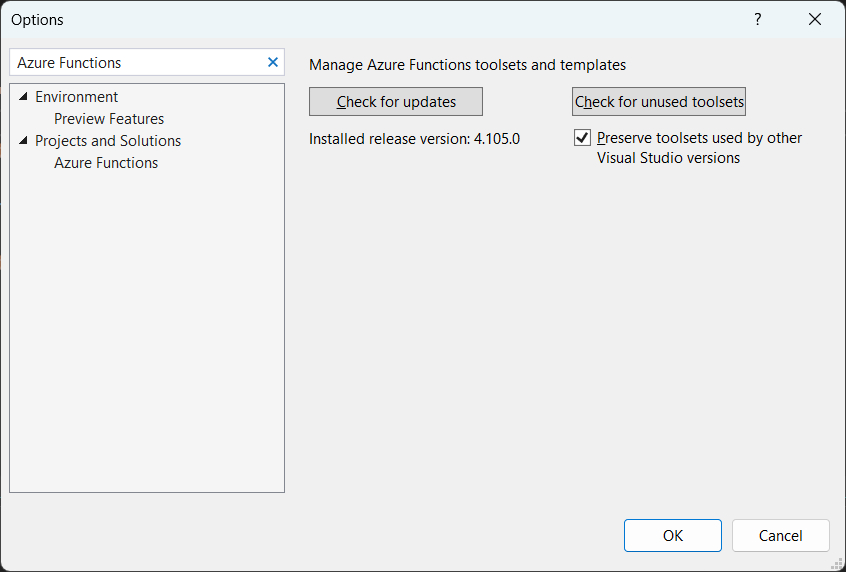
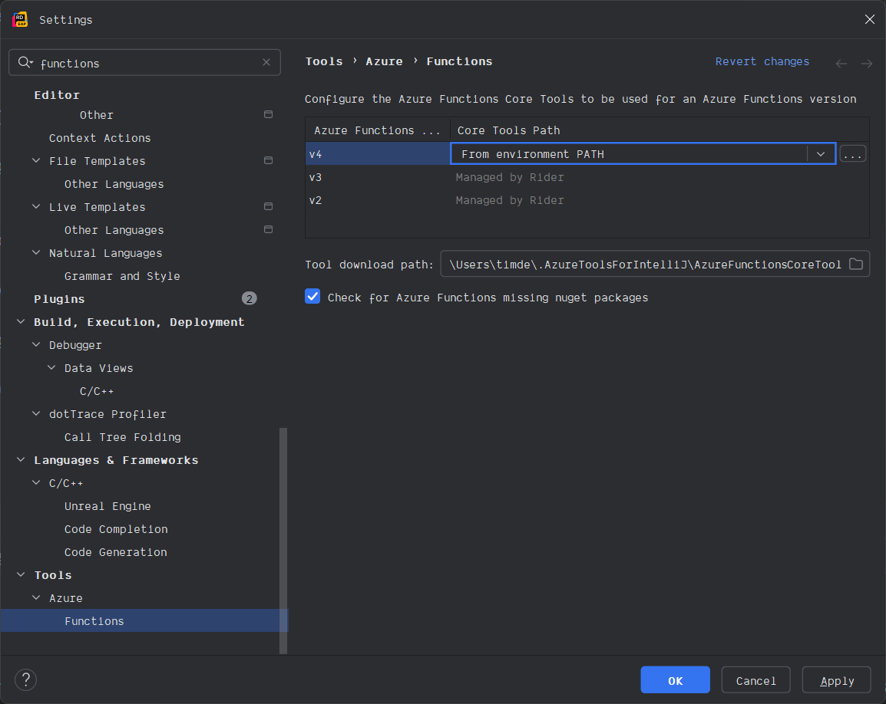
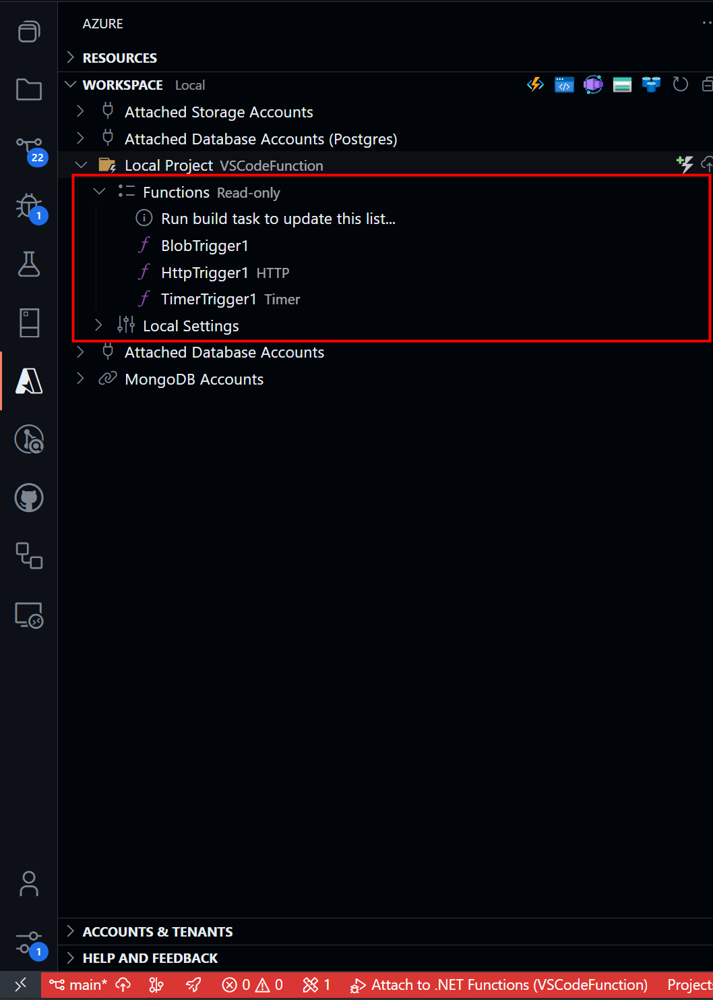
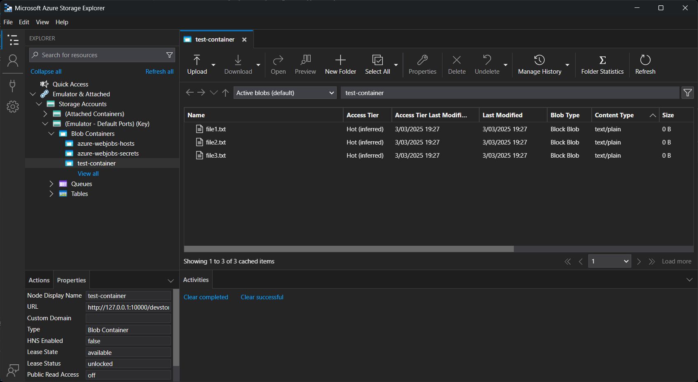

## Introduction

Recently I wrote my first Azure Function. While the overall experience was positive, I encountered several interesting learning experiences along the way. This post documents my journey and the insights I gained - hopefully, they'll save you some time if you're getting started with Azure Functions.

The first thing I noticed was two distinct "models" to choose from when creating a function, the `in-process` model and the `isolated` model.
Because the `in-process` model is deprecated and [loses support in November 2026](https://azure.microsoft.com/en-us/updates?id=retirement-support-for-the-inprocess-model-for-net-apps-in-azure-functions-ends-10-november-2026), I decided to go with the `isolated` model. As the name describes, this model runs a function in a separate .NET worker process. For more differences between the two models, see the [docs](https://learn.microsoft.com/en-us/azure/azure-functions/dotnet-isolated-in-process-differences).

## Which IDE to use?

If you know me, you know that I like to switch up my IDEs and editors.
Mostly the experience is more or less the same, but for Azure Functions, I noticed some big differences between Visual Studio, Rider, and Visual Studio Code.

### Visual Studio

Visual Studio provides the most out of the box.
Just ensure you've installed the "Azure Development" workload when installing Visual Studio, which you can always add later by using the "Visual Studio Installer".

Before I was able to create an isolated function, I had to update the Azure Functions toolset to the latest version.
You can update it via Tools > Options > Projects and Solutions > Azure Functions > click on "Check for updates" > restart Visual Studio.
Before the update, I was only capable of creating an in-process function for older .NET versions.



Once the function is created you can just create a new Azure Function and/or start to run and debug your function as you would with any other .NET project.

### Rider

Before you can start to develop Azure Functions in Rider, you need to install a few things:

1. The [Azure Toolkit for Rider plugin](https://plugins.jetbrains.com/plugin/11220-azure-toolkit-for-rider)
2. Install [azurite](https://github.com/Azure/Azurite) using npm: `npm install -g azurite`
3. [Install the Azure Functions Core Tools](https://github.com/Azure/azure-functions-core-tools/blob/v4.x/README.md#windows) using npm: `npm install -g azure-functions-core-tools@4` (visit the link for more installation options).

After the installation, I also had to update the Rider settings to use the Azure Functions Core Tools from my environment.
You can do this by going to Settings > Tools > Azure > Functions, and set the path to the Azure Functions Core Tools to "From environment path".
In my case this translates to "C:\Program Files\Microsoft\Azure Functions Core Tools\func.exe".



Now, you can create a new Azure Function project and start writing your function.
Additionally, the Rider extension also adds a button to the sidebar to trigger the Azure Function; however, this resulted in (what I believe is) a CORS issue that I didn't investigate further.

### Visual Studio Code

To develop Azure Functions in Visual Studio Code, install the [Azure Functions](https://marketplace.visualstudio.com/items?itemName=ms-azuretools.vscode-azurefunctions) and [Azurite](https://marketplace.visualstudio.com/items?itemName=azurite.azurite) extension from the marketplace. Even if you have the `azurite` package globally installed, I still recommend installing the extension, as it provides a more seamless experience within Visual Studio Code.

:::tip
If you've not already installed the [C# DevKit](https://marketplace.visualstudio.com/items?itemName=ms-dotnettools.csdevkit) extension, I recommend doing so. It's a must-have for C# developers. If this is the first time you're developing C# in Visual Studio Code, you can follow the learning module [Install and configure Visual Studio Code for C# development](https://learn.microsoft.com/en-us/training/modules/install-configure-visual-studio-code/) to get your environment up and running.
:::

After installing the Azure Functions extension, you can create a new Azure Function project or add a new function to an existing project using the command palette (Ctrl+Shift+P).
Once the function is created, you can start developing your function, just as you're used to with other .NET projects.

To run and debug your function locally, you need to manually start the Azurite local emulator first, which can be done by opening the command palette and then searching for "Azurite: Start". Don't worry if you forget to start the emulator, you will get an error message while trying to run your function. Note that this only applies if the Azure Function uses the local environment (more on this later).

What I like about the Visual Studio Code extension is that it provides a lot of functionality for Azure Functions development.
One of the features I like and use a lot is the ability to right-click a function and trigger it (with sample data if needed, e.g., for an HTTP trigger).
This has saved me a lot of time while testing the function.

Via the Azure icon in the sidebar, open the "workspace" menu.
Here you will see your local project, including all the functions, which can be triggered separately.



### My choice: Visual Studio Code

Personally, I find Visual Studio Code superior for developing Azure Functions.
The main reason is the Azure extension, which improves the development experience.

The capability to simply (re-)trigger a function with a single click is very handy.
In other IDEs, I restarted the function app every time I wanted to test a function, which can be cumbersome.

If you have the [Azure Storage](https://marketplace.visualstudio.com/items?itemName=ms-azuretools.vscode-azurestorage) extension installed, you can also view/edit the storage files directly from Visual Studio Code.
If you don't use Visual Studio Code, you can download the [Microsoft Azure Storage Explorer](https://azure.microsoft.com/en-us/products/storage/storage-explorer/#Download-4/) to browse the storage files. This works for both local and cloud storage.



## Your local environment

While developing your Azure Function, I don't want to interact with the real Azure environment.
Instead, it's better to keep as much as possible locally.
That's where [Azurite](https://github.com/Azure/Azurite) comes in, a local emulator that hosts the Azure Storage services.

By keeping everything local, you can test your function without affecting the real Azure environment.
Using the emulator is free, and it's also easier to spin up and tear down using the emulator.

This is why the steps in the [Which IDE to use?](#which-ide-to-use) section mention installing Azurite.
Using Azurite is especially useful if your function(s) interact with blobs, queues, or tables. Some other functions might use one of these services under the hood, for example, an Azure Function based on a timer trigger uses a storage queue to store the timer schedule.

The emulator automatically runs in the background while opening Visual Studio, or running the function within Rider, but you need to start it manually when using Visual Studio Code.

To make the Azure Function use the emulator, set the `AzureWebJobsStorage` setting in the `local.settings.json` file to `UseDevelopmentStorage=true`.
The `local.settings.json` file is located in the root of your function project, and replaces the `appsettings.json` file in a regular .NET project.
It's purpose is to store local settings, which shouldn't be commited to git.

```json{4}:local.settings.json
{
  "IsEncrypted": false,
  "Values": {
    "AzureWebJobsStorage": "UseDevelopmentStorage=true",
    "FUNCTIONS_WORKER_RUNTIME": "dotnet-isolated"
  }
}
```

This instructs the function runtime to use your emulator instead of an actual Azure Storage account.
The value `UseDevelopmentStorage=true` is basically a connection string pointing to the emulator.

## Settings cannot be nested

Speaking of `local.settings.json`, I stumbled upon a surprising limitation: Azure Functions doesn't support nested configuration "objects".
Because I was unaware of this limitation, my function simply didn't start without any clear indication of what went wrong.
The error message that I received wasn't very helpful, as it just said "A host error has occurred during startup operation", mentioning that the current value of a connection string cannot be `null`.

The following configuration **doesn't** work because of the `BatchConfiguration` object:

```json{6-10}:local.settings.json
{
  "IsEncrypted": false,
  "Values": {
    "AzureWebJobsStorage": "UseDevelopmentStorage=true",
    "FUNCTIONS_WORKER_RUNTIME": "dotnet-isolated",
    "BatchConfiguration": {
      "MinimumValue": 1,
      "MaximumValue": 100,
      "BatchSize": 10
    }
  }
}
```

A solution is to not use nested configuration values but to flatten them.
However, this prevents us from using the [Options pattern](https://docs.microsoft.com/en-us/aspnet/core/fundamentals/configuration/options) to group and bind configuration values to a strongly typed class.

A workaround is to use a double-underscore (`__`) to create logical groupings in your configuration keys.
The first part of the key is the group name, followed by the actual key name.
The Azure function runtime interprets this as a nested structure.
It's also possible to use a colon instead (`:`), but this is only supported on Windows, so I prefer the double-underscore.

The revised configuration looks like this:

```json{6-8}:local.settings.json
{
  "IsEncrypted": false,
  "Values": {
    "AzureWebJobsStorage": "UseDevelopmentStorage=true",
    "FUNCTIONS_WORKER_RUNTIME": "dotnet-isolated",
    "BatchConfiguration__MinimumValue": 1,
    "BatchConfiguration__MaximumValue": 100,
    "BatchConfiguration__BatchSize": 10
  }
}
```

## Deploy to Azure

Deploying to Azure turned out to be very simple within all IDE's.
The Azure Functions extension provides a one-click deployment experience, in which you will have to follow a wizard (the first time) to deploy your function to Azure.
If it's a new function, all the required resources will be created for you.

One thing to remember is that your `local.settings.json` doesn't automatically transfer to Azure.
You'll need to configure your application settings in the Azure portal or via the Azure CLI.

## Conclusion

The overall experience of writing my first Azure Function was very positive.
With the help of Azurite to spin up a local environment, it is convenient to write and test your function in isolation.
The storage explorer is also a nice addition to view and edit the storage files.

I also learned that Visual Studio Code plays nice with Azure Functions projects, thanks to the available range of Azure extensions.
Because it's easy to quickly trigger a function, I found it to be the best choice for developing Azure Functions.
In comparison to other IDEs this shortens the feedback loop, which improves the development experience.

## More resources

- [Getting started with Azure Functions](https://learn.microsoft.com/en-us/azure/azure-functions/functions-get-started?pivots=programming-language-csharp#create-your-first-function/)
