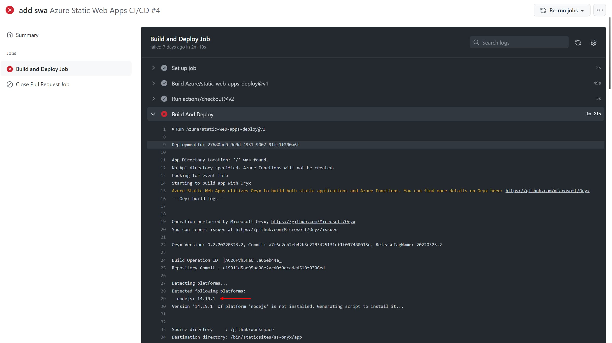
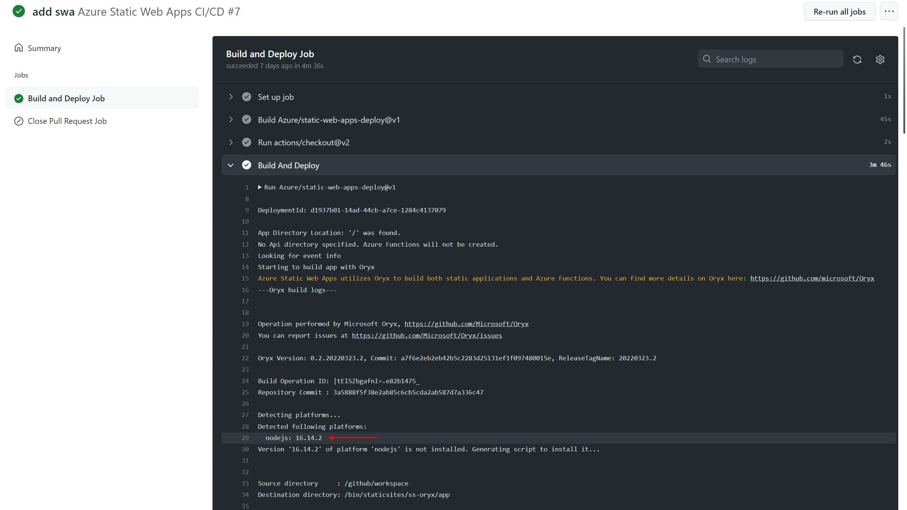

While migrating my [blog](https://timdeschryver.dev/) to an [Azure Static Web App](https://docs.microsoft.com/en-us/azure/static-web-apps/), I encountered a minor issue that occured during the build process within the GitHub workflow.

I created the Azure Static Web App via the Azure Portal (you can also use the [VSCode Extension](https://marketplace.visualstudio.com/items?itemName=ms-azuretools.vscode-azurestaticwebapps), or the [Azure CLI](https://docs.microsoft.com/en-us/azure/static-web-apps/get-started-cli?tabs=vanilla-javascript)), which automatically created a [GitHub workflow (azure-static-web-apps-salmon-rock-0fb035b03.yml)](https://github.com/timdeschryver/timdeschryver.dev/blob/main/.github/workflows/azure-static-web-apps-salmon-rock-0fb035b03.yml) on my GitHub repository.

The worflow uses the [Azure/static-web-apps-deploy](https://github.com/Azure/static-web-apps-deploy) GitHub action to build and deploy the application, and was already [pre-configured](https://docs.microsoft.com/en-us/azure/static-web-apps/configuration).

The problem I encountered was that my blog required a different Node.js version than the one that was used by the action.
The action was using the default Node.js version (14.x), while my blog required version 16.x.



Because the GitHub action doesn't support specifying a Node.js version, the solution is to specify the Node.js version within the `package.json` file.
To do this, use the [`engines`](https://docs.npmjs.com/cli/v8/configuring-npm/package-json#engines) field.

```json:package.json
{
	"engines": {
		"node": "^16.0.0"
	}
}
```


