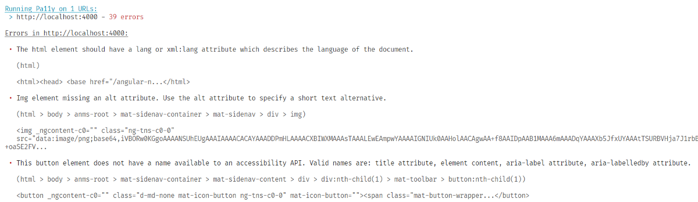
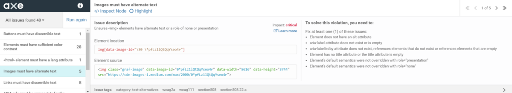

Nearly 1 in 7 people have a disability, therefore it is important to make sure your application or website is accessible for everyone. This probably also means that it will increase the user experience of the common user and (SEO) bots. Along the way you’ll notice that this will bring more satisfaction and enjoyment during development and again when you deliver the product: making everyone happier, from developer, to management, to user.

## What this post is about

This post is about using libraries to follow accessibility best practices and catching issues during development, making the pit of success wider for you and your team. I’m no accessibility expert but I believe that following these rules will have a high-impact, with almost zero effort.

This is my small contribution to raise the awareness about accessibility and I hope to trigger you, just like [This.JavaScript: State of Accessibility](https://www.youtube.com/watch?v=aoyLG2gTFpI) did to me.

## What this post is not about

This post does not contain tips and tricks nor a checklist to make your application accessible (e.g. use semantic HTML, don’t use divs for everything). We will not cover all cases, use this post as a starting point to make your applications (more) accessible.

## What is accessible

Before we start let’s first define the term accessible. If you search for accessible on google, these are some few points that you’ll encounter:

- **easy** to approach, reach, enter, speak with, get along with.
- capable of being used or seen: **available**
- easily used or accessed by people with disabilities**: adapted** for use by people with disabilities

> An estimated 1 billion people are disabled, about 15% of the world’s population — [World Health Organisation](http://www.who.int/disabilities/world_report/2011/report.pdf)

## Pa11y

The easiest “bang for the buck” tool is [pa11y](https://github.com/pa11y/pa11y), an open-source project to automate accessibility checks. It is very easy to use, gives a nice overview of the errors and can be used during a CI build. Using pa11y can be as simple as installing and running it against a website.

As a use case we’re going to focus on the Angular NgRx Material Starter Project by [Tomas Trajan](https://twitter.com/tomastrajan) and a big community of open source contributors. The project can be found on [GitHub](https://github.com/tomastrajan/angular-ngrx-material-starter), more about this later.

$ npm install pa11y -g
$ pa11y [https://tomastrajan.github.io/angular-ngrx-material-starter](https://tomastrajan.github.io/angular-ngrx-material-starter)


To get the most from pa11y, [pa11y-ci](https://github.com/pa11y/pa11y-ci) is needed. As the name already gives away, it does the same thing but is focused on running during a CI build. Pa11y-ci is also more customizable, and this can be done via a config file (`.pa11yci` by default). The following steps show you how to integrate pa11y-ci into your CI build:

First, install `pa11y-ci`:

```bash
npm install pa11y-ci --save-dev
```

The next step is to create the `.pa11yci` config file. This file contains the configuration in JSON format.

```json
{
	"defaults": {
		"timeout": 10000,
		"wait": 2000,
		"ignore": ["notice"]
	},
	"urls": ["http://localhost:4000"]
}
```

The last step is to add some scripts in the `package.json`.

```json
{
	"preaccessibility": "ng build --prod",
	"accessibility": "npm-run-all --parallel --race server accessibility:run",
	"accessibility:run": "pa11y-ci",
	"server": "node ./server.js"
}
```

These scripts are needed to build and serve our application first before we can use pa11y-ci. To serve the application a server is needed, you can either use [angular-http-server](https://github.com/simonh1000/angular-http-server) for this or create [your own node server with express](https://github.com/tomastrajan/angular-ngrx-material-starter/blob/master/server.js). [Npm-run-all](https://github.com/mysticatea/npm-run-all) (install it via `npm install npm-run-all --save-dev`) is being used here to start the server. Once the server is up and running, we can run pa11y-ci against it.

Now if we do `npm run accessibility`,we get an overview with errors, just like before.



With this in place all that is left to do is to add this command as a step in the CI build. Here is an example with CircleCI:

```yml
test-accessibility:
    <<: *job_defaults
    steps:
      - checkout
      - restore_cache:
          key: *cache_key
      - run:
          name: test accessibility
          command: npm run `accessibility`
```

### Pa11y tips

- Run pa11y against local html files without launching a server: `pa11y-ci ./dist/index.html`
- Instead of defining the URLs manually, refer to a sitemap — [docs](https://github.com/pa11y/pa11y-ci#sitemaps)
- When adding pa11y to an existing project, set a high threshold number in order to not break the build until all errors are solved: `pa11y-ci --threshold 250`
- Ignore certain elements you have no control over: `hideElements: '3rd-party-element'`
- Override the defaults for a specific URL:

```json
{
  "url1",
  {
    "url": "url2",
    ... overrides here ...
  }
}
```

- It’s even possible to perform some actions before the pa11y tests are run without writing a single line of code.

```json
actions: [
  'click element #tab-1',
  'wait for element #tab-1-content to be visible',
  'set field #fullname to John Doe',
  'check field #terms-and-conditions',
  'uncheck field #subscribe-to-marketing'
]
```

### Alternatives to pa11y

- [a11y](https://a11yproject.com/)
- [axe](https://www.deque.com/axe/) — which also has a browser extension



## Dom-testing-library

Use a library based on [dom-testing-library](https://github.com/kentcdodds/dom-testing-library) for example [ngx-testing-library](https://github.com/timdeschryver/ngx-testing-library) or [cypress-testing-library](https://github.com/kentcdodds/cypress-testing-library), to test your application in a way that your users are using the application, in contrast to using the component’s API.

### Making sure you have defined the proper HTML attributes

Instead of setting the component’s values directly or using css selectors to populate the fields in a form, use a label with a `for` attribute or use the `aria-labelledby` attribute on the input field. This has more meaning to your end users. And, you’ll also get the benefit that your tests won’t break when the id or the class of an element has been changed. The code below shows you a comparison between these ways of testing, by testing a simple login Angular component.

The default or standard approach:

```ts
test('a user can log in', () => {
	const username = fixture.debugElement.query(By.css('#username'));
	username.nativeElement.value = 'username';

	const password = fixture.debugElement.query(By.css('input[type=password]'));
	password.nativeElement.value = '******';

	fixture.detectChanges();
	expect(component.login()).toBe(true);
});

// or

test('a user can log in', () => {
	component.username = 'username';
	component.password = '********';
	expect(component.login()).toBe(true);
});
```

And now in comparison with ngx-testing-library:

```ts
test('a user can log in', () => {
	const username = getByLabelText('Username');
	username.value = 'username';
	input(username);

	const password = getByLabelText('Password');
	password.value = '******';
	input(password);

	submit(getByText('Submit'));
	expect(login).toHaveBeenCalledTimes(1);
});
```

As you can see in the example above: the library encourages, or even enforces, you to think like a user, making the application more accessible.

### Keyboard events

Another way to make sure your components are accessible is to use keyboard events in your test cases, whether it is a unit, integration or end to end test. An example that illustrates this, is a user using a dropdown component:

```ts
test('a user can use keyboard arrows to select an item', () => {
	const dropdown = getByText('Select your favorite color');
	keyDown(dropdown, { key: 'ArrowDown' });
	keyDown(dropdown, { key: 'ArrowDown' });
	keyDown(dropdown, { key: 'ArrowDown' });
	keyDown(dropdown, { key: 'Enter' });
});
```

> _Notice that this becomes a breeze with_ [_ngx-testing-library_](https://github.com/timdeschryver/ngx-testing-library)_._

## During development

When you create a new component make it a habit to read through the [W3C standards](https://www.w3.org/standards/webdesign/accessibility) about accessibility. I’m sure that this will make you look at your components through different eyes. More often than not, this will result in a cleaner and more reusable API. It will also bring more joy and satisfaction when you’re finished.

If you need some inspiration, go take a look at the source code of libraries like [Angular Material](https://material.angular.io/), they even have an [a11y cdk package](https://material.angular.io/cdk/a11y/overview)! Their components are often designed with accessibility as a first class citizen.

## Next steps

While these libraries might give you some ideas and will definitely make your applications more accessible, **it doesn’t stop here**. If you want to take it to the next level, use your own application with a screen reader (start by using the native screen reader of your OS) or drop your mouse while you browse through your application. By doing this you’ll quickly find some weird quirks;

Talk about accessibility within your team (e.g. add it to the Definition of Done) or online to raise the awareness about accessibility;

Start opening issues or submitting pull requests to some open source projects;

Invite people with a disability to your testing groups;

If you don’t got the knowledge in house, ask for an external audit to get you and your team on the right track;

**You might already have noticed that making your application accessible isn’t a one-time thing, you’ll have to make room for it within your process to maintain it along the way. The sooner the better.**

## Not to miss: Hacktoberfest

> [Hacktoberfest](https://hacktoberfest.digitalocean.com/) is a month-long celebration of open source software run by DigitalOcean in partnership with GitHub and Twilio.

As briefly mentioned in this post, I’ve set up pa11y in the Angular NgRx Material Starter Project and there are some accessibility issues. Therefore we created a couple of open issues, I would like to invite you to take a look at the [Hacktoberfest open issues](https://github.com/tomastrajan/angular-ngrx-material-starter/issues?utf8=%E2%9C%93&q=is%3Aissue+is%3Aopen+++label%3A%22hacktoberfest+%F0%9F%8D%BB%22+) and get your first experience with accessibility testing or open source contributions. Feel free to ask questions, we’ll be there to guide you along the way.
