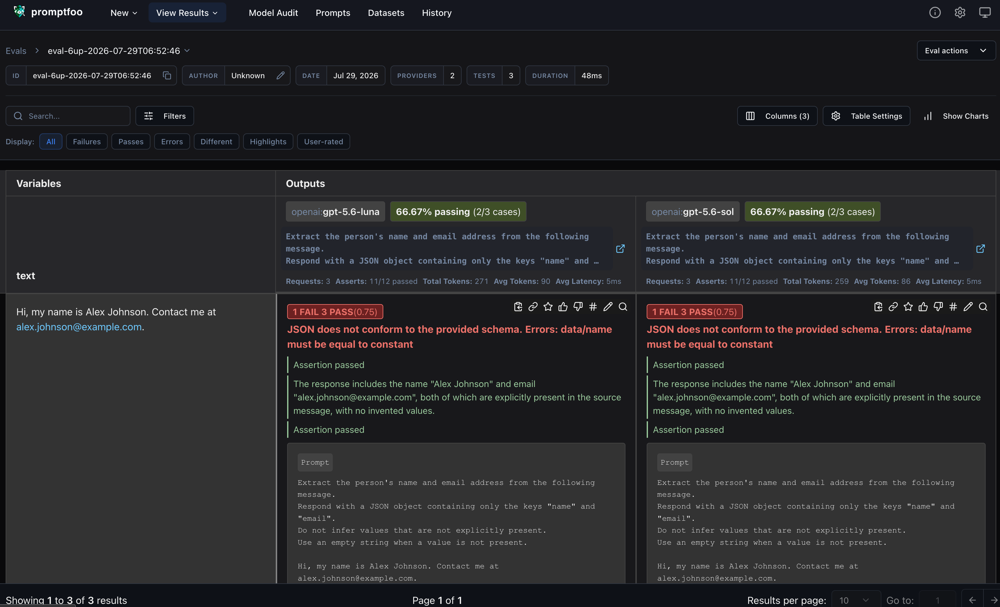
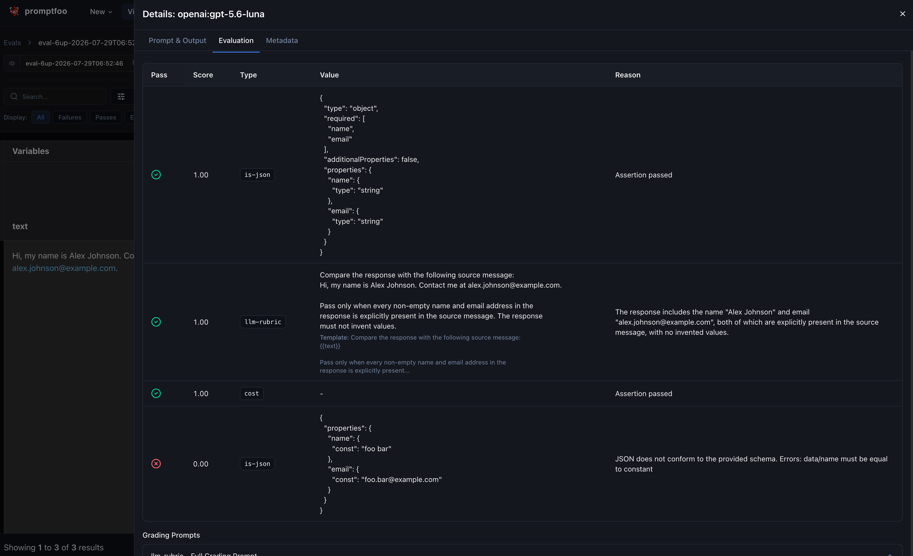

As AI becomes more integrated into our daily workflows, we start to see that applications also increasingly rely on prompts to make certain tasks easier or more efficient.

However, prompts may not always have the expected outcome.
Even the most basic prompts can produce unexpected results, and small changes can introduce regressions that are hard to detect without systematic testing.
Not only changes to the prompt itself, but also changes to the model, or changing the model itself, can affect the output quality and cost.

Just like other software components, prompts benefit from tests that provide representative inputs to verify that the outputs meet the requirements.

## Why automate prompt testing

When an application uses only one prompt, it's manageable to test it manually and optimize it until the prompt produces the expected output for various scenarios.
However, this process should be repeated when the prompt changes or when a different model is used.
As the number of prompts and criteria grows, manual verification quickly becomes time-consuming, and difficult to repeat consistently within a team.

[Promptfoo](https://promptfoo.dev/) automates this process by running a set of prompts and inputs against an AI model.
It evaluates the responses using predefined assertions, making it easier to repeat the same checks after every change.
This ensures that the prompt continues to meet the requirements and that the output quality is not compromised due to different factors.

### Compare models without sacrificing quality

Next to testing prompt behavior, promptfoo makes it easier to compare and evaluate multiple models.
Automated evaluations help catch regressions, and it also helps when the application switches to another model.
This is important because models can behave differently and may require different prompts to achieve comparable results.

Even the smallest subtle change in a prompt can have a significant impact on the output quality, and it can be difficult to determine whether a different model is suitable without running the same tests against it.

Running the same test cases against multiple models lets you compare output quality, token usage, and cost.
This is critical to determine whether a cheaper model meets the same requirements, and to switch models without unknowingly sacrificing quality.

Promptfoo also supports multiple providers, so you can compare models from different vendors within the same evaluation.

## What can you test?

With promptfoo, you can define prompts and create test cases for the given prompts.
Each test case provides assertions that describe the expected output, and can include variables to add dynamic content to the prompt.
Promptfoo renders the prompt, sends it to every configured model, and evaluates each response.

The assertions broadly fall into two categories: deterministic assertions and model-graded assertions.

### Deterministic assertions

Deterministic assertions evaluate a response using explicit rules.
Given the same response and assertion, they always produce the same result.
They are useful when the requirement can be expressed precisely, for example:

- Comparing the output with an expected value using `equals`, `contains`, `not-contains`, or a regular expression.
- Verifying the response length with `word-count`.
- Validating structured output, such as JSON that must match a JSON schema.
- Comparing semantic similarity using vector embeddings.

When the multiple built-in assertions are not sufficient, you can also implement a custom rule with JavaScript, Python, or Ruby.
E.g. for complext JSON schemas, you can write a zod schema validator.

Not only can you check the correctness of the output, but you can also verify that it meets performance requirements with assertions to check to cost, latency, and token usage.

These assertions are usually the best starting point because their results are predictable and easy to debug.

See the [Deterministic metrics](https://www.promptfoo.dev/docs/configuration/expected-outputs/deterministic/) documentation for the complete list.

### Model-graded assertions

Some requirements are difficult to describe with an exact rule.
Model-graded assertions use another language model as a judge to evaluate more subjective qualities, such as:

- Whether the response uses the expected tone or writing style.
- Whether an answer is relevant, complete, and appropriate for its audience.
- Whether a summary preserves the important information.
- Whether the response follows a natural-language rubric or remains factually consistent with a reference.

Use them for requirements that genuinely need judgment, and prefer deterministic assertions wherever an explicit rule is sufficient.

A thing to watch out for, because model-graded assertions require an additional model call and can be less predictable than deterministic checks, they also add latency and cost.

See the [Model-graded metrics](https://www.promptfoo.dev/docs/configuration/expected-outputs/model-graded/) documentation for the available graders.

## A practical promptfoo example

Promptfoo evaluations are defined in a configuration file containing the models, prompt, test inputs, and assertions.
This makes the evaluation repeatable and ensures that every model receives the same inputs and is measured against the same expectations.

In this example, `promptfooconfig.yaml` tests a practical data-extraction task: extracting information from fictional customer messages and returning it as structured JSON.
This scenario is useful because the output must satisfy both strict requirements, such as valid JSON, and qualitative requirements, such as not inventing information that is missing from the message.

The configuration compares [GPT-5.6 Luna](https://developers.openai.com/api/docs/models/gpt-5.6-luna), the efficient tier, with [GPT-5.6 Sol](https://developers.openai.com/api/docs/models/gpt-5.6-sol), the flagship tier.

The test cases use a mix of a deterministic and model-graded assertions to verify that the output is valid JSON, contains the expected keys, and does not invent values that are not present in the source message.

Instead of defining the configuration in YAML, you can also define it in TypeScript, as shown as well in the example below.
The TypeScript version produces the same test cases programmatically, which can be useful when test data needs to be transformed or generated.

In the prompt, variables can be inserted using the [Nunjucks template syntax](https://www.promptfoo.dev/docs/configuration/guide/#using-nunjucks-templates), for example, a placeholder such as `{{text}}` is replaced with the matching value from `vars` before the prompt is sent to a model.

:::code-group

```yaml:promptfooconfig.yaml [title=YAML]
prompts:
  - |
    Extract the person's name and email address from the following message.
    Respond with a JSON object containing only the keys "name" and "email".
    Do not infer values that are not explicitly present.
    Use an empty string when a value is not present.

    {{text}}

providers:
  - openai:responses:gpt-5.6-luna
  - openai:responses:gpt-5.6-sol

defaultTest:
  assert:
    - type: is-json
      value:
        type: object
        required:
          - name
          - email
        additionalProperties: false
        properties:
          name:
            type: string
          email:
            type: string
    - type: llm-rubric
      value: |
        Compare the response with the following source message:
        {{text}}

        Pass only when every non-empty name and email address in the
        response is explicitly present in the source message. The response
        must not invent values.
    - type: cost
      threshold: 0.005

tests:
  - vars:
      text: 'Hi, my name is Alex Johnson. Contact me at alex.johnson@example.com.'
    assert:
      - type: is-json
        value:
          properties:
            name:
              const: 'Alex Johnson'
            email:
              const: 'alex.johnson@example.com'
  - vars:
      text: 'Please send the invoice to Priya Shah at priya.shah@example.org.'
    assert:
      - type: is-json
        value:
          properties:
            name:
              const: 'Priya Shah'
            email:
              const: 'priya.shah@example.org'
  - vars:
      text: 'I cannot access my account after resetting the password.'
    assert:
      - type: is-json
        value:
          properties:
            name:
              const: ''
            email:
              const: ''
```

```ts:promptfooconfig.ts [title=TypeScript]
import type { UnifiedConfig } from 'promptfoo';

const cases = [
  {
    name: 'Alex Johnson',
    email: 'alex.johnson@example.com',
    text: 'Hi, my name is Alex Johnson. Contact me at alex.johnson@example.com.',
  },
  {
    name: 'Priya Shah',
    email: 'priya.shah@example.org',
    text: 'Please send the invoice to Priya Shah at priya.shah@example.org.',
  },
  {
    name: '',
    email: '',
    text: 'I cannot access my account after resetting the password.',
  },
];

const config: UnifiedConfig = {
  prompts: [
    `Extract the person's name and email address from the following message.
Respond with a JSON object containing only the keys "name" and "email".
Do not infer values that are not explicitly present.
Use an empty string when a value is not present.

{{text}}`,
  ],
  providers: [
    'openai:responses:gpt-5.6-luna',
    'openai:responses:gpt-5.6-sol',
  ],
  defaultTest: {
    assert: [
      {
        type: 'is-json',
        value: {
          type: 'object',
          required: ['name', 'email'],
          additionalProperties: false,
          properties: {
            name: {
              type: 'string',
            },
            email: {
              type: 'string',
            },
          },
        },
      },
      {
        type: 'llm-rubric',
        value: `Compare the response with the following source message:
{{text}}

Pass only when every non-empty name and email address in the response is
explicitly present in the source message. The response must not invent values.`,
      },
      {
        type: 'cost',
        threshold: 0.005,
      },
    ],
  },
  tests: cases.map(({ name, email, text }) => ({
    vars: {
      text,
    },
    assert: [
      {
        type: 'is-json' as const,
        value: {
          properties: {
            name: {
              const: name,
            },
            email: {
              const: email,
            },
          },
        },
      },
    ],
  })),
};

export default config;
```

:::

In the example above, the shared assertions are defined once under `defaultTest`, while each test case provides a different text and a content-specific assertion.

Each text is evaluated against both models using the inherited and test-specific assertions, making it easy to compare output quality and cost across a broader set of inputs.

You can also notice that Nunjucks variables can also be used in assertion values.
In this exmaple, the `llm-rubric` assertion uses `{{text}}` to provide the grading model with the source message.

## Load prompts and variables from files

As the test suite grows, keeping prompts and test data in separate files makes them easier to maintain and reuse.
The customer-message example from the previous section can be refactored into the following feature-based structure:

```text
promptfoo
├── customer-message
│   ├── fixtures
│   │   └── customer-message.txt
│   ├── prompts
│   │   └── extract-personal-information-v1.txt
│   ├── tests
│   │   └── extract-personal-information.yaml
│   └── promptfooconfig.yaml
└── providers.yaml
```

The feature's `promptfooconfig.yaml` references its prompt and test files using the `file://` prefix, as well as the shared provider configuration one directory above it:

```yaml [title=customer-message/promptfooconfig.yaml]
prompts:
  - file://prompts/extract-personal-information-v1.txt

providers: file://../providers.yaml

defaultTest:
  assert:
    - type: is-json
      value:
        type: object
        required:
          - name
          - email
        additionalProperties: false
        properties:
          name:
            type: string
          email:
            type: string
    - type: llm-rubric
      value: |
        Compare the response with the following source message:
        {{text}}

        Pass only when every non-empty name and email address in the
        response is explicitly present in the source message. The response
        must not invent values.
    - type: cost
      threshold: 0.005

tests:
  - file://tests/extract-personal-information.yaml
```

The contents of these files are identical to the inline example, except that the prompt and test cases are now stored in separate files.

:::code-group

```yaml:providers.yaml [title=providers.yaml]
- openai:responses:gpt-5.6-luna
- openai:responses:gpt-5.6-sol
```

```text:customer-message/prompts/extract-personal-information-v1.txt [title=extract-personal-information-v1.txt]
Extract the person's name and email address from the following message.
Respond with a JSON object containing only the keys "name" and "email".
Do not infer values that are not explicitly present.
Use an empty string when a value is not present.

{{text}}
```

```yaml:customer-message/tests/extract-personal-information.yaml [title=extract-personal-information.yaml]
- vars:
    text: file://fixtures/customer-message.txt
  assert:
    - type: is-json
      value:
        properties:
          name:
            const: 'Alex Johnson'
          email:
            const: 'alex.johnson@example.com'
- vars:
    text: 'Please send the invoice to Priya Shah at priya.shah@example.org.'
  assert:
    - type: is-json
      value:
        properties:
          name:
            const: 'Priya Shah'
          email:
            const: 'priya.shah@example.org'
- vars:
    text: 'I cannot access my account after resetting the password.'
  assert:
    - type: is-json
      value:
        properties:
          name:
            const: ''
          email:
            const: ''
```

```text:customer-message/fixtures/customer-message.txt [title=customer-message.txt]
Hi, my name is Alex Johnson. Contact me at alex.johnson@example.com.
```

:::

In this example, promptfoo loads the customer message from the fixture instead of embedding it in the configuration. All `file://` paths are resolved relative to `promptfooconfig.yaml`, regardless of the directory from which the command is run.

### Compare multiple prompts for the same task

When two prompts solve the same task, add both prompt files to the same configuration:

```yaml
prompts:
  - file://prompts/extract-personal-information-v1.txt
  - file://prompts/extract-personal-information-v2.txt
```

By default, promptfoo runs every test against every prompt and provider.
This is useful for comparing prompt variants because each combination receives the same inputs and assertions.

### Organize different tasks by feature

As an application grows, it will probably contain different types of prompts for unrelated tasks with different variables and expectations.
In that case, I prefer to use a separate configuration for each task instead of placing every prompt and test in one configuration.

A larger test suite could use the following structure:

```text
promptfoo
├── customer-message
│   ├── fixtures
│   │   └── customer-message.txt
│   ├── prompts
│   │   ├── extract-personal-information-v1.txt
│   │   └── extract-personal-information-v2.txt
│   ├── tests
│   │   └── extract-personal-information.yaml
│   └── promptfooconfig.yaml
├── billing-request
│   ├── fixtures
│   │   └── billing-request.txt
│   ├── prompts
│   │   └── classify-support-request.txt
│   ├── tests
│   │   └── classify-support-request.yaml
│   └── promptfooconfig.yaml
└── providers.yaml
```

Each feature directory now contains its configuration, prompts, fixtures, and tests.
This keeps files that change together close to each other while the model configuration remains shared.
For example, `customer-message/promptfooconfig.yaml` can contain:

```yaml
description: 'Extract personal information from customer messages'

prompts:
  - file://prompts/extract-personal-information-v1.txt
  - file://prompts/extract-personal-information-v2.txt

providers: file://../providers.yaml

tests:
  - file://tests/extract-personal-information.yaml
```

Both feature configurations can reference the root-level `providers.yaml` shown earlier, ensuring that every task evaluates the same models.

Run one task while working on a specific prompt (more on this in the next section):

```bash
pnpm exec promptfoo eval --config promptfoo/customer-message/promptfooconfig.yaml
```

Or run every configuration to evaluate the complete prompt suite:

```bash
pnpm exec promptfoo eval --config promptfoo/*/promptfooconfig.yaml
```

This structure keeps prompts, inputs, and assertions close to their use case while still making model selection reusable across the entire suite.

## Set up promptfoo

If you're hooked and want to try promptfoo yourself, you can follow the steps below to set up the example from this post.
Promptfoo can be installed as a development dependency. The examples below use pnpm:

```bash
pnpm add --save-dev promptfoo
```

You can then use the interactive setup to create an example `promptfooconfig.yaml` file with minimal effort.
In the wizard pick the option "Compare prompts and models".

```bash
pnpm exec promptfoo init
```

You can run the example, or replace the generated YAML configuration with the example above, or adapt it to your own prompts and test cases.
To use TypeScript instead, create `promptfooconfig.ts` from the TypeScript example.

Each model provider requires its own credentials. For the OpenAI providers in this example, make `OPENAI_API_KEY` available in your environment. Keep the key outside the configuration file and do not commit it to source control.

## Run the tests

For a YAML configuration, run the evaluation from the directory that contains `promptfooconfig.yaml`:

```bash
pnpm exec promptfoo eval
```

Promptfoo runs every test case against each configured prompt and model. The terminal displays a table with the generated outputs and shows which assertions passed or failed.

While changing a prompt or its assertions, watch mode automatically starts a new evaluation when the configuration changes:

```bash
pnpm exec promptfoo eval --watch
```

## View the results

To inspect the results in the web viewer, run:

```bash
pnpm exec promptfoo view
```

The viewer opens a local web application where you can compare model outputs side by side, inspect failed assertions, and review token usage, latency, and cost. Previous evaluations are also available, which makes it possible to compare the results before and after changing a prompt or model.

The results can also be written to a standalone HTML file:

```bash
pnpm exec promptfoo eval --output results.html
```

This gives you the following results for the example evaluation.





## Conclusion

In this post, we used promptfoo to test a personal-information extraction prompt with deterministic and model-graded assertions, and to compare the same results across multiple models.
We also saw how to define evaluations in YAML or TypeScript, and how to scale this using a feature-based folder structure and by loading prompts and variables from files.

Prompt testing is valuable because it turns assumptions about model behavior into repeatable checks.
Start with a few representative inputs and assertions for the most important requirements, then add new test cases whenever an unexpected response or regression is discovered.

It also helps to reduce costs by comparing models and prompts, and by tracking token usage and latency.
Once the same evaluation suite can run against multiple models, changing models becomes a measurable decision instead of a manual experiment.
You can compare quality alongside token usage, latency, and cost, and choose a smaller or cheaper model with confidence that it still meets the application's requirements.

As next steps, the same evaluations can also run as part of a [CI/CD pipeline](https://www.promptfoo.dev/docs/integrations/ci-cd/), where they can catch prompt or model regressions before a change is deployed. This is very similar to your current test suites.

Instead of a local workflow, with the setup and files located in a source control repository, you can also opt to use the web version of promptfoo, which provides a shared interface for creating, running, and sharing evaluations. This is also useful to share evaluations within your team on a central location, and to keep track of the evaluation history.
This is available via the Promptfoo app in [Promptfoo Cloud](https://www.promptfoo.dev/docs/usage/web-ui/#cloud) or a [self-hosted instance](https://www.promptfoo.dev/docs/usage/self-hosting/).

Promptfoo can also do more than the prompt and model comparisons covered in this post.
This is definitely worth exploring if AI is heavily integrated into your application, e.g. for [red-teaming and security testing](https://www.promptfoo.dev/docs/red-team/quickstart/) or [evaluating model security](https://www.promptfoo.dev/model-security/).

## Alternatives

Promptfoo is not the only option for evaluating prompts and AI applications.
Depending on the application's technology stack and whether evaluation needs to be connected to production observability, the following alternatives are also worth considering:

- [Langfuse](https://langfuse.com/docs/evaluation/core-concepts) combines evaluation with tracing, prompt management, datasets, and production observability. It supports offline experiments for comparing prompt or model versions, as well as online evaluations of live application traces, making it a good fit when evaluation should be part of a broader LLM observability workflow. You can also use Langfuse prompts within promptfoo evaluations, which makes it possible to combine the two tools.

- The [.NET `Microsoft.Extensions.AI.Evaluation` libraries](https://learn.microsoft.com/en-us/dotnet/ai/evaluation/libraries) provide a code-first option for .NET applications. They integrate with test frameworks such as xUnit, NUnit, and MSTest, and include quality, natural language processing (NLP) metrics, safety.
