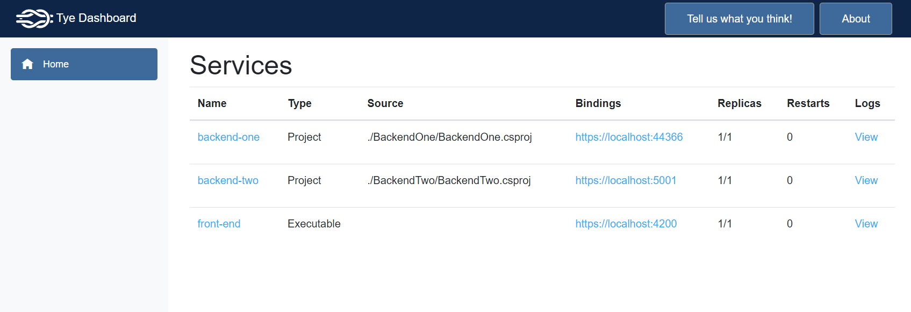

Today, most of the applications consist of multiple projects.
Most of them have some kind of front-end application (e.g. Angular) that consumes one or more .NET C# APIs, which in their turn might also be linked to each other.

Because applications are built like this, running your local development environment can become a lot of work, and the environment also needs to be maintained.
When there goes something wrong while spinning up the environment, for example, an API that isn't started, it can be hard to find the cause of the problem. This is time that is wasted.
Your local environment might even take up a lot of resources when you have multiple Visual Studio or Rider instances open. Again, this is time that is wasted.

Thanks to the [Project Tye](https://github.com/dotnet/tye) this doesn't have to become a problem.
The best thing is you aren't required to learn anything new, and you can get up and running in just a few minutes. Besides being easy to use, another benefit is that Tye contains a few utilities that can be used to help you with your development.

> Tye is a tool that makes developing, testing, and deploying microservices and distributed applications easier. Project Tye includes a local orchestrator to make developing microservices easier and the ability to deploy microservices to Kubernetes with minimal configuration.

In this post, we're applying the [Pareto Principle](https://en.wikipedia.org/wiki/Pareto_principle)(80/20 rule) to discover how easy it is to set up Tye. By following this rule, our team can run our whole local environment with just a single command.

In the short run, using Tye just seems like an improvement to your developer experience.
On its own, this already sounds like a good thing but in the long run, you'll also notice that a lot of time is saved.

## Installation

Tye is installed as a global dotnet tool with the following command.
For more info, take a look at the [Getting Started](https://github.com/dotnet/tye/blob/main/docs/getting_started.md) guide.

```bash
dotnet tool install -g Microsoft.Tye --version "0.11.0-alpha.22111.1"
```

## Configuring your environment

When Tye is installed, create a `tye.yml` file and start to configure your environment.

Do this by including your .NET projects to the `services` section.
A service has a reference to the `csproj` file that needs to be started.
Optionally, create a binding (ignore this if the port doesn't matter, tye randomly assigns an available port when the binding isn't specified) for this service.

```yaml{3-7}:tye.yml
name: Awesome Application
services:
  - name: backend-one
    project: ./BackendOne/BackendOne.csproj
    bindings:
      - protocol: https
        port: 4061

  - name: backend-two
    project: ./BackendTwo/BackendTwo.csproj
    bindings:
      - protocol: https
        port: 5063
```

As mentioned before, Tye is focused on the .NET ecosystem but you can also include different technologies, for example, an Angular front-end application.
To do so, add the Angular application to your configuration as an executable.
To start the Angular application, define the script to run the application.

```yaml{15-20}:tye.yml
name: Awesome Application
services:
  - name: backend-one
    project: ./BackendOne/BackendOne.csproj
    bindings:
      - protocol: https
        port: 4061

  - name: backend-two
    project: ./BackendTwo/BackendTwo.csproj
    bindings:
      - protocol: https
        port: 5063

  - name: front-end
    executable: cmd
    args: '/c cd ./Frontend && npm run start'
    bindings:
      - protocol: https
        port: 4200
```

As shown below, you can also add a reference to a different repository that contains a tye config.

```yaml{5-6}:tye.yml
name: Awesome Application
services:
  ...

  - name: other repository
    include: ../other-repository/tye.yaml
```

Instead of the whole environment, it might be useful to solely run a subset of the environment.
Therefore, define `tags` within the configuration to filter the services.

```yaml{5-6,13-14}:tye.yml
name: Awesome Application
services:
  - name: backend-one
    project: ./BackendOne/BackendOne.csproj
    tags:
      - subset-one
    bindings:
      - protocol: https
        port: 4061

  - name: backend-two
    project: ./BackendTwo/BackendTwo.csproj
    tags:
      - subset-two
    bindings:
      - protocol: https
        port: 5063
```

## Running the environment

Once your environment is configured, you can run it with the `tye run` command.

```bash
# runs `tye.yml` by default
tye run

# restart the service on file change
tye run --watch

# run a subset of services
tye run --tags subset-one

# provide a custom configuration file
tye run other-tye.yml
```

After running the command, the hosted environment (with logs) is visible in the Tye dashboard.
Navigate to `http://localhost:8000` to open the dashboard.



## How to debug services

Without using Tye, you probably started the API service manually by clicking on the `Start` button.
Doing this automatically hooked the debugger to the spawned process.

If you're using Tye, debugging is isn't automatically anymore.
Instead, you have to attach your IDE to the spawned process when you want to start a debug session.

## Bonus tip

I like to be able to run my environment with a single command, no matter in which directory I'm currently in.
Therefore, I've added a shortcut to my PowerShell profile.
The profile executes the `tye` command and provides it the full path of the config.

```bash
tye run "C:\Users\timde\dev\project\tye.yaml" --watch
```

## Summary

- [Tye](https://github.com/dotnet/tye) is installed as a global dotnet tool
- The environment is configured with the `tye.yml` file
- Run the environment with the `tye run --watch` command
- To debug, attach your IDE to the spawned process

And that's it!

If you're hooked to Tye as I am, check out the [Tye documentation](https://github.com/dotnet/tye/tree/main/docs#-tye-documentation) for more information and different scenarios (with example configs).
