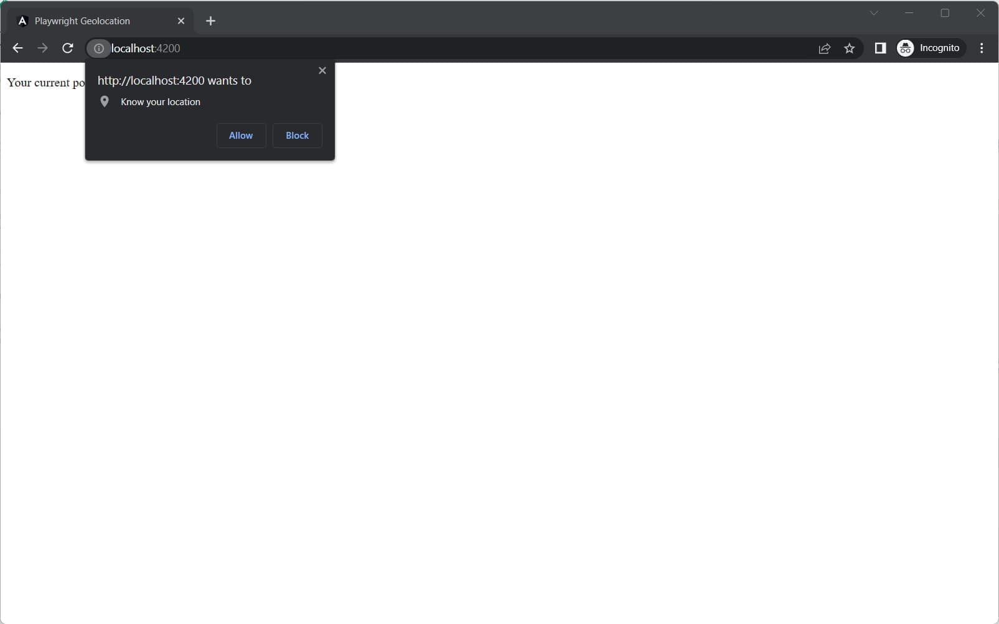
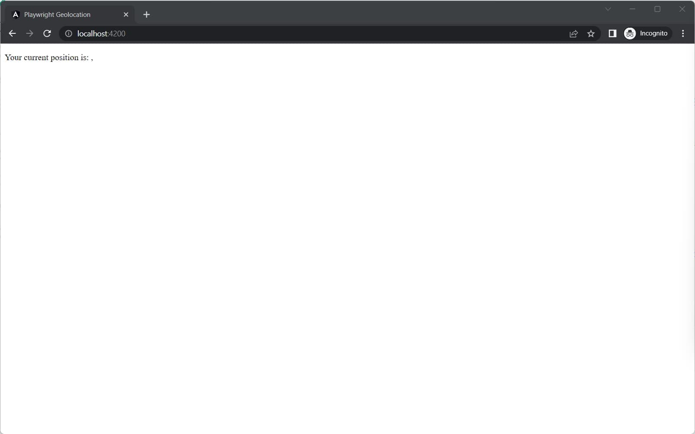
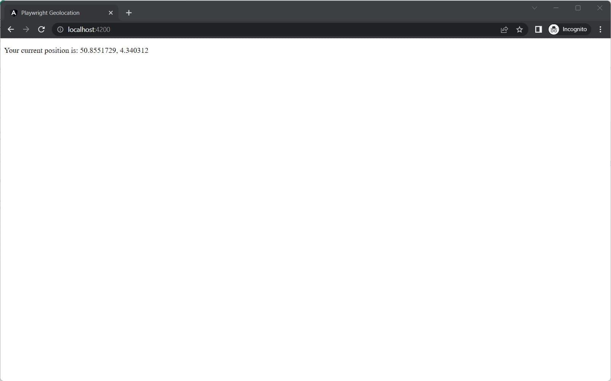

In this blog post, we go over the basics of how to use the [Geolocation API](https://developer.mozilla.org/en-US/docs/Web/API/Geolocation_API) with [Playwright](https://playwright.dev/).

You might have already written some code to get access to the user's location.
Even if you haven't, you probably have already seen the browser asking for permission to access your location.
This is not different in Playwright tests.

When your application tries to access the location during a test, the same prompt will appear.



This is blocking the test execution, and after a few seconds, it results in a timeout.
Luckily we don't have to click the "Allow" button manually for every test.

## Giving permission to use the location

To get rid of the prompt, we need to configure Playwright to have permission to use the location.
This is done in the Playwright config file, via the [use](https://playwright.dev/docs/api/class-testconfig#test-config-use) option.

```ts{5}:playwright.config.ts
const config: PlaywrightTestConfig = {
	testDir: './tests',
	use: {
		trace: 'on-first-retry',
		permissions: ['geolocation'],
	},
};
```

While this grants permission to the browser context to read the user's location, it doesn't actually set the location.



## Setting the location

We're over the first hurdle, but we still need to set the location.

### Provide a global geolocation configuration

To set the location globally, we set the `geolocation` option in the Playwright config file to emulate a user's location.

```ts{6}:playwright.config.ts
const config: PlaywrightTestConfig = {
	testDir: './tests',
	use: {
		trace: 'on-first-retry',
		permissions: ['geolocation'],
		geolocation: { latitude: 50.8551729, longitude: 4.340312 },
	},
};
```

When we run the test now, the application receives the coordinates and the location is set.



### Stubbing the location for a specific test(s)

To set the location for a specific test, inject the browser context in the test (`context`), and set the location with the `setGeolocation()` method.

```ts{4-5}:tests/coords.test.ts
import { test, expect } from '@playwright/test';

test("the user's location is shown", async ({ page, context }) => {
	const coords = { latitude: 50.9245541, longitude: 5.2435062 };
	context.setGeolocation(coords);

	await page.goto('http://localhost:4200');

	await expect(page.locator('p')).toHaveText(
		`Your current position is: ${coords.latitude}, ${coords.longitude}`,
	);
});
```

When multiple tests need to overwrite the location, you can also set the location for all tests within a file.

```ts{3-9}:tests/coords.test.ts
import { test, expect } from '@playwright/test';

// set the location for all tests within this file
test.use({
	geolocation: {
		latitude: 50.8841204,
		longitude: 4.635328,
	},
});

test("the user's location is shown", async ({ page }) => {
	await page.goto('http://localhost:4200');

	await expect(page.locator('p')).toHaveText(
		`Your current position is: 50.8841204, 4.635328`
	);
});
```

Or, set the location for all tests within a `describe` block.

```ts{4-10}:tests/coords.test.ts
import { test, expect } from '@playwright/test';

test.describe("User's location", () => {
	// set the location for all tests within the describe block
	test.use({
		geolocation: {
			latitude: 50.8841204,
			longitude: 4.635328,
		},
	});

	test("the user's location is shown", async ({ page }) => {
		await page.goto('http://localhost:4200');

		await expect(page.locator('p')).toHaveText(
			`Your current position is: 50.8841204, 4.635328`
		);
	});
});
```
