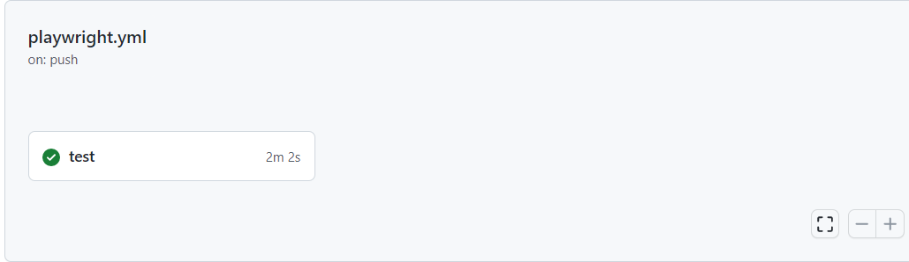
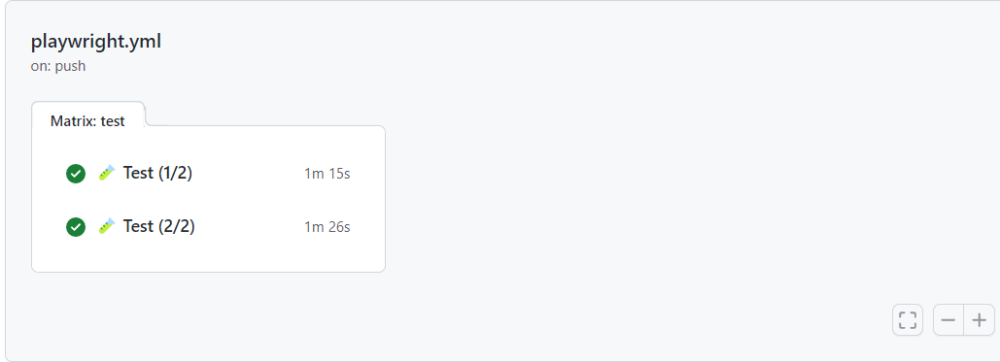
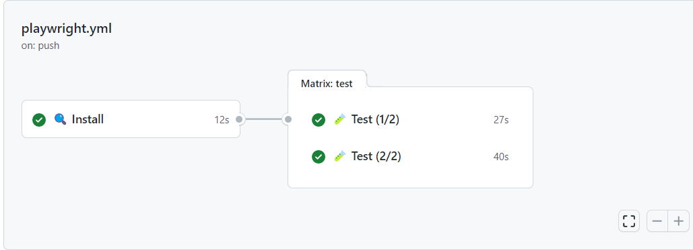

Using the test sharding technique means that the test suite is separated into multiple chunks (shards).
This can drastically improve the execution time when the different shards are tested simultaneously.
To accomplish this, the test shards need to be distributed to different machines.

In this post, we'll specifically take a look at how to shard your [Playwright](https://playwright.dev/) test suite.
To take full advantage of the test shards, we're also configuring a GitHub Workflow to run these tests in parallel during a CI run.

## Shards in Playwright

Playwright supports the [shard feature](https://playwright.dev/docs/test-parallel#shard-tests-between-multiple-machines) by using the `shard` option that can be passed via the CLI when you run the test command.
Test sharding with Playwright is especially useful when the test suite is run against multiple browsers or devices.

Let's say you run your Playwright tests against two different browsers.
By default, the test command runs the same tests against the two browsers.
But, by partitioning the workflow into two shards, we get:

- one shard to run the test suite against browser one;
- the other shard to run the same test suite against the second browser;

As an example. let's take a look at the following commands.
While passing the `shard` option to the `test` command, the first number (numerator) represents the shard to run, and the second number (denominator) is the amount of shards in which the test suite is split.

```bash
# run against browser one
npx playwright test --shard=1/2
  Running 25 tests using 1 worker, shard 1 of 2
  25 passed (17s)

# run against browser two
npx playwright test --shard=2/2
  Running 25 tests using 1 worker, shard 2 of 2
  25 passed (19s)
```

When the above commands are translated into a GitHub Workflow, we get the following result.

```yml{13-17}
jobs:
  test:
    steps:
    - uses: actions/checkout@v3
    - uses: actions/setup-node@v3

    - name: Install dependencies
      run: npm ci

    - name: Install Playwright Browsers
      run: npx playwright install --with-deps

    - name: Run Playwright tests (1/2)
      run: npx playwright test --shard=1/2

    - name: Run Playwright tests (2/2)
      run: npx playwright test --shard=2/2
```



## GitHub Workflow Jobs

Simply using test shards doesn't change anything in comparison to the normal test command.
The tests are sharded but are still run in serial, one after each other.
To take advantage of the test shards, these test shards must be run in parallel.

To run multiple tasks in parallel, the GitHub or Azure DevOps workflow needs to be divided into jobs.
In the example below, two jobs are created and each job runs its shard.

```yml{14-15,29-30}
jobs:
  test-one:
    name: 🧪 Test (1/2)
    steps:
    - uses: actions/checkout@v3
    - uses: actions/setup-node@v3

    - name: Install dependencies
      run: npm ci

    - name: Install Playwright Browsers
      run: npx playwright install --with-deps

    - name: Run Playwright tests
      run: npx playwright test --shard=1/2

  test-two:
    name: 🧪 Test (2/2)
    steps:
      - uses: actions/checkout@v3
      - uses: actions/setup-node@v3

      - name: Install dependencies
        run: npm ci

      - name: Install Playwright Browsers
        run: npx playwright install --with-deps

      - name: Run Playwright tests
        run: npx playwright test --shard=2/2
```



### GitHub Workflow Matrix

As you can see in the above workflow, most of the steps are duplicated in the two jobs.
In fact, only the `shard` option is different.
This can become very bloaty, and it also consumes resources and time to maintain the workflow.

Now, imagine having more than two shards and also that the job is more complex (e.g. more steps).
You can already see that this can become an issue in the future.

To improve the workflow, introduce a matrix in which the different shards options are defined.

After moving the shards in a matrix, the refactored workflow looks like this.

```yml{4-6,17-18}
jobs:
  test:
    name: name: 🧪 Test (${{ matrix.shard }}/${{ strategy.job-total }})
    strategy:
      matrix:
        shard: [1, 2]
    steps:
    - uses: actions/checkout@v3
    - uses: actions/setup-node@v3

    - name: Install dependencies
      run: npm ci

    - name: Install Playwright Browsers
      run: npx playwright install --with-deps

    - name: Run Playwright tests
      run: npx playwright test --shard=${{ matrix.shard }}/${{ strategy.job-total }}
```


### GitHub Workflow Caching

As you can notice, a matrix can improve the readability of the workflow, making it is clean because the duplication is removed.
Much better, but we can do better.

The result is that there are now two `test` jobs that are repeating the same "pre"-steps.
Because each job is run on a different machine, this also means that the `install` (node dependencies and Playwright binaries) step is also run twice.

If this becomes a problem _- in most cases this isn't -_ the solution is to add caching.
To do this, break the `test` job into two separate jobs, an `install` job, and a `test` job.

- The `install` job installs the required dependencies and adds them to a cache.
- Instead of installing the dependencies in the `test` job, the `test` job now reads from the build-up cache in the previous step.

Resulting in the following workflow.

```yml:playwright.yml
name: Playwright Tests

jobs:
  install:
    timeout-minutes: 60
    name: 🔍 Install
    runs-on: ubuntu-latest
    steps:
      - uses: actions/checkout@v3
      - uses: actions/setup-node@v3

      - name: Cache node_modules
        uses: actions/cache@v3
        id: cache-node-modules
        with:
          path: |
            node_modules
          key: modules-${{ hashFiles('package-lock.json') }}

      - name: Cache Playwright binaries
        uses: actions/cache@v3
        id: cache-playwright
        with:
          path: |
            ~/.cache/ms-playwright
          key: playwright-${{ hashFiles('package-lock.json') }}

      - name: Install dependencies
        if: steps.cache-node-modules.outputs.cache-hit != 'true'
        run: npm ci

      - name: Install Playwright Browsers
        if: steps.cache-playwright.outputs.cache-hit != 'true'
        run: npx playwright install --with-deps

  test:
    name: 🧪 Test (${{ matrix.shard }}/${{ strategy.job-total }})
    needs: install
    timeout-minutes: 60
    runs-on: ubuntu-latest
    strategy:
      fail-fast: false
      matrix:
        shard: [1, 2]
    steps:
      - uses: actions/checkout@v3
      - uses: actions/setup-node@v3

      - name: Cache node_modules
        uses: actions/cache@v3
        with:
          path: |
            node_modules
          key: modules-${{ hashFiles('package-lock.json') }}

      - name: Cache Playwright
        uses: actions/cache@v3
        with:
          path: |
            ~/.cache/ms-playwright
          key: playwright-${{ hashFiles('package-lock.json') }}

      - name: Run Playwright tests
        run: npx playwright test --shard=${{ matrix.shard }}/${{ strategy.job-total }}

      - uses: actions/upload-artifact@v3
        if: always()
        with:
          name: playwright-report-${{ matrix.shard }}_${{ strategy.job-total }}
          path: playwright-report
          retention-days: 30
```



Because the intallation step is removed, this also lowers the time it takes to run the workflow.
But it doesn't come without a cost, adding a caching layer need to be maintained, and can also result in hard to find bugs.

## Result

Combining test shards with parallel jobs helps to keep the time it takes to run your test suite to a bare minimum.

As an example, take a look at the demo GitHub repository "[playwright-sharding](https://github.com/timdeschryver/playwright-sharding)", which I've used to test the shard option with Playwright.
The following commits are made to improve a default workflow to a workflow that uses shards, GitHub jobs, and caching:

- [init](https://github.com/timdeschryver/playwright-sharding/commit/25eea0418fe43d9b872ebc4f09e0ced8c7c51e41)
- [add shards](https://github.com/timdeschryver/playwright-sharding/commit/0b2e2b6bf3dafd1b036b74928be6740972c37eb8)
- [cache node_modules and binaries](https://github.com/timdeschryver/playwright-sharding/commit/a27cc50bd8cb34d5ecc41c5627da4fb73f60b8c3)

### Before


### After


This post is inspired by the following tweet, showcasing the new [`shard` option](https://jestjs.io/docs/next/cli#--shard) in [Jest 28](https://jestjs.io/blog/2022/04/25/jest-28).

https://twitter.com/diegohaz/status/1526184439830781952
