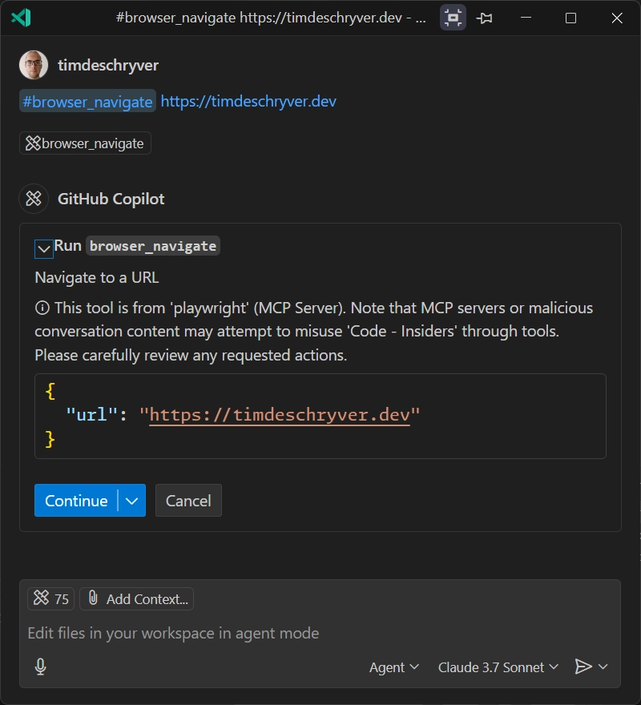
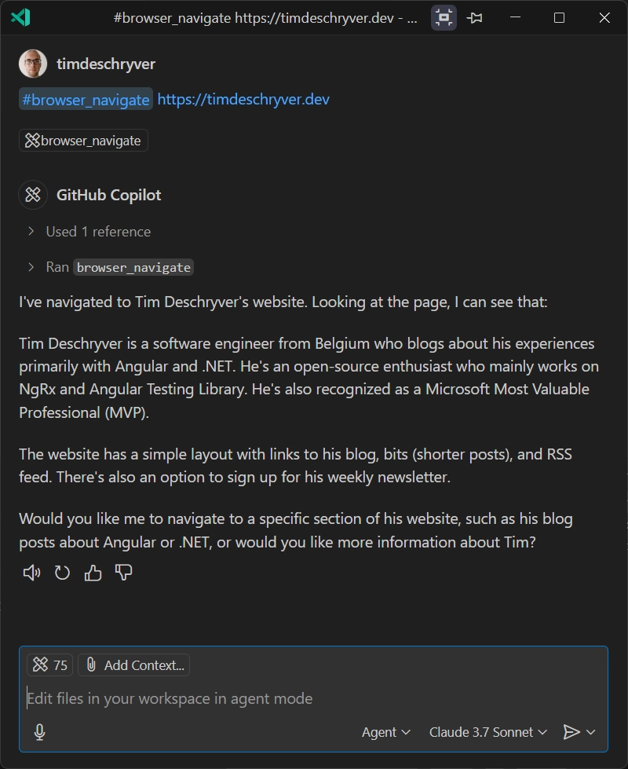
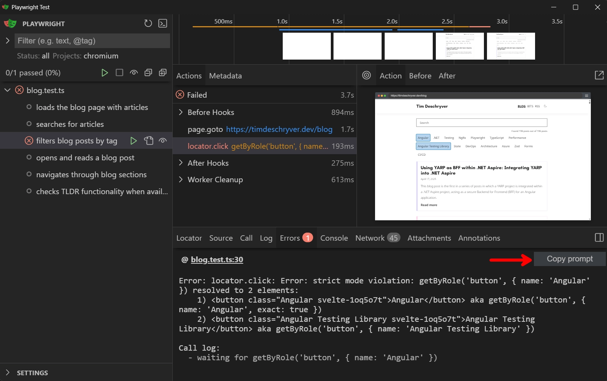
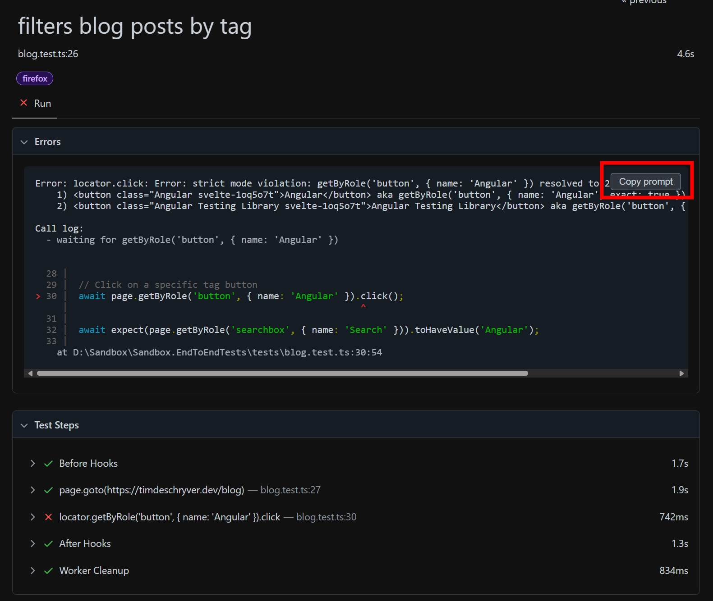

I have been using Playwright for some time now, and I think it's the best tool for end-to-end testing.
Playwright is fast, reliable, and has a great and intuitive API.
It also has a great Developer Experience, for example, it's easy to automate the writing process of your tests using the [`codegen` command](https://playwright.dev/docs/codegen#running-codegen). With `codegen`, it records your actions and generates the test code in the background while you interact with your application. In recent versions, the codegen UI also has more features, like the ability to add assertions and capture an ARAI snapshot.

I'm also more and more interested in AI and how it can help me in my daily work.
While it didn't convince me at first, the [GitHub Copilot agent mode](https://code.visualstudio.com/blogs/2025/02/24/introducing-copilot-agent-mode) and the [Model Context Protocol (MCP)](https://modelcontextprotocol.io/introduction) have changed my mind. I find these two features very interesting and something I want to explore more because I believe they can help me to be more productive.

:::tip
I really like this [Visual Guide To MCP Ecosystem](https://block.github.io/goose/blog/2025/04/10/visual-guide-mcp/) of what MCP is by [Ebony Louis](https://x.com/ebonyjlouis), in which she uses James Bond as an analogy.
Give it a read!
:::

Because of my recent interest in AI, and my passion for Playwright, I wanted to combine the two and see how they work together. I'm curious about the AI capabilities that Playwright has to offer and want to test if it can help me write tests for an application.

Some criteria I have in mind to evaluate the AI capabilities of Playwright are:

- Are the tests relevant?
- How good or bad is the quality of the test?
- Are the tests green on the first run?
- How's the process of using AI to write a Playwright test, is it easy to prompt?

To write a good test we need to have a good understanding of the application we want to test (this is the context).
Previously, it was difficult to provide context to the AI, but with the introduction of the Model Context Protocol (MCP) and the Playwright MCP server, this is now possible. At least, that's what I want to find out.

For this PoC, I will use my blog as the application to test.

## Installing the Playwright MCP

Add the following settings to your VSCode's `settings.json` file to install the [Playwright MCP](https://github.com/microsoft/playwright-mcp).
The server installs the Playwright MCP through `npm`, so make sure you have it installed on your machine.

```json:settings.json
{
	"mcp": {
		"servers": {
			"playwright": {
				"command": "npx",
				"args": ["-y", "@playwright/mcp@latest"]
			}
		}
	}
}
```

After that, you should see the Playwright MCP tools in the list of available tools.


This allows you to run certain playwright commands via GitHub Copilot's agent mode. To run the commands, use the hashtag (`#`) prefix in your prompt.

The Playwright commands all start with `browser_`, followed by the command you want to run. The most important command in the context of this blog post is the one to navigate to a webpage, which is `#browser_navigate`.

To try it out, open a new chat in the Copilot chat and type the following command:

```txt
#browser_navigate https://timdeschryver.dev
```

After running the command, you are asked for permission to run the command.



After you permit to the agent, it executes the command, resulting in a browser window that opens the page.
For this simple prompt, it gives a summary of the page.



## Vibe coding a test

So far, this is nothing special, as you could also reference the same page in your prompt and ask for a summary.
But, the real power is that it's now possible to let the agent interact with the page and perform user actions, like clicking buttons, filling out forms, and even validating the results of those actions. Previously, I also had rare occasions where I couldn't fetch the page (e.g. using the `#fetch` tool) because the page required authentication, or required JavaScript to be executed. This becomes possible now with the Playwright MCP server.

Let's try it out more and ask the agent to write a test for the [blog page](/blog) of my blog using Playwright.
The blog page displays a list of blog posts and has a search input to filter the posts, which can be used with a search text or by clicking on a tag.

The prompt I used is the most basic one I could think of and simply asks the agent to write a test for the blog page using the `#browser_navigate` tool.

```txt
Interact with my website and take a look at the functionalities.
When you have enough information please test for this page.
#browser_navigate https://timdeschryver.dev/blog
```

While the agent interacts with the page, it can also ask more permissions to run commands, like clicking on a button or filling out a form.

After Copilot is finished, I notice that a new `blog.test.ts` file is created in the `tests` folder.
In the chat, I can also see the progress of the agent while it writes the test, and the functionalities it detected on the page.

Here's a trimmed-down excerpt of the output.

```txt
1. Basic Blog Page Test
    - Verifies the page title is correct
    - Checks that navigation elements (BLOG, BITS, and RSS) are visible
    - Confirms the search box is present
    - Checks that blog post counter text is displayed
    - Verifies filter tags like Angular and .NET are available
    - Ensures blog posts are displayed with titles and "Read more" links
2. Tag Filtering Test
    - Captures the initial count of blog posts
    - Clicks on the "Angular" tag filter
    - Verifies that the post count decreases (confirming the filter works)
    - Checks that only filtered posts are shown
3. Search Functionality Test
    - Tests searching for "Angular" in the search box
    - Verifies that search results update dynamically
    - Confirms that search results contain posts related to the search term
4. Blog Post Navigation Test
    - Clicks on a blog post title
    - Verifies navigation to the individual post page
    - Confirms that the post title on the detail page matches what was clicked
5. TLDR Functionality Test
    - Checks TLDR functionality when available
    - Confirms that the TLDR text is displayed correctly
```

By simply looking at the output, I was already impressed and confident that the test would be relevant.
Now, the question is, how's the quality of the test cases?

### The test code

The tests that are generated (with Claude 3.7) are the following:

- loads the blog page with articles
- searches for articles
- filters blog posts by tags
- opens and reads a blog post
- checks TLDR functionality when available

To not go through all tests, let's scope into the ones that are the most important to me, being the ones that open a blog post and the one that verifies the search functionality.
Looking at the different two cases should give us a good idea of the quality of the tests that are generated by the agent.

The test to open a blog post is the simplest one.
It navigates to the blog page, gets the first article's title, clicks on the "Read more" link, and verifies that the article page is opened and that the title is displayed.
There's nothing fancy about this, but it does the job.

```ts
test('opens and reads a blog post', async ({ page }) => {
	await page.goto('https://timdeschryver.dev/blog');

	// Get the first article's title
	const firstArticle = page.getByRole('article').first();
	await expect(firstArticle.getByRole('heading', { level: 2 })).toBeVisible();
	const articleTitle = await firstArticle.getByRole('heading', { level: 2 }).textContent();

	// Click on "Read more" link of the first article
	await firstArticle.getByRole('link', { name: 'Read more' }).click();

	// Verify we're on the article page
	await expect(page).toHaveURL(/\/blog\/.+/);

	// Check that the article title is displayed on the article page
	const mainContent = page.getByRole('main');
	await expect(mainContent.getByRole('heading').first()).toContainText(articleTitle);
});
```

Looking at the test, I can see that it uses the `getByRole` method to get the elements on the page, which is a good practice. It also uses the `toBeVisible` assertion, which is preferred over `isVisible` because it waits for the element to be visible and retries this until the element is visible, or until it timeouts. This is a good practice, as it makes the test more reliable. If I were to write this test, I would have ended up with a similar test, so I think the quality is good.

The second test is the one that verifies the search functionality.
This test is a bit more complex, as it needs to interact with the search input and verify that the results are filtered correctly. It looks like this:

```ts
test('searches for articles', async ({ page }) => {
	await page.goto('https://timdeschryver.dev/blog');

	// Get initial article count before filtering
	const initialArticles = page.getByRole('article');
	const initialCount = await initialArticles.count();
	expect(initialCount).toBeGreaterThan(0);

	// Check if the search box is visible and fill it with a search term
	const searchTerm = 'Angular';
	await page.getByRole('searchbox', { name: 'Search' }).fill(searchTerm);

	// Verify search results contain the search term
	const articles = page.getByRole('article');
	await expect(articles.first()).toBeVisible();
	expect(await articles.first().textContent()).toContain(searchTerm);

	// Check if at least one article in the search results contains the search term
	const articleCount = await articles.count();
	expect(articleCount).toBeGreaterThan(0);

	// Verify that the article count is less than the initial count
	expect(articleCount).toBeLessThan(initialCount);
});
```

Again, the test looks good to me. I also like it that it compares the count before and after the filter, and that it verifies that the search term is present in the first article. This is a good way to verify that the filtering actually works. The only thing I don't like is that it verifies that the first article is visible, which is not really necessary, and is a duplicate assertion.

When running the test suite, these tests turned green on the first run.
But, the other tests that were generated, like the one that filters by tags, are currently failing.

```ts
test('filters blog posts by tag', async ({ page }) => {
	await page.goto('https://timdeschryver.dev/blog');

	// Click on a specific tag button
	await page.getByRole('button', { name: 'Angular' }).click();

	// Wait for page to update with filtered results
	await page.waitForFunction(() => document.querySelector('body')?.textContent?.includes('Found'));

	// Get filtered article count
	const filteredArticles = page.getByRole('article');
	const filteredCount = await filteredArticles.count();

	// If filtering works, it should show a different number of articles
	// but not zero (there should be Angular articles)
	expect(filteredCount).toBeGreaterThan(0);
});
```

By looking at the failing test, can you spot the problem?
Of course this is hard, so let me help you by providing you the the failure message.

```txt
Error: locator.click: Error: strict mode violation: getByRole('button', { name: 'Angular' }) resolved to 2 elements:
    1) <button class="Angular svelte-1oq5o7t">Angular</button> aka getByRole('button', { name: 'Angular', exact: true })
    2) <button class="Angular Testing Library svelte-1oq5o7t">Angular Testing Library</button> aka getByRole('button', { name: 'Angular Testing Library' })

Call log:
  - waiting for getByRole('button', { name: 'Angular' })
```

When we read the error message, we can see that the test is failing because it can't find a unique button with the name "Angular". If you're not familiar with Playwright, this can be a problem that is hard to solve, for which you will probably need to look at the documentation or search for the solution online.
The same applies to harder problems.

## Copy as prompt

As usual, the Playwright team is always thinking about the developer experience and how to improve it.
For this problem, the team has added a feature to copy the error message as a prompt.
This allows you to copy the error message and paste it in the chat, in order for the agent to try to solve the problem for you.

You can find this "copy as prompt" button in two ways.

1. In the UI mode (while running `npx playwright test --ui`) it's located in the "Error" tab.



1. Within the reports, it's located on the details page of the test that failed.



When you click on the button, it copies the prompt to your clipboard, which can directly be pasted into the Copilot chat window.
The prompt contains some basic instructions, the error message containing the stack trace, an ARIA snapshot of the page, and the test source code.

````txt
# Instructions

- Following Playwright test failed.
- Explain why, be concise, respect Playwright best practices.
- Provide a snippet of code with the fix, if possible.
# Test info

- Name: filters blog posts by tag
- Location: D:\Sandbox\Sandbox.EndToEndTests\tests\blog.test.ts:26:1

# Error details

```
Error: locator.click: Error: strict mode violation: getByRole('button', { name: 'Angular' }) resolved to 2 elements:
    1) <button class="Angular svelte-1oq5o7t">Angular</button> aka getByRole('button', { name: 'Angular', exact: true })
    2) <button class="Angular Testing Library svelte-1oq5o7t">Angular Testing Library</button> aka getByRole('button', { name: 'Angular Testing Library' })

Call log:
  - waiting for getByRole('button', { name: 'Angular' })

    at D:\Sandbox\Sandbox.EndToEndTests\tests\blog.test.ts:30:54
```

# Page snapshot

```yaml
ARIA snapshot is emitted for brevity
```

# Test source

```ts
   1 | import { test, expect } from '@playwright/test';
   2 |
   26 | test('filters blog posts by tag', async ({ page }) => {
   27 | 	await page.goto('https://timdeschryver.dev/blog');
   28 |
   29 | 	// Click on a specific tag button
>  30 | 	await page.getByRole('button', { name: 'Angular' }).click();
      | 	                                                    ^ Error: locator.click: Error: strict mode violation: getByRole('button', { name: 'Angular' }) resolved to 2 elements:
   31 |
   32 |
   33 |
   34 | 	// Wait for page to update with filtered results
   35 | 	await page.waitForFunction(() => document.querySelector('body')?.textContent?.includes('Found'));
   36 |
   37 | 	// Get filtered article count
   38 | 	const filteredArticles = page.getByRole('article');
   39 | 	const filteredCount = await filteredArticles.count();
   40 |
   41 | 	// If filtering works, it should show a different number of articles
   42 | 	// but not zero (there should be Angular articles)
   43 | 	expect(filteredCount).toBeGreaterThan(0);
   44 | });
```
````

When I pasted the prompt in the chat, I got a response that explained the problem, why this occurs, and provided a solution. When it solved the problem, Copilot also wanted to run the test to verify that the solution fixed the test.

If you're wondering, the solution was to use the `exact` option to make sure that only one button is selected.

```ts
await page.getByRole('button', { name: 'Angular', exact: true }).click();
```

## Conclusion

In this blog post, I wanted to explore the AI capabilities of Playwright and how it can help me to write tests for my application.

My first impression is that this is promising.
The tests that are generated are relevant and of good quality. It's not perfect, but it's a good start.
For example, I would like to have more assertions in the tests, like verifying that the search input contains the correct search term after clicking on a tag. But, this is something that can easily be added by us when we review the tests.

The examples of this blog post are performed in an empty project. When using this technique in a real project, the agent uses the source code to understand the context better and thus also generate better tests. It also makes use of team standards when generating the tests, e.g. it can detect ESLint warnings and errors of [ESLint Plugin Playwright](https://github.com/playwright-community/eslint-plugin-playwright#readme) and update the code accordingly.

I can see that this is a great way to start introducing tests in a project or to get a head start when writing tests for a new feature. It can also be a gentle way to get to learn Playwright and how to write tests with it.
