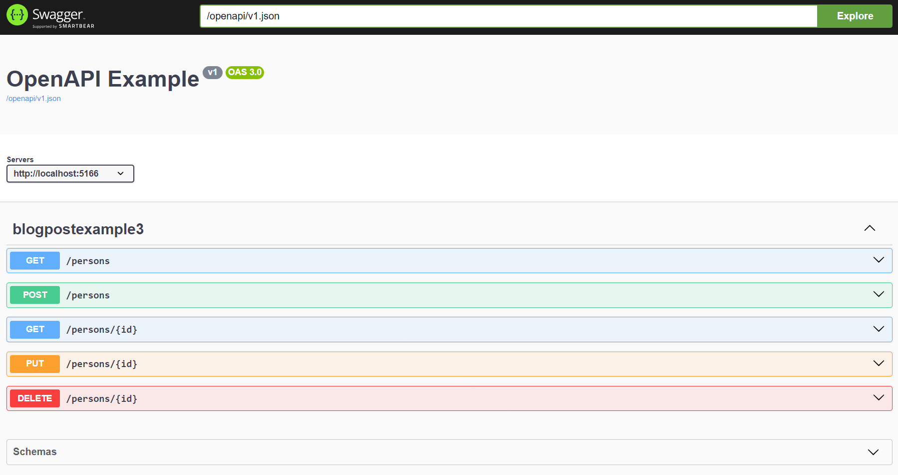
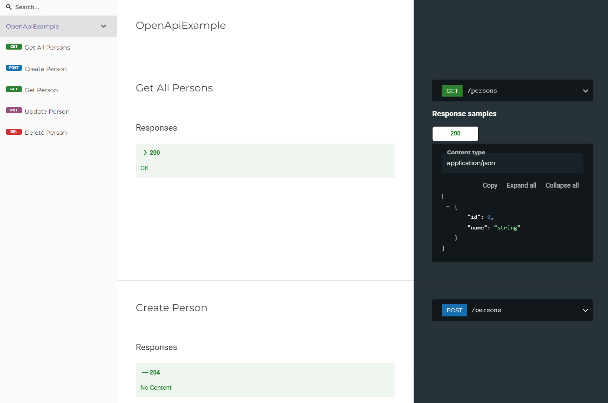
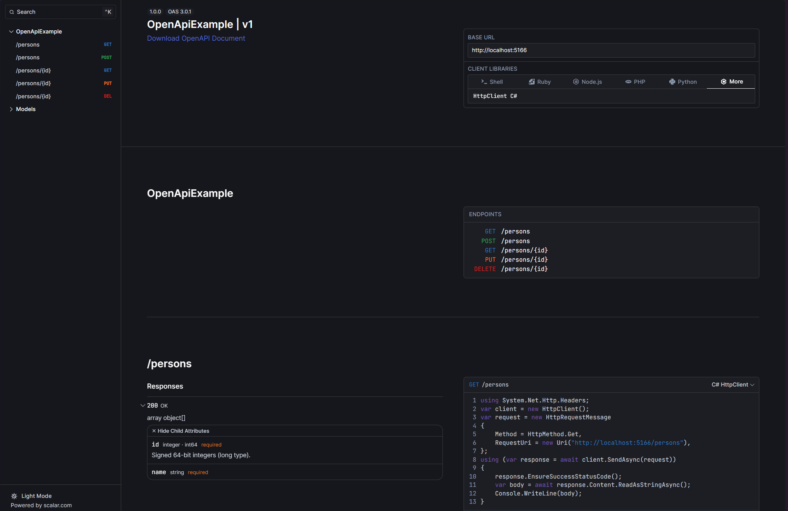

For over a year, the ASP.NET teams has been working on their own built-in implementation (`Microsoft.AspNetCore.OpenApi`) to generate an OpenAPI document. Until now you could opt-in to this new behavior, but from ASP.NET 9 this changes, making it the default.

Let's take a look at what this means for your API documentation and go through some options to render the OpenAPI document (as this isn't included).

> The Microsoft.AspNetCore.OpenApi package provides built-in support for OpenAPI document generation in ASP.NET Core. The package provides the following features:
>
> - Support for generating OpenAPI documents at run time and accessing them via an endpoint on the application.
> - Support for "transformer" APIs that allow modifying the generated document.
> - Support for generating multiple OpenAPI documents from a single app.
> - Takes advantage of JSON schema support provided by System.Text.Json.
>   -Is compatible with native AoT.

## Current behavior

Scaffolding a new ASP.NET 8 WebAPI project resulted in the following `Program.cs` file.
Here, we can see that the project relied on using Swashbuckle (`Swashbuckle.AspNetCore`) to generate the OpenAPI document, as well as rendering the documentation using Swagger UI.

```cs{3-4, 10-11}:Program.cs
var builder = WebApplication.CreateBuilder(args);

builder.Services.AddEndpointsApiExplorer();
builder.Services.AddSwaggerGen();

var app = builder.Build();

if (app.Environment.IsDevelopment())
{
    app.UseSwagger();
    app.UseSwaggerUI();
}

app.UseHttpsRedirection();

app.Run();
```

## New behavior (ASP.NET 9)

Starting from ASP.NET 9, Swashbuckle is no longer a dependency in the project template, resulting the following new `Program.cs` file.

```cs{3,9}:Program.cs
var builder = WebApplication.CreateBuilder(args);

builder.Services.AddOpenApi();

var app = builder.Build();

if (app.Environment.IsDevelopment())
{
    app.MapOpenApi();
}

app.UseHttpsRedirection();

app.Run();
```

The new behavior uses the `AddOpenApi()` and `MapOpenApi()` extension methods, which are imported from the [`Microsoft.AspNetCore.OpenApi` NuGet package](https://www.nuget.org/packages/Microsoft.AspNetCore.OpenApi/), to register and enable the OpenAPI middleware.

The middleware is responsible for generating the [OpenAPI document](https://www.openapis.org/what-is-openapi/) based on the API endpoints (Controllers and Minimal endpoints) in the application.

With the default settings, the OpenAPI document is available at `/openapi/v1.json`.
To access the OpenAPI document, you can navigate to the URL `https://localhost:{port}/openapi/v1.json`.

As you can see, there's no longer a UI part to render the OpenAPI document within a human-friendly interface.
The package "only" is in charge of the generation process, it is not responsible for rendering the OpenAPI document.

:::note
If you want, you can resort to the old behavior and still rely on [Swashbuckle](https://github.com/domaindrivendev/Swashbuckle.AspNetCore)'s or [NSwag](https://github.com/RicoSuter/NSwag)'s packages to generate the OpenAPI document.
But I strongly recommend to use the new `Microsoft.AspNetCore.OpenApi` package as it's maintained by the ASP.NET team and it will follow the latest developments.
:::

## (Re-)Render the OpenAPI document

As I've mentioned before, the biggest difference between the old and new behavior is that a UI interface is no longer included in the project template.

This means that you need to provide your own solution to render the OpenAPI document based on the generated file.

Luckily, you don't have to start from scratch for doing this.
Because OpenAPI is an established and thus well-known specification, there are products available that can render the OpenAPI document. Most of them are also available in the .NET ecosystem.

If you prefer, you can still resort to Swagger UI, but as you will see, there are more tools that can efficiently render the OpenAPI document.
These new(er) tools are more flexible and provide more features compared to Swagger UI, so I think it's worth considering them now that you have the opportunity.

### Swagger UI

If you still want to use [Swagger UI](https://swagger.io/tools/swagger-ui/), you can add the following code to your project.

Instead of adding the full-blown Swashbuckle package, you can just use the `Swashbuckle.AspNetCore.SwaggerUI` package, which only contains the Swagger UI interface.

```bash
dotnet add package Swashbuckle.AspNetCore.SwaggerUI
```

Alternatively, you can use NSwag's version with the `NSwag.AspNetCore` package (note that the implementation is slightly different).

After adding the package, you can use `UseSwaggerUI()` to render the OpenAPI document using Swagger UI.
Because the OpenAPI document is now available at `/openapi/v1.json`, you need to define the document path in the Swagger UI options.

```cs{10-13}:Program.cs
var builder = WebApplication.CreateBuilder(args);

builder.Services.AddOpenApi();

var app = builder.Build();

if (app.Environment.IsDevelopment())
{
    app.MapOpenApi();
    app.UseSwaggerUI(options =>
    {
        options.SwaggerEndpoint("/openapi/v1.json", "OpenAPI V1");
    });
}

app.UseHttpsRedirection();

app.Run();
```

Now, when you navigate to `https://localhost:{port}/swagger`, you will see the Swagger UI interface.



The advantage of using Swagger UI is that it's a well-known tool that provides a clean and user-friendly interface to render the OpenAPI document.
However, it's not as feature-rich as the other tools.

### Redoc

[Redoc](https://redocly.com/docs/redoc) is another tool that can render the OpenAPI document.
It's the free version of the Redocly API documentation tool, which provides additional features and integrations.

To use Redoc, install the `Swashbuckle.AspNetCore.ReDoc` package.

```bash
dotnet add package Swashbuckle.AspNetCore.ReDoc
```

Alternatively, you can use NSwag's version with the `NSwag.AspNetCore` package (note that the implementation is slightly different).

After installing the package, use the `UseReDoc()` method to render the OpenAPI document using Redoc. Because the OpenAPI document is now available at `/openapi/v1.json`, you need to specify the document path in the ReDoc options.

```cs{10-13}:Program.cs
var builder = WebApplication.CreateBuilder(args);

builder.Services.AddOpenApi();

var app = builder.Build();

if (app.Environment.IsDevelopment())
{
    app.MapOpenApi();
    app.UseReDoc(options =>
    {
        options.SpecUrl("/openapi/v1.json");
    });
}

app.UseHttpsRedirection();

app.Run();
```

After this, when you go to `https://localhost:{port}/api-docs` you will see the Redoc interface.



The advantage of using Redoc is that it provides a more clean and modern interface compared to Swagger UI, in my opinion. This makes it easier to navigate and read the OpenAPI document.

### Scalar

The last alternative is [Scalar](https://scalar.com/), which is the newest tool in this list.

You can install the `Scalar.AspNetCore` package to use Scalar.

```bash
dotnet add package Scalar.AspNetCore
```

Afterward, you can use the `MapScalarApiReference()` method to render the OpenAPI document using Scalar.

```cs{10}:Program.cs
var builder = WebApplication.CreateBuilder(args);

builder.Services.AddOpenApi();

var app = builder.Build();

if (app.Environment.IsDevelopment())
{
    app.MapOpenApi();
    app.MapScalarApiReference();
}

app.UseHttpsRedirection();

app.Run();
```

To visit the documentation, navigate to `https://localhost:{port}/scalar/v1`.



The advantage of using Scalar is that it provides the most feature-rich interface compared to Swagger UI and Redoc. It has built-in themes, a search function, and provides code examples to consume the API endpoints in different programming languages.

## Conclusion

As we've seen in this blog post, the Swashbuckle package is no longer a default dependency in the project template starting from ASP.NET 9.

Instead, the new `Microsoft.AspNetCore.OpenApi` package is used to generate the OpenAPI document based on the API endpoints in the application. It takes the information from traditional controllers as well as minimal endpoints.

But, it does not include a way to render the OpenAPI document. For this task, you're required to bring your own interface to render the documentation.
Luckily, you can still use Swagger UI, Redoc, or Scalar to render the OpenAPI document.

If you want to try them all out, install the packages and configure all of them at once.

```cs{3-4,10-11,13-18,20-25,27-29}:Program.cs
var builder = WebApplication.CreateBuilder(args);

// Generate OpenAPI document
builder.Services.AddOpenApi();

var app = builder.Build();

if (app.Environment.IsDevelopment())
{
    // Register an endpoint to access the OpenAPI document
    app.MapOpenApi();

    // Render the OpenAPI document using Swagger UI
    // Available at https://localhost:{port}/swagger
    app.UseSwaggerUI(options =>
    {
        options.SwaggerEndpoint("/openapi/v1.json", "OpenAPI V1");
    });

    // Render the OpenAPI document using Redoc
    // Available at https://localhost:{port}/api-docs
    app.UseReDoc(options =>
    {
        options.SpecUrl("/openapi/v1.json");
    });

    // Render the OpenAPI document using Scalar
    // Available at https://localhost:{port}/scalar/v1
    app.MapScalarApiReference();
}

app.UseHttpsRedirection();

app.Run();
```

## Further reading

Take a look at the official Microsoft documentation @ [learn.microsoft](https://learn.microsoft.com/en-us/aspnet/core/fundamentals/openapi/aspnetcore-openapi?view=aspnetcore-9.0&tabs=visual-studio,minimal-apis) to learn more about the new OpenAPI middleware in ASP.NET 9.
This documentation provides more information about the OpenAPI middleware, as it also shows how to customize the OpenAPI document.

If you want to learn more about the OpenAPI specification, visit the [OpenAPI website](https://www.openapis.org/what-is-openapi/).

Take a look at the project's documentation to learn how to customize the UI interface, e.g. to add an authentication layer before accessing the OpenAPI document.

- [Swagger UI](https://github.com/domaindrivendev/Swashbuckle.AspNetCore?tab=readme-ov-file#enable-oauth20-flows/)
- [Redoc](https://github.com/domaindrivendev/swashbuckle.aspnetcore?tab=readme-ov-file#swashbuckleaspnetcoreredoc)
- [Scalar](https://github.com/scalar/scalar/blob/main/documentation/integrations/dotnet.md#authentication)
