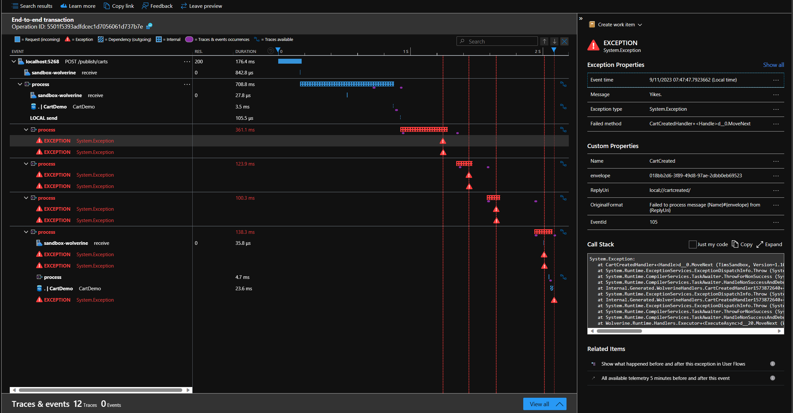
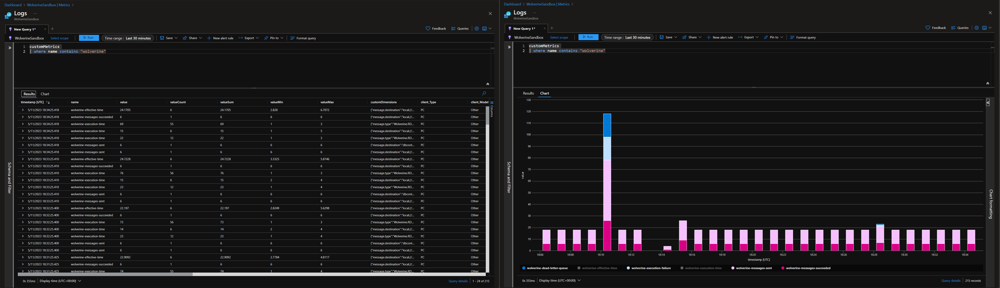

The last month I've been on a journey to explore [Wolverine](https://wolverine.netlify.app/), which you have noticed in my [blogging pattern](/blog?q=wolverine). In this post, I'm taking the next steps in that journey by taking a look at the integration between Wolverine and OpenTelemetry.

Not surprisingly, Wolverine continues the trend of being extremely developer-friendly, as it already has observability built into the library.
By just adding two simple lines of configuration code we enable its tracing and metrics capabilities **without having to change our application code**.

But why should you care?
To answer that question we need to take a few steps back, and first go through the benefits that Observability and OpenTelemtry bring to the table.
At the end of the post, you'll see the power of it.

## Observablity

Observability in terms of software systems means that it can expose data about the internal health of an application.
The data comes in three different flavors, (structured) logs, traces, and metrics, also known as the **three pillars of observability**.

You probably already know and make use of application logging, logs record events within an application and contain contextual information.
While traces allow you to correlate the chain of events within a session or lifecycle of an action.
Lastly, metrics offer insights into some critical numbers, e.g. response times and the amount of failures.

By combining this data, teams gain visibility into the current and past state of an application, and can also predict the future state.
Teams that embrace and leverage observability can investigate current issues, identify potential problems, and determine their root cause.

In short, an application that is observable benefits the team by helping create and maintain small and large applications, which is where OpenTelemetry comes into play.

## OpenTelemetry

:::info
OpenTelemetry, also known as OTel for short, is a vendor-neutral open source Observability framework for instrumenting, generating, collecting, and exporting telemetry data such as traces, metrics, logs. As an industry-standard, it is supported by 40+ observability vendors, integrated by many libraries, services and apps and adopted by a number of end-users.
For more information see [What is OpenTelemetry?](https://opentelemetry.io/docs/what-is-opentelemetry/), and its [mission, vision, and values](https://opentelemetry.io/community/mission/).
:::

OpenTelemetry gives us the proper tooling to collect and process the data generated by enabling observability.
The tooling provided by OpenTelemetry helps teams to better understand and analyze their application.
This gained knowledge empowers teams to have a deeper understanding of their applications.

## Enable Observability in Wolverine

As mentioned at the beginning of this post, Wolverine has the capability to collect and send telemetry data.
This data contains useful information about the messages that are sent, and their handlers that are executed including the cascading handlers.

This is an opt-in feature within Wolverine, which I highly recommend to enable you to gain more insights into the internal workings of your application. This will help you later to easily detect and solve problems.

Let's take a look at how we can achieve this, **without touching the application code**.

### Tracing with Wolverine

To enable Wolverine tracing, add the Wolverine instrumentation to the tracing configuration.

In the example below, we already had the instrument in place for ASP.NET (e.g. incoming requests), the HTTP client (outgoing requests), and SQL (communication with a SQL instance).
Here, we add Wolverine using `AddSource`.

```cs{10}:Program.cs
var builder = WebApplication.CreateBuilder(args);

builder.Services.AddOpenTelemetry()
    .WithTracing(configure =>
    {
        configure
            .AddAspNetCoreInstrumentation()
            .AddHttpClientInstrumentation()
            .AddSqlClientInstrumentation()
            .AddSource("Wolverine");
    });

var app = builder.Build();
```

Adding this simple line gives us the following result.
In the screenshot below, we see the entire lifecycle of an HTTP request visualized as a waterfall diagram.
The diagram shows the relationship between linked spans, creating the trace.

First, we see that the request is received, next, we see the Wolverine handlers as its children.

The instrumentation that Wolverine provides gives us information about the processing of the messages.
When they are sent, a message is received, the duration and the status of messages.
In the screenshot, we discover that there was an error during the handling of the `CartCreated` message and that it's retried 3 times before it's stored in Wolverine's deadletter queue.



The screenshot above shows the trace within the [Azure Application Insights](https://learn.microsoft.com/en-us/azure/azure-monitor/app/app-insights-overview) overview. Because OpenTelemetry is a standard, we can also send the data to other services, for example [honeycomb](https://www.honeycomb.io/) in the example below. The example also shows that a delayed message is nicely shown in the trace, with its preceding spans.


## Metrics in Wolverine

To enable Metrics, we need to register the Wolverine meter.
Just like before, the metrics created by ASP.NET and HTTP clients are already configured in the example below.
To add Wolverine, use the `AddMeter` method and provide it the string `Wolverine:{YourProjectName}`.

Wolverine provides a range of metrics, for example, counters for failures and successes.
This can be useful to create alerts when you detect abnormalities within the application, e.g. when there are many execution failures or dead letters.
For the entire list of metrics that Wolverine creates, take a look at the [documentation](https://wolverine.netlify.app/guide/logging.html#metrics).

```cs{10}:Program.cs
var builder = WebApplication.CreateBuilder(args);

builder.Services.AddOpenTelemetry()
    .WithTracing(configure => {})
    .WithMetrics(configure =>
    {
        configure
            .AddAspNetCoreInstrumentation()
            .AddHttpClientInstrumentation()
            .AddMeter($"Wolverine:{ProjectName}");
    });

var app = builder.Build();
```

The metrics can be queried via the logs, and be mapped as a graph.
The screenshot below reads the metrics within Azure Application Insights.



## Conclusion

Observability and OpenTelemetry unlock a variety of benefits for teams.
Together they help to simplify, and partly automate, the maintenance of applications.
This can even be beneficial for small applications.

Observability is the ability to understand what’s happening inside a system from the knowledge of the external data it produces.
The data comes in three different types, which are logs, metrics, and traces.

OpenTelemetry aims to provide unified sets of vendor-agnostic libraries and APIs for collecting data and transferring this data.
There are [many vendors](https://opentelemetry.io/ecosystem/vendors/) that can visualize the data into a useful form.

Wolverine provides these features out of the box, and they can be enabled by adding two simple rules of configuration.
One is to collect traces, and the other one is for generating metrics.

```cs{10,17}:Program.cs
var builder = WebApplication.CreateBuilder(args);

builder.Services.AddOpenTelemetry()
    .WithTracing(configure =>
    {
        configure
            .AddAspNetCoreInstrumentation()
            .AddHttpClientInstrumentation()
            .AddSqlClientInstrumentation()
            .AddSource("Wolverine");
    })
    .WithMetrics(configure =>
    {
        configure
            .AddAspNetCoreInstrumentation()
            .AddHttpClientInstrumentation()
            .AddMeter($"Wolverine:{ProjectName}");
    });

var app = builder.Build();
```

**Doing this gives the team insights into the flow of messages, without touching the application's code.**
If we had to manually create the traces and metrics, the application code would be "polluted" with it, and will probably be inconsistent.

To learn more about OpenTelemetry in the .NET ecosystem you can take a look at the official documentation.
To make it easy, I've already grouped some of the pages that I find useful within a [Microsoft Learn Collection](https://learn.microsoft.com/en-us/collections/4n7sr58y1xk25).

For more information about OpenTelemetry in Wolverine, see the Wolverine documentation [Instrumentation and Metrics](https://wolverine.netlify.app/guide/logging.html#metrics).
