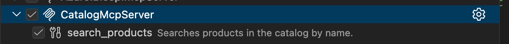
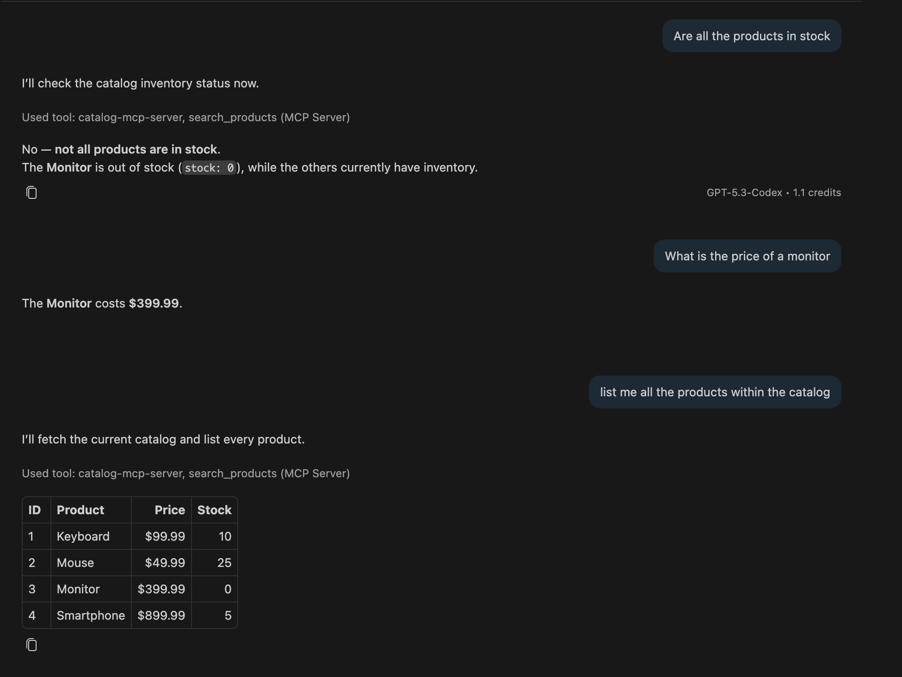

## What and Why

The [Model Context Protocol (MCP)](https://modelcontextprotocol.io/introduction) gives AI clients a standardized way to connect with external tools outside of the chat window's context. These tools can come in different flavors, most commonly they read from external systems to enrich a prompt with structured data.

> MCP (Model Context Protocol) is an open-source standard for connecting AI applications to external systems.

Creating your own MCP server allows you to expose your application's data and logic to AI clients. This seemless integration lets you interact with your application in a more natural way, using natural language instead of technical API calls. If you're already leveraging AI, it also automates certain tasks, e.g. instead of manually copy-pasting data into a prompt to provide context, the client can call an MCP tool to automatically retrieve the relevant information it needs.
If your tool allows schedudeled tasks, the AI client can also call your tool to perform actions on your behalf.

With ASP.NET you can create your custom MCP tools using the [`ModelContextProtocol.AspNetCore` NuGet package](https://www.nuget.org/packages/ModelContextProtocol.AspNetCore/).

In this post, we'll build a small HTTP-based MCP tool that exposes a search tool for AI clients, just to give you a quick idea of how it works.

TLDR: writing an MCP tool is almost identical to building a regular web API endpoint, but it uses the MCP SDK to handle the request and response format for you.

## When to use it

Instead of building a traditional (UI) application, you can build an MCP server to expose the internals of your application directly to AI clients. This allows you to leverage the power of AI models to interact with your application. In other words, it gives your prompt a window into your application, so it can retrieve data and perform actions on your behalf.

This can be useful in many scenarios. Personally, I think it can help to reduce the friction of interacting with your application, and make complex screen flows more accessible. We recently used it to query data by asking "normal" questions instead of building a complex filter UI. It can also be helpful to quickly instruct an action to be performed.

## Setup in ASP.NET

Follow along to create a new ASP.NET application and add the MCP server capabilities to it.

First start by creating a new ASP.NET application:

```bash
dotnet new web -o CatalogMcpServer
cd CatalogMcpServer
```

In the ASP.NET application, add the `ModelContextProtocol.AspNetCore` NuGet package:

```bash
dotnet add package ModelContextProtocol.AspNetCore
```

Then, in the `Program.cs` file, add the MCP server to the service collection and configure the MCP server to work over HTTP:

- `AddMcpServer()` registers the MCP server to the service collection with default options.
- `WithHttpTransport()` adds the services necessary for `McpEndpointRouteBuilderExtensions.MapMcp` to handle MCP requests and sessions using the MCP Streamable HTTP transport.
- `WithToolsFromAssembly()` scans the assembly for MCP tool classes (more on this later). If you want, you can also register your tools manually using `WithTools<ToolType>()` instead.
- `MapMcp()` exposes the MCP endpoint over HTTP, and we set it to the path `/mcp`.

```cs [name=Program.cs] [highlight=5,7,11,15]
var builder = WebApplication.CreateBuilder(args);

builder.Services
    // Adds the Model Context Protocol (MCP) server to the service collection with default options.
    .AddMcpServer()
    // Adds the services necessary for McpEndpointRouteBuilderExtensions.MapMcp to handle MCP requests and sessions using the MCP Streamable HTTP transport.
    .WithHttpTransport()
    // Manually register your MCP tools.
    .WithTools<CatalogTools>();
    // Adds types marked with the ModelContextProtocol.Server.McpServerToolTypeAttribute attribute from the given assembly as tools to the server.
    .WithToolsFromAssembly();

var app = builder.Build();

app.MapMcp("mcp");

app.Run();
```

## Your first MCP tool

So far, we have created an ASP.NET application and added the MCP server to it. Now let's create a tool that can be called by AI clients.

For example, let's create a tool that allows AI clients to search for products in a catalog.
To keep the example compact, we're using a in-memory list of products, but in a real application you would query your database or call an external service.

To create the tool, create a new class `CatalogTools` and mark it with the `McpServerToolType` attribute, this is important so it is automatically discovered.

Within the class create your tool method and mark it with the `McpServerTool` attribute. The method can be asynchronous and return any serializable type, in this case we return a list of products.

```cs [name=CatalogTools.cs]
using System.ComponentModel;
using ModelContextProtocol.Server;

[McpServerToolType]
public sealed class CatalogTools
{
    [McpServerTool, Description("Searches products in the catalog by name.")]
    public static async Task<IEnumerable<ProductResult>> SearchProducts(
        [Description("Part of the product name, for example 'smartphone'. If not provided, all products will be returned.")]
        string? query)
    {
        return new[]
        {
            new ProductResult(1, "Keyboard", 10, 99.99m),
            new ProductResult(2, "Mouse", 25, 49.99m),
            new ProductResult(3, "Monitor", 0, 399.99m),
            new ProductResult(4, "Smartphone", 5, 899.99m),
        }.Where(p => query == null || p.Name.Contains(query, StringComparison.OrdinalIgnoreCase));
    }
}

public record ProductResult(int Id, string Name, int Stock, decimal Price);
```

As you can see, the tool, and the parameters, are decorated with the `Description` attribute, which is used by the MCP server to generate a description of the tool and its parameters. This description is sent to the client when it connects, so it knows what tools are available and how to call them.

A `McpServerTool` method can have any number of parameters, and the parameters can be of any serializable type. The MCP server will automatically serialize the parameters to JSON and deserialize them back to the method parameters when the tool is called.

The `McpServerToolType` can also have multiple tools defined in the same class.

To test the server, start your application with `dotnet run`.

```bash
dotnet run
```

### How it translates a prompt to a request

When the MCP client connects to our server, it asks the server the tools that are available.
In this case it connects to the `Catalog` server and it discovers the product search tool (`search_products`).

When a user asks a question in the chat window, the client uses all of this information to determine which tool to call and with which parameters. It uses the description of the tool and its parameters to understand how to call the tool and provide the right arguments. That's why it's important to provide a good description of the tool and its parameters, ideally with some examples, as it helps the client understand how to call the tool and provide the right arguments.

Let's take a look at a concrete example, and let's say we ask the question "Do we sell keyboards?" in the chat window of the AI client:

```txt
Do we sell keyboards?
```

The client detects that the context is about our catalog, and it knows about the Catalog tool. If it doesn't automatically detect the tool, you can also explicitly tell the client to use the tool.
With that knowledge, it translates the given question into a request that our server expects and understands, in this case it invokes the `search_products` tool with a JSON payload containing the `query` parameter set to "keyboard":

```json
{
	"query": "keyboard"
}
```

ASP.NET receives the tool call, the MCP SDK invokes `SearchProducts`, and the client receives the result.
The model then uses that result to formulate a suitable answer.

Based on the result the model either:

- Answers the question directly when it has enough information;
- Uses the result to extract the relevant information and answer the question;
- Invokes other tools until it has enough information to answer the question.

Based on the question and the result, the AI model decides how to structure and format the answer in a way that is most useful to the user. It can for example just answer the question, or display a collection as a table.

In the case of our example, the model uses the result to answer the question directly:

```txt
Yes, we sell keyboards
```

Or it can even add extra information, like the stock and price of the product:

```txt
Yes — we sell Keyboard.
    Stock: 10
    Price: $99.99
```

## Installing the MCP server with an AI client

To make the MCP server available to AI clients, we need to add the server to the list of available MCP servers. Depending on the AI client you are using, this can be done in different ways. Some clients allow you to add the server to a configuration file, while others allow you to add it via a UI (this can also be named plugins, extensions, ...).

In the following example, we add a new entry to the `.mcp.json` file in the root of the project, as this file is generic and can be used by multiple AI clients (GitHub Copilot, Codex, OpenCode) to discover available MCP servers.

```json [name=.mcp.json]
{
	"mcpServers": {
		"catalog": {
			"type": "http",
			"url": "<ASP.NET URL>/mcp"
		}
	}
}
```

Because we made the MCP server available over HTTP, we register it as an HTTP server with the URL of the endpoint we mapped in `Program.cs`.

After adding the server to the configuration file, you might also need to "start" the MCP tool.
Again, this is different depending on the tools you are using, and whether you are registering the MCP server as part of a project workspace or if it's available globally.

In VS Code, there will be a lightbulb above the "catalog" entry in the `.mcp.json` file, click "Start" to start the server and make it available to the chat window of VS Code.

After these steps, you should see that the client can discover the catalog MCP server, together with the available tools and their descriptions.



## Result

You can now ask questions about the catalog products, and the client should call the `search_products` tool to retrieve the relevant information.



In the chat history you can notice that the client calls the `search_products` tool, and if you click on it you can also verify the raw input and outputs. The model then uses that result to formulate a suitable answer.

## Conclusion

In this blog post, we've built a small HTTP-based MCP server with ASP.NET that gives you a quick idea of how you can build your own MCP server, and how AI clients communicate with it.

MCP allows AI clients to use external systems outside of the chat window's context.
A common use case is to retrieve relevant data from an external system.

This can be useful for your application, if you want to expose your application's data so your users can inquire about it in a more natural way via a chat window.
While this was a simple example, in a real-world scenario, you would query your database or call an external service to retrieve the relevant information.

The next steps are to secure the MCP server with authentication. Since it's just an ASP.NET application, you can re-use the same techniques you would use to secure any other Web API application. You could for example add a Key header to the request and validate it using middleware.

Instead of making the MCP tool available via HTTP, you can also make it available as a CLI tool using `WithStdioServerTransport()` instead of `WithHttpTransport()`. This allows you to run the MCP server as a separate process and communicate with it via standard IO.
