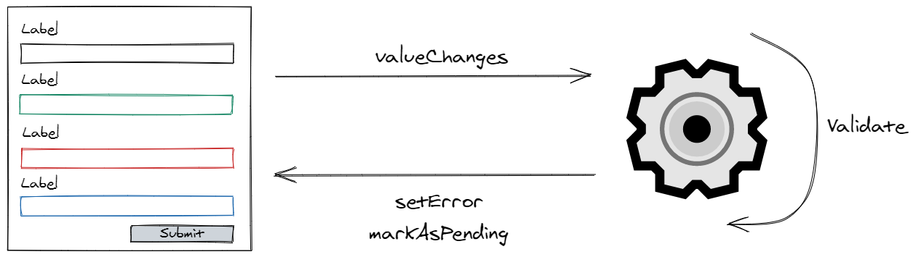

Over the past year, our team has created a lot of different forms for a form-heavy application.
One of the difficulties we experiences was validating fields that are dependent on other fields of the form.
For example, conditional validation or validation where multiple fields are needed to validate a control.

Now, when we look back at those forms, we notice that most of the forms are build differently.
We're not the only ones that struggle with this. I asked the question of how to implement a conditional validation in Angular Forms on Twitter, and they were multiple answers on how to tackle this problem. [All of them were different but there was a consensus, it isn't always straightforward, nor is it easy](https://twitter.com/tim_deschryver/status/1360597421340979206).

To streamline our forms and to make the validation easier I started a proof of concept to validate forms differently.

### Goals

The goal is to come up with a solution for more complex forms, but also that it can be used for the simple forms.

As a developer using this new validation API, I **don't want to write a lot of code** that introduces subtle bugs. Instead, I just want to **declare validation rules**.

These validation rules must be reusable (and testable). We get extra points if common rules are built-in, preferably similar to the Angular validators.

I also don't want the solution to be destructive because I don't want to rewrite existing forms.
Therefore, the solution has to build a layer on top of the existing Angular Forms API.

### The proposal

The Angular Forms API already provides the basic building blocks to make these goals possible.
An [`AbstractControl`](https://angular.io/api/forms/AbstractControl) has the method [`setError`](https://angular.io/api/forms/AbstractControl#setErrors), which is all that's needed to make a form (control) valid or invalid.
Based on the validity of these form controls, the form derives its validity status.

For asynchronous validators, we'll also need [`markAsPending`](https://angular.io/api/forms/AbstractControl#markaspending) to set the control's status to `pending` while a validator is validating its value.

The intention of this new validation layer is only to validate the form value and to make use of the existing Forms API to set and clear the errors of the form controls, and thus also for the form itself.



To build the validation layer, we use the `createValidator<T>()` wrapper and assign validation rules to the form properties. A validation rule consists of the details of why the validation has failed. The validation rule also contains a message for a user and can include these details in the message.

To active the validator, it must be subscribed to, and the validator returns an Observable containing all of the messages.

To see this in action, please have a look at the following examples.

<iframe src="https://stackblitz.com/edit/create-validator-poc?ctl=1&embed=1&file=src/app/user-form/user-form.component.ts" title="create-validator-poc" loading="lazy"></iframe>

### The differences

Let's highlight the differences and the benefits compared to the default behavior by comparing the two.

#### Conditional Validation

To disable and enable form validation based on a control's value, we use `when`.
For example, in the validator below `name` becomes required when `strict` is true.

```ts
formValidator = createValidator<FormValue>(this.form, {
	name: {
		validator: required(),
		when: (_, form) => form.strict
	}
});
```

Without the `createValidator` wrapper, we need to juggle with validators by adding or removing validators of the control.
If you use the [Taiga UI](https://taiga-ui.dev/) kit, you can use the `tuiValidator` directive.

```ts
this.form.get('strict')!.valueChanges.subscribe((strict) => {
	if (strict) {
		this.form.get('string')!.setValidators(Validators.required);
		this.form.get('string')!.updateValueAndValidity();
	} else {
		this.form.get('string')!.setValidators(null);
		this.form.get('string')!.updateValueAndValidity();
	}
});
```

Doing this can quickly become bloated and hazardous for large forms when there's cohesion between different controls.
In our case, we overruled a previously validator with a different one. It was after a couple of debugging sessions that we were able to reproduce this hidden bug.
With the `when` syntax, it becomes easier to see the coherence between (multiple) controls and (multiple) validators.

#### Access to the form value

In each validator, we have access to the value of the whole form.
Having access to the form value is useful when you need to compare properties of a form (e.g. with the `equal` rule), or when the validation is based on multiple form values.
In the snippet below, `passwordConfirmation` needs to be equal to the value of `password`.

```ts
formValidator = createValidator<User>(this.form, {
	password: [required(), minLength(7)],
	passwordConfirmation: equal((user) => user.password)
});
```

To implement this scenario with the Forms API, we have two options.

One, we can group both controls and create a validator for the form group. This has the disadvantage that the validation message isn't bound to a specific control. For us, this was problematic because our generic controls expect the validation messages to be bound to the control, not to a group, to display a validation message to the user.

The second option is to re-create the validators when the value changes.

```ts
this.form.get('password')!.valueChanges.subscribe((password) => {
    this.form.get('passwordConfirmation')!.setValidators(CustomValidators.equal(password))
    this.form.get('passwordConfirmation')!.updateValueAndValidity()
  }
})
```

Just like [Conditional Validation](#conditional-validation) this becomes tricky for bigger forms.

#### Statically Typed

When you pass a type to `createValidator<T>`, the rest of the validation is statically typed.

While building the validator, properties of the form model are auto-completed and the value of a form control and the form will be typed in all of the validator rules. The built-in validators are also typed so we can't make the mistake of using the wrong validator.
For example, you won't be able to use a number validation (e.g. `greaterThan`) for a property that holds a string value.

#### Main difference

To make the above use cases possible, the whole form is validated on every change.
This impact is negligible for synchronous validators because these are just methods that are invoked, thus should be fast and has a low impact on the performance.
This is a different story for asynchronous validators, where this behavior might have an impact.

### Impact

As a developer, the `createValidator` wrapper intends to make it easier to write and read the validation logic of your Angular forms.
Its minimal API (with the common supplied validation rules) should also allow a quick transition towards the `createValidator` wrapper.
Refactoring existing forms will have a minimal impact because the status and the value of the form remain the same as before.

### Final thoughts

While this is just a simple proof of concept, I can see the benefits of adding an extra layer on top of the Angular Forms API and use the basis as building blocks. Because of this, and because of the common validation rules that behave the same as the built-in Angular validator I expect it to be a small and quick shift if we decide to pull the trigger.

The form validation is more expressive, and this should help with the development while also improving the maintenance cost.

As always, feel free to let me know your thoughts.
