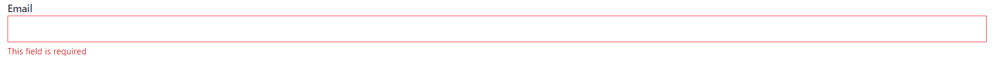

In Angular, we have two ways to build forms, which are template-driven and reactive.
While both ways are different to use, they're both built on top of a common Forms API.

From the start of my journey with Angular, I've always used Reactive Forms.
That's because reactive forms are recommended (sold as more scalable, reusable, and testable) in the [Angular docs](https://angular.io/guide/forms-overview#choosing-an-approach) and because most of the content created by the community is focused on using the reactive way to create forms in Angular.

Until recently, I never looked at template-driven forms. But due to circumstances that have occurred in the same week, I've decided to get more familiar with creating template-driven forms.

The first circumstance was returning to a complex form after a couple of months and having struggles with how the form was set up. Due to these struggles, I [experimented with building a layer on top of the Reactive Forms API](/blog/a-new-way-to-validate-angular-forms). While at first, I was pretty happy with the design, the solution was getting worse with every addition. Now that I look back at that proof of concept, I realize that I was building a poor-mans API compared to the API that template-driven forms already provide.

The second circumstance was that [Ward Bell](https://twitter.com/wardbell) was advocating for template-driven forms on a [Forms Episode](https://www.spreaker.com/user/ng-conf/e047-forms-series-episode-2-template-dri) of the [The Angular Show](https://twitter.com/AngularShow) podcast.

Based on Ward's experience, the examples that were talked about on the podcast (alongside a [StackBlitz demo](https://stackblitz.com/edit/angular-kkatri)), and my findings while I was attempting to build a layer on top of the Angular Forms API, I'm now exploring and discovering the benefits of the template-driven way.

In this post, I'd like to share my experience with some practical examples.
The code used in this guide can be found on [GitHub](https://github.com/timdeschryver/angular-forms-guide).

> This guide is a Work In Process. During the next weeks, I'll probably cover validation, nested forms, how to test template-driven forms, control value accessors, and dynamic forms. If you have anything you want to see here or if you have suggestions feel free to reach out on [Twitter](https://timdeschryver.dev/twitter) or [create an issue on GitHub](https://github.com/timdeschryver/angular-forms-guide/issues/new).

## Creating a form

If this is your first time building a template-driven form or if you just need a quick refresher, I would suggest starting by reading the [Angular docs](https://angular.io/guide/forms#building-a-template-driven-form). For a more in-depth look at how template-driven forms behave and react, the Angular docs also got you covered at [Data flow in template-driven forms](https://angular.io/guide/forms-overview#data-flow-in-template-driven-forms).

A brief recap of the docs is that the HTML `form` entity creates a new [`NgForm`](https://angular.io/api/forms/NgForm) instance (this is a [built-in Angular directive](https://github.com/angular/angular/blob/master/packages/forms/src/directives/ng_form.ts), which uses `form` as the directive's selector). Inside the form, the [`ngModel` directive](https://angular.io/api/forms/NgModel) is used to register form controls to the form instance (under the hood `ngModel` creates a new [`FormControl`](https://angular.io/api/forms/FormControl), as we can see in the [source code](https://github.com/angular/angular/blob/master/packages/forms/src/directives/ng_model.ts#L268)). While adding the `ngModel` attribute to a control, it's important to also assign a value to the `name` attribute to correctly build up the form tree. The value given to the `name` attribute is the property name inside the template model, with the form control instance as the value.

In code, this looks like this.

```ts
@Component({
	template: `
		<form>
			<label for="text">A label</label>
			<input type="text" id="text" name="formText" ngModel />
		</form>
	`
})
export class AppComponent {}
```

> While the `for` attribute of the label and the `id` attribute of the input control does not affect the Angular form, it's important to link the label to the control in order to make the form [accessible](https://www.w3.org/WAI/tutorials/forms/labels/).

This form results in the following form value.

```json
{
	"formText": ""
}
```

To unlock the full potential of template-driven forms, we use [two-way binding](https://angular.io/guide/two-way-binding) to bind the template form to a TypeScript (data) model. The TypeScript model is used to process a form submission when a user submits the form, for example, to make a request to a backend. The model can be sent to the backend in its current state, or it can also be translated to a model that the backend API expects.

Because the TypeScript model is coupled to the template model, every change made to the model will also change the value of the template model and visa-versa.

To create a two-way binding we use the banana in a box syntax (`[()]`), the form now looks like this.

```ts{6,11-13}
@Component({
  template: `
    <form>
      <label for="text">Text</label>
      <input type="text" id="text" name="formText" [(ngModel)]="model.text" />
    </form>
  `,
})
export class AppComponent {
  model = {
    text: null,
  }
}
```

The above template and model result in the following structures for the two models.
Notice the difference between the two property names:

- `formText` for the template model, because the input has `formText` as the name of the control
- and `text` for the TypeScript model, because the model has the `text` property

<table>
<thead>
<th style="vertical-align: top; width: 1%;">
Template Form Value
</th>
<th style="vertical-align: top; width: 1%;">
TypeScript Model Value
</th>
</thead>
<tr style="background: inherit;">
<td style="vertical-align: top; width: 1%;">
<pre>
{
    formText: 'some text value here'
}
</pre>
</td>
<td style="vertical-align: top; ; width: 1%;">
<pre>
{
    text: 'some text value here'
}
</pre>
</td>
</tr>
</table>

Because the structure of the template model and the TypeScript model doesn't need to match, it unlocks significant advantages in comparison to reactive forms, which we will address later in the next sections.

### Form Building Blocks

First, we need some basic controls before we're able to construct a usable form.
In this section, we'll take a look at how we can create the most common form controls and how its value translates to the two models look like.

#### Input Controls

The obvious and the easiest controls are the native input controls, these controls are single HTML elements that have a value. To bind the control to the TypeScript model, we can just use the `ngModel` directive.

Angular makes things easier for us by already parsing the value of the input control to its corresponding type. Angular does this with a [couple of directives](https://github.com/angular/angular/tree/master/packages/forms/src/directives), more specifically with control value accessors. An example of this is the number input control, the value of the number control (a string) is [parsed](https://github.com/angular/angular/blob/master/packages/forms/src/directives/number_value_accessor.ts#L81) to a number by the number value accessor.

```ts
@Component({
	template: `
		<form>
			<label for="text">Text</label>
			<input type="text" id="text" name="formText" [(ngModel)]="model.text" />

			<label for="number">Number</label>
			<input type="number" id="number" name="formNumber" [(ngModel)]="model.number" />
		</form>
	`
})
export class AppComponent {
	model = {
		text: null,
		number: null
	};
}
```

<table>
<thead>
<th style="vertical-align: top; width: 1%;">
Template Form Value
</th>
<th style="vertical-align: top; width: 1%;">
TypeScript Model Value
</th>
</thead>
<tr style="background: inherit;">
<td style="vertical-align: top; width: 1%;">
<pre>
{
    formText: 'hello',
    formNumber: 5
}
</pre>
</td>
<td style="vertical-align: top; ; width: 1%;">
<pre>
{
    text: 'hello',
    number: 5
}
</pre>
</td>
</tr>
</table>

#### Select Element

While the HTML select element doesn't have a value attribute, we can still use the `ngModel` directive to bind the select element to the TypeScript model.

To assign values to the option elements, the `value` attribute is used on the options.
These options can be static or can be iterated over by using the `*ngFor` directive.

The value of the selected option is used as the value of the TypeScript model.
When the TypeScript model has an initial value or when it's reassigned a new value, the corresponding option will be selected automatically in the template.

```ts
@Component({
	template: `
		<label for="select">Select</label>
		<select id="select" name="formSelect" [(ngModel)]="model.select">
			<option [value]="null">Default Option</option>
			<option *ngFor="let option of options" [value]="option.value">
				{{ option.label }}
			</option>
		</select>
	`
})
export class AppComponent {
	model = {
		select: null
	};

	options = [
		{
			value: 1,
			label: 'Option One'
		},
		{
			value: 2,
			label: 'Option Two'
		},
		{
			value: 3,
			label: 'Option Three'
		}
	];
}
```

<table>
<thead>
<th style="vertical-align: top; width: 1%;">
Template Form Value
</th>
<th style="vertical-align: top; width: 1%;">
TypeScript Model Value
</th>
</thead>
<tr style="background: inherit;">
<td style="vertical-align: top; width: 1%;">
<pre>
{
    formSelect: 2
}
</pre>
</td>
<td style="vertical-align: top; ; width: 1%;">
<pre>
{
    select: 2
}
</pre>
</td>
</tr>
</table>

#### Checkbox List

For my checkbox lists I like to include the checkbox items in the TypeScript model, and add a `selected` property on the items to know which checkboxes are selected (checked). In the template, this `selected` property is bound to a checkbox control with the `ngModel` directive.

All checkbox elements within the same group must have unique names, otherwise, all the control will share the same form control instance, and thus the same value.

```ts
@Component({
	template: `
		<label>Checkbox list</label>
		<div *ngFor="let check of model.checks">
			<input
				type="checkbox"
				[id]="'formCheckbox-' + check.id"
				[name]="'formCheckbox-' + check.id"
				[(ngModel)]="check.selected"
			/>
			<label [for]="'formCheckbox-' + check.id">{{ check.label }}</label>
		</div>
	`
})
export class AppComponent {
	model = {
		checks: [
			{
				id: 'check-one',
				label: 'Check One',
				selected: false
			},
			{
				id: 'check-two',
				label: 'Check Two',
				selected: false
			},
			{
				id: 'check-three',
				label: 'Check Three',
				selected: false
			}
		]
	};
}
```

<table>
<thead>
<th style="vertical-align: top; width: 1%;">
Template Form Value
</th>
<th style="vertical-align: top; width: 1%;">
TypeScript Model Value
</th>
</thead>
<tr style="background: inherit;">
<td style="vertical-align: top; width: 1%;">
<pre>
{
    formCheckbox-check-one: false,
    formCheckbox-check-two: true,
    formCheckbox-check-three: true,
}
</pre>
</td>
<td style="vertical-align: top; ; width: 1%;">
<pre>
{
    checks: [
        {
            id: 'check-one',
            label: 'Check One',
            selected: false
        },
        {
            id: 'check-two',
            label: 'Check Two',
            selected: true
        },
        {
            id: 'check-three',
            label: 'Check Three',
            selected: true
        }
    ]
}
</pre>
</td>
</tr>
</table>

In the example above, the checkbox values are represented in a flat object structure.
While this is enough for the simple cases, we can also reorganize the structure of the template model by creating nested objects.
Because the template model doesn't need to reflect the TypeScript model, it allows us to be flexible with the structures we use to shape the form.

This allows us as developers to model the template as efficiently as possible for certain use-cases.
I find it easier to group the checkboxes in a nested hierarchy to make it [effortless to validate the checkbox group](#custom-validators), e.g. when at least one checkbox needs to be checked.

The snippet below uses the [`ngModelGroup` directive](https://angular.io/api/forms/NgModelGroup) to group the checkboxes. Behind the scenes, Angular creates a new [`FormGroup`](https://angular.io/api/forms/FormGroup) instance and adds a new leaf in the template model with the given name.
This change doesn't impact the TypeScript model and is purely a change to the template model to make it easier to use.

```ts{5,9}
@Component({
  template: `
    <label>Checkbox list</label>
    <div *ngFor="let check of model.checks" ngModelGroup="formCheckbox">
      <input
        type="checkbox"
        [id]="'formCheckbox-' + check.id"
        [name]="check.id"
        [(ngModel)]="check.selected"
      />
      <label [for]="'formCheckbox-' + check.id">{{ check.label }}</label>
    </div>
  `,
})
export class AppComponent {
  model = {
    checks: [
      {
        id: 'check-one',
        label: 'Check One',
        selected: false,
      },
      {
        id: 'check-two',
        label: 'Check Two',
        selected: false,
      },
      {
        id: 'check-three',
        label: 'Check Three',
        selected: false,
      },
    ],
  }
}
```

This change leads to the following structures of the template model and the TypeScript model.

<table>
<thead>
<th style="vertical-align: top; width: 1%;">
Template Form Value
</th>
<th style="vertical-align: top; width: 1%;">
TypeScript Model Value
</th>
</thead>
<tr style="background: inherit;">
<td style="vertical-align: top; width: 1%;">
<pre>
{
    formCheckbox: {
        check-one: false,
        check-two: true,
        check-three: true
    }
}
</pre>
</td>
<td style="vertical-align: top; ; width: 1%;">
<pre>
{
    checks: [
        {
            id: 'check-one',
            label: 'Check One',
            selected: false
        },
        {
            id: 'check-two',
            label: 'Check Two',
            selected: true
        },
        {
            id: 'check-three',
            label: 'Check Three',
            selected: true
        }
    ]
}
</pre>
</td>
</tr>
</table>

#### Radio Group

A radio group is similar to a checkbox list. The difference is that in contrast to a checkbox list, radio buttons that belong together need to have the same `name`. If this is not the case, the form creates a new form control instance for each radio button with a different name. Because the radio buttons are linked to the same TypeScript model value, the radio buttons all have the same value and will all be updated when another radio button is selected. While the TypeScript model will have the correct value, this might be confusing on the side of the template model and might cause problems in the future when it needs to be validated.

```ts
@Component({
	template: `
		<label>Radio group</label>
		<div>
			<input
				type="radio"
				id="radio-1"
				name="formRadioGroup"
				[value]="1"
				[(ngModel)]="model.radio"
			/>
			<label for="radio-1">Radio One</label>
		</div>

		<div>
			<input
				type="radio"
				id="radio-2"
				name="formRadioGroup"
				[value]="2"
				[(ngModel)]="model.radio"
			/>
			<label for="radio-2">Radio Two</label>
		</div>

		<div>
			<input
				type="radio"
				id="radio-3"
				name="formRadioGroup"
				[value]="3"
				[(ngModel)]="model.radio"
			/>
			<label for="radio-3">Radio Three</label>
		</div>
	`
})
export class AppComponent {
	model = {
		radio: null
	};
}
```

<table>
<thead>
<th style="vertical-align: top; width: 1%;">
Template Form Value
</th>
<th style="vertical-align: top; width: 1%;">
TypeScript Model Value
</th>
</thead>
<tr style="background: inherit;">
<td style="vertical-align: top; width: 1%;">
<pre>
{
    formRadioGroup: 1
}
</pre>
</td>
<td style="vertical-align: top; ; width: 1%;">
<pre>
{
    radio: 1
}
</pre>
</td>
</tr>
</table>

### Forms Controls Example

To play around with the form controls and see how changes reflect on the template model and the TypeScript model, you can take a look at the following StackBlitz.

<iframe src="https://stackblitz.com/github/timdeschryver/angular-forms-guide/tree/7194d3ddab3d7d99079c4127e70540dfb714d41e?ctl=1&embed=1" title="angular-forms-guide-input-types" loading="lazy"></iframe>

## Validators

Validation with template-driven forms is done by adding attributes (directives) to a form control.
This makes it feel like you're using the Web platform, which is always pleasant.

> I can highly recommend [Kara Erickson](https://twitter.com/karaforthewin)'s talk [Angular Form Validation](https://www.youtube.com/watch?v=kM5QBOWrUVI) to get a better understanding of Angular validators.

### Built-in validators

The Angular `FormsModule` comes with a set of directives that implement the [native HTML form validation attributes](https://developer.mozilla.org/en-US/docs/Learn/Forms/Form_validation#using_built-in_form_validation), except for the `min` and `max` validators. Recently, a [Pull Request](https://github.com/angular/angular/pull/39063) was merged, so I assume that these missing validators will be available in one of the future releases.

```html
<input required />
<input minlength="3" minlength="10" />
<input pattern="/@/" />
```

### Dynamic Validators

To make the validators dynamic, the static value of an attribute needs to be replaced with a component variable. When the value of the variable changes, it re-triggers the validator with the new value.

Because the validator revalidates, it's effortless to create dynamic and conditional validators.
For example, to make a field required based on another form control, we bind the value of the second control to the `required` attribute. When that value is truthy, the control is required, otherwise, it isn't required. In the following snippet, the name control is required when the checkbox `makeNameRequired` is checked.

```ts{20}
@Component({
  template: `
    <form>
      <div class="checkbox-container">
        <input
          type="checkbox"
          id="makeNameRequired"
          name="makeNameRequired"
          [(ngModel)]="model.makeNameRequired"
        />
        <label for="makeNameRequired">Make "name" required</label>
      </div>

      <label for="text">Name</label>
      <input
        type="text"
        id="text"
        name="text"
        [(ngModel)]="model.name"
        [required]="model.makeNameRequired"
      />
    </form>
  `,
})
export class AppComponent {
  model = {
    makeNameRequired: false,
    name: '',
  }
}
```

Depending on the desired user experience, hiding the control (by using the `*ngIf` directive) or disabling the control (with the `disabled` attribute), also removes all of the validators of the control.

### Custom Validators

While the built-in validators are providing a good starting point and are sufficient for basic forms, we need to write custom validators that fit the specific needs of our forms.

To create a custom validator we must create a new Angular directive, implementing the [`Validator` interface](https://angular.io/api/forms/Validator)(1). The validator also needs to be registered to the Angular validators, therefore we register the directive to the Angular validators (`NG_VALIDATORS`) (2).

As an example, I've created the `RequiredCheckboxGroupValidatorDirective` validator.
This validator requires that at least N checkboxes need to be checked inside a checkbox group.

```ts{11-18,23-37}
import { Directive, Input } from '@angular/core'
import {
  AbstractControl,
  ValidationErrors,
  NG_VALIDATORS,
  Validator,
} from '@angular/forms'

@Directive({
  selector: '[requiredCheckboxGroup][ngModelGroup]',
  // 2: register the custom validator as an Angular Validator
  providers: [
    {
      provide: NG_VALIDATORS,
      useExisting: RequiredCheckboxGroupValidatorDirective,
      multi: true,
    },
  ],
})
export class RequiredCheckboxGroupValidatorDirective implements Validator {
  @Input() requiredCheckboxGroup = 1

  // 1: implement the validate method
  validate(control: AbstractControl): ValidationErrors | null {
    // the value of the control is an object that holds the value of each checkbox
    // the value's signature looks like this, `{ 'check-one': false, 'check-two': true }`
    const selected = Object.values(control.value).filter(Boolean).length
    if (selected < this.requiredCheckboxGroup) {
      return {
        requiredCheckboxGroup: {
          requiredCheckboxes: this.requiredCheckboxGroup,
        },
      }
    }

    return null
  }
}
```

A best practice is to extract the `validate` method out of the directive, and to define it as a stand-alone [validator function (`ValidatorFn`)](https://angular.io/api/forms/ValidatorFn). The gained benefits are that the logic inside the validator is easier to test and that it's now possible to reuse the validator in a reactive form.

```ts{9-20,36}
import { Directive, Input } from '@angular/core'
import {
  AbstractControl,
  ValidationErrors,
  NG_VALIDATORS,
  Validator,
} from '@angular/forms'

function requiredCheckboxGroup(requiredCheckboxes: number): ValidatorFn {
  return (control: AbstractControl): ValidationErrors | null => {
    const selected = Object.values(control.value).filter(Boolean).length
    if (selected < requiredCheckboxes) {
      return {
        requiredCheckboxGroup: { requiredCheckboxes },
      }
    }

    return null
  }
}

@Directive({
  selector: '[requiredCheckboxGroup][ngModelGroup]',
  providers: [
    {
      provide: NG_VALIDATORS,
      useExisting: RequiredCheckboxGroupValidatorDirective,
      multi: true,
    },
  ],
})
export class RequiredCheckboxGroupValidatorDirective implements Validator {
  @Input() requiredCheckboxGroup = 1

  validate(control: AbstractControl): ValidationErrors | null {
    return requiredCheckboxGroup(this.requiredCheckboxGroup)(control)
  }
}
```

The `validate` method needs to return a `null` value when the value of the control is valid.
Otherwise, if the value is invalid, the `validate` method needs to return an [`ValidationErrors` object](https://angular.io/api/forms/ValidationErrors) with (details of) the validation errors. The returned details will be used to create user-friendly [Validation Messages](#validation-messages).

To use the `RequiredCheckboxGroupValidatorDirective` validator, we can now append the directive to a control, or in this case to a model group.

```html{2}
<label>Pick a time</label>
<div class="flex space-x-4" ngModelGroup="times" [requiredCheckboxGroup]="1">
  <div class="checkbox-container" *ngFor="let time of model.times">
    <input
      type="checkbox"
      [id]="time.label"
      [name]="time.label"
      [(ngModel)]="time.selected"
    />
    <label [for]="time.label">{{ time.label }}</label>
  </div>
</div>
```

In Displaying Validation Errors (needs to be written), we'll see how we can transform this object into human-friendly messages.

#### Revalidate Custom Validators

There's one problem with the current version of the validator. To set the minimum required selected checkboxes, the `RequiredCheckboxGroupValidatorDirective` validator uses the `requiredCheckboxGroup` input property, but the validator doesn't revalidate the validity of the checkbox group when the value of the `requiredCheckboxGroup` input property changes.

To trigger the validator when the value of an input property changes, we need to make several changes to the directive:

- register a change handler with the [`registerOnValidatorChange` hook](https://angular.io/api/forms/Validator#registerOnValidatorChange) (1)
- create a getter and a setter for the input property (2)
- invoke the change handler when an input property receives a new value in the setter (3)

```ts{37-49, 55-58}
import { Directive, Input } from '@angular/core'
import {
  ValidatorFn,
  AbstractControl,
  ValidationErrors,
  NG_VALIDATORS,
  Validator,
} from '@angular/forms'

function requiredCheckboxGroup(requiredCheckboxes: number): ValidatorFn {
  return (control: AbstractControl): ValidationErrors | null => {
    const selected = Object.values(control.value).filter(Boolean).length
    if (selected < requiredCheckboxes) {
      return {
        requiredCheckboxGroup: { requiredCheckboxes },
      }
    }

    return null
  }
}

@Directive({
  selector: '[requiredCheckboxGroup][ngModelGroup]',
  providers: [
    {
      provide: NG_VALIDATORS,
      useExisting: RequiredCheckboxGroupValidatorDirective,
      multi: true,
    },
  ],
})
export class RequiredCheckboxGroupValidatorDirective implements Validator {
  private _requiredCheckboxGroup = 1
  private _onChange?: () => void

  // 2: create a getter and a setter for the input property
  @Input()
  get requiredCheckboxGroup() {
    return this._requiredCheckboxGroup
  }

  set requiredCheckboxGroup(value: number) {
    this._requiredCheckboxGroup = value
    // 3: invoke the change handler
    if (this._onChange) {
      this._onChange()
    }
  }

  validate(control: AbstractControl): ValidationErrors | null {
    return requiredCheckboxGroup(this.requiredCheckboxGroup)(control)
  }

  // 1: register the change handler
  registerOnValidatorChange?(fn: () => void): void {
    this._onChange = fn
  }
}
```

To give another example, let's take a look at another widely used validator is a comparison validator to compare two values, for example to validate the values of two input controls e.g. password and password confirmation.

```ts
function equalTo(value: any): ValidatorFn {
	return (control: AbstractControl): ValidationErrors | null => {
		if (control.value !== value) {
			return {
				equalTo: value
			};
		}

		return null;
	};
}

@Directive({
	selector: '[equalTo][ngModel]',
	providers: [
		{
			provide: NG_VALIDATORS,
			useExisting: EqualToValidatorDirective,
			multi: true
		}
	]
})
export class EqualToValidatorDirective implements Validator {
	private _equalTo: any;
	private _onChange?: () => void;

	@Input()
	get equalTo() {
		return this._equalTo;
	}

	set equalTo(value: any) {
		this._equalTo = value;
		if (this._onChange) {
			this._onChange();
		}
	}

	validate(control: AbstractControl): ValidationErrors | null {
		return equalTo(this.equalTo)(control);
	}

	registerOnValidatorChange?(fn: () => void): void {
		this._onChange = fn;
	}
}
```

#### Async Validators

To validate form controls require an HTTP request to be validated, we need to create an asynchronous validator.
The async validator almost looks identical to a synchronous validator, with subtle differences:

- the validator needs to be provided to the Angular asynchronous validators, `NG_ASYNC_VALIDATORS` (instead of `NG_VALIDATORS`)
- the validator needs to implement the [`AsyncValidator` interface](https://angular.io/api/forms/AsyncValidator) (instead of `Validator`)
- the validate method needs to return an Observable containing the `ValidationErrors` or `null`. It's important to know that Angular expects that the Observable stream completes at some point.

```ts{12-16, 22-30}
import { Directive, Inject } from '@angular/core'
import {
  NG_ASYNC_VALIDATORS,
  AsyncValidator,
  AbstractControl,
  ValidationErrors,
} from '@angular/forms'

@Directive({
  selector: '[uniqueUsername][ngModel]',
  providers: [
    {
      provide: NG_ASYNC_VALIDATORS,
      useExisting: UniqueUsernameValidatorDirective,
      multi: true,
    },
  ],
})
export class UniqueUsernameValidatorDirective implements AsyncValidator {
  constructor(@Inject(UsersService) private usersService: UsersService) {}

  validate(
    control: AbstractControl,
  ): Promise<ValidationErrors | null> | Observable<ValidationErrors | null> {
    return this.usersService.isUsernameTaken(control.value as string).pipe(
      map((taken) => {
        return taken ? { usernameTaken: true } : null
      }),
    )
  }
}
```

Using the asynchronous validator isn't different from using a synchronous validator, we can just add the directive to a control.
A common pattern with asynchronous validation is to use the [`ngModelOptions`](https://angular.io/api/forms/NgModel#properties) configuration to trigger the validators when the user leaves the input control, and not on every change.

```html{7,8}
<label for="username">Username</label>
<input
  type="text"
  id="username"
  name="username"
  [(ngModel)]="model.username"
  [ngModelOptions]="{ updateOn: 'blur' }"
  uniqueUsername
/>
```

#### Nice to knows

- An asynchronous validator is only invoked when all the synchronous validators of that control are valid
- While an asynchronous validator is pending, the state of the form control (and the form) isn't `valid` nor `invalid`, but the control is given the `pending` state

### Testing Validators

Simple validators can be tested by just putting the `ValidatorFn` method under test, and this might also be a good start for the more complex validators. But to test the revalidation behavior we need to write a test that uses the DOM.

To write this test we can create a host component that "hosts" the directive by using the regular Angular TestBed, and this works fine, but... I like to use [Angular Testing Library](https://github.com/testing-library/angular-testing-library/) because it removes some of the setup (e.g. I don't need to create a host component, nor do I have to trigger a change detection cycle), plus I also use the Angular Testing Library [to test my components](/blog/good-testing-practices-with-angular-testing-library).

In the following two tests, we verify that the `EqualToValidatorDirective` directive (written in [Revalidate Custom Validators](#revalidate-custom-validators)) has the expected behavior. Therefore,

- the first test verifies that the control is valid when the input control has the same value as the comparison value,
- while the second test verifies that the validity of the control gets revalidated when the comparison value changes

```ts
it('is valid when it has the same value as the comparison value', async () => {
	const component = await render(EqualToValidatorDirective, {
		template: `<form><input [equalTo]='compareValue' ngModel name="sut" /></form>`,
		imports: [FormsModule],
		componentProperties: {
			compareValue: 'value1'
		}
	});

	const model = component.fixture.debugElement.children[0].injector.get(NgForm);
	const input = screen.getByRole('textbox');

	userEvent.type(input, 'value2');
	expect(model.controls.sut.invalid).toBeTruthy();
	expect(model.controls.sut.errors).toEqual({
		equalTo: 'value1'
	});

	userEvent.clear(input);
	userEvent.type(input, 'value1');
	expect(model.controls.sut.valid).toBeTruthy();
	expect(model.controls.sut.errors).toBeNull();
});

it('revalidates on input change', async () => {
	const component = await render(EqualToValidatorDirective, {
		template: `<form><input [equalTo]='compareValue' ngModel name="sut" /></form>`,
		imports: [FormsModule],
		componentProperties: {
			compareValue: 'value1'
		}
	});

	const model = component.fixture.debugElement.children[0].injector.get(NgForm);
	const input = screen.getByRole('textbox');

	userEvent.type(input, 'value2');
	expect(model.controls.sut.invalid).toBeTruthy();
	expect(model.controls.sut.errors).toEqual({
		equalTo: 'value1'
	});

	component.fixture.componentInstance.compareValue = 'value2';
	expect(model.controls.sut.valid).toBeTruthy();
	expect(model.controls.sut.errors).toBeNull();
});
```

### Validators Example

The examples that we created in this section are available in the following StackBlitz.

<iframe src="https://stackblitz.com/github/timdeschryver/angular-forms-guide/tree/7e22775c8644c3d0929d1a0822dc9e964167e882?ctl=1&embed=1" title="angular-forms-guide-input-types" loading="lazy"></iframe>

## Form Errors

In this section, we're going to take a look at how to translate the validation errors to create human-friendly messages, and how to show and hide these validation messages in our forms. But first, we need to get familiar with the states of a form control.

### Control States

The most obvious state of a form control is the `status` property. The value of `status` can be one of the following, `'VALID'`, `'INVALID'`, `'PENDING'` (while an async validator waits on a result), or `'DISABLED'`. You can also use the shorthand properties `valid`, `invalid`, `pending`, and `disabled`, which are all booleans.

Other useful states are `pristine` and its counterpart `dirty`. These two states mark a control when its value has been changed by a user. The control starts in the `pristine` status and when the user changes its value, the state of the control transforms to `dirty`. Both properties are also booleans.

The last two useful states are `untouched` and the opposite, `touched`. When the user leaves a control (this triggers the `blur` event), the status of the control is updated from `untouched` to `touched`. Again, both properties are also booleans.

The same states are also available on form groups (`NgModelGroup`) and forms (`NgForm`). A form also has a `submitted` property, which becomes `true` when the submit event is triggered.

#### CSS Classes

All control states have an equivalent CSS class.
To obtain the class of a state, simply prepend the state with `ng-`.

This results in the following class names, `.ng-valid`, `.ng-invalid`, `.ng-pending`, `.ng-pristine`, `.ng-dirty`, `.ng-untouched` and `.ng-touched`. Sadly, there is no `.ng-submitted` class when a form has been submitted.

These class names can be used to style the control field of our forms.
For example, to change the border color to red when an invalid control is touched by the user, we can use the following styles.

```css
input.ng-invalid.ng-touched:not(:focus),
select.ng-invalid.ng-touched:not(:focus),
textarea.ng-invalid.ng-touched:not(:focus) {
	border-color: red;
}

/* all of the checkboxes inside a required checkbox group */
[requiredcheckboxgroup].ng-invalid.ng-touched input {
	border-color: red;
}
```

#### Disabled State

A form control can be disabled by adding the `disabled` attribute to the HTML element.
When a control is disabled, its `status` will be changed to `DISABLED`.
As a shortcut to check if a form control is disabled, we can also use the `disabled` and `enabled` properties.
It's important to know that if a control is disabled, all the validators of that control are also disabled and the value of the form model will be equal to `undefined`.

### Validation Messages

Now that we understand the basics of the different form control states, we can start the implementation to show validation messages to our users.

#### Control Errors

All the results of the [validators](#validators) are added to the `errors` property of the form control instance.
This `errors` property is an object, a key-value pair where each key is the name of a validator and the value contains the error details.
Be aware that `errors` is `null` when the form control is valid.

For example, for our custom validator [RequiredCheckboxGroupValidatorDirective](#custom-validators), the error key is `requiredCheckboxGroup`, and details contain the number of required checkboxes.

To help users to fill in the form correctly, we need to translate the error details into a user-friendly message.
A naive implementation might look like this.
Notice that the messages are hidden until the control is touched by the user, and of course only when the control invalid.

```html
<input type="text" name="name" ngModel required minlength="4" #name="ngModel" />
<div *ngIf="name.invalid && name.touched">
	<div *ngIf="name.errors.required">Name is required.</div>
	<div *ngIf="name.errors.minlength">
		Name must be at least {{ name.errors.minlength.requiredLength }} characters long.
	</div>
</div>
```

While the above solution works for simple projects, this doesn't scale in larger projects because it has some problems:

- the solution is brittle for changes, we have to manually add and remove validation messages when the validation logic of a form control is changed.
- it will lead to a bad user experience, 1) the wording of the messages won't be consistent, 2) the criteria when a message is shown is different depending on the developer who wrote the form
- creating or updating a new form will take a longer time because the form needs to be manually tied together, which also needs to be tested

To obtain a better experience for our users, we have to come up with an abstraction layer(s).
This extra layer will do two things:

- the result of the validator(s) are mapped to a validation message
- the layer determines when the message appears

If we build the layer correctly, it would be possible to use these two features independently of each other.
While this might take some time, it will drastically improve the time it takes to develop and maintain forms in the long run.
Luckily, there are already some battle-tested libraries available, [Angular Material](https://material.angular.io/) and [Error Tailer](https://github.com/ngneat/error-tailor) by ngneat.

To give us a better understanding of the internals of such a validation layer, we're building the different pieces of the layer ourselves.
This solution is based on a similar custom-made solution that fits our specific needs.

#### Configuring Validation Messages

The first step towards reusable validation messages is to create a coat rack to hang up message templates.
We do this by creating a new `InjectionToken` called `VALIDATION_MESSAGES`.
Later on, we use the provided templates to build the validation messages.

```ts:validation-message.ts
import { InjectionToken } from '@angular/core'

export interface ValidationMessages {
  [errorKey: string]: (...errorDetails: any[]) => string
}

export const VALIDATION_MESSAGES = new InjectionToken<ValidationMessages>(
  'VALIDATION_MESSAGES',
)
```

To configure a message template, we provide the template as a factory function for each validator.
While we're configuring the Angular Modules, these templates are provided via the `VALIDATION_MESSAGES` token.

For the built-in Angular validators, I like to provide these message templates in a central module.

```ts{6-16}:validators.module.ts
import { VALIDATION_MESSAGES } from './validation-message'

@NgModule({
  providers: [
    {
      provide: VALIDATION_MESSAGES,
      useValue: {
        required: () => 'This field is required',
        email: () => 'This field must be a valid email',
        minlength: (details: any) =>
          `This field must have a minimum length of ${details.requiredLength}`,
        maxlength: (details: any) =>
          `This field must have a maximum length of ${details.requiredLength}`,
      },
      multi: true,
    },
  ],
})
export class ValidatorModule {}
```

For the custom validators, I provide the message template in the same module wherein the validator is declared.

> Because I follow the [SCAM](https://dev.to/this-is-angular/emulating-tree-shakable-components-using-single-component-angular-modules-13do) principles, coined by [Lars Gyrup Brink Nielsen](https://twitter.com/LayZeeDK), this only doesn't look clean but it's also easy to use.

```ts{8-16}
import { VALIDATION_MESSAGES } from './validation-message'

@NgModule({
  declarations: [RequiredCheckboxGroupValidatorDirective],
  exports: [RequiredCheckboxGroupValidatorDirective],
  providers: [
    {
      provide: VALIDATION_MESSAGES,
      useValue: {
        requiredCheckboxGroup: (details: any) =>
          `This field must have at least ${details.requiredCheckboxes} ${
            details.groupName || 'items'
          } selected`,
      },
      multi: true,
    },
  ],
})
export class RequiredCheckboxGroupValidatorModule {}
```

#### Validate Pipe

To transform the form control errors to a validation message, we create a new [Angular Pipe](https://angular.io/guide/pipes) named `ValidatePipe`. I like to use a pipe for this, just because the pipe doesn't contain any markup which makes it reusable in multiple cases.

To assemble the message, the validate pipe needs to have access to the coat rack of [validation message templates](#configuring-validation-messages). To make these templates available in the validate pipe, the `VALIDATION_MESSAGES` token is injected into the pipe.

Next, the form control errors are passed to the `transform` method of the validate pipe and the corresponding message templates can be looked up by using the error key and the injected messages. When the message template is found, the method is invoked with the error details.

This implementation of the `ValidatePipe` pipe doesn't show all the validation messages, just the message for the first error.
When an error isn't configured, a default validation message is returned.

```ts:validate-pipe.ts
import { Pipe, PipeTransform, Inject } from '@angular/core'
import { ValidationMessages, VALIDATION_MESSAGES } from './validation-message'

@Pipe({ name: 'validate' })
export class ValidatePipe implements PipeTransform {
  // create a key-value pair out of the provided validation messages
  readonly validationMessage = this.validationMessages.reduce(
    (all, entry) => ({ ...all, ...entry }),
    {} as ValidationMessages,
  )

  constructor(
    @Inject(VALIDATION_MESSAGES)
    readonly validationMessages: ValidationMessages[],
  ) {}

  transform(validationErrors: ValidationErrors | null) {
    // pluck the first error out of the errors
    const [error] = Object.entries(validationErrors || {})
    if (!error) {
      return ''
    }

    // create the validation message
    const [errorKey, errorDetails] = error
    const template = this.validationMessage[errorKey]
    return template ? template(errorDetails) : 'This field is invalid'
  }
}
```

We can now perform the first refactor to the initial implementation and replace the inline messages in the template with the `validate` pipe.

This change ensures that the same validation messages are used throughout the whole application.
Because the validation messages are centralized it's also easy to change a message at a later time.

```html{3}
<input type="text" name="name" ngModel required minlength="4" #name="ngModel" />
<div *ngIf="name.invalid && name.touched">
  {{ name.errors | validate }}
</div>
```

#### Error Component

To make sure that all the validation messages look and behave the same way, we need to create a component, `ControlErrorComponent`.

The component is in charge of two things:

- it determines the markup and style of the message,
- it controls when the validation message is visible

In the template of `ControlErrorComponent`, the errors are shown when a control is invalid and if it's been touched by a user.
To render the validation message, the `validate` pipe is used (created in [Validate Pipe](#validate-pipe)).

```ts{7-13}:control-error.component.ts
import { Component, Input } from '@angular/core'
import { AbstractControl, NgForm } from '@angular/forms'

@Component({
  selector: 'app-control-error',
  template: `
    <div
      role="alert"
      class="mt-1 text-sm text-red-600"
      [hidden]="control.valid || !control.touched"
    >
      {{ control.errors | validate }}
    </div>
  `,
  styles: [
    `
      :host {
        margin: 0 !important;
      }
    `,
  ],
})
export class ControlErrorComponent {
  @Input() control: AbstractControl
}
```

After the second refactor, the snippet now uses the `ControlErrorComponent` component instead of the `*ngIf` directive in the original snippet.
The abstracted `ControlErrorComponent` component has the benefit that there is a uniform design and behavior, leading to a better user experience. From a technical perspective, we're protected against future design changes because we'll have to change the design only once.

```html{2,4}
<input type="text" name="name" ngModel required minlength="4" #name="ngModel" />
<app-control-error [control]="name.control">
  {{ name.errors | validate }}
</app-control-error>
```

#### Error Directive

The current implementation requires that the `ControlErrorComponent` component is added to a form control in order to show the message.

To solve this problem, we're introducing a new directive called `ErrorDirective`.
The job of the error directive is to dynamically render the `ControlErrorComponent` when a form control (or a form group) is rendered.

```ts:error.directive.ts
import {
  Directive,
  ComponentFactoryResolver,
  AfterViewInit,
  ViewContainerRef,
  Optional,
} from '@angular/core'
import { NgControl, NgModelGroup } from '@angular/forms'
import { ControlErrorComponent } from './control-error.component'
import { FormFieldDirective } from './form-field.directive'

@Directive({
  selector: '[ngModel], [ngModelGroup]',
})
export class ErrorDirective implements AfterViewInit {
  constructor(
    readonly componentFactoryResolver: ComponentFactoryResolver,
    readonly viewContainerRef: ViewContainerRef,
    @Optional() readonly ngModel: NgControl,
    @Optional() readonly ngModelGroup: NgModelGroup,
    @Optional() readonly formFieldDirective: FormFieldDirective,
  ) {}

  ngAfterViewInit() {
    setTimeout(() => {
      const control = this.ngModel?.control ?? this.ngModelGroup?.control
      if (control && !this.formFieldDirective) {
        const componentFactory = this.componentFactoryResolver.resolveComponentFactory(
          ControlErrorComponent,
        )
        const errorContainer = this.viewContainerRef.createComponent(
          componentFactory,
        )
        errorContainer.instance.control = control
      }
    })
  }
}
```

The way that the directive is written, the error component is added to the DOM under the input element.



This works fine for the simple controls, but it's causing troubles for form groups and checkboxes because the error might be shown in between multiple elements.


To fix this behavior, we create a second directive called `FormFieldDirective`.
The idea behind this directive is the same as the `ErrorDirective` directive, but instead that the validation message is added after form control, the message will be appended to the bottom of the form control's container.

```ts:form-field.directive.ts
import {
  Directive,
  ComponentFactoryResolver,
  AfterViewInit,
  ViewContainerRef,
  Optional,
  ContentChild,
  ElementRef,
} from '@angular/core'
import { NgModel, NgModelGroup } from '@angular/forms'
import { ControlErrorComponent } from './control-error.component'

@Directive({
  selector: '[formField]',
})
export class FormFieldDirective implements AfterViewInit {
  @ContentChild(NgModel) ngModelChild?: NgModel
  @ContentChild(NgModelGroup) ngModelGroupChild?: NgModelGroup

  constructor(
    private element: ElementRef,
    private componentFactoryResolver: ComponentFactoryResolver,
    private viewContainerRef: ViewContainerRef,
    @Optional() private ngModelGroup: NgModelGroup,
  ) {}

  ngAfterViewInit() {
    setTimeout(() => {
      const control =
        this.ngModelGroup?.control ??
        this.ngModelChild?.control ??
        this.ngModelGroupChild?.control
      if (control) {
        const componentFactory = this.componentFactoryResolver.resolveComponentFactory(
          ControlErrorComponent,
        )
        this.viewContainerRef.clear()

        const errorContainer = this.viewContainerRef.createComponent(
          componentFactory,
        )

        const host = this.element.nativeElement as HTMLElement
        host.style.flexWrap = 'wrap'
        host.appendChild(errorContainer.location.nativeElement)

        errorContainer.instance.control = control
      }
    })
  }
}
```

To use the form field directive we have to add the `formField` attribute to the form control container.
We could also use the `ControlErrorComponent` like before, but I find this solution to be more in-line with the `ErrorDirective`.

```html
<div class="checkbox-container" formField>
	<input type="checkbox" id="tac" name="tac" ngModel required />
	<label for="tac">I agree with the terms and conditions</label>
</div>
```

After the last refactor, we don't have any code in our forms to display the validation messages.

```html
<input type="text" name="name" ngModel required minlength="4" />
```

### Form Helpers

So far we're only marking the invalid form controls and are only showing validation messages when a user has touched the form control.
But the user also expects feedback when she submits the form.

To implement this feature, we have options.

The first one is to add a new condition to the [Error Component](#error-component) and check if the form has been submitted by using the `submitted` property on the form. Besides this, to add the red border color to invalid controls, a `submitted` class should also be added to the form. That's why having a `.ng-submitted` class would be useful, sadly this is not (yet?) the case.

The second option is to touch all form controls when a user submits the form.
This is simply done by invoking the [`markAllAsTouched` method](https://angular.io/api/forms/AbstractControl#markallastouched) of the form.

### Errors Example

A demo about form control states and validation messages can be found in the following StackBlitz.

<iframe src="https://stackblitz.com/github/timdeschryver/angular-forms-guide/tree/ac48e7de21dc5a67fe338e1315bfd5e5999a6c49?ctl=1&embed=1" title="angular-forms-guide-form-errors" loading="lazy"></iframe>

> The code used in this guide can be found on [GitHub](https://github.com/timdeschryver/angular-forms-guide). This guide is a Work In Process. During the next weeks, I'll probably cover validation, nested forms, how to test template-driven forms, control value accessors, and dynamic forms. If you have anything you want to see here or if you have suggestions feel free to reach out on [Twitter](https://timdeschryver.dev/twitter) or [create an issue on GitHub](https://github.com/timdeschryver/angular-forms-guide/issues/new).
