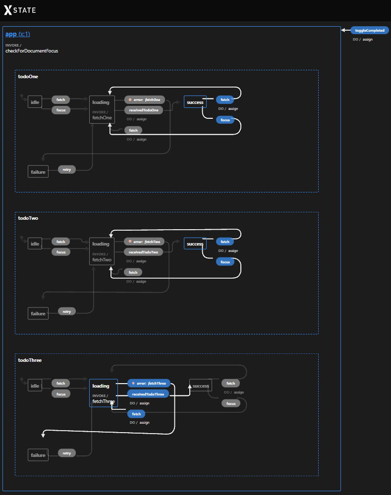

Let's give [XState](https://xstate.js.org/) a spin to see how we can build incremental views with it to achieve a better and smoother experience for our users.

Incremental views is a technique that is used when a view needs its data from multiple sources, and where the view directly renders the data coming from these sources as they resolve. Another term for an incremental view is a progressive view.
In other words, we want to show our users the data as soon as it's retrieved, we don't wait for all of the requests to complete before we render the view. This technique can improve the user experience when some requests are sensible slower than others. The result is that our users are happy because the application feels fast and responsive.

To keep this example simple, we're going to fetch 3 separate todos, and then render them in a single list.
In a real-world scenario, we'd need to request different services (domains) to get the data we need to build the view.
For example, think of a calendar where events are fetched from different services.

We could build this in multiple ways, but I prefer to use [parallel (or orthogonal) states](https://xstate.js.org/docs/guides/parallel).

## Why use parallel states

Within a parallel state machine, there are multiple active state nodes that live independently from each other.
You can compare it to one big node that has multiple children, which are also single state machines.
This has the advantage that a child node lives on its own without bothering other state nodes.
In our example, this means that **each request has its own distinct state** representing the lifecycle of the request, `idle`, `loading`, `success`, and `error`.

Because all of the state nodes belong to one machine, they can all **react to the same events**.
In our example, there will be a single `fetch` event, which is the trigger to fire all of the requests.
A single state node can also have **node-specific events**, for example, the success event of a request to assign the response to the context of a machine.

A parallel state machine shares a single context with the different state nodes.
This makes it **easy to build a "view-model"** that uses the context from the state machine.
If you would use different machines, you would have to stitch the states of multiple machines manually together.

In practice, this gives us the following state graph.



In the image above, we can clearly see the different state nodes, `todoOne`, `todoTwo`, and `todoThree`.
Each of these state nodes has its own state, we can see that `todoOne` and `todoTwo` are in the success state, while `todoThree` is still in the loading state. All of the events are also on the graph and how they transition to another state (going from one state to another).

## How to create a parallel state machine

### A small detour to machine models

Before we take a look at the machine that I came up with, let's first take a look at the [machine's model](https://xstate.js.org/docs/guides/models) API. In the next steps, the machine is created based on this model, and the defined events on the model are used by the component to communicate with the machine.

Using a model gives us a better developer experience because we can easily see the structure of the context, and all the possible events that can be sent to the machine.
Besides these benefits, a model also provides better type support while sending or reacting to events.
According to the docs, more goodies will follow!

If you have taken a look at the state graph above and compare it with the model below, you'll recognize the model within a single eye blink.

```ts
import { createModel } from 'xstate/lib/model';

export const appModel = createModel(
	{
		// comes from an external service
		todoOne: undefined as Todo | undefined,
		todoTwo: undefined as Todo | undefined,
		todoThree: undefined as Todo | undefined,

		// comes from the component
		onlyUncompleted: false,
	},
	{
		events: {
			// first group: events that all state nodes react to
			fetch: () => ({}),
			retry: () => ({}),
			focus: () => ({}),
			// second group: events where a single state node reacts to
			receivedTodoOne: (todo: Todo) => ({ todo }),
			receivedTodoTwo: (todo: Todo) => ({ todo }),
			receivedTodoThree: (todo: Todo) => ({ todo }),
			// third group: events that simply update the context
			toggleCompleted: () => ({}),
		},
	},
);
```

As you can see, the model also contains an `onlyUncompleted` property, which can be toggled by clicking on a button in the component.
The property is used to filter the todo items that are completed (which we'll see later).

The events of this model can be categorized into 3 groups.

The first group containing the `fetch`, `retry`, and `focus`events are used to fetch the todos. All the different parallel nodes react to these events and cause an internal transition from one state to another state, e.g. from `idle` to `loading` when the node receives the `fetch` event.

The second group of events are the specific events that belong to a single state tree, these events are `receivedOne`, `receivedTwo`, and `receivedThree`. Just like the first group, these events also cause an internal transition from one state to another state, e.g. from `loading` to `success` when a fetch action resolves.

The third and last group, are the events that don't belong to any state tree and thus won't cause a transition.
These events are only used to update the context of the machine. The `toggleCompleted` event belongs to this third group, e.g. it sets `onlyUncompleted` to true or false.

### The parallel machine

With the model analyzed, we can now create the machine.
Let's go through the important parts that are applicable to this example, also notice that we're using the `appModel` model that we've defined before.

The first step to create a parallel machine is to configure the `type` property , which is set to `parallel`.
With this configured, the machine has multiple sub-nodes that are simultaneously active.

As we've seen in the graph, the machine includes three isolated state nodes: `todoOne`, `todoTwo`, and `todoThree`.
Each node is almost identical to the other node, with the exception that it invokes a different service (to fetch a todo), and that it updates the context which it owns. We also notice that all of the nodes share a single context within the machine.

```ts{3,4,9,59,109}
export const appMachine = appModel.createMachine({
    id: 'app',
    type: 'parallel',
    context: appModel.initialContext,
    invoke: {
        src: 'checkForDocumentFocus',
    },
    states: {
        todoOne: {
            initial: 'idle',
            states: {
                idle: {
                    on: {
                        fetch: { target: 'loading' },
                        focus: { target: 'loading' },
                    },
                },
                loading: {
                    tags: ['loading'],
                    invoke: {
                        src: 'fetchOne',
                        onError: {
                            target: 'failure',
                        },
                    },
                    on: {
                        receivedTodoOne: {
                            target: 'success',
                            actions: appModel.assign({
                                todoOne: (_, event) => event.todo,
                            }),
                        },
                        fetch: {
                            target: 'loading',
                            actions: appModel.assign({
                                todoOne: () => undefined,
                            }),
                        },
                    },
                },
                success: {
                    on: {
                        fetch: {
                            target: 'loading',
                            actions: appModel.assign({
                                todoOne: () => undefined,
                            }),
                        },
                        focus: { target: 'loading' },
                    },
                },
                failure: {
                    on: {
                        retry: { target: 'loading' },
                    },
                },
            },
        },
        todoTwo: {
            initial: 'idle',
            states: {
                idle: {
                    on: {
                        fetch: { target: 'loading' },
                        focus: { target: 'loading' },
                    },
                },
                loading: {
                    tags: ['loading'],
                    invoke: {
                        src: 'fetchTwo',
                        onError: {
                            target: 'failure',
                        },
                    },
                    on: {
                        receivedTodoTwo: {
                            target: 'success',
                            actions: appModel.assign({
                                todoTwo: (_, event) => event.todo,
                            }),
                        },
                        fetch: {
                            target: 'loading',
                            actions: appModel.assign({
                                todoTwo: () => undefined,
                            }),
                        },
                    },
                },
                success: {
                    on: {
                        fetch: {
                            target: 'loading',
                            actions: appModel.assign({
                                todoTwo: () => undefined,
                            }),
                        },
                        focus: { target: 'loading' },
                    },
                },
                failure: {
                    on: {
                        retry: { target: 'loading' },
                    },
                },
            },
        },
        todoThree: {
            initial: 'idle',
            states: {
                idle: {
                    on: {
                        fetch: { target: 'loading' },
                        focus: { target: 'loading' },
                    },
                },
                loading: {
                    tags: ['loading'],
                    invoke: {
                        src: 'fetchThree',
                        onError: {
                            target: 'failure',
                        },
                    },
                    on: {
                        receivedTodoThree: {
                            target: 'success',
                            actions: appModel.assign({
                                todoThree: (_, event) => event.todo,
                            }),
                        },
                        fetch: {
                            target: 'loading',
                            actions: appModel.assign({
                                todoThree: () => undefined,
                            }),
                        },
                    },
                },
                success: {
                    on: {
                        fetch: {
                            target: 'loading',
                            actions: appModel.assign({
                                todoThree: () => undefined,
                            }),
                        },
                        focus: { target: 'loading' },
                    },
                },
                failure: {
                    on: {
                        retry: { target: 'loading' },
                    },
                },
            },
        },
    },
    on: {
        toggleCompleted: {
            actions: appModel.assign({
                onlyUncompleted: (context) => !context.onlyUncompleted,
            }),
        },
    },
});
```

### An in-depth look at a state node

Now that we have a better understanding of the bigger picture, let's zoom in into a single state node.
The node can be in one state at a time and represents the state of a request, which can be in the `idle`, `loading`, `success`, or `failure` state.
Depending on the state of the node, the node can transition into another state when it receives an event.
For example, the node can transition from the `idle` state to the `loading` state, but it can't transition from the `idle` state to the `failure` state. The graph shows the possible transitions between the nodes, which makes it easier to communicate about the behaviors and the intentions.

Let's take a closer look at the loading node because this one does most of the heavy lifting.
The rest of the nodes are simple transition nodes.

Via the `invoke` property, the loading state invokes the `fetchOne` service when it becomes the active state.
The service is responsible to fetch the data from an external service and returning the data it has received.
The state machine doesn't need to know about the implementation details of the service, it's solely interested in the response of the service.
While you're developing the flow of a machine, you can focus on the essentials and worry about the details later.
This keeps the state machine simple and decoupled from the consumers (which makes a machine also reusable) and frameworks.
The implementation of the service is provided by the consumer of the state machine. In a component, this will be the real service, while the service could be stubbed in a test.

I the model you also see three different `receivedTodo` events. These events could be replaced with the [`onDone` transition](https://xstate.js.org/docs/guides/communication.html#invoking-promises), but I prefer to be explicit about these and add them to the model. This practice keeps all of the events typed, and also easier to test because you have full control over the events.

When the service responds with a successful response (with the `receivedTodoOne` event), the todo that is added to the event is assigned to the context, and the state transitions into the `success` state.

Last but not unimportant, is the `loading` tag, which is used in the component to easily show a loading indicator while `loading` is the active node. As an alternative you could check if one of the state nodes is in the `loading` state, e.g. `state.matches('todoOne.loading') || state.matches('todoTwo.loading') || state.matches('todoThree.loading')`. I find that using tags is just simpler and easier to extend in the future.

```json{12, 13-18, 19-25}
{
    "todoOne": {
        "initial": "idle",
        "states": {
            "idle": {
                "on": {
                    "fetch": { "target": "loading" },
                    "focus": { "target": "loading" }
                }
            },
            "loading": {
                "tags": ["loading"],
                "invoke": {
                    "src": "fetchOne",
                    "onError": {
                        "target": "failure"
                    }
                },
                "on": {
                    "receivedTodoOne": {
                        "target": "success",
                        "actions": appModel.assign({
                            "todoOne": (_, event) => event.todo
                        })
                    },
                    "fetch": {
                        "target": "loading",
                        "actions": appModel.assign({
                            "todoOne": () => undefined
                        })
                    }
                }
            },
            "success": {
                "on": {
                    "fetch": {
                        "target": "loading",
                        "actions": appModel.assign({
                            "todoOne": () => undefined
                        })
                    },
                    "focus": { "target": "loading" }
                }
            },
            "failure": {
                "on": {
                    "retry": { "target": "loading" }
                }
            }
        }
    }
}
```

### Consuming the machine

The machine is now ready to be consumed by the component.

The component provides an implementation of all the services.
Besides that, the `state$` subscribes to state changes and builds the view model that is used in the template.

By using [the model](#a-small-detour-to-machine-models), the events are sent to the machine.

```ts
@Component({
	template: `
		<button (click)="fetch()">Fetch</button>
		<ng-container *ngIf="state$ | async as state">
			<div *ngIf="state.loading">Loading...</div>
			<div *ngIf="!state.loading">
				<button (click)="toggleClicked()">Toggle completed</button>
			</div>
			<pre>{{ state.todos | json }}</pre>
		</ng-container>
	`,
})
export class AppComponent {
	machine = appMachine.withConfig({
		// in a real application, these services would be @Injectable services
		services: {
			fetchOne: () => {
				return this.http.get<Todo>('https://jsonplaceholder.typicode.com/todos/1').pipe(
					delay(1000),
					map((todo) => appModel.events.receivedTodoOne(todo)),
				);
			},
			fetchTwo: () => {
				return this.http.get<Todo>('https://jsonplaceholder.typicode.com/todos/2').pipe(
					delay(2000),
					map((todo) => appModel.events.receivedTodoTwo(todo)),
				);
			},
			fetchThree: () => {
				return this.http.get<Todo>('https://jsonplaceholder.typicode.com/todos/4').pipe(
					delay(4000),
					map((todo) => appModel.events.receivedTodoThree(todo)),
				);
			},
			checkForDocumentFocus: () => (sendBack) => {
				const listener = () => {
					sendBack(appModel.events.focus());
				};

				window.addEventListener('focus', listener);

				return () => {
					window.removeEventListener('focus', listener);
				};
			},
		},
	});

	service = interpret(this.machine, { devTools: true }).start();

	state$ = from(this.service).pipe(
		filter((state) => state.changed === true),
		map((state) => {
			// build a view model from the state
			const componentState = {
				todos: [state.context.todoOne, state.context.todoTwo, state.context.todoThree]
					.filter((todo) => todo && (state.context.onlyUncompleted ? !todo.completed : true))
					.map((todo) => ({
						title: todo!.completed ? `${todo!.title} (completed)` : todo!.title,
					})),
				loading: state.hasTag('loading'),
			};
			return componentState;
		}),
	);

	constructor(private http: HttpClient) {}

	fetch() {
		this.service.send(appModel.events.fetch());
	}

	toggleClicked() {
		this.service.send(appModel.events.toggleCompleted());
	}
}
```

Because most of the logic lives in the state machine, we end up with a lean component that's responsible for two things:

- the communication with the machine
- to render the current state of the machine

## Demo application

We've discussed the why and how, but we didn't see how this translates to the user interface.

For our simple example, this means that we progressively show the todo items as they are fetched, nothing too special.
There's also a loading indicator that is shown until all of the requests are complete.

In a real-world scenario, the same technique can be applied to achieve a better and smoother user experience.
For example, to load multiple events (coming from different sources) into a calendar.


If you want to fiddle with the code, you can use the [StackBlitz](https://stackblitz.com/edit/angular-ivy-oauzet?file=src%2Fapp%2Fapp.machine.ts&ctl=1&embed=1) below 👇.

<iframe src="https://stackblitz.com/edit/angular-ivy-oauzet?file=src%2Fapp%2Fapp.machine.ts&ctl=1&embed=1" title="angular-xstate-parallel" loading="lazy"></iframe>
