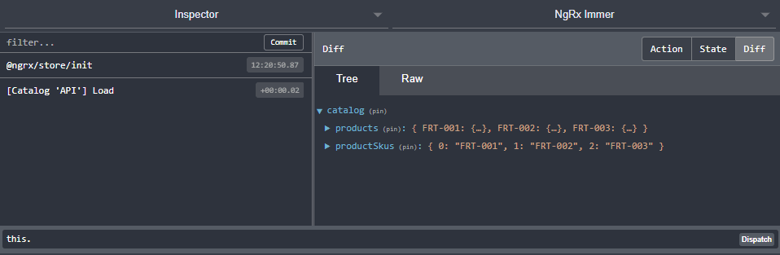

This weeks post is inspired by another great [This Dot Media](https://www.thisdot.co/) event and the topic this time was state management. There was a small segment about Immer which I found interesting (video is linked at the bottom of this post), so I decided to give it a shot with NgRx.

## Why Immer

Like the title says, Immer can **reduce the complexity** of reducers.

**Ease of use**, you don’t have to learn a new API or concept because it’s just using normal JavaScript objects and arrays. This can also lower the transition from a backend role to a front end role.

The thing I like most is that it can just be **plugged in wherever needed**. Introducing Immer doesn’t mean you have to use it in every reducer in your code base.

## About Immer

> Immer (German for: always) is a tiny package that allows you to work with immutable state in a more convenient way. It is based on the [_copy-on-write_](https://en.wikipedia.org/wiki/Copy-on-write) mechanism.

With Immer you’re treating your state inside reducers as what they call a draft. This draft can be mutated “in the normal way”, with the JavaScript API. The mutations applied on the draft produce the next state. All this while still having the benefit that the state will remain immutable in the rest of your application. To make this possible Immer relies on [Proxies](https://developer.mozilla.org/en-US/docs/Web/JavaScript/Reference/Global_Objects/Proxy) under the hood.  
In this post we’re only using it with a reducer, but it also can be used outside of one.

It is created by [Michel Weststrate](https://twitter.com/mweststrate), the owner of MobX.

## Side by side comparison

Let’s take a look at what a normal NgRx reducer might look like and compare it with the Immer implementation. As an example we’re going to use the classic shopping cart example where we can add and remove items from the cart.

First off, the state, which looks as follows:

```ts
// for each item in our cart we're storing the amount.
export interface State {
  cartItems: { [sku: string]: number }
}
```

A typical NgRx implementation doesn’t mutate the current state and uses the [spread syntax](https://developer.mozilla.org/en-US/docs/Web/JavaScript/Reference/Operators/Spread_syntax) to return a new version of the state.

For our cart example, it looks like this:

```ts
export function reducer(state = initialState, action: CartActions) {
  switch (action.type) {
    case CartActionTypes.AddToCart:
      return {
        ...state,
        cartItems: {
          ...state.cartItems,
          [action.payload.sku]: (state.cartItems[action.payload.sku] || 0) + 1,
        },
      }

    case CartActionTypes.RemoveFromCart:
      return {
        ...state,
        cartItems: {
          ...state.cartItems,
          [action.payload.sku]: Math.max(
            (state.cartItems[action.payload.sku] || 0) - 1,
            0,
          ),
        },
      }

    case CartActionTypes.EmptyCart:
      return initialState

    default:
      return state
  }
}
```

Now let’s take a look at the Immer way.  
The state remains the same and the reducer becomes:

```ts
export const reducer = produce<State, CartActions>((draft, action) => {
  switch (action.type) {
    case CartActionTypes.AddToCart:
      draft.cartItems[action.payload.sku] =
        (draft.cartItems[action.payload.sku] || 0) + 1
      return

    case CartActionTypes.RemoveFromCart:
      const newAmount = draft.cartItems[action.payload.sku] - 1
      if (newAmount > 0) {
        draft.cartItems[action.payload.sku] = newAmount
        return
      }
      delete draft.cartItems[action.payload.sku]
      // or
      // draft.cartItems[action.payload.sku] =
      //   Math.max((draft.cartItems[action.payload.sku] || 0) - 1, 0);
      return

    case CartActionTypes.EmptyCart:
      return initialState
  }
}, initialState)
```

Let’s highlight some points from the snippet above:

- `produce` is a curried function which expects your reducer function as the first argument, and a second argument for the initial state
- `draft` is our current `state`, which is typesafe
- changes made to `draft` produces the next state
- We can simply edit our item’s amount `draft.cartItems[action.payload.sku] = …`
- We can simply delete products from our cart  
   `delete draft.cartItems[action.payload.sku]`

And some subtle differences which you may have missed:

- we don’t have to return the `draft`, this is because we’re modifying `draft` directly
- there is no default case, the state doesn’t change and will also be the next state

To give another example, let’s take a look at how we load the catalog:

```ts
export const reducer = produce<State, CatalogActions>((draft, action) => {
  switch (action.type) {
    case CatalogActionTypes.Load:
      action.payload.products.forEach((product) => {
        draft.products[product.sku] = product
        draft.productSkus.push(product.sku)
      })
  }
}, initialState)
```

Pretty straight forward, right?

## Usage

In order to use Immer you’ll have to install it first via `npm install immer`, and then import it with `import produce from 'immer’`.

## Good to know: selectors

If you’re afraid that changing state like this means that every part of your application will be re-rendered, don’t be. Immer uses **structurally shared data structures** which basically means that only the modified parts of your state will trigger a new result from selectors based of the modified state. Thus, it only re-renders your application where needed.

## Good to know: object freezing

Immer comes with object freezing out of the box in development. This means that it will throw an error if the state is mutated from outside the `produce` function. So if you’re currently not using a library like [ngrx-store-freeze](https://github.com/brandonroberts/ngrx-store-freeze) **and** if you’re mutating state outside a reducer, you **will** get an error thrown at you.  
If you still want to mutate your state (which I don’t recommend by the way), you can turn off this feature with `setAutoFreeze(false)`.  
If you build your application in production mode, this check will automatically be skipped for performance reasons.

## Good to know: redux devtools

Since we’re just using normal JavaScript objects the redux devtools just keep working.



we’re seeing the redux developer tool in action

## Conclusion

Simply put, I like it. But this doesn’t mean I’ll use it everywhere (hint, there is no such thing is a silver bullet), only in places where I see fit. Partly because I like (and I’m used to) writing my reducers in a functional way. But I’ll use it when a reducer becomes too bloated or too hard to reason about.

> NOTE: When dealing with collections and CRUD actions you probably (still) want to use [@ngrx/entity](https://ngrx.io/guide/entity).

This post is meant to be a short introduction to Immer and to spread the word to the NgRx community. If you like what you’re seeing and want some more details or if you’re interested on how it’s working there are some useful resources below.

The code can be found on [GitHub](https://github.com/timdeschryver/ngrx-immer) or directly on [StackBlitz](https://stackblitz.com/github/timdeschryver/ngrx-immer).

## More resources

- [Introducing Immer: Immutability the easy way](https://hackernoon.com/introducing-immer-immutability-the-easy-way-9d73d8f71cb3)
- [The NgRx repository on GitHub](https://github.com/ngrx/platform)
- [The Immer repository on GitHub](https://github.com/mweststrate/immer)

## Not to miss

[Angular contributor day](https://www.youtube.com/watch?v=2u-dtwQhffk)

> Keep up with the advancement of prominent open source frameworks, libraries, and browser standards by attending this online event. Core team members will discuss topics such as upcoming releases, recent milestones, and community initiatives.
